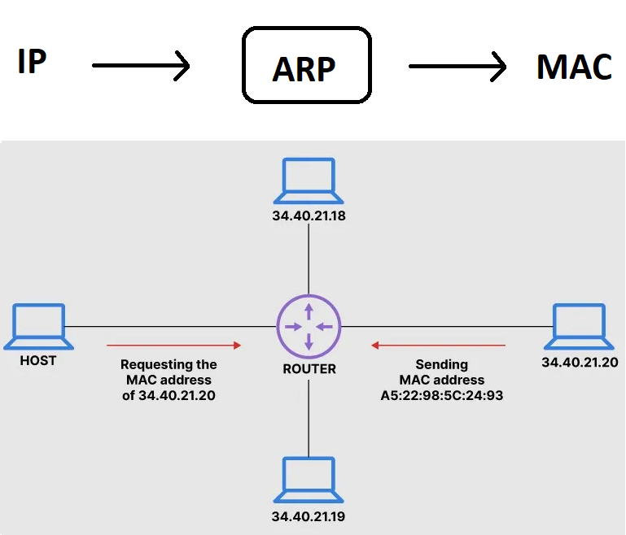
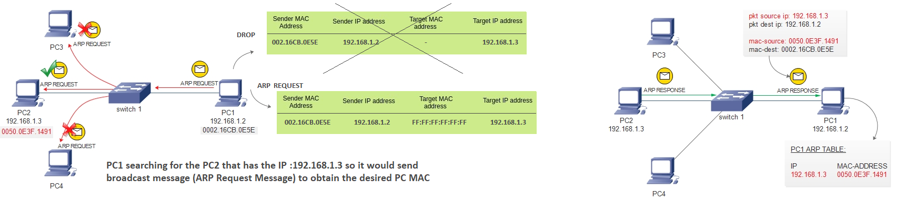
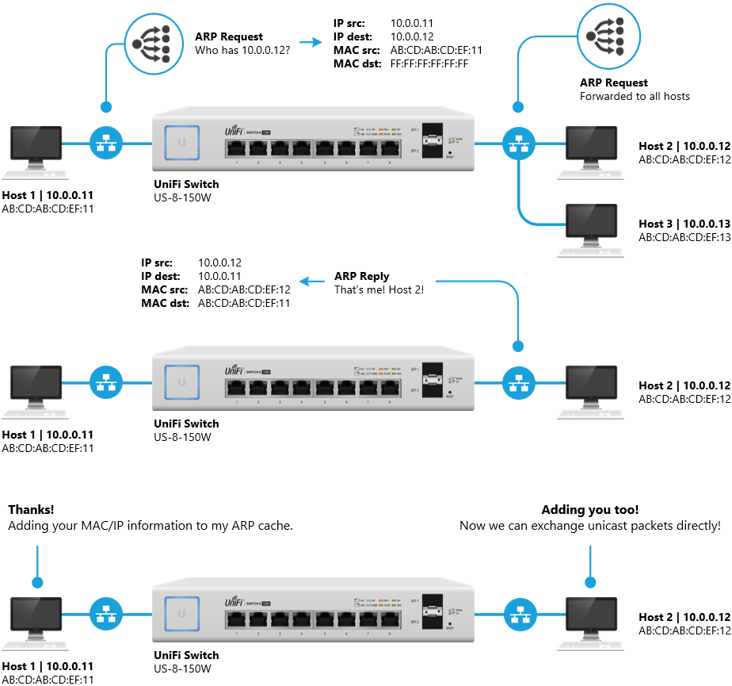
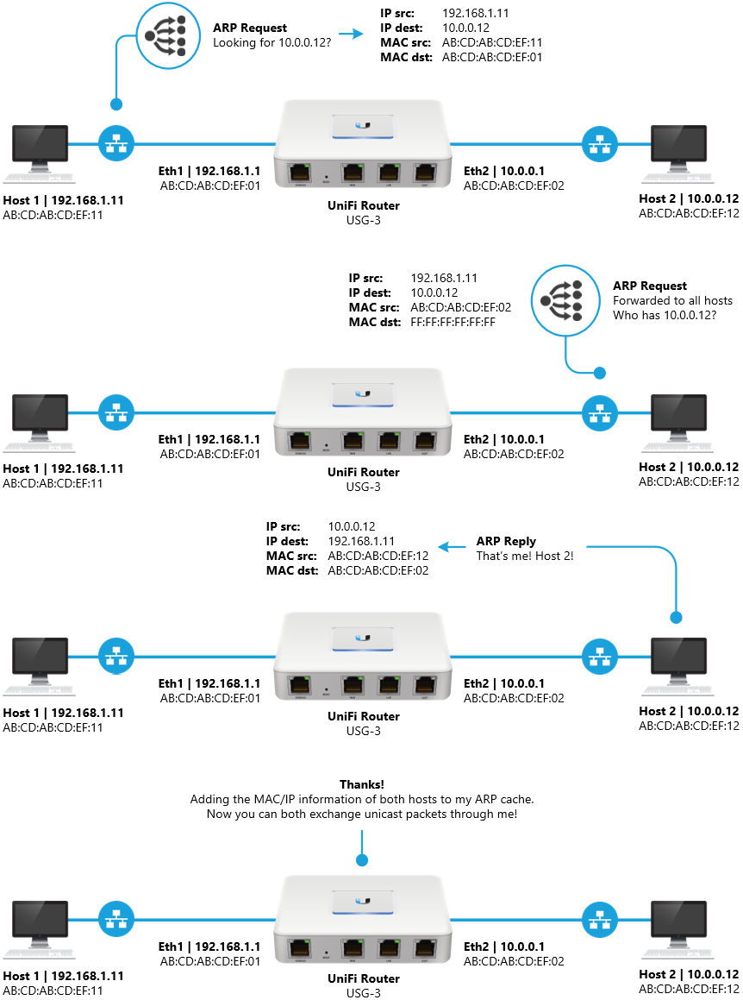
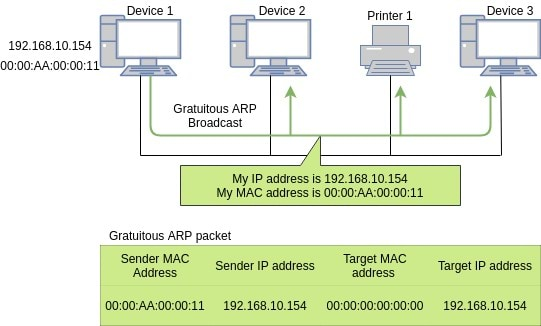
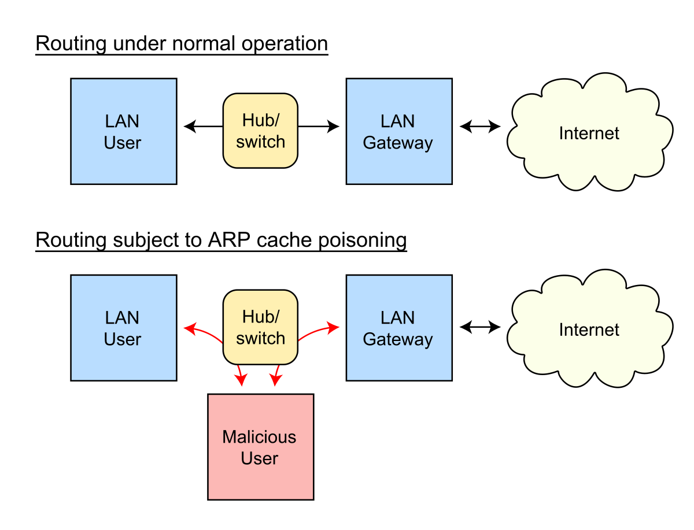

# Address Resolution Protocol (ARP) 

Most of the computer programs/applications use logical address **(IP address)** to send/receive messages, however, the **actual communication** happens over the physical address **(MAC address)** i.e. from layer 2 of the OSI model. So our mission is to get the destination MAC address which helps in communicating with other devices. This is where **ARP** comes into the picture, its functionality is to **translate IP address to physical addresses**. 

# ARP Process

The Address Resolution itself is a **two-step** process – a **request** and a **response**.

- It starts with the initiator sending an **ARP Request** as a **broadcast frame** to the entire network. This request must be a broadcast, because at this point the initiator does not know the target’s MAC address, and is therefore unable to send a unicast frame to the target.

- Since it was a broadcast, all nodes on the network will receive the ARP Request. All nodes will take a look at the content of the ARP request to determine whether they are the intended target. The nodes which are not the intended target will silently discard the packet.

- The node which is the target of the ARP Request will then send an ARP Response back to the original sender. Since the target knows who sent the initial ARP Request, it is able to send the **ARP Response** **unicast**, directly back to the initiator.

> Notice the ARP Request includes the sender’s MAC address. This is what allows the target (Host B, in this case) to respond directly back to the initiator (Host A).

### ARP on Layer-2 

If the Layer-3 destination IP address belongs to the **same local network** as the source IP address, then the host sends out an **ARP Request** to the **Layer-2 broadcast address (FF:FF:FF:FF:FF:FF)**. In the example below, the ARP request is flooded on all ports by the switch. If the host to which the source IP belongs to exists on the local network, then an ARP Reply message is sent back. This **reply message** will contain the **source MAC address** in the Layer-2 frame header.

### ARP on Layer-3 

If the Layer-3 destination IP address belongs to a **different network** than the host’s local network, then the packet is **forwarded to the local gateway** instead. Instead of sending the **ARP Request** as a broadcast, it is sent to the **destination MAC address of the gateway**. The ARP request will also contain the destination IP address of the remote Layer-3 host that the device is trying to reach.

> Host 1 will send the traffic for the 10.0.0.0 to its default gateway (Router). The Router will send an ARP request and will store their IP and MAC addresses in its ARP cache. 
> Note that the hosts do not know each other's MAC address, instead using the MAC address of the Router to communicate.

----------------------------------------------------------------

# Gratuitous ARP (GARP)

- A Gratuitous ARP is an ARP **Response** that **was not prompted** by an **ARP Request**. 

-  When a new device joins the LAN, it broadcasts its MAC address to the entire network **immediately** after its network **interface boots up**. Gratuitous ARP packet has both, **source and destination IP** set to the IP address of the **device issuing the packet** and the **destination MAC** is the **broadcast address** `ff:ff:ff:ff:ff:ff` or `00:00:00:00:00:00` based on the ARP implementation. 

-------------------------------

# Categories of ARP Entries

**Dynamic ARP Entry**

- A dynamic entry is **automatically** created and maintained by ARP. It can **age out**, be **updated** by a new ARP packet, or be **overwritten** by a static ARP entry.

- A dynamic ARP entry is **removed** when its **age timer expires** or the **interface goes down**.

**Static ARP Entry**

- A static ARP entry is **manually** configured and maintained. It **does not** age out or **cannot** be overwritten by a dynamic ARP entry.

- Static ARP entries **protect** communication between devices, because attack packets cannot modify the IP-to-MAC mapping in a static ARP entry.

----------------------------------------------------------------------

# ARP Spoofing (Netcut Attack)

- In computer networking, ARP spoofing, **ARP cache poisoning**, or **ARP poison routing**, is a technique by which an attacker sends (spoofed) ARP messages onto a LAN. Generally, the aim is to associate the **attacker's MAC address** with the **IP address of another host**, such as the default gateway, causing any traffic meant for that IP address to be sent to the attacker instead.

- ARP spoofing may allow an attacker to intercept data frames on a network, modify the traffic, or stop all traffic. Often the attack is used as an opening for other attacks, such as **denial of service (DoS)**, **man in the middle(MITM)**, or **session hijacking attacks**.

- The attack can only be used **on networks that use ARP**, and requires attacker have **direct access** to the **local network segment** to be attacked.

--------------------------------------------

# ARP Commands (Windows)

All operating systems maintain **ARP caches** that are **checked before sending an ARP request message**. Each time a host needs to send a packet to another host on the LAN, it first checks its ARP cache for the correct IP address and matching MAC address. The addresses will stay in the cache for a couple of minutes. 

### To display ARP entries : `arp -a`

- This will list the MAC address associated with a specific IP. 
- **Note that some mappings maybe wrong due to ARP Spoofing**

### To delete the ARP cache : `arb -d`

- Every connection you now establish will have to resolve the MAC address from the IP address again.

- E.g, Let's assume that you establish a new NIC (new MAC address) on PC2 therefore the ARP table on PC1 saves the old NIC so if you try to send the PC2 a packet it won't arrive, so you can delete the ARP cache (or restart the PC). Clearing the ARP cache essentially causes all the requests in your database to go through the entire ARP process again.

### To add static ARP entry :
 
-  It will make permanent ARP entry:

    `netsh -c interface ipv4 add neighbors “Network Card Name” “IP Address” “MAC Address” store=persistent` 
 
- For Example :-

    - Your Network Card Name is :- Local Area Connection
    - IP Address is :- 192.168.10.10
    - MAC Address is :- 00-1d-71-83-6c-00

    - `netsh -c interface ipv4 add neighbors “Local Area Connection” “192.168.10.10” “00-1d-71-83-6c-00” store=persistent`

### To delete static ARP entry :

`netsh -c interface ipv4 delete neighbors “Network Card Name” “IP Address” “MAC Address” store=persistent`

----------------------------------------

