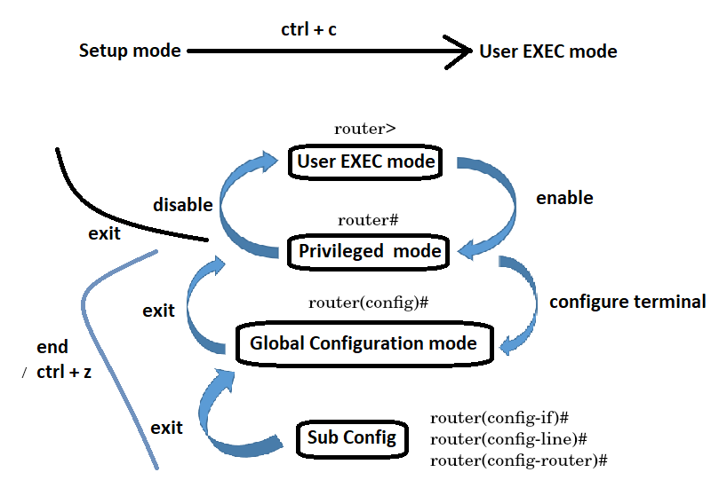

# Cisco Commands

- All the commands in the CLI are **not case sensitive.** We can type all the commands in either capital or small or by mixture of both. 

- The passwords are case sensitive.

- Cisco IOS provides some abbreviation commands to speed user interaction, e.g.: user not need to type the entire command to have recognized by IOS, it only requires minimum amount of character that **unambiguously** define a commands. 

  `sh ip int bri  ➡ show ip interface brief`

-----------------------------

# Command Prompts (Modes)

|      Command Prompt    |Description|
|------------------------|-----------|
|`Router>`               |User EXEC mode|
|`Router#`               | Privileged EXEC mode|
|`Router(config)#`       | Global configuration (notice the # sign indicates this is accessible only at privileged EXEC mode)|
|`Router(config-if)#`    | Interface configuration|
|`Router(config-line)#`  | Line configuration (vty, tty, async)|
|`Router(config-router)#`| Routing engine level within configuration mode|

-----------------------------

# IOS Navigation

|        Modes            |	    Access Method    |	    Prompt	   |Exit Method|
|-------------------------|----------------------|-----------------|------------|
|User execution mode      |	login	               |`router>`	       | `exit`   `logout`|
|Privilege mode	          | `enable`             |`router#`        |`disable` → router>   `exit` → Setup mode|
|Global configuration mode| `configure terminal` |`router(config)#`| `exit` →  router# |
|ROMMON mode              |press `ctrl+break` key while boot process   or use `reload` command in privilege mode.| `ROMMON 1>` |`continue`|

-----------------------------------------------

# Help Facility

|Command|Description|
|-------|-----------|
|`tab`  |It completes a partially typed CLI command. E.g if you type `show run` and press TAB, it will complete the command as `show running-config`.|
|`!comment`|comment|
|`Router#?`    |Show the available commands in this mode.    You can hit `enter` to see below commands or hit `space` to see page after page.    To quit type `q`|
|`Router# show ?`|To see the available options for this command.|
|`Router# co?`|To see the available commands that begin with "co"|
|` R(config)# do ping [172.16.0.1]`   `router(config)# do show running-config`| Doing the do Command provides the convenience of entering EXEC-level commands without needing to exit the current configuration mode.|

-----------------------------

# Keyboard Shortcuts
|Key Combination|Purpose|
|---------------|-------|
|`CTRL-A`       | Cursor moves to the "Beginning" of the Line.|
|`CTRL-E`       | Cursor moves to the “End” of the line.|
|`CTRL-U`       | Erases the line completely |
|`CTRL-W`       | Erases the word the cursor is under|
|`CTRL-Z`       | Move from Configuration mode back to Privilege EXEC mode |
|`CTRL-D`       | Delete|
|`CTRL+R`       |Redisplays the current command line|
|`Ctrl+Shift+6` | Stop! Cancels whatever it's currently doing|

-----------------------------------

# Configuration Commands

|                Command                      |Description|
|---------------------------------------------|-----------|
|`R(config)#hostname Cisco`                   |Sets a host name to the current Cisco network device.|
|`R(config-if)#shutdown`                      |Shuts down the interface.|
|`R(config-if)#no shutdown`                   |Brings up the interface.|
|`R(config-if)#ip [address] [ip-address mask]`|	Assigns an IP address and a subnet mask.|

-------------------------------------------

# Configurations: View, Save,Copy, Erase
 
|                   Command                                                  |  Description |
|----------------------------------------------------------------------------|--------------|
|`R# show running-config`                                                    |Display the current configuration.|
|`Router#write memory`                                                       |saves the running configuration as the startup configuration.|
|`R#copy [source] [destination]`   `R#copy running-config startup-config` |Copies files from one file location to another.|
|`Router# write erase`   `Router# erase nvram`                            |Deletee all files in the NVRAM but the configuration file is still in the RAM so you have to reload the router to delete it.|
|`R#erase startup-config`                                                    |Deletes the startup config file.|

-----------------------------------------------

# Router Passwords
|  Password Type |Commands|Mode|
|----------------|--------|----|
|Console Password| `Router>en`   `Router#config t`     `R1(config)#line console 0`   `R1(config-line)#password cisco`   `R1(config-line)#login` |`Press RETURN to get started`.    `User Access Verification`   `Password:`|
|Enable Password | `Router> en`   `Router# config t`  `Router(config)# enable password 123`| `Router>enable`   `Password:`   `Router#`|
|Secret Password | `Router# config t`   `Router(config)#enable secret 123ABC`|`Router>enable`   `Password:`   `Router#`|
|Telnet Password |`R2(config)#line vty 0 4`   `R2(config-line)#password cisco`   `R2(config-line)#login`|`R1#telnet 10.0.0.2`    `Trying 10.0.0.2 ...Open`   `User Access Verification`   `Password:`    `R2>`|
| Aux Password   | `Router(config)# line aux 0`   `Router(config-line)#password 123`   `Router(config-line)# login`||

|Command|Description|
|-------|-----------|
|`Router(config-line)#login`| Setting the password does not enable password authentication. You’ll need to tell the router to prompt incoming sessions on the console line to require a password.|
|`Router(config)#service password-encryption`| Encrypts both **current and future** passwords. All passwords configured on an IOS device, with the exception of the passwords configured with enable secret password, are stored in clear-text.|
|`Router(config)#no service password-encryption`|Decrypts **future** passwords.|

-----------------------------------------------------------------------