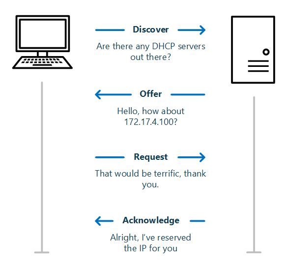

# Methods for Configuring IP

**1. Maually**

**2. DHCP**

**3. Alternate IP configuration:**

   - Alternate Configuration is designed to be used by laptops and other mobile computers to manage IP configurations when the computer is used in multiple locations and one location requires a static IP address and the other location(s) require dynamic IP addressing.
   - For example, a user with a laptop might need a static IP address to connect to their broadband ISP at home, and then use DHCP when connected to the corporate network. Alternate Configuration works by allowing the user to configure the computer so that it will initially try to connect to a network using DHCP; if the DHCP attempt fails (for example, when the user is at home), the alternate static IP configuration is used. The alternate IP address can be an APIPA or a manually configured IP address.
   
**4. APIPA :**

   - When the client is configured as a DHCP client, but no DHCP server is available to service the DHCP request.
   - When the client originally obtained a DHCP lease from a DHCP server, but when the client tried to renew the DHCP lease, the DHCP server was unavailable and the lease period expired.  
   - If APIPA is being used, clients will be able to communicate only with other clients on the same subnet that are also using APIPA.  
   - APIPA uses a **Class B** network address space that has been reserved for its use where the range **169.254.0.1 - 169.254.255.254** is available for hosts to assign to themselves.

----------------------------------------------------------------------------------

# DHCP

- **Dynamic Host Configuration Protocol** 

- Every network has it, a DHCP Server. It may be built into your router or you have a server that is handling the DHCP Leases. Without it, you would have to assign every network device (computer, mobile phone, network printer) manually an IP Address. A DHCP server does this task automatically for you ensuring that every device gets a unique IP Address to connect to the network. Now that address is leased to the client for a specific amount of time, the **DHCP Lease Time**.

## DHCP Lease Time

- DHCP Lease Time is the amount of time in minutes or seconds a network device can use an IP Address in a network. The IP Address is reserved for that device until the reservation expires.

- Every DHCP lease life cycle will follow a specific pattern, it starts with the initial lease, a normal operation period, a renewal period and if the renewal fails a rebinding period.

    - At day 0 it will request a new lease
    - During normal operation, the client can use the address
    - Halfway the lease time it will try to renew the lease so it can keep the same IP address.
    - If renewing failed (DHCP server is offline for example), it will try to extend the current lease with any active DHCP Server.

- Now let’s say you have set the lease time to 8 days (pretty long, but common in an enterprise network for wired devices). After 4 days the network device will try to renew the lease. On day 5 it is able to contact the DHCP server and renew the current lease. At that point, the DHCP Lease life cycle will start over, so the timers will reset and the lease is valid for another 8 days.


#### Recommend DHCP Lease Time

- For wired devices, a lease time of 8 days is a typical period. Wired devices won’t leave the network often, so there is no reason to create a shorter period. A shorter period only increases the DHCP-related network traffic.

- Wireless devices tend to leave the network pretty often and can stay away for a couple of days. So a smaller lease of 24 hours is pretty common. This way regular devices will keep mostly the same IP Address.

- For guest networks and hotspots, you want a short lease time. Hotspots an hour max, while for Office guest networks 8 hours will work fine.


#### Default Lease period

It depends on the operating system:

- The default DHCP lease period on Microsoft DHCP servers is eight days.
- The default DHCP lease period on Cisco devices is one day by default.

## DORA

- DORA is the process that is used by DHCP to provide an IP address to clients.

- It consists of four-stage:
   - Discover
   - Offer
   - Request
   - Acknowledge



- when DHCP clients request a DHCP server an IP address:
     - **Step 1: DHCP Discover Message**
         - This is the first message in the DORA process which helps in finding the DHCP server of the network. DHCP client will find the server by sending DHCP discover message. The broadcast message is sent to the network. As the DHCP client doesn’t know the IP address of the server so the message is broadcast with a destination IP is 255.255.255.255. And the source IP will be 0.0.0.0 as the client does not have any IP address. Here the DHCP discover message in the data link layer and network layer is always broadcast. 
            ```
            Source IP address: 0.0.0.0  
            Destination IP address: 255.255.255.255
            Source MAC address: MAC address of DHCP clients
            Destination MAC address: FF:FF:FF:FF:FF:FF
            ```
     - **Step 2: DHCP Offer Message**
         - DHCP server receives the discover message and it replays the DHCP client with the DHCP offer request. The server sends a DHCP offer message with filled information. It has information about the IP address and **duration of time that a host can use.** Here destination IP address will be 255.255.255.255 as the DHCP client still does not have its IP address. But this DHCP offer message is broadcast in the network layer and unicast in the data link layer. 
           ````
           Source IP address: IP Address of DHCP Server
           Destination IP address: 255.255.255.255
           Source MAC address: MAC address of DHCP Server
           Destination MAC address: MAC address of DHCP clients
           ```
     - **Step 3: DHCP Request Message**
        - DHCP clients send the request message to the server when it receives a DHCP offer message from the server. This message tells the server that it accepts the IP address given by the server. Here destination address will be 255.255.255.255 means it’s again broadcast. The reason for this is there might be many DHCP servers in the network so the client may receive multiple offer messages and it will accept the request that reaches him first and send a broadcast message to eliminate other DHCP servers. Here source IP address will be 0.0.0.0 as the DHCP server hasn’t yet assigned an IP address to the client. DHCP Request Message is also a broadcast message.
          ```
          Source IP address: 0.0.0.0
          Destination IP address: 255.255.255.255
          Source MAC address: MAC address of DHCP clients
          Destination MAC address: MAC address of DHCP server
          ```
    - **Step 4: DHCP Acknowledge Message**
        - This is the last step or message in the DORA process. The DHCP server sends Acknowledge Message to the client when it receives the request message from the DHCP client. This message will contain the IP address and subnet mask that the server assigns to the client. Source IP address will be the IP address of the server. This will be again broadcast message as the destination IP address is 255.255.255.255. But it is unicast in the case of the data link layer. 
           ```
           Source IP address: IP Address of DHCP Server
           Destination IP address: 255.255.255.255
           Source MAC address: MAC address of DHCP server
           Destination MAC address: MAC address of DHCP clients
           ```
           
   **Here things to remember is** 
      
   - DHCP Discover Message – Broadcast
      
   - DHCP Offer Message – Broadcast in the network layer and unicast in the data link layer
      
   - DHCP Request Message – Broadcast in the network layer and unicast in the data link layer
      
   - DHCP Acknowledge Message – Broadcast in the network layer and unicast in the data link layer

--------------------------------------
