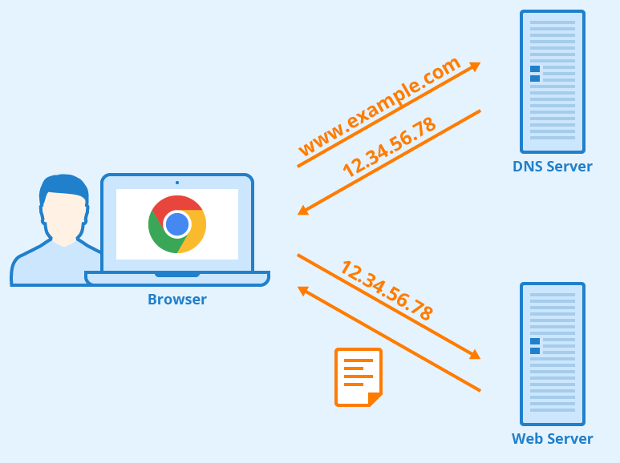
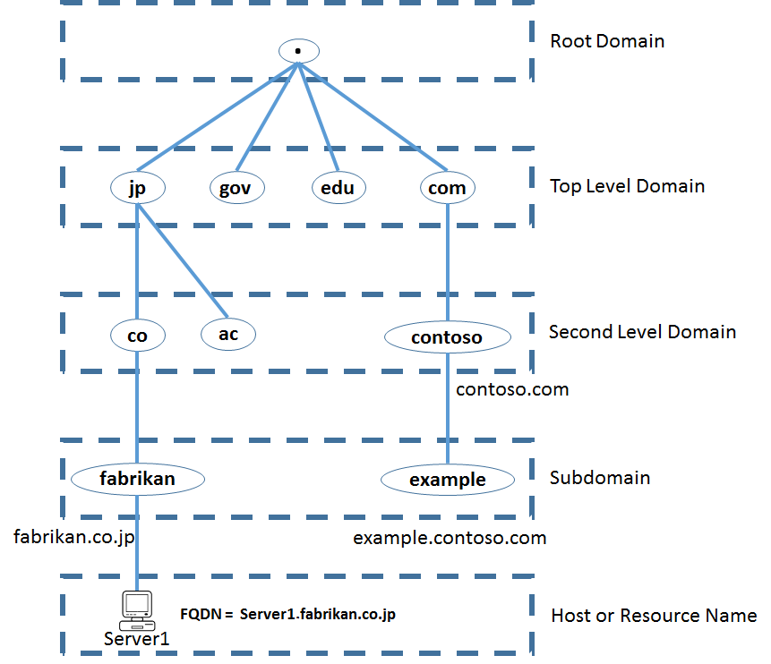
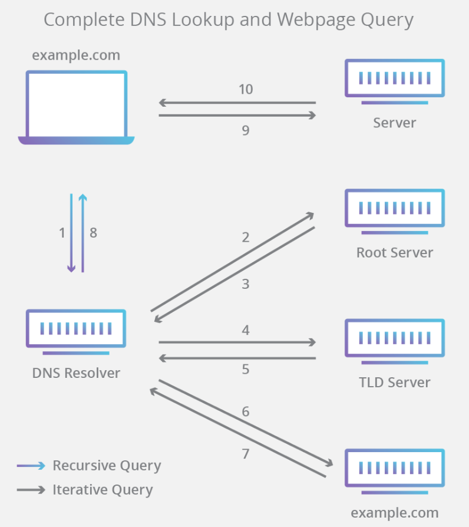
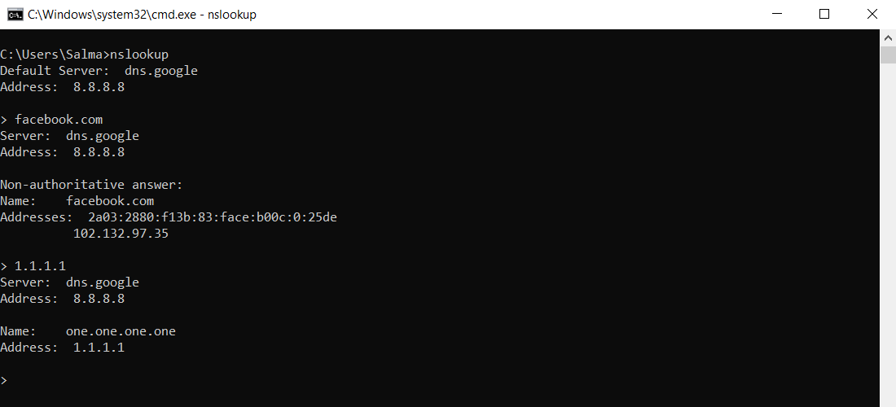

# DNS

- DNS stands for **Domain Name System.**

- DNS is responsible for translating **domain names** into a specific **IP address** so that the initiating client can load the requested Internet resources. The DNS works much like a phone book where users can search for a requested person and retrieve their phone number. 

- For example, suppose the Google site had an IP address of 12.34.56.78, most people would reach this site by specifying `www.example.com`. Therefore, the domain name is more reliable than IP address.

-------------------------------------------------------------------

## DNS Hierarchy (Domain Name Space)

- The DNS hierarchy, also called the **domain name space**, is an inverted tree structure. 

- The DNS hierarchy comprises the following **five** levels:

    - Root Level Domain (13 root name servers)
    - Top Level Domains (TLD)
    - Second Level Domains (SLD)
    - Subdomains
    - Hosts

- Each node in a tree has a domain name, and a full domain name is a sequence of symbols specified by **dots**.

- Currently, there are **13 root name servers** specified, with names ranges from “A” to “M”. You can view the locations of all [the root zone servers](https://root-servers.org/) here.

## Parts of a URL

-------------------------------------------------------------------

## Authoritative vs. Recursive DNS Servers

When your computer wants to find the IP address associated with a domain name, it first makes its request to a **recursive DNS server**, also known as **recursive resolver**. 

- A **recursive resolver** is a server that is usually operated by an ISP or other third-party provider, and it knows which other DNS servers **it needs to ask** to resolve the name of a site with its IP address.

- The servers that **actually have the needed information** are called **authoritative DNS servers**.

-------------------------------------------------------------------

## DNS Caching

- DNS information is shared among many servers. But information for sites visited recently is also **cached locally** on client computers. Chances are that you use `google.com` several times a day. Instead of your computer querying the DNS name server for the IP address of google.com every time, that information is saved on your computer, so it doesn’t have to access a DNS server to resolve the name with its IP address. 

- Additional caching can occur on the routers used to connect clients to the internet, as well as on the servers of the user’s ISP. With so much caching going on, the number of queries that actually make it to DNS name servers **is a lot lower** than it would seem.

- Your computer may be using the router itself as its DNS server, but the router is forwarding requests to your ISP's DNS servers. 

- Many Linux distributions do not use DNS caching at the operating system level. Instead, applications (such as web browsers) maintain their own internal caches. To clear an application's DNS cache, often all you need to do is restart the application. If your Linux computer does use a DNS caching service, however, consult its documentation for instructions about how to clear the cache.

### On Microsoft Windows :

- To view the DNS cache : `ipconfig /displaydns`

- To clear the DNS cache on Microsoft Windows :`ipconfig /flushdns`

-------------------------------------------------------------------

## The DNS Lookup Process

There are typically eight steps in this DNS lookup process that follow the information path from the originating web browser to the DNS server and back again. In practice, DNS information is often cached **to reduce the DNS lookup response time**. When the DNS information is not cached, the eight-step lookup process is as follows:

**1.** A user types `example.com` into a web browser and the query travels into the Internet and is received by a **DNS recursive resolver**.

**2.** The **resolver** then queries a DNS **root nameserver** (.).

**3.** The **root server** then responds to the **resolver** with the address of a Top Level Domain (TLD) DNS server (such as .com or .net), which stores the information for its domains. When searching for `example.com`, our request is pointed toward the `.com` TLD.

**4.** The **resolver** then makes a request to the `.com` TLD.

**5.** The **TLD** server then responds with the IP address of the domain’s nameserver, `example.com`.

**6.** Lastly, the **recursive resolver** sends a query to the **domain’s nameserver**.

**7.** The IP address for `example.com` is then returned to the **resolver** from the **nameserver**.

**8.** The **DNS resolver** then responds to the **web browser** with the IP address of the domain requested initially.

**Once the 8 steps of the DNS lookup have returned the IP address for `example.com`, the browser is able to make the request for the web page:**

**9.** The browser makes an HTTP request to the IP address.

**10.** The server at that IP returns the webpage to be rendered in the browser.

-------------------------------------------------------------------

## DNS Servers and IP Addresses

- Each domain can correspond to **more than one** IP address. In fact, some sites have hundreds or more IP addresses that correspond with a single domain name. 

- For example, the server your computer reaches for `www.google.com` is likely completely different from the server that someone in another country would reach by typing the same site name into their browser.

- Another reason for the **distributed nature** of the directory is the amount of time it would take for you to get a response when you were looking for a site if there was only one location for the directory, shared among the millions, probably billions, of people also looking for information at the same time. 

-------------------------------------------------------------------

## Finding Your DNS Server

The DNS server you use will be established automatically by your network provider when you connect to the internet. If you want to see which servers are your primary nameservers, there are web utilities that can provide a host of information about your current network connection. [Browserleaks.com](https://browserleaks.com/ip) is a good one, and it provides a lot of information, including your current DNS servers.

-------------------------------------------------------------------

## NsLookup (Name Server Lookup)

- `nslookup` is the name of a program that lets you enter a host name (for example, "facebook.com") and find out the corresponding IP address. You can also enter an IP address to do a reverse DNS lookup and find the host name for that IP address.

  

-------------------------------------------------------------------

##  Public DNS Servers

If you don't want to use your ISP DNS, you can instead point your computer to a public DNS server that will act as a recursive resolver.

### Best Free & Public DNS Servers

|Provider|	Primary DNS|	Secondary DNS|
|--|--|--|
|Google|	8.8.8.8	|8.8.4.4|
|Cloudflare|	1.1.1.1	|1.0.0.1|
|Quad9|	9.9.9.9|	149.112.112.112|
|OpenDNS Home	|208.67.222.222	|208.67.220.220|
|CleanBrowsing	|185.228.168.9	|185.228.169.9|
|Alternate DNS	|76.76.19.19|	76.223.122.150|
|AdGuard DNS|	94.140.14.14|	94.140.15.15|