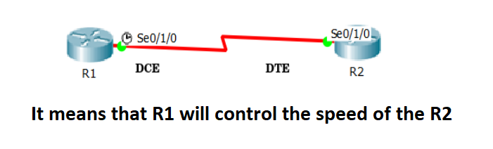

# Serial Cable Connection

There are two types of devices that can communicate over a **serial interface**: DTE and DCE. 

The most important difference between these types of devices is that the **DCE device supplies the clock signal** that is used to synchronize your **circuit speed**. 


# DTE (Data Terminal Equipment)

- DTE is any device that is a **source** of data transmission over a serial telecommunications link. 

- Typically, DTE can be a computer, a printer,a router, a server, or some similar device.

**Each device sends data with its interface speed so in order to control this speed we use DCE.**

# DCE (Data Communications Equipment)

- It accepts the data produced by **DTE** and converts them to suitable signals within a network. After converting the signals, it introduces the signals onto the telecommunication link.

- DCE device is either a modem, DSU/CSU, switch, Hub, or other piece of data communications equipment.

-----------------------------

# CSU/DSU (Channel Service Unit/Data Service Unit)

- When connecting a serial cable to the serial interface of the router, clocking is provided by an external device, such as a **CSU/DSU** device. 

- A **CSU/DSU** is a digital-interface device used to connect a router to a digital circuit. 

- The **router** is the **DTE** and the **external device** is the **DCE**, where the DCE provides the clocking. 

  

**CSU/DSU has disappeared. The configuration of the CSU/DSU moved into software.**

- When we connect two routers back-to-back using the routers serial interfaces, each router is a DTE by default. **The cable decides which end to be DCE or DTE**, and it is usually marked on the cable.  If is not marked, we can use the Cisco IOS show command `show controller` command to determine the interface is DTE or DCE.

--------------------------------

# Show Controllers Command

This command is used to check the hardware statistic of interface including clock rate and cable status such as cable is attached or not. One end of serial cable is physically DTE, and other end is DCE. If cable is attached, it will display the type of cable.

**Syntax :** `R#show controllers [interface]`


# Clock Rate Command

- When you set the clock rate for a **serial interface**, you are setting the **speed of the interface**, in other words, the bandwidth (bandwidth meaning rate of data transfer). When using this command it's in the form of bits: 64000 bits = 64 kb.

- If the clock rate is set to 64000 bits, you will never be able to send faster than 64 kilobits over the interface.

- While you can configure the clock rate on both ends of the serial link, the router will only accept the command on the **DCE end**.

**Syntax :** `R(config-if)#clock rate <number>`

--------------------------------

## Example



> GNS3 doesn't work the same as physical hardware. It's going to have both sides DCE. Use packet tracer for this lab. 

```
R1#show controllers s0/1/0

Interface Serial0/1/0
Hardware is PowerQUICC MPC860
DCE V.35, clock rate 2000000      --> DCE Device - Cable Type: V.35  - Clock Rate = 2000000
 
 --More--
```

```
R2#show controllers s0/1/0
Interface Serial0/1/0
Hardware is PowerQUICC MPC860
DTE V.35 TX and RX clocks detected   --> DTE Device - Cable Type: V.35  -  TX : means transmitted  - RX : means received 
 --More--
```


```
R1(config)#interface Serial 0/1/0
R1(config-if)#clock rate ?
Speed (bits per second
  1200           
  2400           
  4800           
  9600           
  19200          
  38400          
  56000          
  64000          
  72000          
  125000         
  128000         
  148000         
  250000         
  500000         
  800000         
  1000000        
  1300000        
  2000000        
  4000000        
  <300-4000000>  Choose clockrate from list above
R1(config-if)#clock rate 64000
```


```
R1#show running-config 

!
interface Serial0/1/0
 ip address 192.168.33.1 255.255.255.0
 clock rate 64000
!
```

**Note That**

```
R2(config)#interface serial 0
R2(config)#interface serial 0/1/0
R2(config-if)#clock rate 2400
This command applies only to DCE interfaces
```
----------------------------------------------------------

# Summary

|Command|Description|
|-------|-----------|
|`R#show controllers` <br> `R#show controllers [interface]`|To check the hardware statistic of interface including clock rate and cable status. Also to determine if the interface is DTE or DCE.  |
|`R(config-if)#clock rate <number>`|To set the speed of the interface on the DCE end.|