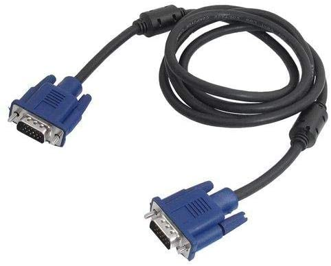
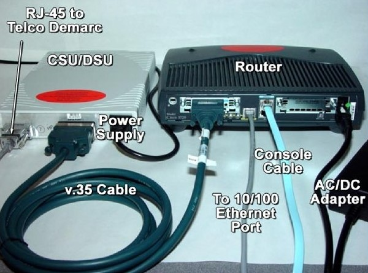
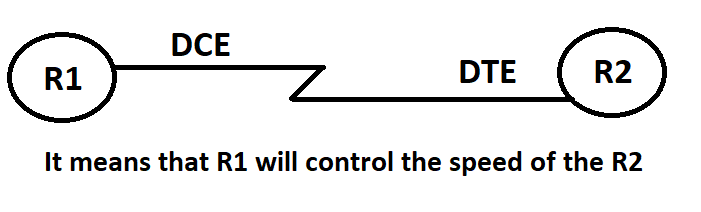

# Data Terminal Equipment (DTE)

- DTE is any device that is a source of data transmission over a serial telecommunications link. 

- Typically, data terminal equipment (DTE) can be a computer, a printer ,a router, an access server, or some similar device.


> **Each device sends data with its interface speed so in order to control this speed we use DCE.**

# Data Communications Equipment(DCE)

- It accepts the data produced by DTE and converts them to suitable signals within a network. After converting the signals, it introduces the signals onto the telecommunication link.

- DCE device is either a modem , DSU/CSU , switch, Hub, or other piece of data communications equipment. which is located between the data transmission circuit and the data terminal equipment for converting the signals.


-------------------

### Important Notes

- When connecting a serial cable to the serial interface of the router, clocking is provided by an external device, such as a CSU/DSU device. 

- A CSU/DSU (Channel Service Unit/Data Service Unit) is a digital-interface device used to connect a router to a digital circuit. 

- The **router** is the **DTE**  and the **external device** is the **DCE**, where the DCE provides the clocking. 





- However, in some cases we might connect two routers back-to-back using the routers’ serial interfaces. 

- Each router is a DTE by default. The cable decides which end to be DCE or DTE and it is usually marked on the cable. 

- If is not marked, we can use the Cisco IOS show command `show controller` command to determine the interface is DTE or DCE.

# show controllers Command

This command is used to check the hardware statistic of interface including clock rate and cable status such as cable is attached or not. One end of serial cable is physically DTE, and other end is DCE. If cable is attached, it will display the type of cable.

**Syntax :** `R#show controllers [interface]`


# Clock Rate Command

- This command is used to set the clock rate on **serial links**. 

- While you can configure the clock rate on both ends of the serial link, the router will only accept the command on the **DCE end**.

- **Note:** Clock rate sets how many bits can be sent over a given time. If the clock rate is set to 64000, you will never be able to send faster then 64 kbs over the interface.

**Syntax :** `R(config-if)#clock rate <number>`


### Example



```
R1#show controllers s0/1/0

Interface Serial0/1/0
Hardware is PowerQUICC MPC860
DCE V.35, clock rate 2000000      --> DCE Device - Cable Type: V.35  - Clock Rate = 2000000
 
 --More--
```

```
R2#show controllers s0/1/0
Interface Serial0/1/0
Hardware is PowerQUICC MPC860
DTE V.35 TX and RX clocks detected   --> DTE Device - Cable Type: V.35  -  TX : means transmitted  - RX : means received 
 --More--
````


```
Router(config)#interface Serial 0/1/0
Router(config-if)#clock rate ?
Speed (bits per second
  1200           
  2400           
  4800           
  9600           
  19200          
  38400          
  56000          
  64000          
  72000          
  125000         
  128000         
  148000         
  250000         
  500000         
  800000         
  1000000        
  1300000        
  2000000        
  4000000        
  <300-4000000>  Choose clockrate from list above
Router(config-if)#clock rate 64000
```


```
R1#show running-config 

!
interface Serial0/1/0
 ip address 192.168.33.1 255.255.255.0
 clock rate 64000
!
````

**Note That**

```
R2(config)#interface serial 0
R2(config)#interface serial 0/1/0
R2(config-if)#clock rate 2400
This command applies only to DCE interfaces
```
----------------------------------------------------------

# Possible status of physical layer

**UP:** - Interface is receiving physical layer signals.

**Administratively down:**- Interface is turned off by using shutdown command.

**Down:** - Interface is not receiving physical layer signals. This could be happen due to following reasons.

- Cable is unplugged

- You are using wrong cable type.

- Attached device is turned off.


# Possible status of data link layer

**UP:**- interface is operational.

**Down:**- interface is not operational. This could be due to following reasons:-

- Physical layer is down

- Incorrect encapsulation setting

- Incorrect clock rate or bandwidth setting

- Incorrect keepalives setting


|Interface status|	Description|
|--|--|
|Administratively down and down	|Interface is disabled with shutdown command|
|Down and Down|	Check physical layer for possible reasons given above|
|UP and Down	|Check data link layer for possible reasons given above|
|UP and UP|	Interface is operational|


# show ip interface brief Command

This command provides a quick overview of all interfaces on the router including their IP addresses and status.

**Syntax:** `R# show ip interface brief`
