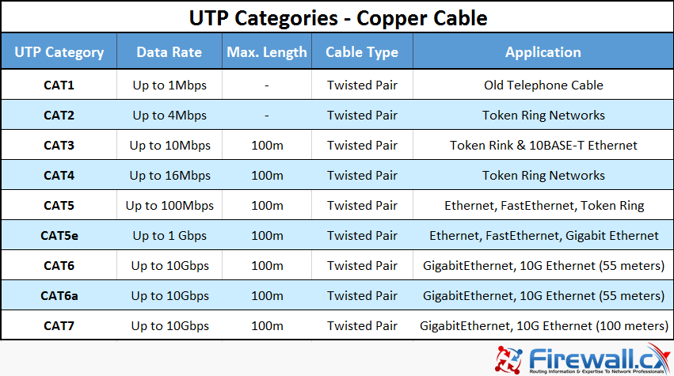

# Transmission Media

- In the OSI model, the transmission media is available in the **physical layer.**

## IEEE Shorthand Identifiers

- **IEEE shorthand identifiers,** such as 10Base5, 10Base2, 10BaseT, and 10BaseF include three pieces of information:

  - **The number 10:** At the front of each identifier, 10 denotes the standard data transfer speed over these media – ten megabits per second (BW = 10Mbps).
  - **The word Base:** refer to baseband signaling.
  - **The segment type or segment length:** This part of the identifier can be a digit or a letter:
  
    - **Digit –** shorthand for how long (in meters) a cable segment may be before attenuation sets in. For example, a 10Base5 segment can be **no more** than 500 meters long.
    - **Letter –** identifies a specific physical type of cable. For example, the **T** at the end of 10BaseT stands for twisted-pair.

 

   |Specification	| Cable Type|Specification	| Cable Type|
   |--|--|--|--|
   |10BaseT|	Unshielded Twisted Pair| 1000BaseBX	|Single mode Fiber|  
   |100BaseT|Unshielded Twisted Pair|100BaseBX|	Single mode Fiber|
   |1000BaseT|Unshielded Twisted Pair |1000BaseSX	|Multimode Fiber|
   |10Base2	|Thin Coaxial|  100BaseSX|	Multimode Fiber|
   |10Base5	|Thick Coaxial| 100BaseFX|	Fiber Optic |
   |1000BaseFX|Fiber Optic|||
   
 ----------------------------------------------------------------
 
# Guided Media (Wired)

- It is defined as the physical medium through which the signals are transmitted.

- There are 3 major types of Guided Media: 
  - Coaxial Cable
  - Twisted Pair Cable
  - Optical Fiber Cable

## Coaxial Cable

   - **Types:**
      - Thinnet or 10Base2.
      - Thicknet or 10Base5.
     

----------------------------------------

## Twisted Pair Cable

- One wire is used for the transmission of the data and the other wire is used for ground.

- **Note:** Ground wire isn't carrying any current. But when an electrical accident such as a short circuit occurs, the ground wire takes the unstable current away from your electrical system and sends it toward the ground.

- **Types:** 
  - STP
  - UTP ➡ The most common UTP Connector : RJ45
  
  

### STP (Shielded Twisted-Pair) 

- It is more expensive and difficult to install than UTP. 

### UTP (Unshielded Twisted-Pair)

- It is easy to install and is less expensive than STP. 

#### UTP Categories

- Suppliers often advertise UTP cables as Ethernet cables. UTP cables are the most common cable used in networks and have become closely identified as **Ethernet cables**.

- The cables themselves are not limited to transmitting Ethernet, nor is Ethernet restricted to using just UTP cables. You can run Ethernet over coax, fiber, or STP.

- Following are the categories of the UTP cable:

  - cat3  ➡ 10Base-T
  - cat5  ➡ 100Base-T
  - cat5e ➡ 1000Base-T

## Ethernet Cables 

|Cable|Pairs|
|--|--|
|10Base-T   100Base-T| 2 pairs (4 wires)|
|1000Base-T   10GBase-T| 4 pairs (8 wires)|

------------------------------------------

## Fiber-Optic Cable

- It carries communication signals using pulses of light.
- It's highly efficient and allow the transfer of data in a very large volume.

- SAN (Storage Area Network) implementations use optical fiber cabling. 

- Undersea fiber cables are connecting our world.

> **"People think that data is in the cloud, but it’s not. It’s in the ocean." 😂😂**   -Jayne Stowell

- The internet consists of tiny bits of code that move around the world, traveling along wires as thin as a strand of hair strung across the ocean floor. The data zips from New York to Sydney, from Hong Kong to London, in the time it takes you to read this word.

### fiber-Optic Connections

Look at this Cisco switch here , here it is 24 ports for RJ45 connectors. This is ports where you connect the copper UTP cable to but what about  the red interfaces? in this interfaces you insert on of these :

So you connect one of these cables. this is a fiber cable.
Notice that there are two connectors on each end that's because you need one connector to transmit data and one to receive data on each end.

---------------------------------------------------------

# Unguided Media (Wireless)

- An unguided transmission transmits the electromagnetic waves without using any physical medium. Therefore, it is also known as **wireless transmission**.

- Types:
  - **Radio waves**
  - **Microwaves**
  - **Infrared waves** are used for very short distance communication. 

---------------------------------------------------------------

# Connectors

- Networking cable connectors are many and differ in terms of compatibility, built quality, cables type, and other specifications.

- Connectors can be distinguished according to :
    - Their physical appearance and mating features, such as plugs **(male connectors)** or sockets and ports **(female connectors)**.
    - Their different pinning configurations, such as DB9 and DB15 connectors, which have 9 and 15 pins, respectively.
    - The kind of electrical interfaces they support. Examples of different types of connectors include:
        - Connectors for serial interfaces, such as RS-232 and V.35
        - Ethernet connectors, such as RJ-45 and BNC connectors
        - Fiber-optic cabling connectors, such as SC and ST connectors

|Image|Connector| Used for| Notes |
|--|--|--|--|
|| BNC |Coaxial Cable||
||T-connector (BNC T-connectors) |Coaxial Cable|Connecting three cables together.|
|| RJ45 |Twisted Pair Cable| The most commonly used Ethernet cable connectors.|
|| RJ11 |Twisted Pair Cable|Connecting telephone cables. |
|| ST |Fiber-optic Cable|They support connections with both single and multimode fiber cables. The primary job of this connector is to connect the cables without getting the optic fiber damaged. The optic fiber is extremely fragile, therefore protecting it is one of the main jobs of the connector.|

---------------------------------------------------------------

