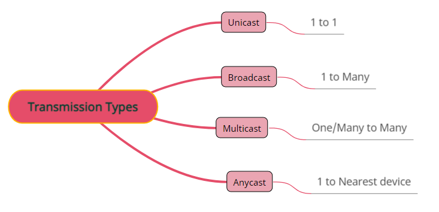
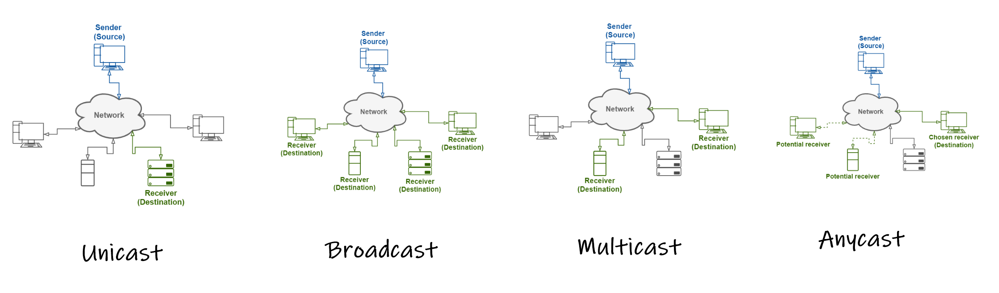

  

# Transmission Types

#### Addressing Methods

Addressing a message means determining to which destination a source wants to communicate.

## Unicast

- The unicast addressing method indicates that communication through a network involves a unique sender (source) and a single receiver (destination).

## Broadcast

- The broadcast addressing method considers the communication through a network that involves a single sender (source) and multiple receivers (destinations).
 
- Some communication protocols don’t support broadcast addressing, such as IPv6.
- In most cases, broadcast messages aren’t routed.

## Multicast

- Multicasting addresses messages for a specific group of devices in a network. Note that, even if a group contains all the devices in a network, multicast is theoretically different from the broadcast. This difference consists that, in the multicast case, devices effectively subscribe to receive messages. In the broadcast case, however, devices receive messages regardless of whether they want to.

## Anycast

- The anycast addressing method forwards messages to a single device of a specific group of devices. Typically, considering the sender’s position, the topologically **nearest device** of the aimed anycast group will receive the message.

---------------------------------------------------------

## Let's sum it up :

| Type      | Associations       | Scope           |             Example          |
|-----------|--------------------|-----------------|------------------------------|
| Unicast   | 1 to 1             | Whole network   | HTTP, Telnet, FTP, and SMTP. | 
| Broadcast | 1 to Many          | Subnet          | ARP,  DHCP                   |
| Multicast | One to Many        | Defined horizon | SLP                          |
| Anycast   | 1 to Nearest device| Whole network   | 6to4                         |

**In Networking a packet can be sent to:**

- A single host – Unicast → TCP and UDP
- All hosts – Broadcast → UDP only
- A group of hosts – Multicast → UDP only

[Read more](https://www.baeldung.com/cs/multicast-vs-broadcast-anycast-unicast)

---------------------------------------------------------------------------------------------
