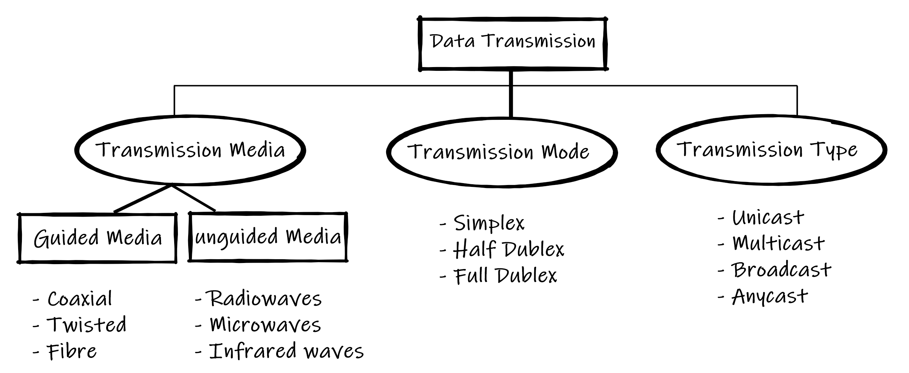

# Transmission Media

- **In the OSI model , the transmission media is available in the physical layer**

- **IEEE shorthand identifiers,** such as 10Base5, 10Base2, 10BaseT, and 10BaseF include three pieces of information:

  - **The number 10:** At the front of each identifier, 10 denotes the standard data transfer speed over these media – ten megabits per second (BW= 10Mbps).
  - **The word Base:** refer to baseband signaling.
  - **The segment type or segment length:** This part of the identifier can be a digit or a letter:
  
    - **Digit –** shorthand for how long (in meters) a cable segment may be before attenuation sets in. For example, a 10Base5 segment can be **no more** than 500 meters long.
    - **Letter –** identifies a specific physical type of cable. For example, the **T** at the end of 10BaseT stands for twisted-pair.

|Specification	| Cable Type|
|--|--|
|10BaseT|	Unshielded Twisted Pair|
|10Base2	|Thin Coaxial|
|10Base5	|Thick Coaxial|
|100BaseT|	Unshielded Twisted Pair|
|100BaseFX|	Fiber Optic|
|100BaseBX|	Single mode Fiber|
|100BaseSX|	Multimode Fiber|
|1000BaseT	|Unshielded Twisted Pair|
|1000BaseFX|	Fiber Optic|
|1000BaseBX	|Single mode Fiber|
|1000BaseSX	|Multimode Fiber|

# Guided Media (Wired)

## Coaxial Cable

   - For LANs, it can be run longer distances than STP and UTP cable without the need for repeaters.
   - **Types:**
      - Thinnet or 10Base2.
      - Thicknet or10Base5.
     
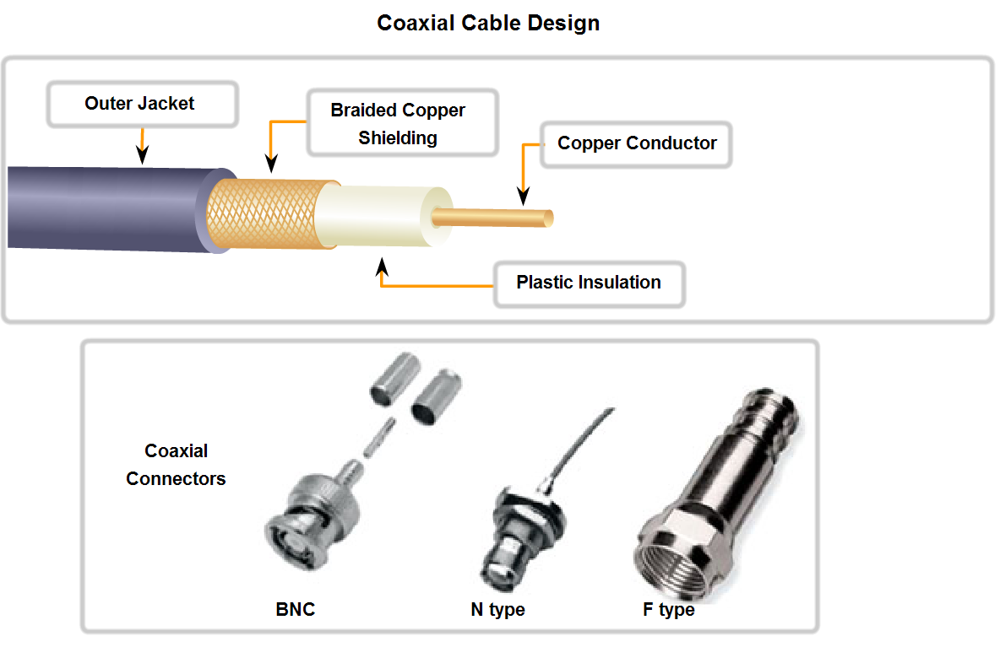

## Twisted Pair Cable
- protects against electromagnetic interference (EMI)
- one wire is used for The transmission of the data and the other wire is used for ground.

**Note:**  ground wire isn't carrying any current.But when an electrical accident such as a short circuit occurs, the ground wire takes the unstable cuurent away from your electrical system and sends it toward the ground.

- **Types:** 
 - UTP ➡The most common UTP Connector : RJ45
 - STP
### Shielded Twisted-Pair

- STP affords greater protection from all types of external interference, but is more expensive and difficult to install than UTP. 

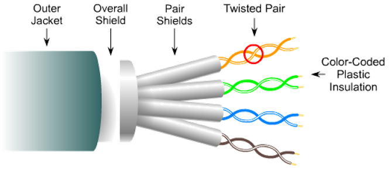

### Unshielded Twisted-Pair

- It is easy to install and is less expensive than STP. 

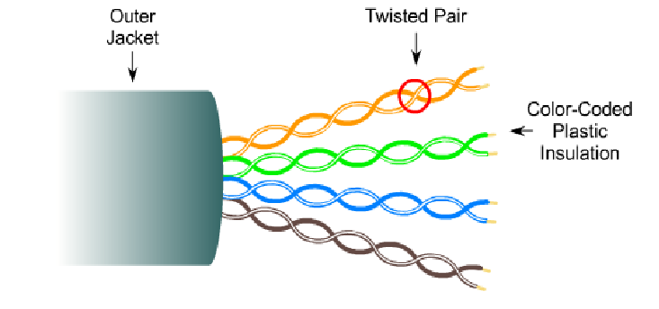
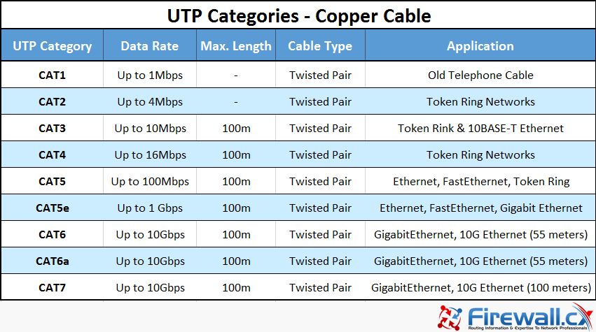
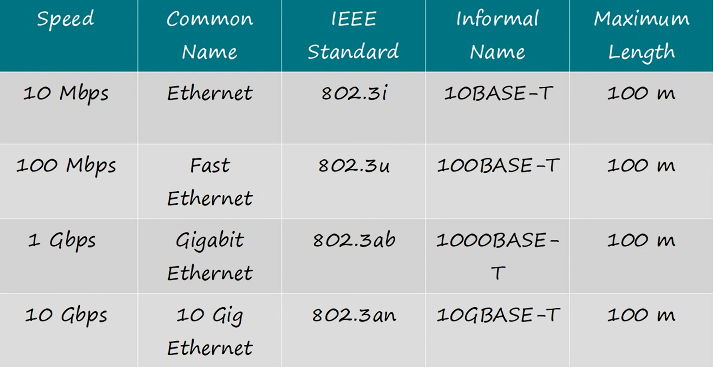

- cat3 ➡ 10Base-T
- cat5 ➡ 100Base-T
- cat5e ➡ 1000Base-T

**Coaxial cables are generally used for cable television and internet connections.
Twisted pair cables are usually used for telephone connections.**

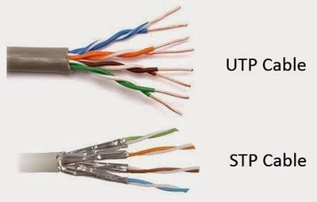

|Cable|Pairs|
|--|--|
|10Base-T   100Base-T| 2 pairs (4 wires)|
|1000Base-T   10GBase-T| 4 pairs (8 wires)|

## Fiber-optic Cable

- carry communication signals using pulses of light
- highly efficient and allow the transfer of data in a very large volume.
-  Undersea fiber cables are connecting our world .
- SAN implementations use optical fiber cabling. 

**"People think that data is in the cloud, but it’s not. It’s in the ocean." 😂😂**
-Jayne Stowell

The internet consists of tiny bits of code that move around the world, traveling along wires as thin as a strand of hair strung across the ocean floor. The data zips from New York to Sydney, from Hong Kong to London, in the time it takes you to read this word.
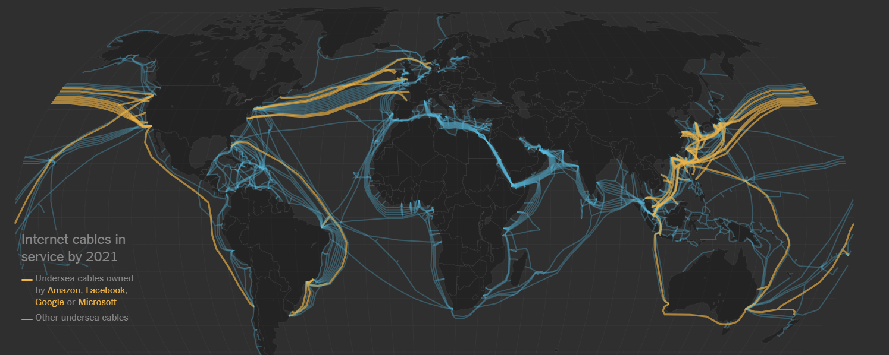

# Unguided Media (Wireless)

- **Infrared waves** are used for very short distance communication. 

---------------------------------------------------------------

# Connectors

- Networking cable connectors are many and differ in terms of compatibility, built quality, cables type, and other specifications.

- Connectors can be distinguished according to :
    - their physical appearance and mating features, such as plugs **(male connectors)** or sockets and ports **(female connectors)**.
    - their different pinning configurations, such as DB9 and DB15 connectors, which have 9 and 15 pins, respectively.
    - the kind of electrical interfaces they support. Examples of different types of connectors include:
        - Connectors for serial interfaces, such as RS-232 and V.35
        - Ethernet connectors, such as RJ-45 and BNC connectors
        - Fiber-optic cabling connectors, such as SC and ST connectors

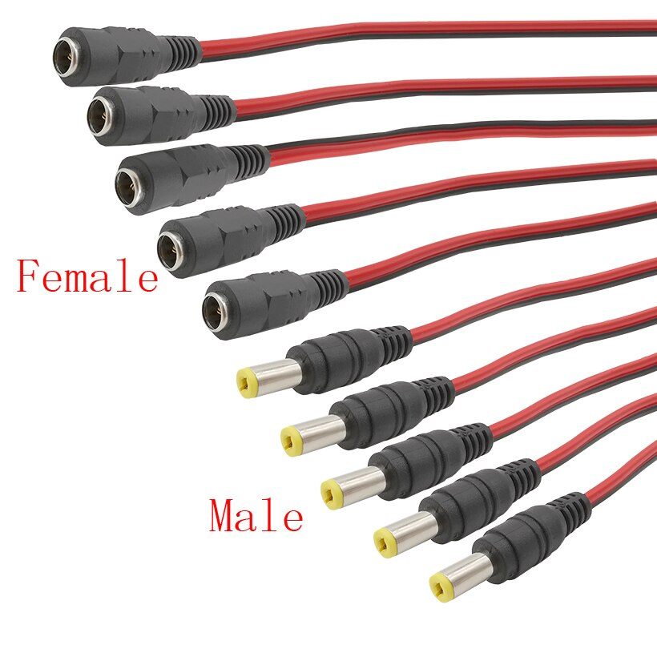

|Image|Connector| Used for| Notes |
|--|--|--|--|
|| BNC |Coaxial Cable|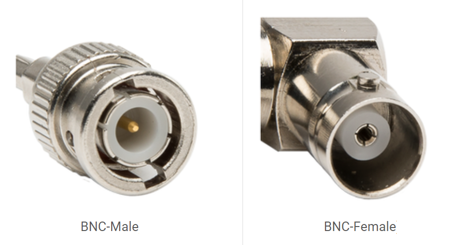|
|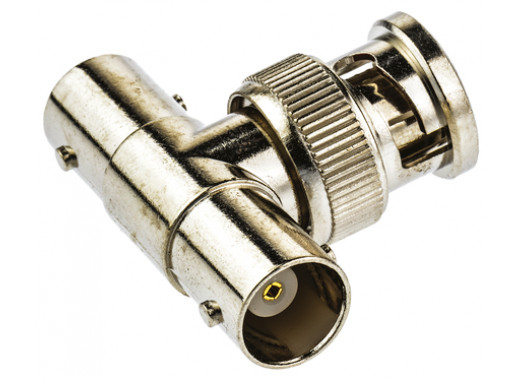|T-connector (BNC T-connectors) |Coaxial Cable|Connecting three cables together.|
|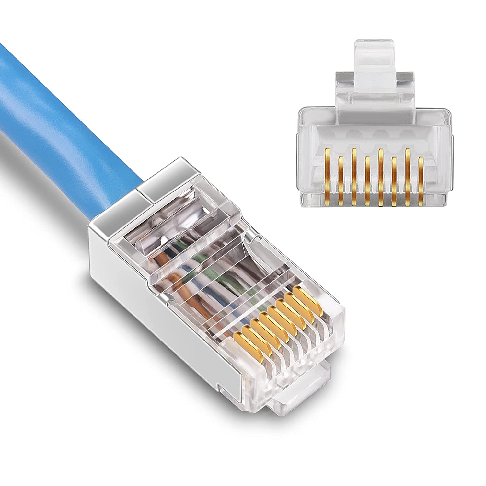| RJ45 |Twisted Pair Cable| The most commonly used Ethernet cable connectors.|
|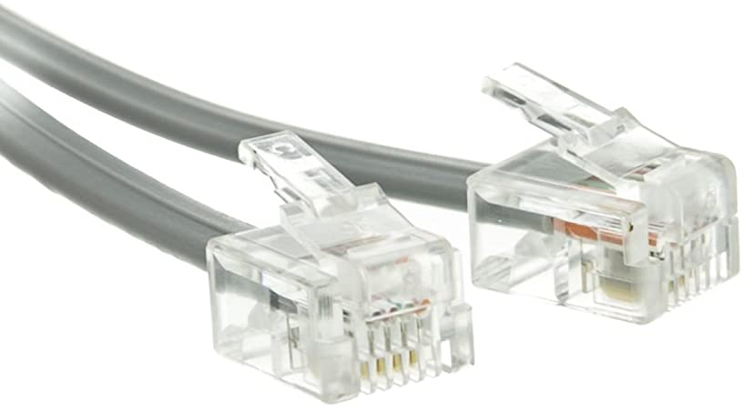| RJ11 |Twisted Pair Cable|Connecting telephone cables. |
|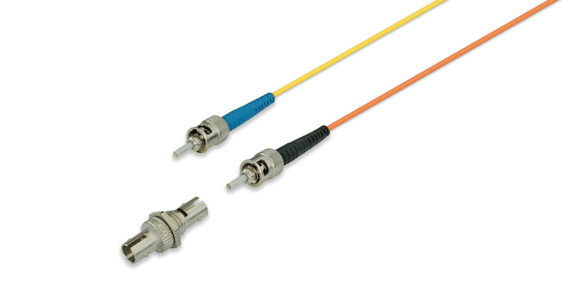| ST  |Fiber-optic Cable|They support connections with both single and multi-mode fiber cables. The primary job of this connector is to connect the cables without getting the optic fiber damaged. The optic fiber is extremely fragile, therefore protecting it is one of the main jobs of the connector.|

---------------------------------------------------------------

# MDI/MDIX Device Type

MDI/MDIX are types of Ethernet interface (both physical and electrical/optical) in a computer network used to carry transmission. They must be connected using the right twisted pair cable so that the transmission pair on one end is linked to the receiving pair on the other end, and vice versa

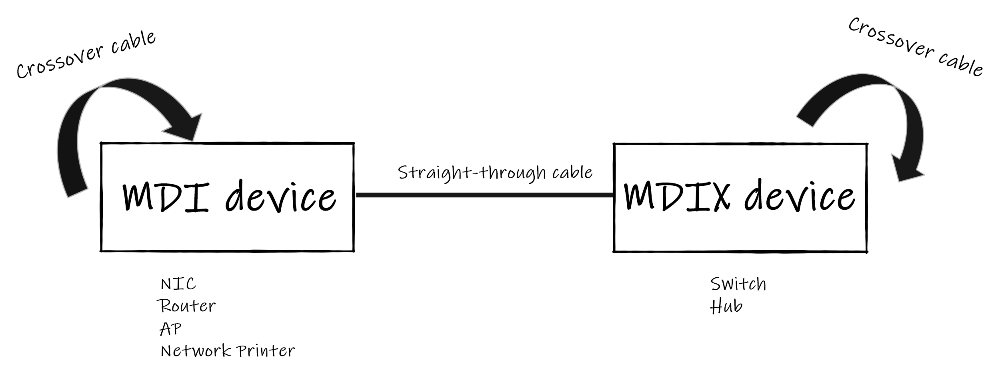

<table>
  <tr>
    <th>Setting</th>
    <th>MDI device</th>
    <th>MDIX device</th>
  </tr>
  <tr>
    <td>MDI</td>
    <td>Crossover cable</td>
    <td>Straight-through cable</td>
  </tr>
  <tr>
    <td>MDIX</td>
    <td>Straight-through cable</td>
    <td>Crossover cable</td>
  </tr>
   <tr>
    <td>Auto-MDI/MDIX</td>
    <td  colspan="2">Either crossover or straight-through cable</td>
  </tr>
</table>

-----------------------------

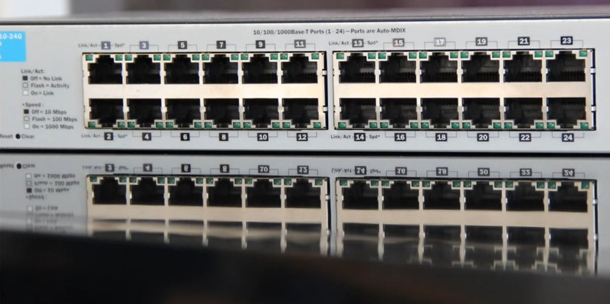
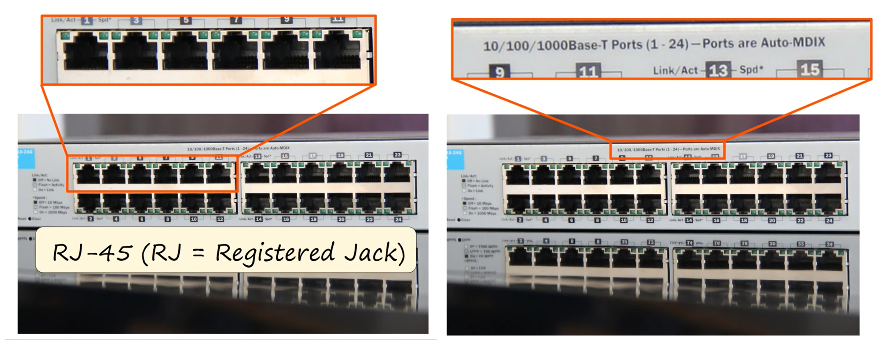

----------------------------

# Transmission Modes

 The transmission mode defines the direction of signal flow between two connected devices.
 
 
|Basis for Comparison|	Simplex	| Half Duplex	|Full Duplex|
|--|--|--|--|
|Direction of Communication|	Unidirectional|	Two-directional, one at a time|	Two-directional, simultaneously|
|Send / Receive	|The sender can only send data	|The sender can send and receive data, but one a time	|The sender can send and receive data simultaneously|
|Performance|	Worst performing mode of transmission|	Better than Simplex	|Best performing mode of transmission|
|Example|	Keyboard and monitor	|Walkie-talkie	|Telephone|

-----------------------------------
# Straight-through, Crossover, and Rollover Wiring

These terms are referring to the way the UTP cables are wired (which pin on one end is connected to which pin on the other end).

## Straight-Through Wired Cables

- Straight-Through refers to cables that have the pin assignments on each end of the cable. In other words, Pin 1 connector A goes to Pin 1 on connector B, Pin 2 to Pin 2, etc. 

- When we talk about cat5e patch cables, the Straight-Through wired cat5e patch cable is used to connect computers, printers, and other network client devices to the router, switch or hub.

## Crossover Wired Cables

- They are at opposite positions on either end of the cable. In other words, Pin 1 on connector A goes to Pin 3 on connector B. Pin 2 on connector A goes to Pin 6 on connector B, etc.

- Crossover cables are most commonly used to connect two hosts directly. Examples would be connecting a computer directly to another computer, connecting a switch directly to another switch, or connecting a router to a router. 

- Note: While in the past, when connecting two host devices directly, a crossover cable was required. Nowadays, most devices have auto-sensing technology that detects the cable and device and crosses pairs when needed.

# Rollover Wired Cables (console cable)

- Rollover wired cables have opposite Pin assignments on each end of the cable or, in other words, it is "rolled over." Pin 1 of connector A would be connected to Pin 8 of connector B. Pin 2 of connector A would be connected to Pin 7 of connector B and so on.

- A rollover cable is a network cable that connects a computer terminal to  a **device's console port** .

--------------------------------------

## Full-Duplex 

# Straight-through cable
Let's say we connected a PC to siwtch with a fastethernet  connection.

These numbers represented pins on RJ45 on **PC NIC** and the switch interface.

There are 8 but we only use 4 or two pairs since it is the fastethernet or 100Base-T. Also in this diagram thw wrires looks stright, in real life the pairs are twisted together.

This allows what is called Full-Duplex transmission.

Full-Duplex means that both devices can send and receive data at the same time and no problem like collision will occur because you separate wire to transmit and receive data.

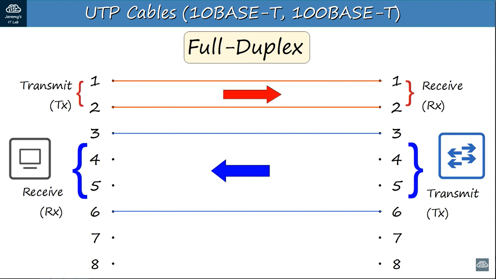

The NIC on the router transmits and receives data on the same pairs as the PC NIC does.

When connected a PC to a switch or a router to a switch this works fine because they transmit and receive on opposite pin pairs. 

**This kind of cable is called straight-through because pin 1 on one end connect through to pin 1 on the other end ...etc**

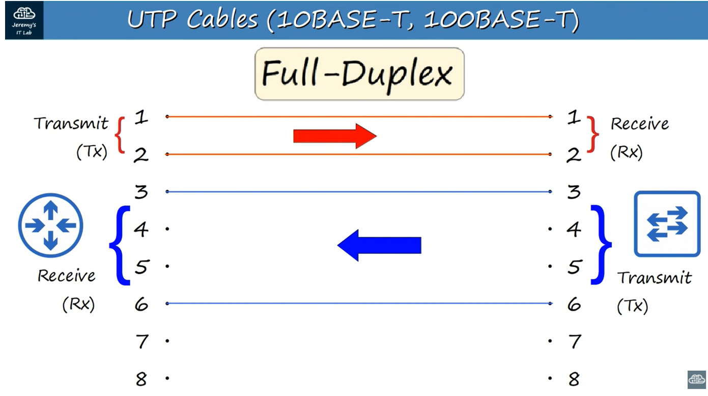

What happens if the router on the left sends data to the router on the right?
It simply not going to work!!

The right router isn't prepared to receive data on pins 1 and 2 so the communication between two router just doesn't happen.

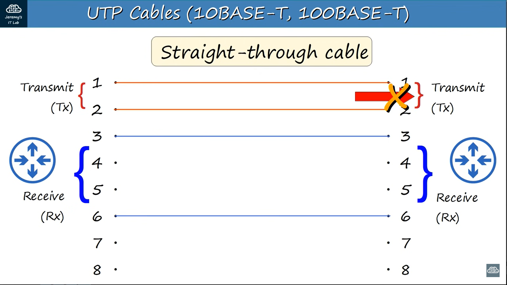

# Crossover cable

So now the two devices can send data to each other with no problems

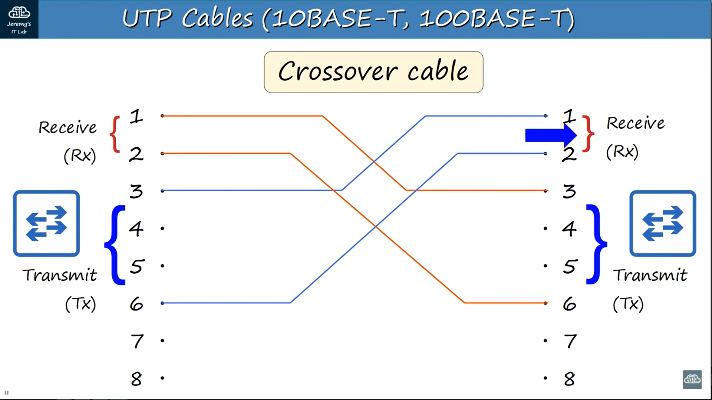

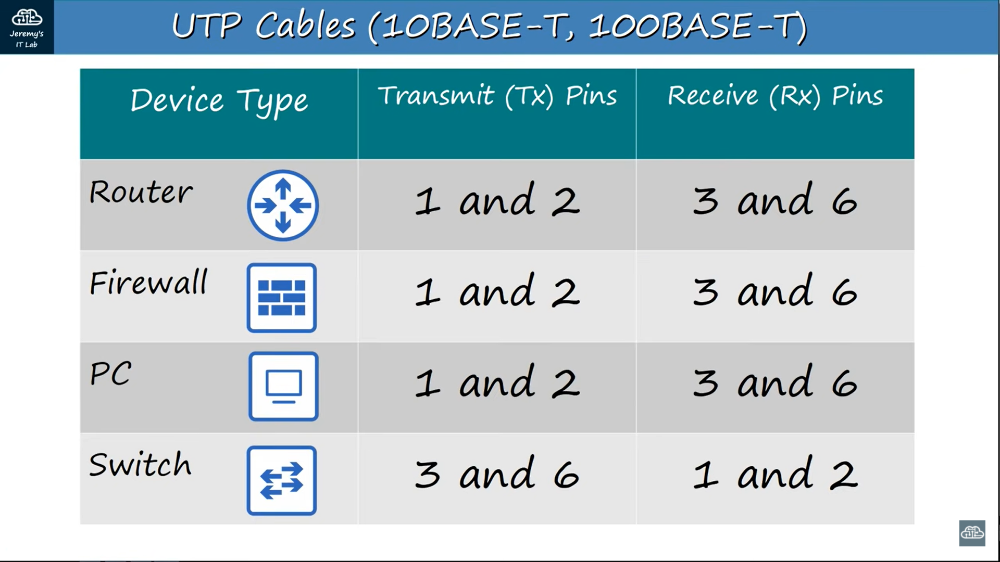

# Auto-MDI/MDIX

The truth is that most modern networking devices have evolved beyond having to worry about straight-through or crossover cables that's because newer networking devices include a feature called **auto-mdix.** 

Previously if two switches were connected with a straight-through cable, they would be unable to communicate. however auto mdix allows devices to automatically detect which pins the neighbour is transmitting data on and then adjust which pins they used to transmit and receive data. So now they can exchange data normally.

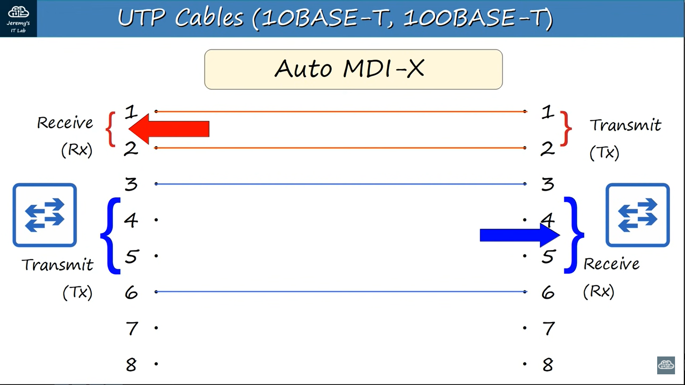

--------------------------------------------------
# Fiber cable

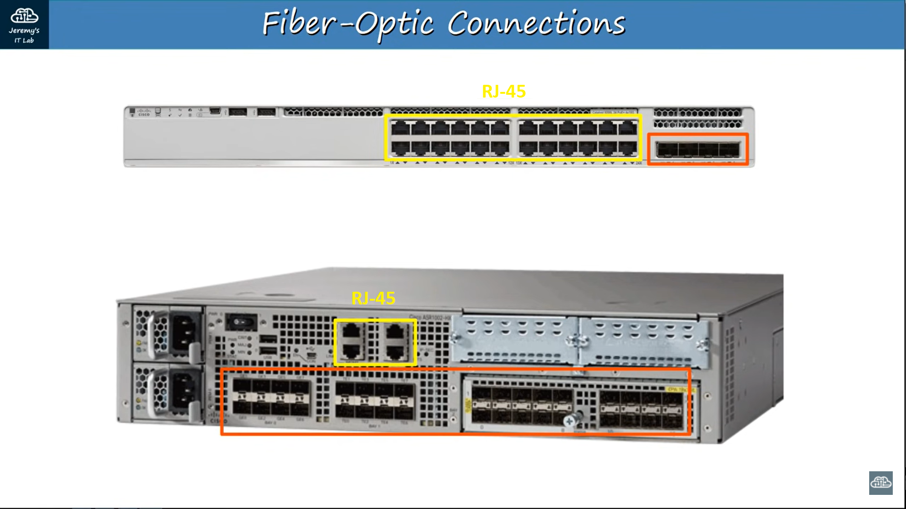

look at this Cisco switch here , here it is 24 ports for RJ45 connectors. This is ports where you connect the copper UTP cable to but what about  the red interfaces? in this interfaces you insert on of these :

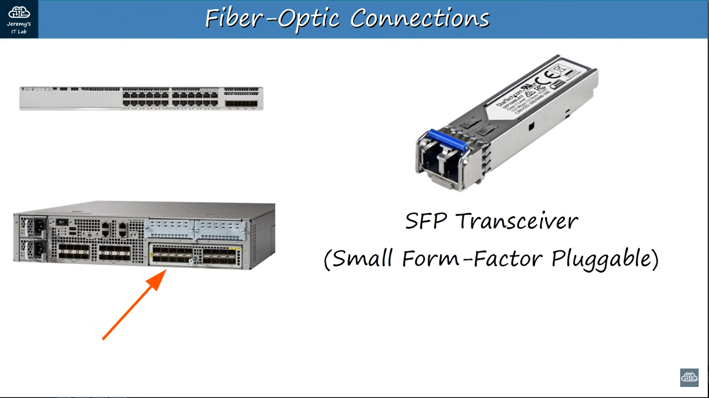

So you connect one of these cables. this is a fiber cable.
Notice that there are two connector on each end thats becaue you need one connector to tansmit data and one to recieve data on each end.

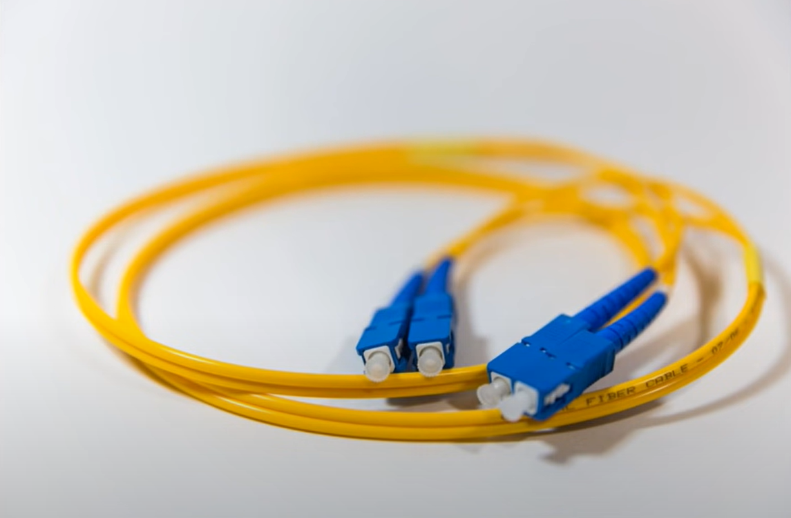
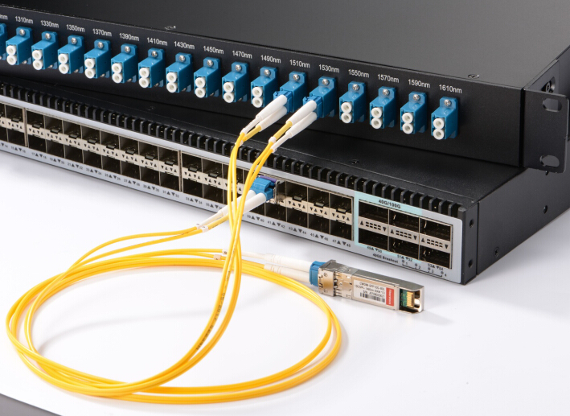

# Transmission Types

#### Addressing Methods
Addressing a message means determining to which destination a source wants to communicate.

## Unicast
The unicast addressing method indicates that communication through a network involves a unique sender (source) and a single receiver (destination).

## Broadcast
The broadcast addressing method considers the communication through a network that involves a single sender (source) and multiple receivers (destinations).
 
 - some communication protocols don’t support broadcast addressing, such as IPv6.
 - In most cases, broadcast messages aren’t routed

## Multicast
Multicasting addresses messages for a specific group of devices in a network. Note that, even if a group contains all the devices in a network, multicast is theoretically different from the broadcast. This difference consists that, in the multicast case, devices effectively subscribe to receive messages. In the broadcast case, however, devices receive messages regardless of whether or not they want to.

## Anycast
The anycast addressing method forwards messages to a single device of a specific group of devices. Typically, considering the sender’s position, the topologically **nearest device** of the aimed anycast group will receive the message.

## let's sum it up :

| TYPE      | ASSOCIATIONS     | SCOPE           |             EXAMPLE              |
|----|----|-----|----|
| Unicast   | 1 to 1           | Whole network   | HTTP , Telnet, FTP, and SMTP.    | 
| Broadcast | 1 to Many        | Subnet          |         ARP  ,  DHCP             |
| Multicast | One/Many to Many | Defined horizon |             SLP                  |
| Anycast   | Many to Few      | Whole network   |             6to4                 |

**In Networking a packet can be sent to:**

- A single host –Unicast = (TCP and UDP)
- All hosts -Broadcast – (UDP only)
- A group of hosts – Multicast -(UDP only)

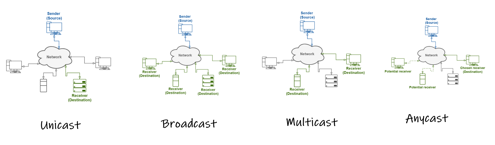

[Read more](https://www.baeldung.com/cs/multicast-vs-broadcast-anycast-unicast)

---------------------------------------------------------------------------------------------
