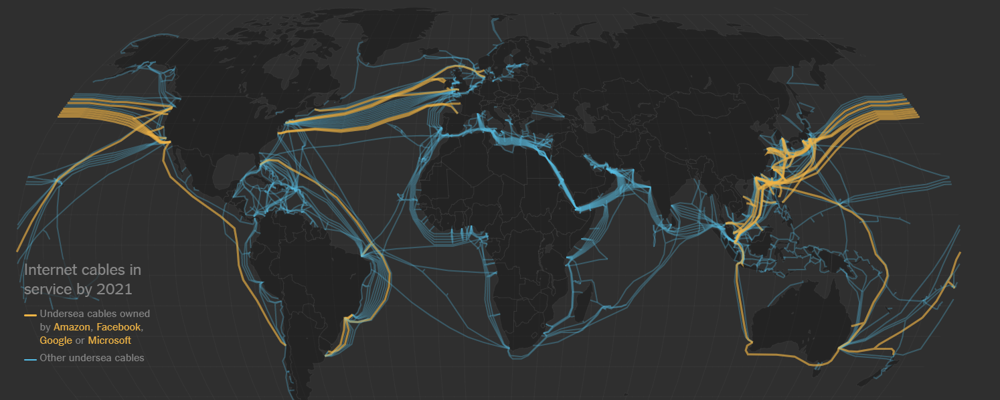
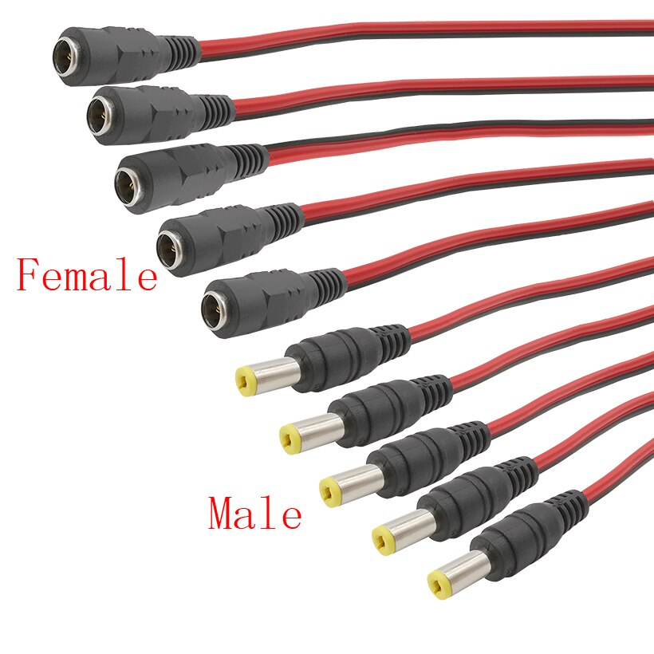
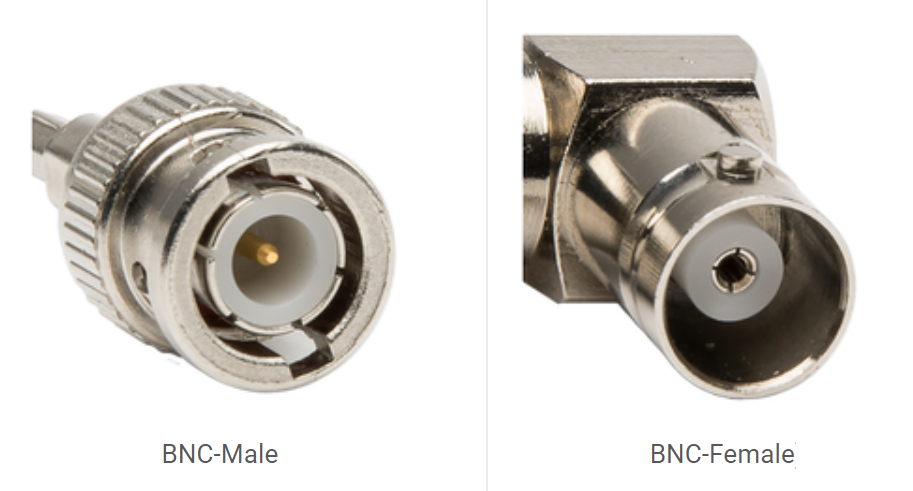
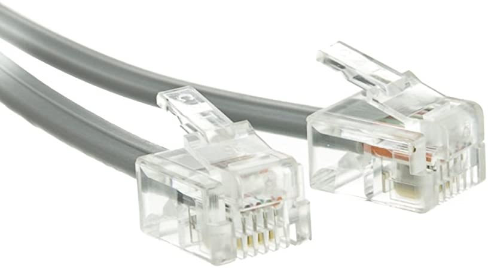
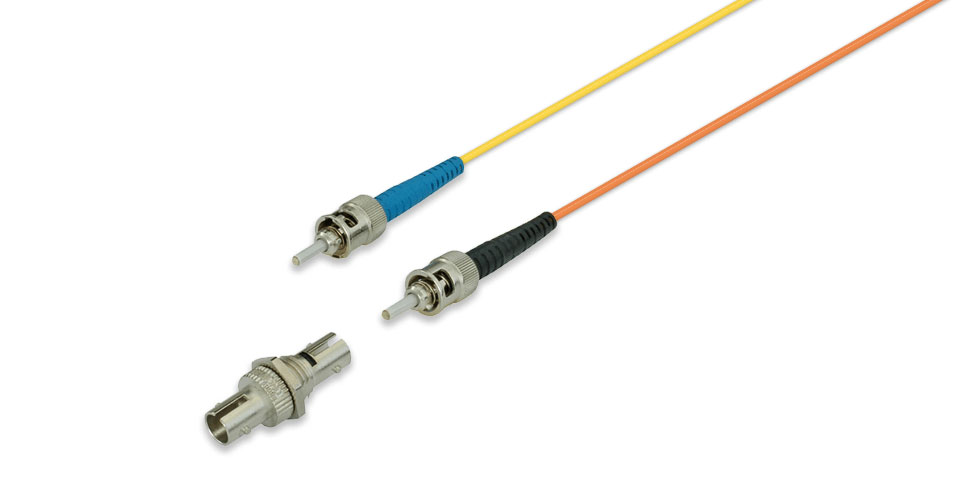
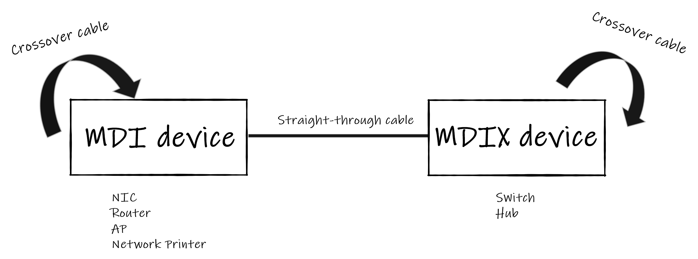

# Transmission Media

- **In the OSI model , the transmission media is available in the physical layer**

- **IEEE shorthand identifiers,** such as 10Base5, 10Base2, 10BaseT, and 10BaseF include three pieces of information:

  - **The number 10:** At the front of each identifier, 10 denotes the standard data transfer speed over these media – ten megabits per second (BW= 10Mbps).
  - **The word Base:** refer to baseband signaling.
  - **The segment type or segment length:** This part of the identifier can be a digit or a letter:
  
    - **Digit –** shorthand for how long (in meters) a cable segment may be before attenuation sets in. For example, a 10Base5 segment can be **no more** than 500 meters long.
    - **Letter –** identifies a specific physical type of cable. For example, the **T** at the end of 10BaseT stands for twisted-pair.

 

   |Specification	| Cable Type|Specification	| Cable Type|
   |--|--|--|--|
   |10BaseT|	Unshielded Twisted Pair| 1000BaseBX	|Single mode Fiber|  
   |100BaseT|Unshielded Twisted Pair|100BaseBX|	Single mode Fiber|
   |1000BaseT|Unshielded Twisted Pair |1000BaseSX	|Multimode Fiber|
   |10Base2	|Thin Coaxial|  100BaseSX|	Multimode Fiber|
   |10Base5	|Thick Coaxial| 100BaseFX|	Fiber Optic |
   |1000BaseFX|Fiber Optic|||

# Guided Media (Wired)

## Coaxial Cable

   - For LANs, it can be run longer distances than STP and UTP cable without the need for repeaters.
   - **Types:**
      - Thinnet or 10Base2.
      - Thicknet or10Base5.
     

## Twisted Pair Cable
- protects against electromagnetic interference (EMI)
- one wire is used for The transmission of the data and the other wire is used for ground.

**Note:**  ground wire isn't carrying any current.But when an electrical accident such as a short circuit occurs, the ground wire takes the unstable cuurent away from your electrical system and sends it toward the ground.

- **Types:** 
 - UTP ➡The most common UTP Connector : RJ45
 - STP
### Shielded Twisted-Pair

- STP affords greater protection from all types of external interference, but is more expensive and difficult to install than UTP. 

### Unshielded Twisted-Pair

- It is easy to install and is less expensive than STP. 

- cat3 ➡ 10Base-T
- cat5 ➡ 100Base-T
- cat5e ➡ 1000Base-T

**Coaxial cables are generally used for cable television and internet connections.
Twisted pair cables are usually used for telephone connections.**

|Cable|Pairs|
|--|--|
|10Base-T   100Base-T| 2 pairs (4 wires)|
|1000Base-T   10GBase-T| 4 pairs (8 wires)|

## Fiber-optic Cable

- carry communication signals using pulses of light
- highly efficient and allow the transfer of data in a very large volume.
-  Undersea fiber cables are connecting our world .
- SAN implementations use optical fiber cabling. 

**"People think that data is in the cloud, but it’s not. It’s in the ocean." 😂😂**
-Jayne Stowell

The internet consists of tiny bits of code that move around the world, traveling along wires as thin as a strand of hair strung across the ocean floor. The data zips from New York to Sydney, from Hong Kong to London, in the time it takes you to read this word.

# Unguided Media (Wireless)

- **Infrared waves** are used for very short distance communication. 

---------------------------------------------------------------

# Connectors

- Networking cable connectors are many and differ in terms of compatibility, built quality, cables type, and other specifications.

- Connectors can be distinguished according to :
    - their physical appearance and mating features, such as plugs **(male connectors)** or sockets and ports **(female connectors)**.
    - their different pinning configurations, such as DB9 and DB15 connectors, which have 9 and 15 pins, respectively.
    - the kind of electrical interfaces they support. Examples of different types of connectors include:
        - Connectors for serial interfaces, such as RS-232 and V.35
        - Ethernet connectors, such as RJ-45 and BNC connectors
        - Fiber-optic cabling connectors, such as SC and ST connectors

|Image|Connector| Used for| Notes |
|--|--|--|--|
|| BNC |Coaxial Cable||
||T-connector (BNC T-connectors) |Coaxial Cable|Connecting three cables together.|
|| RJ45 |Twisted Pair Cable| The most commonly used Ethernet cable connectors.|
|| RJ11 |Twisted Pair Cable|Connecting telephone cables. |
|| ST  |Fiber-optic Cable|They support connections with both single and multi-mode fiber cables. The primary job of this connector is to connect the cables without getting the optic fiber damaged. The optic fiber is extremely fragile, therefore protecting it is one of the main jobs of the connector.|

---------------------------------------------------------------

# MDI/MDIX Device Type

MDI/MDIX are types of Ethernet interface (both physical and electrical/optical) in a computer network used to carry transmission. They must be connected using the right twisted pair cable so that the transmission pair on one end is linked to the receiving pair on the other end, and vice versa

<table>
  <tr>
    <th>Setting</th>
    <th>MDI device</th>
    <th>MDIX device</th>
  </tr>
  <tr>
    <td>MDI</td>
    <td>Crossover cable</td>
    <td>Straight-through cable</td>
  </tr>
  <tr>
    <td>MDIX</td>
    <td>Straight-through cable</td>
    <td>Crossover cable</td>
  </tr>
   <tr>
    <td>Auto-MDI/MDIX</td>
    <td  colspan="2">Either crossover or straight-through cable</td>
  </tr>
</table>

-----------------------------

----------------------------

