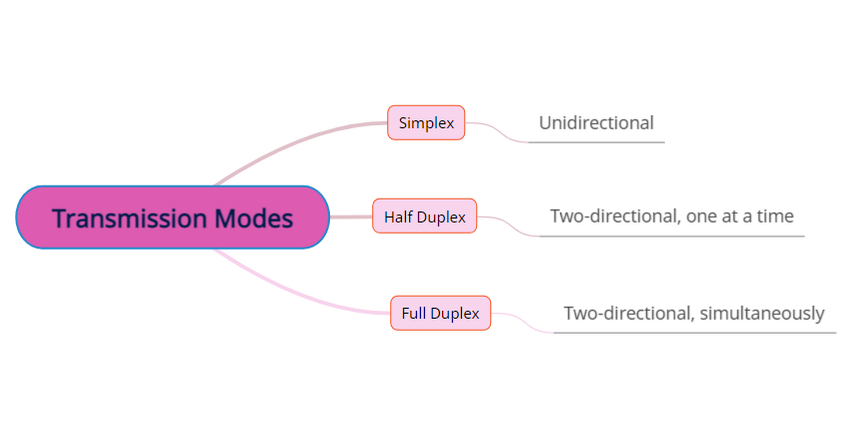
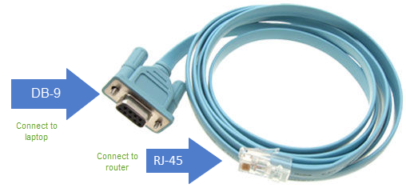
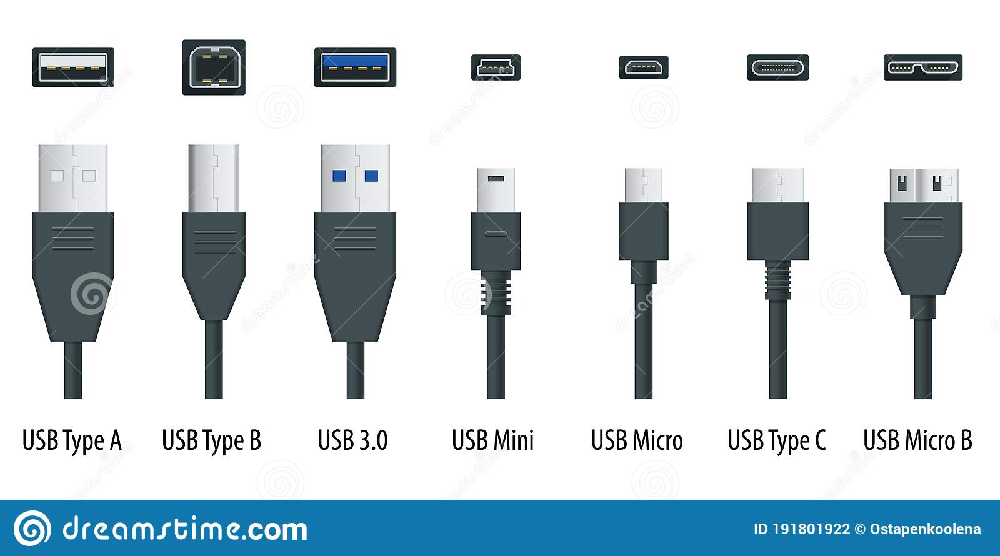
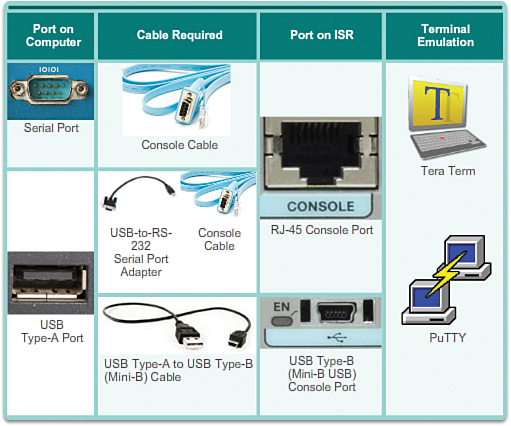

  

# Transmission Modes

 The transmission mode defines the direction of signal flow between two connected devices.
 
 
|Basis for Comparison|	Simplex	| Half Duplex	|Full Duplex|
|--|--|--|--|
|Direction of Communication|	Unidirectional|	Two-directional, one at a time|	Two-directional, simultaneously|
|Send / Receive	|The sender can only send data	|The sender can send and receive data, but one a time	|The sender can send and receive data simultaneously|
|Performance|	Worst performing mode of transmission|	Better than Simplex	|Best performing mode of transmission|
|Example|	Keyboard and monitor	|Walkie-talkie	|Telephone|

-----------------------------------
# Straight-through, Crossover, and Rollover Wiring

These terms are referring to the way the UTP cables are wired (which pin on one end is connected to which pin on the other end).

## Straight-Through Wired Cables

- Straight-Through refers to cables that have the pin assignments on each end of the cable. In other words, Pin 1 connector A goes to Pin 1 on connector B, Pin 2 to Pin 2, etc. 

- When we talk about cat5e patch cables, the Straight-Through wired cat5e patch cable is used to connect computers, printers, and other network client devices to the router, switch or hub.

   

## Crossover Wired Cables

- They are at opposite positions on either end of the cable. In other words, Pin 1 on connector A goes to Pin 3 on connector B. Pin 2 on connector A goes to Pin 6 on connector B, etc.

- Crossover cables are most commonly used to connect two hosts directly. Examples would be connecting a computer directly to another computer, connecting a switch directly to another switch, or connecting a router to a router. 

- Note: While in the past, when connecting two host devices directly, a crossover cable was required. Nowadays, most devices have auto-sensing technology that detects the cable and device and crosses pairs when needed.

  

# Rollover Wired Cables (console cable)

- Rollover wired cables have opposite Pin assignments on each end of the cable or, in other words, it is "rolled over." Pin 1 of connector A would be connected to Pin 8 of connector B. Pin 2 of connector A would be connected to Pin 7 of connector B and so on.

- A rollover cable is a network cable that connects a computer terminal to  a **device's console port** .

  

  
  
  

--------------------------------------

## Full-Duplex 

# Straight-through cable
Let's say we connected a PC to siwtch with a fastethernet  connection.

These numbers represented pins on RJ45 on **PC NIC** and the switch interface.

There are 8 but we only use 4 or two pairs since it is the fastethernet or 100Base-T. Also in this diagram thw wrires looks stright, in real life the pairs are twisted together.

This allows what is called Full-Duplex transmission.

Full-Duplex means that both devices can send and receive data at the same time and no problem like collision will occur because you separate wire to transmit and receive data.

The NIC on the router transmits and receives data on the same pairs as the PC NIC does.

When connected a PC to a switch or a router to a switch this works fine because they transmit and receive on opposite pin pairs. 

**This kind of cable is called straight-through because pin 1 on one end connect through to pin 1 on the other end ...etc**

What happens if the router on the left sends data to the router on the right?
It simply not going to work!!

The right router isn't prepared to receive data on pins 1 and 2 so the communication between two router just doesn't happen.

# Crossover cable

So now the two devices can send data to each other with no problems

# Auto-MDI/MDIX

The truth is that most modern networking devices have evolved beyond having to worry about straight-through or crossover cables that's because newer networking devices include a feature called **auto-mdix.** 

Previously if two switches were connected with a straight-through cable, they would be unable to communicate. however auto mdix allows devices to automatically detect which pins the neighbour is transmitting data on and then adjust which pins they used to transmit and receive data. So now they can exchange data normally.

--------------------------------------------------
# Fiber cable

look at this Cisco switch here , here it is 24 ports for RJ45 connectors. This is ports where you connect the copper UTP cable to but what about  the red interfaces? in this interfaces you insert on of these :

So you connect one of these cables. this is a fiber cable.
Notice that there are two connector on each end thats becaue you need one connector to tansmit data and one to recieve data on each end.

