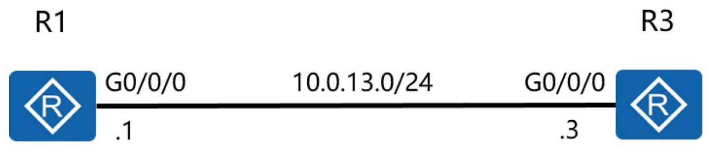

# Lab 3 Topology



### Change the system time parameter

```
<Huawei>clock timezone Local add 08:00:00
<Huawei>clock datetime 12:00:00 2016-03-11
<Huawei>display clock
2016-03-11 12:00:10
Friday
Time Zone(Local) : UTC+08:00
```

### Access the system view

```
<Huawei>system-view
Enter system view, return user view with Ctrl+Z.
[Huawei]
```

### Change device names

Change the name of the R1 router to R1.

```
[Huawei] sysname R1
[R1]
```
Change the name of the R3 router to R3.

```
[Huawei] sysname R3
[R3]
```

### Configure the login information

```
[R1]header shell information "Welcome to the Huawei certification lab."
[R1]header login information “Please enter password."
```

To check whether the login information has been changed, exit from the router command line interface, and log back in to view the login information.

```
[R1] quit
<R1> quit
Configuration console exit, please press any key to log on
Welcome to the Huawei certification lab.
<R1>
```

### Configure console port parameters

```
[R1]user-interface console 0
[R1-ui-console0]authentication-mode password
[R1-ui-console0]set authentication password cipher
Warning: The "password" authentication mode is not secure, and it is strongly recommended to use "aaa"
authentication mode.
Enter Password(<8-128>):
Confirm password:
[R1-ui-console0] idle-timeout 20 0
```
Run the display this command to check the configuration results.
```
[R1-ui-console0] display this
```

### Configure interface IP addresses and descriptions

```
[R1]interface GigabitEthernet 0/0/0
[R1-GigabitEthernet0/0/0]ip address 10.0.13.1 24
[R1-GigabitEthernet0/0/0]description This interface connects to R3-G0/0/0
```
Run the display this command to check the configuration results at the current interface view.
```
[R1-GigabitEthernet0/0/0]display this
[V200R007C00SPC600]
interface GigabitEthernet0/0/0
description This interface connects to R3-G0/0/0
ip address 10.0.13.1 255.255.255.0
```

### Run the display interface command to view the interface description

```
[R1]display interface GigabitEthernet0/0/0
GigabitEthernet0/0/0 current state : UP
Line protocol current state : UP
Last line protocol up time : 2016-03-11 04:13:09
Description: This interface connects to R3-G0/0/0
Route Port,The Maximum Transmit Unit is 1500
Internet Address is 10.0.13.1/24
IP Sending Frames' Format is PKTFMT_ETHNT_2, Hardware address is 5489-9876-830b
Last physical up time : 2016-03-10 03:24:01
Last physical down time : 2016-03-10 03:25:29
Current system time: 2016-03-11 04:15:30
```

#### After completing the configuration, run the ping command to test the connection between R1 and R3.

```
<R1>ping 10.0.13.3
PING 10.0.13.3: 56 data bytes, press CTRL_C to break
Reply from 10.0.13.3: bytes=56 Sequence=2 ttl=255 time=32 ms
Reply from 10.0.13.3: bytes=56 Sequence=3 ttl=255 time=32 ms
Reply from 10.0.13.3: bytes=56 Sequence=4 ttl=255 time=32 ms
Reply from 10.0.13.3: bytes=56 Sequence=5 ttl=255 time=32 ms
--- 10.0.13.3 ping statistics ---
5 packet(s) transmitted
5 packet(s) received
0.00% packet loss
round-trip min/avg/max = 32/32/35 ms om 10.0.13.3: bytes=56 Sequence=1 ttl=255 time=35 ms
```

### View the file list stored on the current device

Run the `dir` command in the user view to display the list of files in the current directory.

```
<R1>dir
Directory of flash:/
Idx Attr Size(Byte) Date Time(LMT) FileName
0 -rw- 1,738,816 Mar 10 2016 11:50:24 web.zip
1 -rw- 68,288,896 Mar 10 2016 14:17:5 ar2220E-v200r007c00spc600.cc
2 -rw- 739 Mar 10 2016 16:01:17 vrpcfg.zip
1,927,476 KB total (1,856,548 KB free)
```

### Manage device configuration files

Attempt to display the saved-configuration file.

```
<R1>display saved-configuration
```
There is no correct configuration file in FLASH Since no save-configuration file exists, save the current configuration file.

```
<R1>save
The current configuration will be written to the device.
Are you sure to continue? (y/n)[n]:y
It will take several minutes to save configuration file, please wait............
Configuration file had been saved successfully
Note: The configuration file will take effect after being activated
```

### View the saved configuration information

```
<R1>display saved-configuration
[V200R007C00SPC600]
#
sysname R1
header shell information "Welcome to Huawei certification lab"
#
board add 0/1 1SA
board add 0/2 1SA
……output omit……
```

### View the current configuration information

```
<R1>display current-configuration
[V200R007C00SPC600]
#
sysname R1
header shell information "Welcome to Huawei certification lab"
#
board add 0/1 1SA
board add 0/2 1SA
board add 0/3 2FE
……output omit……
```

### View the startup configuration information

A router can store multiple configuration files. Run the following command to view the configuration file to currently be used after the next startup:

```
<R3>display startup
MainBoard:
Startup system software: flash:/ar2220E-V200R007C00SPC600.cc
Next startup system software: flash:/ar2220E-V200R007C00SPC600.cc
Backup system software for next startup: null
Startup saved-configuration file: null
```

### Delete configuration files from the flash memory.

```
<R1>reset saved-configuration
This will delete the configuration in the flash memory.
The device configurations will be erased to reconfigure.
Are you sure? (y/n)[n]:y
Clear the configuration in the device successfully.
```

### Device restart procedure

Use the reboot command to restart the router.

```
<R1>reboot
Info: The system is now comparing the configuration, please wait.
Warning: All the configuration will be saved to the next startup configuration. Continue ?
[y/n]:n
System will reboot! Continue ? [y/n]:y
Info: system is rebooting ,please wait...
```

### Final configuration
```
[R1]display current-configuration
[V200R007C00SPC600]
sysname R1
header shell information "Welcome to Huawei certification lab"
interface GigabitEthernet0/0/0
description This interface connects to R3-G0/0/0
ip address 10.0.13.1 255.255.255.0
user-interface con 0
authentication-mode password
set authentication password cipher %$%$4D0K*-
```

-----------------------------------------------------------------

