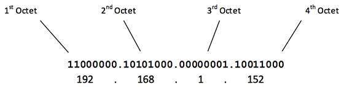
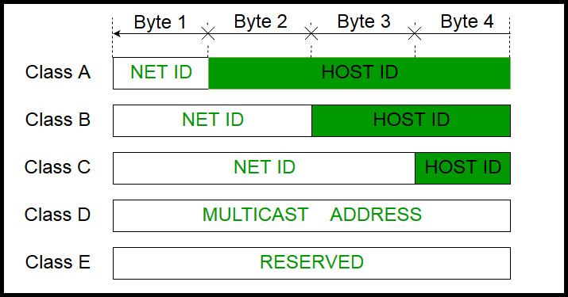
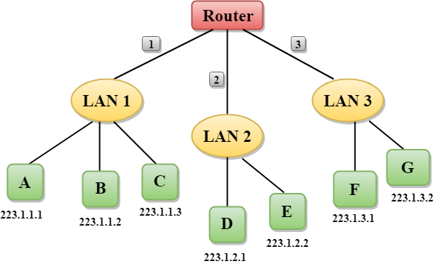
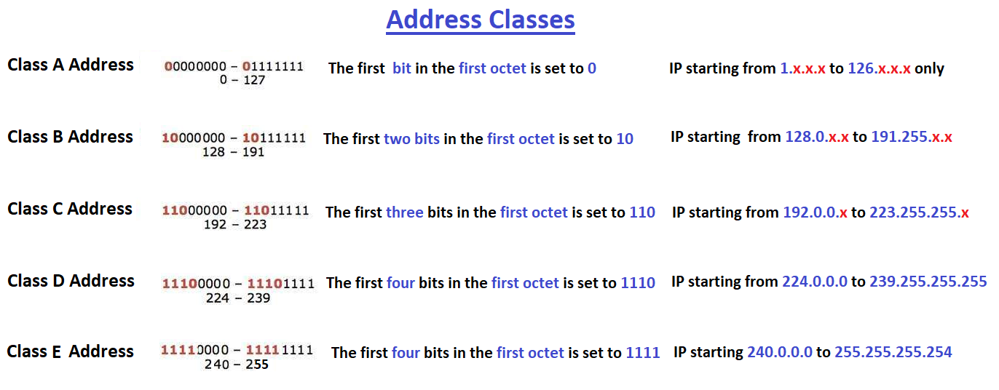
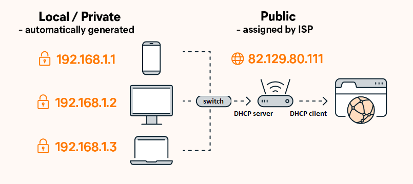

# IPv4

- IP stands for **Internet Protocol.** This address is used to identify a device on the **internet or even a local network**. It also helps you to develop a virtual connection between a destination and a source.

- Each IP address in **IPv4 are 32-bits** long. This allows for a maximum of 4,294,967,296 (2 power 32) unique addresses.  

- IP addresses are **binary numbers** but are typically **expressed** in **"dot-decimal notation"** where each byte is written in the decimal form to make reading and using them easier for humans.

- An IP address can look something like this- 193.32.216.9, where each number can range from 0 to 225. It is assigned by **IANA**. 
 (where 193 represents the decimal notation of first 8 bits of an address, 32 represents the decimal notation of second 8 bits of an address...etc.)
 
- Each octet consists of 8 bits. Some bits are used to identify a network, while the rest are used to identify hosts within a network.

  

### IP Address is divided into two parts:

- **Prefix (Network Address):** identifies the physical network to which the computer is attached.
- **Suffix (Host Address):** identifies the individual computer on the network.

 

### Let's understand through a simple example.

In the above figure, a router has three interfaces labeled as 1, 2 & 3 and each router interface contains its own IP address.

- Each host contains its own interface and IP address.
- All the interfaces attached to the LAN 1 is having an IP address in the form of 223.1.1.xxx, and the interfaces attached to the LAN 2 and LAN 3 have an IP address in the form of 223.1.2.xxx and 223.1.3.xxx respectively.
- Each IP address consists of two parts. The first part (first three bytes in IP address) specifies the network and second part (last byte of an IP address) specifies the host in the network.

## Classful Addressing

- An IP address is divided into sub-classes, each one defined by a letter: A, B, C, D and E and classified depending on the **first octet** range.

- For example, the A class includes all IP addresses from 0.0.0.0 to 127.255.255.255, therefore an IP address whose first octet is between 0 and 127 is an A class IP address.

- Classful addressing is a network addressing the Internet’s architecture from 1981 till **Classless** Inter-Domain Routing was introduced in 1993.

- The major drawback of IP address classes is the risk of running out of address space soon.

**The table below shows the network classes:**

<table>
  <tr>
    <th>IP ADDRESS CLASS</th>
    <th>IP RANGE START</th>
    <th>IP RANGE END</th>
  </tr>
  
  <tr>
    <td>A</td>
    <td>0.0.0.0</td>
    <td>127.255.255.255</td>
    
  </tr>
  
  <tr>
    <td>B</td>
    <td>128.0.0.0</td>
    <td>191.255.255.255</td>
  </tr>
  
  <tr>
    <td>C</td>
    <td>192.0.0.0</td>
    <td>223.255.255.255</td>
  </tr>
  
  <tr>
    <td>D</td>
    <td>224.0.0.0</td>
    <td>239.255.255.255</td>
  </tr>
  
  <tr>
    <td>E</td>
    <td>240.0.0.0</td>
    <td>255.255.255.255</td>
  </tr>
  
</table>

## Class A Network

- This IP address class is used when there are a large number of hosts.

- In a Class A type of network, the first 8 bits (also called the first octet) identify the network, and the remaining have 24 bits for the host into that network.

- An example of a Class A address is 102.168.212.226. Here, “102” helps you identify the network and 168.212.226 identify the host.

- Class A addresses 127.0.0.0 to 127.255.255.255 cannot be used and is reserved for loopback and diagnostic functions.

- Class A addresses 0.0.0.0 to 0.255.255.255 used for broadcast messages to the current (“this”) network. 

## Class B Network

- The first 16 bits (known as two octets) help you identify the network. The other remaining 16 bits indicate the host within the network.

- An example of Class B IP address is 168.212.226.204, where *168 212* identifies the network and *226.204* helps you identify the network host.

## Class C Network

- Class C is a type of IP address that is used for the small network. Mostly local area network used Class C IP address to connect with the network.

- In this class, three octets are used to indent the network.

- The first 24 bits help you identify the network. The other remaining 8 bits indicate the host within the network.

- Example for a Class C IP address: 192.168.178.1

## Class D Network

- Class D addresses are only used for **multicasting applications.** Class D is never used for regular networking operations. 

- Class D addresses are 32-bit network addresses. All the values within the range are used to identify multicast groups uniquely.

- Therefore, they don’t have host ID and subnet mask.

- Example for a Class D IP address: 227.21.6.173

## Class E Network

- Class E IP addresses have been defined but still not used on the internet due to restrictions of The IETF (Internet Engineering Task Force). They have reserved this for their own research purpose. No Class E Address has been released for public use till now.  Therefore, many network implementations discard these addresses as undefined or illegal.

- Class E address 255.255.255.255 is reserved for **general broadcast.**

  (Senders direct an IP broadcast to 255.255.255.255 to indicate all other nodes on the LAN should pick up that message. This broadcast is "limited" in that it does not reach   
  every node on the internet; only nodes on the LAN.)
 
- Example for a Class E IP address: 243.164.89.28

# Example 

- IP address: `11000001`.x.x.x
  - Here 1st and 2nd bits are 1, and the 3rd bit is 0; hence, it is class C.

-----------------------------------------------------------------------

> Note: 
> Unicast IPv4 addresses (Class A, Class B and Class C) are used to identify a single interface. But multicast IPv4 addresses are used to identify a group of interfaces on different computers located in the same network segment or different network segments. A network interface can become member of many multicast groups also.

----------------------------------------------------------------------------------

# IPv4 Running out of Capacity

The number of different devices connected to the Internet grows exponentially, and the size of the address space is quickly depleted. So, new technologies were developed and adopted to slow it down. For instance:

- Short-term solutions:
    - Classless Inter-Domain Routing (CIDR).
    - Network Address Translation (NAT) + Private IP.

- A long-term solution. 
    - Internet Protocol version 6 (IPv6).
    
------------------------------------------------------------

# Public vs. Private IP Addresses

- A **private IP address** is used within a private network to connect securely to other devices within that same network.
   
   - Reserved private IP address range:
   
      |Class|Range|Subnet Mask|
      |--|--|--|
      |A|10.0.0.0 — 10.255.255.255|255.0.0.0 (8)|
      |B|172.16.0.0 — 172.31.255.255| 255.240.0.0 (12)|
      |C|192.168.0.0 — 192.168.255.255|255.255.0.0 (16)|
   
 - A **public IP address** identifies you to the wider internet so that all the information you’re searching for can find you.
     
     - Public IP Range: Any number not included in the reserved private IP address range. E.g, 8.8.8.8.

> Each device within the same network has a unique private IP address.

-----------------------------------------------------------------

# Static vs. Dynamic IP Addresses

## Static IP Address

- A static IP address is simply an address that doesn't change. Once your device is assigned a static IP address, that number typically stays the same until the device is decommissioned or your network architecture changes. 

- Static IP addresses generally are used by servers or other important equipment.

- Static IP addresses are assigned by ISPs. Your ISP may or may not allocate you a static IP address depending on the nature of your service agreement. 

- A static IP address may be IPv4 or IPv6. Some day, every bit of networked gear we have might have a unique static IPv6 address. We're not there yet. 

## Dynamic IP Address

- Dynamic IP addresses are subject to change. Dynamic addresses are assigned by DHCP servers.

- We use dynamic addresses because IPv4 doesn't provide enough static IP addresses to go around. So, for example, a hotel probably has a static IP address, but each individual device within its rooms would have a dynamic IP address.

- On the internet, your home or office router is assigned a dynamic IP address by your ISP's DHCP server. 

- Within your home or business network, the dynamic IP address for your devices -- whether they are personal computers, smartphones, streaming media devices, tablet, …etc. -- are probably assigned by your network router. 
