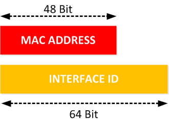
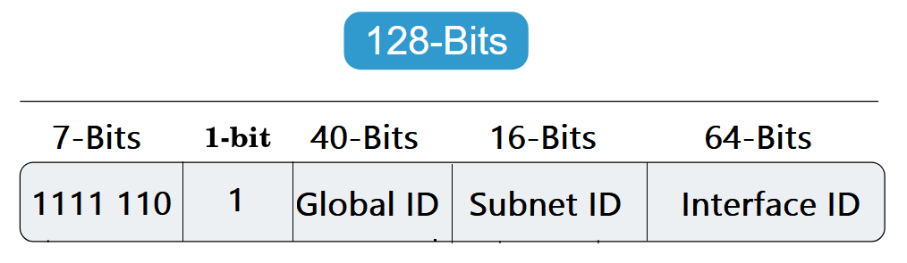

# IPv4

- The previous version, IPv4, uses a **32-bit** addressing scheme to support **4.3 billion devices**, which was thought to be enough at the time it was implemented. However, with the growth of the internet, personal computers, smartphones and now IOT, it became clear that the world needed more addresses.

# Why there is no IPv5

- There was an IPv5 that was also known as **Internet Stream Protocol**, abbreviated simply as **ST**. It was designed for connection-oriented communications across IP networks with the intent of supporting voice and video.

- It was successful at that task, and was used experimentally. One shortcoming that undermined its popular use was its **32-bit** address scheme – the same scheme used by IPv4. As a result, it had the same problem that IPv4 had – a limited number of possible IP addresses. That led to the development and eventual adoption of IPv6. Even though **IPv5 was never adopted publicly**, it had used up the name IPv5.

--------------------------------------------------

# Why IPv6

 **Given below are the major points that played a key role in the birth of IPv6:**

- **Larger Address Space :**
   - Internet has grown exponentially, and the address space allowed by IPv4 is saturating. There is a requirement to have a protocol that can satisfy the needs of future Internet addresses that is expected to grow in an unexpected manner.

- **Security :**
   - IPv4 on its own does not provide any security feature. Data has to be encrypted with some other security application before being sent on the Internet. IPv6 increases the security.

- **Simplified Header :**
   - The IPv6 header was designed to be less complex and easier to process than the IPv4 header.

- **End-to-End Connectivity :**
   - Now, each system has a unique IP address and can traverse the Internet without using NAT or other translating components. After IPv6 is fully implemented, each host can directly access other hosts on the Internet, but it will encounter some restrictions, such as firewalls and organizational policies.

- **Auto-Configuration :**
   - IPv6 supports stateful and stateless auto-configuration modes of its host device. In this way, no DHCP server will not cause inter-segment communication to stop.

--------------------------------------------------

# IPv6

- IPv6 is the next generation Internet Protocol (IP) standard intended to eventually replace IPv4.

- IPv6 was developed to deal with the problem of IPv4 address exhaustion.

- IPv6 uses **128-bit** addressing to support approximately **340 trillion** (or 2 to the 128th power).

- The **IETF** not only added more address space, it included **enhancements** to IPv6 compared with IPv4. The IPv6 protocol can **handle packets** more **efficiently**, improve **performance** and increase **security**. It enables ISPs to reduce the size of their routing tables by making them more hierarchical.

  [↗ Google IPv6](https://www.google.com/intl/en/ipv6/statistics.html)

---------------------------------------------------------------------------------------

# IPv6 Address Format

- IPv6 address is made of **128 bits** divided into **eight 16-bits groups.**

- Each block is then converted into **4-digit Hexadecimal** numbers separated by **colon.**

- For example, given below is a 128 bit IPv6 address represented in binary format and divided into eight 16-bits blocks:

     `0010000000000001 0000000000000000 0011001000111000 1101111111100001 0000000001100011 0000000000000000 0000000000000000 1111111011111011`

- Each block is then converted into Hexadecimal and separated by ‘:’ symbol: `2001:0000:3238:DFE1:0063:0000:0000:FEFB`
 
 
 
 -----------------------------------------------------------------
 
# IPv6 Address Shortening
 
 Even after converting into Hexadecimal format, IPv6 address remains long. IPv6 provides some rules to shorten the address. The rules are as follows:
 
 
 **1- Rule.1: Discard leading Zero(es):**

  - `2340:0023:AABA:0A01:0055:5054:9ABC:ABB0` can be shortened to `2340:23:AABA:A01:55:5054:9ABC:ABB0`

     
     
**2- Rule.2: If two of more blocks contain consecutive zeroes, omit them all and replace with double colon sign (::):**
   
  - `2340:0000:0000:0000:0455:0000:AAAB:1121` can be written as `2340::0455:0000:AAAB:1121`

   > Note that consecutive blocks of zeroes can be replaced only once by :: 
    
  
    
**3- Rule.3: Combining Rule 1 and Rule 2 :**
       
   

-----------------------------------------------------------
-----------------------------------------------------------

# IPv6 Configuration

# Static Ways

## 1- Manual Address
 
 - Manually configured IPv6 address by a user.

**CMD**

1- `C:\Windows\system32>netsh`

2- `netsh>interface ipv6 add address "wi-fi" 2001::5`

**GUI**

**Note that you can set multiple IP addresses**

> IPv6 is not enabled by default in Microsoft Windows XP SP2, it has to be explicitly installed and enabled. 
> To install and activate IPv6 manually on the command line: `netsh interface ipv6 install`

## 2- Link-local Address (EUI-64)

 - **Self-configured local** IPv6 address (Address starts with `FE80`).

- **EUI-64 (Extended Unique Identifier)** is a method we can use to automatically configure IPv6 host addresses.

- An IPv6 device will use the **MAC address** of its interface to generate a unique 64-bit interface ID. However, a MAC address is 48 bits and the interface ID is 64 bit. What are we going to do with the missing bits?

Here’s what we will do to fill the missing bits:

**1-** We take the MAC address and split it into two pieces.

**2-** We insert **“FFFE”** in between the two pieces so that we have a 64 bit value.

**3-** We **invert** the **7th bit** of the interface ID.

> Different Operating systems use different techniques for generating link-local addresses. CISCO, IOS, Linux, and UNIX use EUI-64. Microsoft Windows (Vista and above) uses a random value to generate the second part.

> Link-local addresses in IPv6 exist on each interface, regardless of whether the interface has an address assigned from DHCP or is configured using another method. 

### Windows (Vista and above) and EUI-64

- With the rise of network security, this was found to be a security vulnerability because an IPv6 address can be easily tied to a MAC address, which uniquely identifies physical equipment.

- Windows operating systems don’t use EUI-64. The IPv6 address is calculated by using a random value. The MAC address has no influence on this. 

   - **Why?**

     - For example, imagine a user with a laptop connecting to an IPv6 network with global prefix X:X:X:X::/64. Via SLAAC, the user's laptop will generate a globally unique address X:X:X:X:EUI-64. Let's say the user goes to another place and connects to another IPv6 network with a global prefix Y:Y:Y:Y::/64. Well, the user's laptop will generate a global unicast address Y:Y:Y:Y:EUI-64, if the user connects to a network Z:Z:Z:Z::/64 it will get IPv6 address Z:Z:Z:Z::EUI-64 and so on. You can clearly see that this creates an opportunity to track the user, because wherever he goes and to whichever network he connects, the second half of the globally unique IPv6 address his laptop generates is always the same.

- Companies realized that and introduced two concepts that help to improve user's privacy :
     - Random Interface Identifiers 
     - Temporary IPv6 addresses. 

- It is definitely possible to reconfigure Windows 10 to make it use EUI-64. 

- **Example :** `fe80::ec94:8519:2f19:722f%2` --> The %2 at the end is the interface number of the network card.
 

## IPv6 DAD for its Link-Local Address 

- **Duplicate Address Detection (DAD)** is used to verify that an IPv6 home address is unique on the LAN before the address is assigned to a physical interface. Even though the chances that another node has the same exact address are very slim. It has to perform this process.

- Before a device starts using the **self-generating address**, it needs to check if the address is being used already by any other device. 

- It is done upon every new address assignment.

- DAD leverages **Neighbor Solicitation** and **Neighbor Advertisement** messages.

- **Example:**

   - Suppose, C wants to join the local network. C generates a tentative unicast link-local address using **EUI-64**.
  
   - C sends a **neighbor solicitation message** to check if anyone else is using this address.
  
   - If a duplicate is detected, C determines that the link-local address generated can’t be used and generates another random value to get a new one and checks again. 
   
   - If no duplication is detected the tentative address gets assigned to the device for use.
   
   - When the device gets an IPv6 address, it sends a **neighbor advertisement message** to tell them that he has taken this IP.

# Dynamic Ways

## 1- Stateless Address Auto-Configuration (SLAAC)

- SLAAC allows devices on a network to **automatically configure** IPv6 addresses (IPv6 prefix) on its interface **without** managing a **DHCP server**.

### How does SLAAC work?

**Step 1: The node configures itself with a link-local address**

- When an IPv6 node is connected to an IPv6 enabled network, the first thing it typically does is to autoconfigure itself with a link-local address. The purpose of this local address is to enable the node to communicate at Layer 3 with other IPv6 devices in the local segment. 

**Step 2: The node performs Duplicate Address Detection (DAD)**

- After the IPv6 host has its link-local address auto-configured, it has to make sure that the address is actually unique in the local segment. Even though the chances that another node has the same exact address are very slim. It has to perform this process.

> Step 1 and 2 in this example depict the process of generating and assigning a unique link-local address. This process is not exactly part of the Stateless Autoconfiguration feature but without a link-local address, PC1 won't be able to communicate at layer 3 with any other IPv6 node. Thus, it is a prerequisite for the SLAAC to work and that's why we have included it in our example.

**Step 3: The node sends a Router Solicitation message**

- After PC1 has a link-local address, it can now start the process of **auto-configuring a global unicast address** using SLAAC. The first step of this process is to send an **ICMPv6** message called **Router Solicitation (RS)**. The purpose of this message is to **'ask' all IPv6 routers** attached to this segment about the **global unicast prefix** that is used. 

- The destination address is the all-routers multicast address **FF02::2** and for source, PC1 uses its link-local address. Note that only routers are subscribed to multicast group **FF02::2**, which means that only Router 1 will process this message, and all other nodes on the local segment will discard it.

- After Router 1 gets the Router Solicitation message, it responds back with an **ICMPv6** message called **Router Advertisement (RA)**. The RA message includes the **global IPv6 prefix** on the link and the **prefix length**. For the source of this RA packet, Router 1 uses its own link-local address and destination is the all-nodes multicast address `FF02::1`.

### The Problem with SLAAC

- SLAAC **does not** provide **DNS information** and without DNS, many services such as surfing the Internet are not possible. 

## 2- Stateless Address (The Most common)

- To resolve SLAAC problem, the **router** that is sending the **RA messages** sets a special flag called **O-flag to 1** (O comes from other information). This tells the nodes on the segment that they can contact a **stateless DCHPv6 server** and get the DNS and Domain name information.

- **Stateless DHCPv6** is used by nodes to obtain other information, such as a DNS server list and a domain name. A node that uses stateless DHCPv6 **must have** obtained its IPv6 addresses through some other mechanism usually SLAAC.   

- A **DHCPv6 server** does not keep track of what has or hasn't been assigned. It simply determines what address it should use on a particular network.

- The client will take all the information from DHCPv6 server **except** the **host ID (self-configure)**.

- The DHCPv6 server is only used to assign information that autoconfiguration doesn’t….stuff like a domain-name, multiple DNS servers and all the other options that DHCP has to offer.

## 3- Stateful Address

- IPv6 address configured by a **DHCPv6 server**.

- The stateful version of DHCPv6 **is pretty much the same as** for IPv4. Our DHCPv6 server will assign IPv6 addresses to all DHCPv6 clients, and it will keep track of the bindings. In short, the DHCPv6 servers knows exactly what IPv6 address has been assigned to what host.

-----------------------------------------------------
-----------------------------------------------------

# IPv6 Address Types

 There are three major categories of IPv6 addresses:

   - **Unicast** — For a single interface.

   - **Multicast** — For a set of interfaces. A packet is sent to all interfaces associated with the address.

   - **Anycast** — For a set of interfaces. A packet is sent to **only one** of the interfaces associated with this address, not to all the interfaces.

   - <del> Broadcast </del>  — There are no broadcast addresses in IPv6. Broadcast functionality is implemented using multicast addresses. 

# Unicast Addresses

## 1. Global Unicast Addresses (GUA) `2xxx::/3` `3xxx::/3`
 
 - They are equivalent to **public IPv4** addresses.
 
 - Any ip starts with the bits `001` is public:
    - 001 0 ⇾ 2 
    - 001 1 ⇾ 3 (It's not used yet.)
   
- For example google IP : `2a00:1450:4006:804::2004`

------------------------------------------------ 
 
## 2. Link-Local Addresses (APIPA) `FE80::/10`
 
 - These addresses are the equivalent of **Automatic Private IP Addressing (APIPA)** for IPv4, which uses the `169.254.0.0/16` network.
 
 - They’re assigned to hosts that **don’t have IP addresses** and **can't contact** a stateful configuration server (such as a DHCP server). 
 
 - Link-local addresses may only be used to communicate with **same-network nodes**. 

- It always begins with 1111 1110 10: 

   - `1111 1110 10` `00` 0000 ⇾ **FE80**
   - `1111 1110 10` `01` 0000 ⇾ FE90 (It's not used yet.)
   - `1111 1110 10` `10` 0000 ⇾ FEA0 (It's not used yet.)
   - `1111 1110 10` `11` 0000 ⇾ FEB0 (It's not used yet.) 

 
 > There is an important difference between IPv6 link-local addresses and IPv4 APIPA addresses. Once a PC receives an IPv4 address from a DHCP server, the APIPA address is no longer reachable. However, with IPv6, a network interface always has a link-local address even if you assign another IPv6 address manually or if the NIC receives an IPv6 address from a DHCP server. This means that computers on a link can always communicate through IPv6 using link-local addresses, which is not the case in IPv4 because APIPA addresses are not in the same subnet as private or public IPv4 addresses. Thus, if the local DHCP is unavailable, the computers can still access local services through IPv6 but won't be able to reach the Internet or services in other links.
 
------------------------------------------------
 
## 3. Site-Local Addresses `FECx::/10` `FEDx::/10` `FEEx::/10` `FEFx::/10`
 
- They are equivalent to **private IP addresses** in IPv4. 

- The address space reserved for these addresses, which are only routed within an organization and not on the public Internet.

- It always begins with `1111 1110 11`:

   - `1111 1110 11` `00` ⇾ FEC
   - `1111 1110 11` `01` ⇾ FED  
   - `1111 1110 11` `10` ⇾ FEE  
   - `1111 1110 11` `11` ⇾ FEF   

- The following 54 bits are the subnet ID, and the last 64 bits are the interface ID, which is the part that has to be unique on a link (local network on which hosts communicate without intervening routers). 

> NOTE : This class has been deprecated and replaced with unique local addresses.
------------------------------------------------

## 4. Unique Local Addresses (ULA) `FDxx::/7` 

- These are **private addresses**. 
 
- Unique Local Address–These addresses are the replacement for site-local addresses (which were part of earlier IPv6 standards).
 
-  It always begins with `1111 110`.

 
------------------------------------------------

## 5. Loopback Address `::1/128`

------------------------------------------------

## 6. Unspecified Address `::/128`
 
- The unspecified address is `0:0:0:0:0:0:0:0`. 

- The unspecified address **indicates the absence of an address**, and it **can never be assigned to a host**. It can be used by an IPv6 host that does not yet have an address assigned to it. For example, when the host sends a packet to discover if an address is used by another node, the host uses the unspecified address as its source address.
 
------------------------------------------------

# Multicast Address `FFxx::/8`
 
- IPv6 multicast addresses start with `FFxx::/8`. After the first 8 bits there are **4 bits** which represent the **flag fields** that indicate the nature of **specific multicast addresses**. Next **4 bits** indicate the s**cope of the IPv6 network** for which the **multicast traffic** is intended. Routers use the scope field to determine whether multicast traffic can be forwarded. The remaining **112 bits** of the address make up the **multicast Group ID**.
 
 
 
------------------------------------------------

# Anycast Address

- An anycast address specifies a set of interfaces, possibly at different locations, that all share a **single address**. 

- A packet sent to an anycast address goes only to the **nearest** member of the anycast group.

- An IPv6 anycast address uses the same address range as **global unicast addresses**.

- Anycast is deployed on [root servers](https://root-servers.org/)

 
  
 ------------------------------------------------
 ------------------------------------------------
