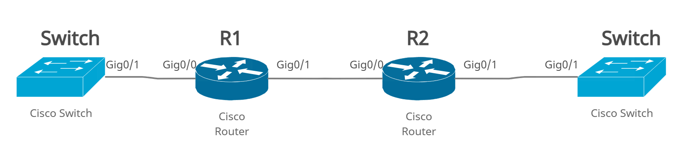

# CDP Cisco Discovery Protocol 

- CDP is Cisco **proprietary**  that is used for collecting **directly connected neighbor** device information like hardware, software, device name details and many more...

- CDP works at **Layer 2** (data-link layer), therefore, it's not necessary for the device to have an IP address on it for it to be detected by its neighbors.

- CDP sends CDP packets containing the neighbor information after every 60 seconds and has a hold time of 180 seconds by default (using the multicast **MAC address** `01-00-0c-cc-cc-cc`).
   -  E.g, if R1 stop sending CDP packets to R2, R2 will assume that he is down after 180 seconds (hold time).

- CDP is **enabled by default** on most Cisco equipment. Not just on routers and switches, but also on the firewalls and even the IP Phones will run CDP.  


- It aids in troubleshooting by allowing administrators to map out how Cisco devices are connected to each other  and to check that the device is there and detected at Layer 2.
  - For example, say that you're in New York and there is a problem in Sydney and you don't know about the network topology in Sydney. As long as you can jump on one device in Sydney, then you could use show CDP neighbors to map out how all the other Cisco devices are connected to each other.

 
------------------------------------------------------------

## CDP Commands
|Command | Description|
|--|--|
|`R1#show cdp`|It shows if CDP is enabled or not, also the timers, etc.|
|`R1#show cdp neighbors`| To see all **directly connected** neighbors. It will give you a nice brief summary view.|
|`R1#show cdp neighbors detail`|It is used to verify the attached devices. It will give more detail, including the IP addresses of the neighbors.|
|`R1(config)# no cdp run`| To disable it.|
|`R1(config)# cdp run`|To turn it back on again|
|`R1(config)# int g0/1` <br> `R1(config-if)# no cdp enable`|To disable it at the interface level|
|`R1(config)# cdp timer 40` <br> `R1(config)# cdp holdtime 200`| To change the default time. <br> Note that they won't work on packet tracer|
|R2#clear cdp table| To clear the table|


- A reason you would maybe want to disable CDP is it can be seen as a security concern. If you're not in a highly secure environment, you don't want people to be able to see what devices are plugged in there so you could disable CDP.
   
   - Let’s say you've got a switch on the edge of your network and you want CDP to be enabled on the internal facing interfaces. You want to disable it on the external facing interface, so you don't give up information to another organization. Therefore, you can do a ‘no cdp enable’ at the interface level.

---------------------

## Example



> Each router can see his neighbors even if the interfaces don't  have IP (L2 Protocol).

**Router 1** 

```
Router>en
Router#config t
Router(config)#host R1
R1(config)#int g0/0
R1(config-if)#no shut
%LINK-5-CHANGED: Interface GigabitEthernet0/0, changed state to up
R1(config-if)#ip address 10.0.0.1 255.255.255.0

R1(config-if)#int g0/1
R1(config-if)#no shut
%LINK-5-CHANGED: Interface GigabitEthernet0/1, changed state to up
```

**Router 2**

```
Router>en
Router#config t
Router(config)#host R2
R2(config)#int g0/0
R2(config-if)#no shut
%LINK-5-CHANGED: Interface GigabitEthernet0/0, changed state to up

R2(config-if)#int g0/1
R2(config-if)#no shut
%LINK-5-CHANGED: Interface GigabitEthernet0/1, changed state to up
```


**Let’s take a look at a network map:**

**`R1#show cdp neighbors`** 
``` 
Capability Codes: R - Router, T - Trans Bridge, B - Source Route Bridge
                  S - Switch, H - Host, I - IGMP, r - Repeater, P - Phone
Device ID    Local Intrfce   Holdtme    Capability   Platform    Port ID
Switch       Gig 0/0          175            S       2960        Gig 0/1
R2           Gig 0/1          172            R       C2900       Gig 0/0
```

- Above you see that R1 is connected to Switch and R2. 

- It gives the :

    - **Device ID** --> hostname of the device. 
    - **Local Intrfce** --> that is connected on R1 side.
    - **Hold time** --> the amount of time the local device will hold the information before discarding it if no more CDP packets are received. 
    - **Capability List** --> shows whether the neighboring device is a router(R), switch(S), server(H) ,Transparent bridge(T),Source-routing bridge(B) or IGMP device (I)..etc
    - **Platform** --> the hardware platform for the network device (model).
    - **Port ID** --> that is the interface that it is plugged into Switch/R2 side. 

> If the Hold time less than 120 it means you're losing connection with your neighbor because CDP packets sent every 60 seconds (holdtme >= 120 && holdtme<=180).

- To get more detail, you can do a `show cdp neighbor detail` and this will give more verbose output like :
     - router IP address. **This is very useful if you need to find out an IP address of a neighbor so that you can Telnet or SSH onto it for troubleshooting.**
     - platform it's running on
     - the IOS version is running on 

```
Switch#show cdp neighbors detail 

Device ID: R1
Entry address(es): 
  IP address : 10.0.0.1
Platform: cisco C2900, Capabilities: Router
Interface: GigabitEthernet0/1, Port ID (outgoing port): GigabitEthernet0/0
Holdtime: 165

Version :
Cisco IOS Software, C2900 Software (C2900-UNIVERSALK9-M), Version 15.1(4)M4, RELEASE SOFTWARE (fc2)
Technical Support: http://www.cisco.com/techsupport
Copyright (c) 1986-2012 by Cisco Systems, Inc.
Compiled Thurs 5-Jan-12 15:41 by pt_team

advertisement version: 2
Duplex: full
```

---------------------------------------------------------------------------------------

# LLDP Link Layer Discovery Protocol

- LLDP functions like the CDP protocol, but it is an **open standard**. So, it's supported on most vendors' devices, and it provides similar information to CDP.

- It usually sent to one of several multicast MAC addresses (`01:80:c2:00:00:0e`, `01:80:c2:00:00:03` or `01:80:c2:00:00:00`) 

- It does have some differences though. CDP will always be enabled by default on Cisco routers and switches, but with LLDP, it depends on the switch and version, whether it will be enabled or disabled by default.

- LLDP sends the LLDP messages containing neighbor information after every 30 seconds and has a hold time of 120 seconds. 


## LLDP Commands
|Command | Description|
|--|--|
|`R1#show lldp`| It will show if LLDP is enabled or not.|
|`R1#show lldp neighbors`|It will show a summary of our neighbors.|
|`R1#show lldp neighbors detail`|It will show more verbose output, including the IP addresses configured on those devices.|
|`R1(config)#lldp run`|to turn it on|
|`R1(config)#no lldp run`|To turn it off|
|`R1(config-if)#no lldp transmit` <br> `R1(config-if)#no lldp receive` |To disable it at the interface level, we do it for both transmit and receive separately.|


> **NOTE:** When configuring LLDP, one has to configure it on every device for it to discover and gather information about the neighboring devices. For CDP it’s already configured by default so there is no need of configuring it unless it is disabled.

------------------------------------------------

#  CDP vs LLDP

|Parameter| CDP |LLDP|
|--|---|---|
|**Proprietary**|Cisco Proprietary| Open Standard|
|**Default Holdtime**| 180 seconds| 120 seconds|
|**CDP packets** |every 60 seconds|every 30 seconds|
|**Global Configuration**|` R1(config)# <no> cdp run`| `R1(config)# <no> lldp run`|
|**Interface Configuration**|`R1(config-if) <no> cdp enable`| `R1(config-if) <no> lldp receive` <br> `R1(config-if) <no> lldp transmit`|
