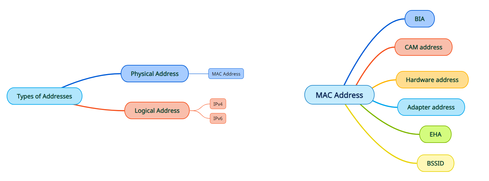

# Types of Addresses

- Physical Address ( MAC Address )
- Logical Address  ( IP Address )

#  MAC Address (Media Access Control)

- A MAC address can also be referred to as :

     - **BIA** (burned-in address) 
     - **CAM address** (content addressable memory)
     - **Hardware address** 
     - **Adapter address**
     - **EHA** (Ethernet hardware address)
     - **BSSID** (basic service set identifier)

- A MAC address is a **unique hardware** identification number but you can usually change the address in **software.** 

- It is a **hexadecimal number.** (The NIC converts this hexadecimal number into binary numbers before processing and using it on the network.)

- Each **network interface** connected to your network—whether it’s your router, wireless device, or network card in your computer—has a unique MAC address. 
  
  (Wi-Fi Router and Access Points have multiple MAC addresses, not just one. They have multiple network interfaces)

- MAC address is used on **data link layer** on the network which means that MAC address is visible only on your local LAN or WiFi network. MAC address is not transmitted beyond   the first router on your network so its not visible to any website you visit.

- A MAC address consists of six groups of two characters (numbers or letters). These groups are separated by colons(:), hyphens(-), or nothing at all. 
    
    - Examples:
       
       -  `D4-FB-6A-7C-31-B4`
       -  `d4:fb:6a:7c:31:b4`
       -  `D4FB6A7C31B4`
     >  MAC is not case-sensitive, but it tends to appear either all lower case or all upper case.

- The first three numbers (i.e. AA:BB:CC) are used to identify a NIC’s manufacturer and are known as an **Organizational Unique Identifier (OUI)**. The OUI is followed by a unique identifier since here too there can be no two devices with the same MAC address.

---------------------------------------------------------------------------------------

# What MAC Addresses Are Used For?

- **A DHCP server** (like your router) uses a MAC address to assign an IP address to a NIC. Without MAC, an adapter can’t get an IP address. Without an IP address, the device can’t connect at all.

  - Example:
     -  When a browser on your computer needs to grab a web page from a server on the Internet, for example, that request passes down through several layers of the TCP/IP protocol.  

     - The web address you type gets translated to the IP address of the server. Your computer sends the request to your router, which then sends it out onto the Internet.

     - At the hardware level of your network card, though, your network card is only looking at other MAC addresses for interfaces on the same network. 

     - It knows to send the request to the MAC address of your router’s network interface.

- **MAC Address Filtering:** Networks can use MAC address filtering, only allowing devices with specific MAC addresses to connect to a network. This isn’t a great security tool because people can spoof their MAC addresses.

- **Device Tracking:** Because they’re unique, MAC addresses can be used to track you. When you walk around, your smartphone scans for nearby Wi-Fi networks and broadcasts its MAC address. A company named Renew London used trash bins in the city of London to [track people’s movements around the city](https://www.bbc.com/news/technology-23665490) based on their MAC addresses. Apple’s iOS 8 will use a random MAC address each time it scans for nearby Wi-Fi networks to prevent this sort of tracking.

- **Device Identification:** Many airport Wi-Fi networks and other public Wi-Fi networks use a device’s MAC address to identify it. For example, an airport Wi-Fi network might offer a free 30 minutes and then ban your MAC address from receiving more Wi-Fi. Change your MAC address and you could get more Wi-Fi. (Free, limited Wi-Fi may also be tracked using browser cookies or an account system.) 

-------------------------------------------------------------------------------------------------------

# Reasons you might want to change your MAC

For the most part, though, a MAC address is permanent when you don’t do anything. Consequently, if someone knows your device’s MAC (like your phone’s), they can potentially keep track of you — both at local (LAN) and Internet (WAN) levels.

For this reason, by default, modern mobile devices automatically use a temporary random “virtual” (or “private”) MAC address when it connects to a new or public Wi-Fi network.

And that’s also one of the reasons, now and then, you might want to change your device’s MAC.

Take “change” with a loose meaning of the word. It’s more of a spoofing than changing since this is only at the software level. The real MAC will return when you restart or reset the device.

**Some reasons:** 

- You know your computer has been blocked or restricted from a network and want to sneak through. 

- You’re about to join a new network — like a public Wi-Fi — and don’t want folks to know your device’s real MAC.

**How to change the MAC Address :**

To undo this, repeat steps then choose Not Present before clicking OK. 

 

>Some computers have two network adapters — one for Wi-Fi and the other for Ethernet.

 

>  If two devices are sharing the same MAC address in a network, both devices will get the same IP address, and you’ll have an IP conflict situation, and neither device will get connected.

 

To find your adapter's physical address : `ipconfig /all`

------------------------------------------------------------
