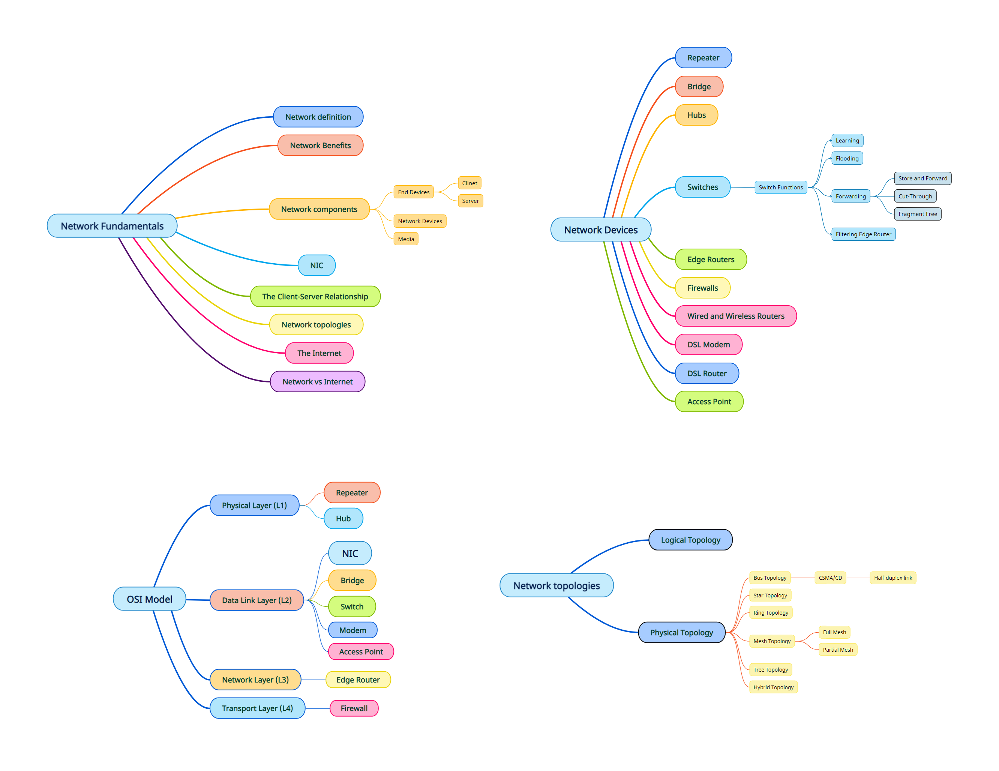

# Network Definition
A computer network can be described as a system of interconnected devices that can communicate using some protocols.

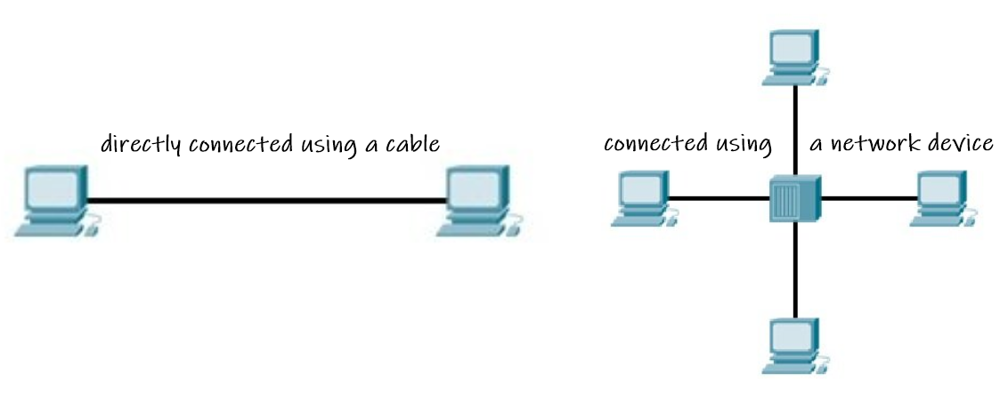

# Network Benefits

- **Data Sharing** 

     - You can easily share data between different users, or access it remotely if you keep it on other connected devices.
     
- **Resource Sharing**

     - Using network-connected peripheral devices like printers and scanners, saves money.

-  **Modern Technology** 
     - BYOD 
     - IOT 
     - Cloud 
     - ...etc

# Network Components

- **End Devices**
   - PC - Laptop - Smartphone - Printer - Server ...etc
- **Network Devices** (Intermediate Devices)
  - Switch - Router - Firewall - Hub - Access Point - Bridge - Repeater...etc

- **Media**
   - Wires
   - Wireless

# NIC 

- NIC or network interface card is a network adapter that is used to connect the computer to the network.
- It is installed in the computer to establish a LAN.  It has a unique ID that is written on the chip **(MAC address)**, and it has a connector to connect the cable to it. 
- NIC card is a layer 2 (DLL) device which means that it works on both physical and data link layer of the OSI model. 

**So, a NIC is a bridge between your computer and the router. This card knows how to read data, send data and everything related to that.**

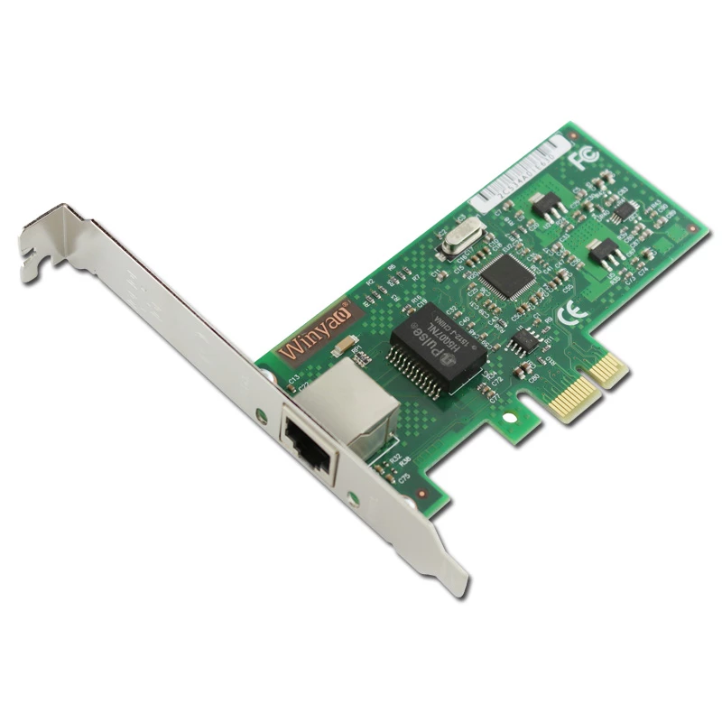

#  End Devices (Hosts)

- They are referred to as end devices (systems) because they sit at the edge of the Internet.

- End Devices are also referred to as hosts because they host (that is, run) application programs such as an e-mail client program, or an e-mail server program.

- Hosts are sometimes divided into two categories: clients and servers. Informally, clients tend to be desktop and mobile PCs, smartphones, and so on, whereas servers tend to be more powerful machines that store and distribute Web pages, stream video, relay e-mail, and so on.

**Fun Fact :**

 **➡ Google has 50-100 data centers, including about 15 large centers, each with more than 100,000 servers.**

## The Client-Server Relationship

**A client** is a device that accesses a service made available by a server.

**A server** is a device that provides services for clients.

**The same device can be a client in some situations , and a server in other situations.**

**For example,** PC1 asks PC2 for a file "image.jpg" , PC2 responses and send the requested image file. so PC1 will be the client and PC2 will be the server.
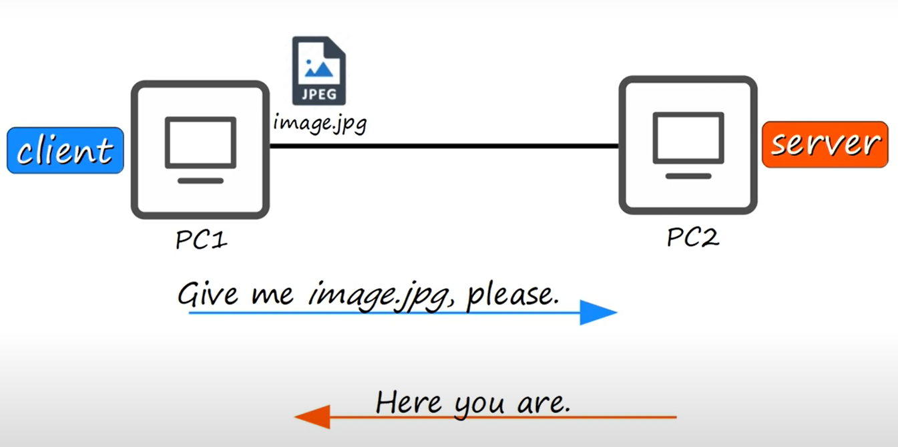

--------------------------------------------------------------------------------------

# Network Devices

# Repeater
- A repeater operates at the physical layer of OSI model.
- Its job is to regenerate the signal over the same network before the signal becomes too weak or corrupted (copy the signal bit by bit).
- It's used to extend the transmissions so that signal can cover larger distance

# Bridge
- A bridge operates at the data link layer of OSI model.
- A bridge is a repeater, with add on the functionality of filtering content by reading the MAC addresses of source and destination.
- It is use to divide a LAN into **multiple segments**.
- It has a single input and single output port, thus making it a **2 port device**.

- **Examples:**
   - If PC 1 tries to send data to PC 2. Data will first travel to the bridge. The bridge will read its MAC address and decide whether to send the data to segment 1 or segment 2. Hence, the PC 2 is available in segment 1 means bridge will broadcast the data only in segment 1 and excludes all the PCs connected in segment 2. Like this bridge reduce the traffic on a computer network.  
   
   - Here PC 1 is trying to send data to PC 8. So, the data will first travel to the bridge. The bridge is going to read it’s MAC Address table and find whether PC 8 belongs to Segment 1 or Segment 2. Hence, the PC 8 is in segment 2 bridge will broadcast the data in segment 2 and excludes all the PCs connected to Segment 1. So, this is how the bridge works and reduce traffic in a computer network.
   
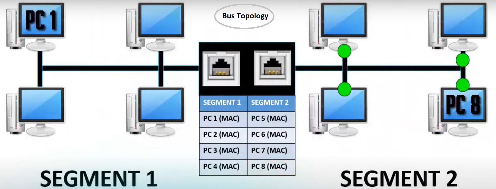

**Bridge doesn't  exist anymore.**
# Hubs
-  A hub operates on the physical layer of OSI model.

- **How Hub Works?**
  
  Hub works like an electric wire, it receives data signals from one device in his one port and forwards them to all the other ports, except the source port. It does not have     any capability to identify any frames to know where it should forward because it does not maintain any kind of table like switch. So there is a lot of traffic on the network  and network performance is also very poor, **only one device transmits information at a particular time.**

> **Repeaters and hubs are not used because they have been replaced by switches.**

# Switches

- They have many network interfaces/ports for end hosts to connect to (usually 24+).

- They provide connectivity to hosts within the same LAN (Local Area Network).

- They do not provide connectivity between LANS/over the Internet.

- They operate on the data link layer of OSI model.

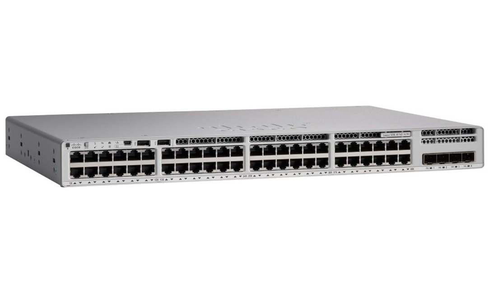

## Switch Functions

A Switch primarily has four functions: Learning, Flooding, Forwarding, and Filtering:
- **Learning:**  It will make all its decisions based upon information found in the layer 2 Header (MAC Header). 
    - Switches maintain a table in memory that matches MAC addresses to the switch's Ethernet ports. This table is called a **Content Addressable Memory (CAM) table.**: 
       - The CAM address table starts out empty, and every time a Switch receives anything,it uses the **source MAC** and the switchport of the frame to build an entry in the MAC Address Table.
      - Sooner or later, as each connected device inevitably sends something, the Switch will have a fully populated MAC Address Table. This table can then be used to smartly forward frames to their intended destination.
- **Flooding:**
    - When the Switch receive a frame destined to a MAC address of which the Switch does not know the location it's duplicate the frame and send it out **all ports with the exception of source port.** 

    - Flooding assures that if the intended device exists and if it is connected to the switch, it will definitely receive the frame.

    - The NIC of each connected device will receive the frame and take a look at the Destination MAC address field. If they are not the intended recipient, they will simply drop       the frame.

    - When the intended device receives the frame, a response will be generated, which when sent to the Switch will allow the switch to learn and create a MAC Address 
      Table mapping that unknown device to its switchport.
      
 - **Forwarding:** There are three methods by which a Switch can forward frames:
    - **Store and Forward** – The Switch copies the entire frame (header + data) into a memory buffer and inspects the frame for errors before forwarding it along. 
      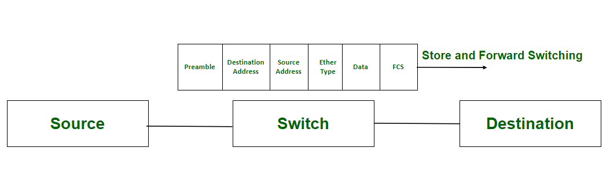
    - **Cut-Through** – The Switch stores nothing,it forwards the data packet as soon as the destination address is received and doesn’t wait for the entire frame to be received.
      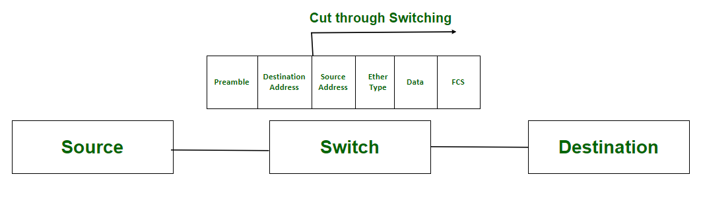

   - **Fragment Free** – This method is a blend of the prior two. The Switch inspects only the first portion of the frame (64 bytes) before forwarding the frame along. If a transmission error occurred, it is typically noticed within the first 64 bytes. As such, this method provides “good enough” error detection.
 
     **Most switches operate in Store and Forward mode.**

 - **Filtering:** If the destination MAC address comes from the same port on which it was received, (in another words, source mac address and destination mac address have the same exit port) then there is no need to forward it, and it is discarded.

## Example

- The switch's CAM table is stored in memory. If the switch is turned off, the table will disappear and the switch has to relearn the table when it is rebooted.

- Now, suppose the switch was just turned on and has not yet created its CAM table.

   | MAC address | Port |
   |---|---|
   |?	| ?|
   |?	| ?| 
   |?	| ?|
   
- Suppose Computer A sends a message to Computer B. The switch takes the following steps to get the message to Computer B and start filling out its CAM table:
  - It records Computer A's MAC address and the port its message came in on.
  - It forwards Computer A's message to all other computers on the network (except Computer A); this is known as "flooding".
  - When Computer B replies, it records Computer B's MAC address and port as well.
  
   | MAC address | Port |
   |---|---|
   |Computer A's MAC address	|1|
   |Computer B's MAC address	|2|
   |?|?|

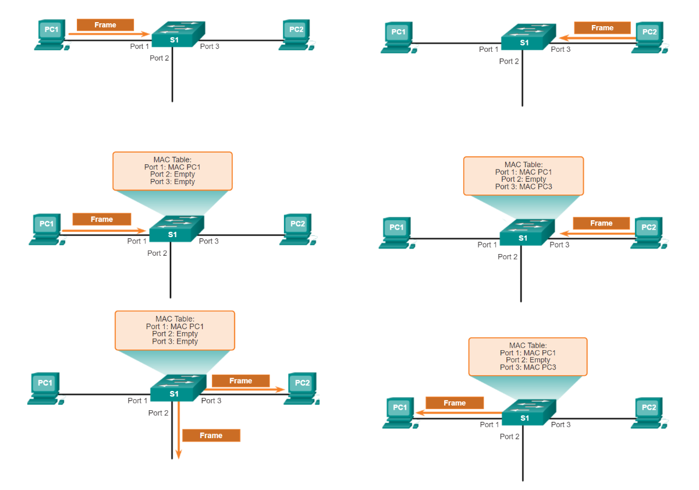

## When does Switch performs filtering ?
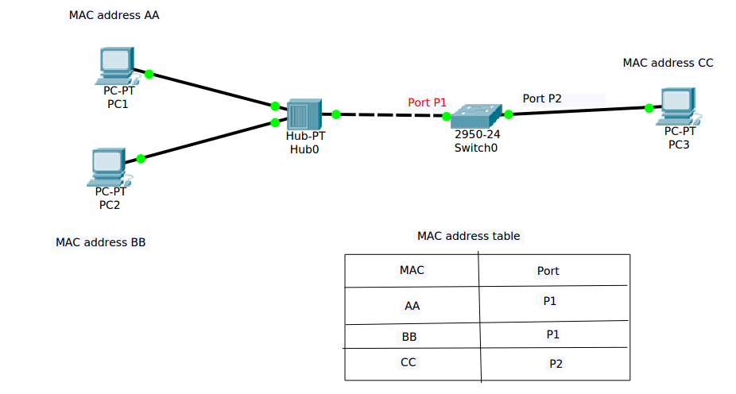

Say , PC1 wants to send data frame to PC2.
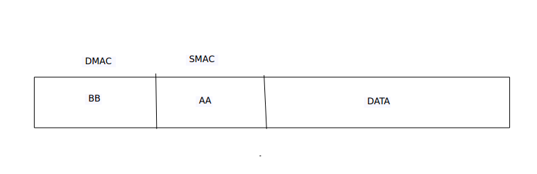
- PC1 will then send the frame through the cable/wire connected to hub.
- Hub will receive the frame. Hub as usual, will flood data frames through all the ports apart from the port where it received the frame.
- So, Hub will flood this frame towards PC2 and Port P1 of switch.
- PC2 will receive the frame and will compare the destination MAC of frame with its own source MAC address. In this case it matches. So, PC2 will accept the frame, and hence receives the frame intended for it.
- Let us see the case of Port P1 of switch receiving the same. Switch will first check the Source MAC of the frame which is AA and will search for the entry of AA in MAC address table.
- Refer the MAC address table given in image above, there is an entry for AA learned at Port P1. Hence, switch will skip the Learning process.
- Switch will now read the Destination MAC address of frame which is BB. There is an entry for MAC BB learned at Port P1.
- When switch will find that both Source MAC address and Destination MAC address of the frame are learned at same Port P1, it will drop the data frame as it knows that the frame is already received by the destination machine.

Have you ever imagined that what would happen if switch does not have filtering procedure? Yes, we would have received multiple copies of same message/data which is really impractical and not required.

# Edge Routers

- They have fewer network interfaces than switches.

- They are used to provide connectivity between LANS.

- They are used to send data over the Internet.

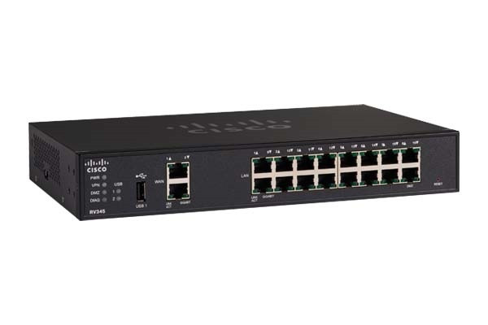

**A network switch forwards data packets between groups of devices in the same network, whereas a router forwards data between different networks.**
 
# Firewall

- It is a network security device that monitors incoming and outgoing network traffic and permits or blocks data packets based on a set of security. 

- It can be placed 'inside' the network, or outside the network (Firewall can filter traffic before it reaches the router , or after it has passed through the router)

- In some cases, you might have a firewall inside and outside the network.

- They are known as 'Next-Generation Firewalls' when they include more modern and advanced filtering capabilities.

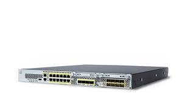

**What about the firewall on your computer?**

- **Network firewalls:**
are hardware devices that filter traffic between networks.

- **Host-based firewalls:**
are software applications that filter traffic entering and exiting a host machine, like a PC.

# Wired and Wireless Routers   
 - It connects all your home's devices to each other—through Ethernet cables or Wi-Fi—and then connects to the modem.
 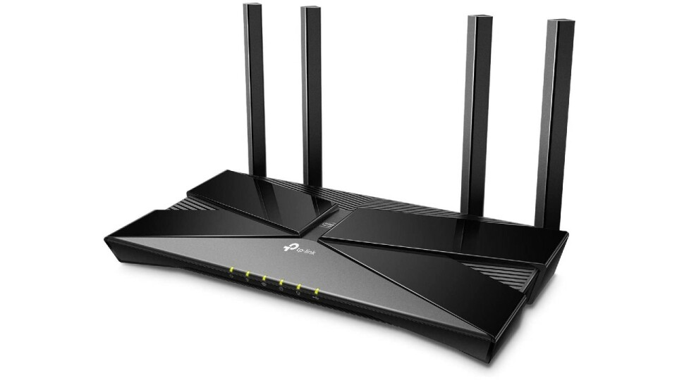
 
# DSL Modem
 - It’s the device that connects a computer to the Internet.
 - A modem has two plugs in it, one that connects it to the telephone line (or the cable provided by your Internet service provider) and the other connecting it to your computer   (or a WiFi router).
 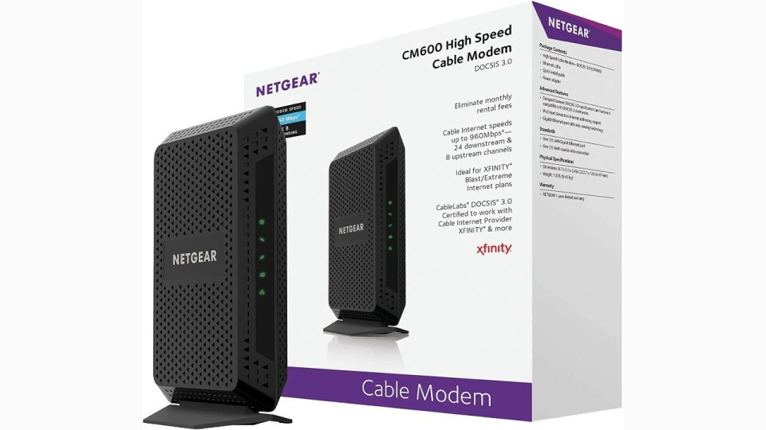
 
### How a Modem Works

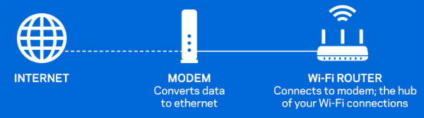

The modem receives information from your ISP through the phone lines, optical fiber, or coaxial cable in your home (depending on your service provider) and converts it into a digital signal. The router’s job is to push this signal out to connected devices, either through wired Ethernet cables or Wi-Fi, so that all of your devices can hop on board and access the Internet. Your router and ISP can’t communicate directly because they speak different languages—or rather, they transmit different signal types—which is why the modem’s role as a **translator** is so important.

# DSL Router
 
- It is a standalone device that combines the function of a DSL modem and a router.
 
- A modem brings internet into your house, while a router directs that internet connection to all the computers, tablets, mobile phones and other connected devices you have on hand. 

#  Access Point 

- Attaches to a router or modem. 

- It generates the Wi-Fi signal your device attaches to — allowing you connect wireless to the internet.

- **It cannot be a wireless router.** A stand-alone wireless access point will have an Ethernet cable running to the router and convert the wired signal into a wireless one. It will not route packets from the local network to anther network or the Internet like a typical router.

- Wireless routers typically have firewalls built-in too, while wireless APs do not.

- Wireless routers have a built-in DHCP service, while wireless APs do not.

- Today’s wireless AP is widely used in business and larger WLANs to cover a bigger area or to support hundreds of users. In larger WLANs, it usually makes sense to have several APs feeding into a single, separate router.

 [Wireless Access Point vs Wi-Fi Router](https://www.youtube.com/watch?v=OxiY4yf6GGg)
 
---------------------------------------------------------------------------------------------------------------

# Network topologies

# Topology
A topology describes how devices are connected and interact with each other using communication links.

## Types of Topology

- **Physical Topology**- describe how the nodes connected with each other (physcical layout of nodes and cables)
- **Logical Topology**- describe the way data flow from one computer to another.(how devices communicate internally)  

**A network can have one physcial topology and multiple logical topologies at the same time.**

## Types of Physical Topology

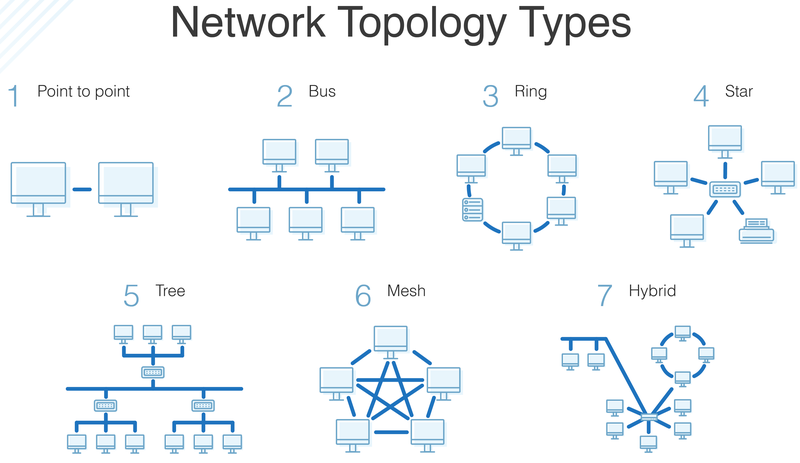

## Point-to-point 

-  It's a serial connection.

- Point-to-point connections are typically used to connect two systems together over a WAN. 

## Bus Topology

- There is a main cable and all the devices are connecred to main cable through drop lines.
 
- When a sender sends a message , all other computers can hear it , but onlt the receiver accepts it (verifying the **mac address** attached with the data frame) and others reject it.

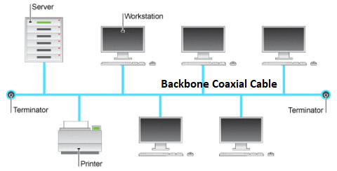

### Carrier Sense Multiple Access With Collision Detection
It's a network Protocal. It helps hosts to decide when to send packets and how to detect collisions if they occur.(MAC method)

**For example,** two devices can send packets at the same time. This cause a collision. CSMA/CD enables devices to sense the wire to ensure that no other devices is currently 
transmitting packets.
**But,** if two devices sense that the wire is clear and sends packets at the Same time, a collision can occur. 
If, a collision is detected, the participant immediately interrupts the transmission and instead sends a **JAM signal** 
so that all other stations can also detect the collision. Now the participant waits for a random amount of time **(backoff)** before trying the transmission again. 
The backoff must be random so that the next collision doesn’t occur straight away. Since both stations select a random value, 
the probability that both of them will start a transport attempt at the same time is quite low.

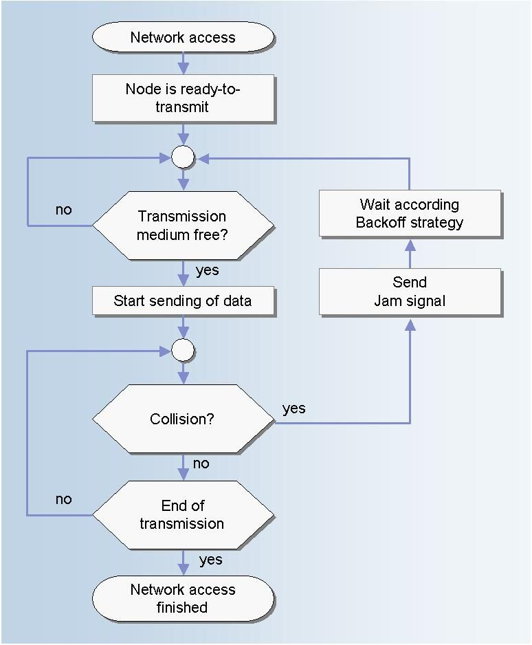

**Modern Ethernet networks, built with switches and full-duplex connections, no longer need to use CSMA/CD because each Ethernet segment, or collision domain, is now isolated. 
CSMA/CD is still used for any half-duplex link.**

## Star Topology (The most common)

- All The nodes are connected to a central device. (Switch-Hub-Router..)

- It doesn't allow direct Communication between devices If one device wants to send data to other devices it has to first send the data to the central devic and then the central device Transmit that data to the designated device.

- The central device broadcast or unicast the message based on the central device used. 
  (The Hub broadcasts the message, while the switch unicasts by maintaining a switch table)

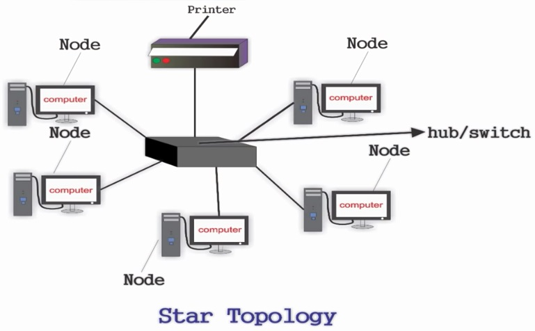

## Ring Topology

- It's like bus topology but with connected ends.

- If a token is free Then the node can capture the token and attach the data and the and destination addresss to the token

- Each device in ring topology has a repeater ,if the received data is intended for other device then repeater forwards this data until the intended device receives it.

- When the token reaches the destination node, the data is removed by the receiver and the token is made free to carry the next data.

- When no node is transmitting the data, then the token will circulate in the ring.

- Trasmission is **unidirectional**, bur it can be made bidrectional by having 2 connections between each network node (Dual Ring Topology).

## Tree Topology (Star Bus Topology)

- It is a combination of bus and star topology

- The various secondary hubs are connected to the central hub. 

- Data Flow from top to the bottom or from the bottom to top.

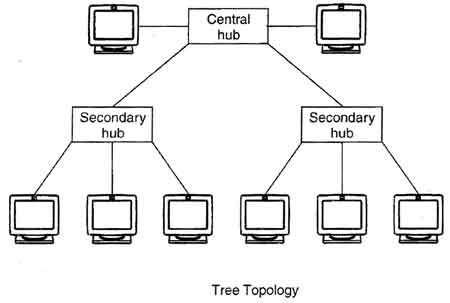

## Mesh Topology

**1. Full Mesh :**
  
  - Each node in is connected to every other node network.

  - If we have N number of devices: ports that are required by each device = N-1

**2. Partial Mesh:**
  
  - Some nodes are not connected to every node in the network

**The internet uses mesh topology.**

**If any node or link in the network fails,then there will be another path that will allow network traffic to continue.**
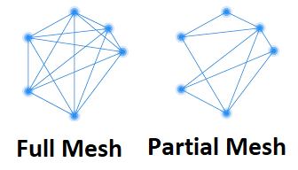

## Hybrid Topology

Uses Two or more different network topologies

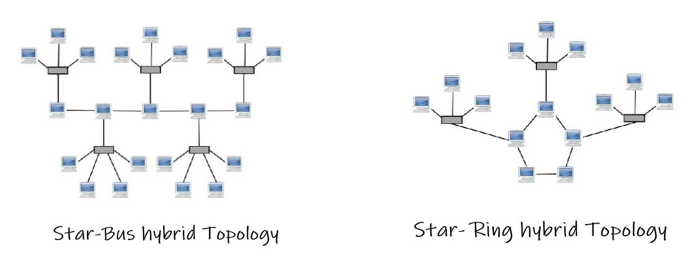

--------------------------------------------------

# The Internet

- The internet is a collection of interconnected devices which are spread across the globe. 
- The internet is a type of network and called network of networks.

# Network vs Internet

The network consists of computers that are physically connected and can be used as a personal computer as well as to share information with each other.Conversely, the internet is a technology which links these small and large networks with each other and builds a more extensive network.

