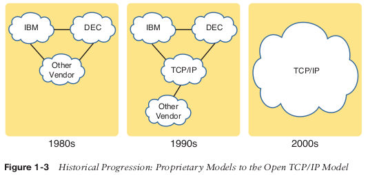
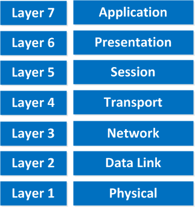
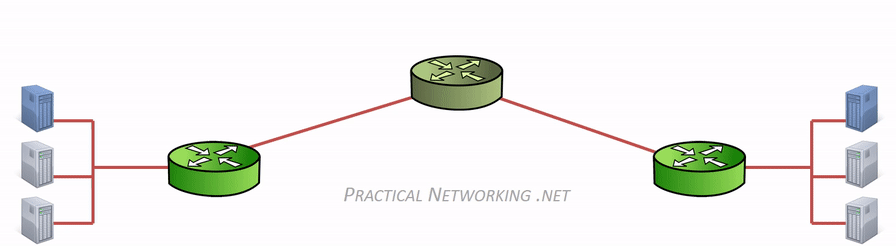
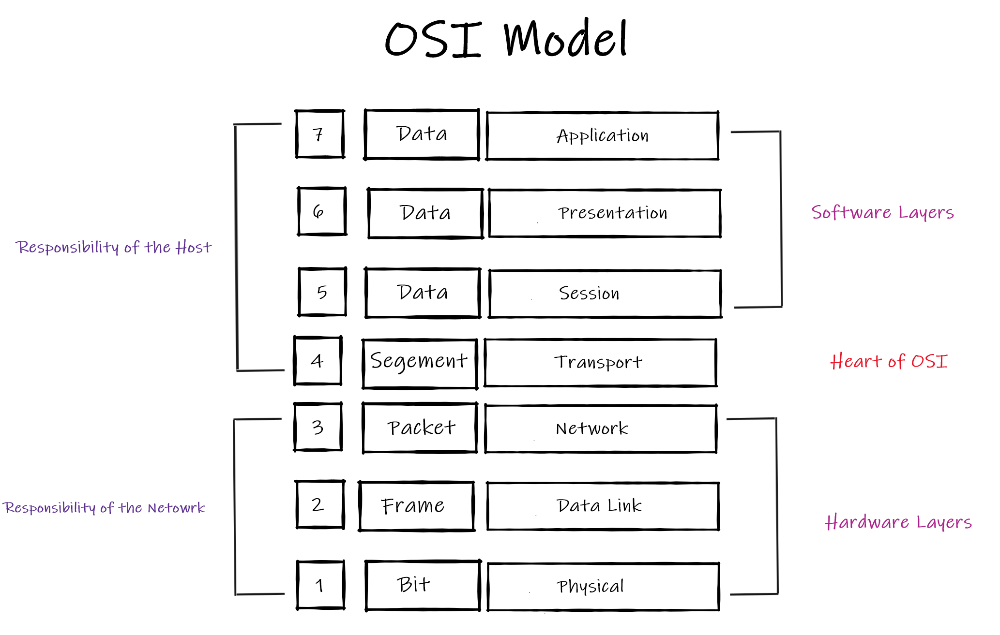
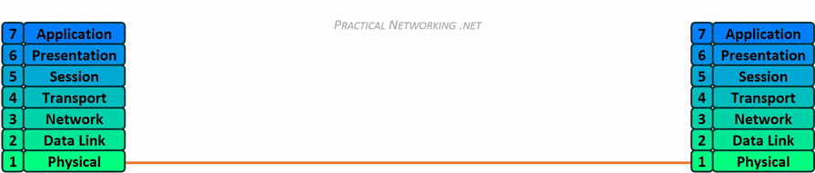

# History Leading to TCP/IP

In the beginning, the development of networks was chaotic. Each vendor had its own proprietary solution. The bad part was that one vendor’s solution was not compatible with another vendor’s solution. 

For instance, IBM published its Systems Network Architecture (SNA) networking model in 1974. Other vendors also created their own proprietary networking models. As a result, if your company bought computers from three vendors, network engineers often had to create three different networks based on the networking models created by each company, and then somehow connect those networks, making the combined networks much more complex.

This is where the idea for the OSI model was born, **The International Organization Standardization ISO** wanted to create a model-free vendor-neutral networking model. ISO created a model called the **OSI Open Systems Interconnection networking model** in the **1970s**. ISO wanted to standardize protocols and enable communication between computers. However, **US Department of Defense DoD** wanted to further develop protocols to make communication independent to other vendors and **TCP/IP** was born. By the end of the 1990s, TCP/IP began to dominate networks. 

Using an open model which everyone agrees on means we can build networks that are compatible with each other.

The figure shows the general idea of what a company’s enterprise network might have looked back in the 1980s, before TCP/IP became common in enterprise internetworks.

During the 1990s, companies began adding OSI, TCP/IP, or both to their enterprise networks. However, by the end of the 1990s, TCP/IP had become the common choice, and OSI fell away.

The OSI-model isn’t just a model to make networks compatible; it’s also one of the BEST ways to teach people about networks. 

 
The world now uses only TCP/IP model. 

# Why OSI model failed

The OSI model had many problems when it came to an implementation.

The committee defining OSI took so long that TCP/IP was already widely established by the time the standard was published. Also, the standard was so complex that only poor implementations of OSI were made, while the simpler layering of TCP/IP was fairly easy to make run well.

TCP/IP is the protocol suite on which almost all of the world’s computer networks run. OSI model couldn’t compete with TCP/IP model, and failed in getting wider acceptance. 

One of the main reasons behind the failure of OSI model and wider acceptance of TCP/IP model was because big global networks like internet started running on TCP/IP protocol suite. All leading vendors discarded their proprietary networking protocols in favor of TCP/IP protocol suite.

Even now we refer OSI model terminologies while discussing about networking related topics. OSI model clearly explained, how different functions of computer networking should work together. The functions of different layers are clearly defined in OSI model. Universities, colleges and networking training institutes explained the concepts of computer networking based on the terminologies from OSI model for many decades.

For example, while discussing about IP addresses, we also call IP addresses as layer 3 addresses because IP addresses are linked with the function of layer 3 of OSI model.

As a networking student, you need to understand that OSI model is not being implemented as a software product or as a service these days. But, OSI model explains about the functions of different components of computer networking in a simpler and easier way. The terminologies of OSI model are still used to teach and explain computer networking. 

**You may never ever work on an implementation of OSI model in future, but the legacy of OSI model still continues.**

-------------------------------------------------------------------------------------------------

# OSI model 

- OSI stands for **Open System Interconnection** is a **reference model** that describes how information moves from an application program running on one networked computer to an application program running on another networked computer. For example : whatsapp , Messenger,Firefox ... ( Word , Poweroint , ... are not examples) 

- OSI model was developed by the International Organization for Standardization **(ISO)** in 1984.

- OSI consists of seven layers, and each layer performs a particular network function.

- OSI model divides the whole task into seven smaller and manageable tasks. Each layer is assigned a particular task.

  

  <b> “All People Seem To Need Data Processing” </b> 

  <b> A </b> = Application,
  <b> P </b> = Presentation,
  <b> S </b> = Session,
  <b> T </b> = Transport,
  <b> N </b> = Network,
  <b> D </b> = Data Link,
  <b> P </b> = Physical

---------------------------------------------------------------------------------------------------------------

# OSI Layers

## Application (Desktop Layer)

- The first layer that interacts with the user.

- It’s implemented by the **network applications**. These applications produce the data, which has to be transferred over the network.

- An application layer is not an application, but it performs the application layer functions.In other words, programs such as Microsoft Word is not at this layer, but browsers, whatsapp, telegram, FTP clients, and mail clients are.

## Presentation (Syntax Layer)

- A Presentation layer is mainly concerned with the syntax of the information exchanged between the two systems. 

- It acts as a data translator for a network. This layer converts the data from one presentation format to another format.

**Functions:**

- **Defines data formats:**

   Examples: ASCII, doc,JPG,PDF,...etc
   
   [Read about magic numbers](https://en.wikipedia.org/wiki/List_of_file_signatures)
   
- **Encoding/Decoding (Translation):**  ASCII ↔ 0,1 Machine Language

  Most computers use the ASCII table for characters. If another computer would use another character like EBCDIC then the presentation layer needs to “reformat” the data so both computers agree on the same characters.
  
  It converts the data from sender-dependent format into a common format and changes the common format into receiver-dependent format at the receiving end.

- **Compression /decompression:**

  Data compression is a process of compressing the data, i.e., it reduces the number of bits to be transmitted. 

- **Encryption/ Decryption:**

  Encryption is needed to maintain privacy. Encryption is a process of converting the sender-transmitted information into another form and sends the resulting message over the network.

## Session

The session layer takes care of establishing, managing and termination of sessions between two hosts. 

**Functions:**

- **Establishes the session :**

  When two computers or other networked devices need to speak with one another, a session needs to be created.
  
- **Manages the session :**
   When you are browsing a website on the internet you are probably not the only user of the webserver hosting that website. This webserver needs to keep track of all the different “sessions”.
   
- **Terminats the session**

- **Authentication and Authorization :**

   Authentication is the process of verifying who someone is, whereas authorization is the process of verifying what specific applications, files, and data a user has access to. 

- **Synchronization :**
 
   Session layer adds some checkpoints when transmitting the data in a sequence. If some error occurs in the middle of the transmission of data, then the transmission will take place again from the checkpoint. This process is known as Synchronization and recovery.

   For example, if a 100 megabyte file is being transferred, the session layer could set a checkpoint every 5 megabytes. In the case of a disconnect or a crash after 52 megabytes have been transferred, the session could be resumed from the last checkpoint, meaning only 50 more megabytes of data need to be transferred. Without the checkpoints, the entire transfer would have to begin again from scratch.

- **Dialog Controller :**
  
  It is responsible to identify the mode of the communication in a particular session like Simplex, Half Duplex or Full Duplex.

--------------------------------------------------------

# Layers about Networking

## Transport

- The Transport layer ensures that messages are transmitted in the order in which they are sent and there is no duplication of data.

- The main responsibility of the transport layer is to transfer the data completely.

- It receives the data from the upper layer and converts them into smaller units known as **segments**.

- The two protocols used in this layer are:

    - **TCP (Transmission Control Protocol) :**

      When data is sent over the TCP connection, then the TCP protocol divides the data into smaller units known as segments. Each segment travels over the internet using multiple routes, and they arrive in different orders at the destination. The transmission control protocol reorders the packets in the correct order at the receiving end.

    - **UDP (User Datagram Protocol) :**

      It is an unreliable transport protocol as in this case receiver does not send any acknowledgment when the packet is received, the sender does not wait for any acknowledgment. Therefore, this makes a protocol unreliable.

- Both TCP and UDP have **65,536** port numbers (each), and a unique application stream is identified by both a Source and Destination port (in combination with their Source and Destination IP address).

**Functions :**

- **Error control (TCP only):** 
  
  The sender transport layer ensures that message reach at the destination without any error.

- **Flow control (TCP only):** 
 
  Flow Control basically means that TCP will ensure that a sender is not overwhelming a receiver by sending packets faster than it can consume.  There are two common methods of flow control used, buffering and windowing:

  - **Buffering :** When buffering flow control is used, data is temporarily stored and waits for the destination device to become available. Buffering can cause a problem if the sending device transmits data much faster than the receiving device is able to manage it.

  - **Windowing :** 
    - In a windowing environment, data is sent in groups of segments that require only one acknowledgment from the destination after a certain number of packets have been transmitted.  The size of the window (that is, how many segments fit into one acknowledgment) is defined at the time the session between the two devices is established. 

    - For example,  With a window size of 3, the source requires an acknowledgment after sending three packets, as follows. First, the source device sends three packets to the destination device. Then, after receiving the three packets, the destination device sends an acknowledgment to the source. The source receives the acknowledgment and sends three more packets. If the destination does not receive one or more of the packets for some reason, such as overflowing buffers, it does not receive enough packets to send an acknowledgment. The source then re-transmits the packets at a reduced transmission rate.

  [This animation illustrates the interaction between a TCP sender and receiver](https://www2.tkn.tu-berlin.de/teaching/rn/animations/flow/)

- **Segmentation and reassembly :** 
   When the transport layer receives the message from the upper layer, it divides the message into multiple segments, and each segment is assigned with a sequence number that uniquely identifies each segment. When the message has arrived at the destination, then the transport layer reassembles the message based on their sequence numbers.

- **Connection control:** 

   Transport layer provides two services Connection-oriented service and connectionless service. A connectionless service treats each segment as an individual packet, and they all travel in different routes to reach the destination. A connection-oriented service makes a connection with the transport layer at the destination machine before delivering the packets. In connection-oriented service, all the packets travel in the single route.

- **Service-point addressing:**

  Computers run several programs simultaneously due to this reason, the transmission of data from source to the destination not only from one computer to another computer but also from one process to another process. The transport layer adds the header that contains the address known as a service-point address or **port address**. The responsibility of the network layer is to transmit the data from one computer to another computer and the responsibility of the transport layer is to transmit the message to the correct process.

## Network

- It is a layer 3 that manages device addressing, tracks the location of devices on the network.

- It determines the best path to move data from source to the destination based on the network conditions.

- Routers are the layer 3 devices, they are specified in this layer.

- The protocols used to route the network traffic are known as Network layer protocols. Examples of protocols are IP and Ipv6.

**Functions:**

- **Internetworking :** An internetworking is the main responsibility of the network layer. It provides a logical connection between different devices.

- **Logical Addressing :** A Network layer adds the source and destination address to the header of the frame. Addressing is used to identify the device on the internet.

- **Routing :** Routing is the major component of the network layer, and it determines the best optimal path out of the multiple paths from source to the destination.

- **Packetizing :** A Network Layer receives the packets from the upper layer and converts them into packets. This process is known as Packetizing. It is achieved by internet protocol (IP).

## Data Link

- This layer makes sure data is formatted the correct way, takes care of error detection and makes sure data is delivered reliably.

- It accomplishes this task by having the sender break up the input data into data frames (typically a few hundred or a few thousand bytes) and transmit the frames sequentially. If the service is reliable, the receiver confirms correct receipt of each frame by sending back an acknowledgement frame. 

- This might sound a bit vague, but for now, try to remember this is where “Ethernet” lives. MAC Addresses and Ethernet frames are on the Data Link layer.

- The Data Link layer of the OSI model is responsible for interfacing with the Physical layer. Effectively, Layer 2 is responsible for putting 1’s and 0’s on the wire, and pulling 1’s and 0’s from the wire. The Network Interface Card (NIC) that you plug your Ethernet wire into handles the Layer 2 functionality. It receives signals from the wire, and transmits signals on to the wire. Your WiFi NIC works the same way, receiving and transmitting radio waves which are then interpreted as a series of 1’s and 0’s. Layer 2 will then group together those 1’s and 0’s into chunks known as Frames.

- It contains two sub-layers:

  **Logical Link Control Layer**

  - It deals with protocols, flow-control, and error control
  - It identifies the address of the network layer protocol from the header.

  **Media Access Control (MAC) Layer**

  - It deals with actual control of media

**Functions :** 

**Framing:** Data-link layer takes packets from Network Layer and encapsulates them into Frames.Then, it sends each frame bit-by-bit on the hardware. At receiver’ end, data link layer picks up signals from hardware and assembles them into frames. The Data link layer adds the header and trailer to the frame. The header which is added to the frame contains the **hardware** destination and source address.

**Physical Addressing:** The Data link layer adds a header to the frame that contains a destination address. The frame is transmitted to the destination address mentioned in the header.

**Flow Control:** Stations on same link may have different speed or capacity. Data-link layer ensures flow control that enables both machine to exchange data on same speed such as a server with higher processing speed does not exceed the receiving station, with lower processing speed.

**Error Control:** Error control is achieved by adding a calculated value CRC (Cyclic Redundancy Check) that is placed to the Data link layer's trailer which is added to the message frame before it is sent to the physical layer. If any error seems to occurr, then the receiver sends the acknowledgment for the retransmission of the corrupted frames.

## Physical Layer

- This layer describes stuff like voltage levels, timing, physical data rates, physical connectors and so on. Everything you can “touch” since it’s physical.

- The physical layer is not concerned with protocols or other such higher-layer items.

- Examples of hardware in the physical layer are ethernet, serial Cable, repeaters, networking hubs, etc.

- The main functionality of the physical layer is to transmit the individual bits from one node to another node.

- Simply put, Layer 1 is anything that carries 1’s and 0’s between two nodes.

- The actual format of the data on the “wire” can vary with each medium. In the case of Ethernet, bits are transferred in the form of electric pulses. In the case of Wifi, bits are transferred in the form of radio waves. In the case of Fiber, bits are transferred in the form of pulses of light.

**Functions :**

**Topology:** It defines the way how network devices are arranged.

**Line Configuration:** It defines the way how two or more devices can be connected physically.

**Signals:** It determines the type of the signal used for transmitting the information

-----------------------------------------------------------------------------

# OSI Model – Layer 2 vs. Layer 3

The interaction and distinction between Layer 2 and Layer 3 is crucial to understanding how data flows between two computers. For example, if we already have a unique L2 addressing scheme on every NIC (like MAC addresses), why do we need yet another addressing scheme at L3 (like IP addresses)? Or vice versa?

The answer is that both addressing schemes accomplish different functions:

- **Layer 2** uses **MAC addresses** and is responsible for packet delivery from **hop to hop**.
- **Layer 3** uses **IP addresses** and is responsible for packet delivery from **end to end**.

When a computer has data to send, it encapsulates it in a IP header which will include information like the Source and Destination IP addresses of the two “ends” of the communication.

The IP Header and Data are then further encapsulated in a MAC address header, which will include information like the Source and Destination MAC address of the current “hop” in the path towards the final destination.

Here is an illustration to drive this point home:

Notice between each Router, the MAC address header is stripped and regenerated to get it to the next hop. The IP header generated by the first computer is only stripped off by the final computer, hence the IP header handled the “end to end” delivery, and each of the four different MAC headers involved in this animation handled the “hop to hop” delivery.

------------------------------------------------------------------------------

**Let’s take a look at a real-life example of data transmission:**

**1.** You are sitting behind your computer and want to download some files of a local webserver. You start up your web browser and type in the URL of your favorite website. Your computer will send a message to the web server requesting a certain web page. You are now using the HTTP protocol which lives on the application layer.

**2.** The presentation layer will structure the information of the application in a certain format.

**3.** The session layer will make sure to separate all the different sessions.

**4.** Depending on the application, you want a reliable (TCP) or unreliable (UDP) protocol to transfer data towards the web server. In this case, it’ll choose TCP since you want to make sure the webpage makes it to your computer.

**5.** Your computer has a unique IP address (for example 192.168.1.1) and it will build an IP packet. This IP packet will contain all the data of the application, presentation and session layer. It also specifies which transport protocol it’s using (TCP in this case) and the source IP address (your computer 192.168.1.1) and the destination (the web server’s IP address).

**6.** The IP packet will be put into an Ethernet Frame. The Ethernet frame has a source MAC address (your computer) and the destination MAC address (web server). More about Ethernet and MAC addresses later.

**7.** Finally, everything is converted into bits and sent down the cable using electric signals.

Going from the application layer all the way down to the physical layer is what we call encapsulation. Going from the physical layer and working your way up to the application layer is called de-encapsulation.

--------------------------------------------------------------------------------------------

# Packaging the data

- Each layer of the OSI model formats the data it receives to suit the functions to be performed on that layer. 

- In general, the package of data that moves through the layers is called a **Protocol Data Unit (PDU)**. However, as the data is reformatted and repackaged, it takes on unique names on certain layers.

 - PDU Names on the Layers of the OSI Model:

    |OSI Layer |PDU Name| Example |
    |--|--|--|
    |Application |Data||
    |Presentation |Data||
    |Session |Data||
    |Transport |Segment|TCP segments|
    |Network |Packet|IP packets|
    |Data Link |Frame|Ethernet frames|
    |Physical |Bits||

------------------------------------------------------------------------------

# Summary

|Layer	|Name|Some Protocols|
|--|--|--|
|Layer 7	|Application	|SMTP, HTTP, FTP, POP3, SNMP|
|Layer 6	|Presentation	|MPEG, ASCH, SSL, TLS|
|Layer 5	|Session|	NetBIOS, SAP|
|Layer 4	|Transport|TCP, UDP|
|Layer 3|	Network	|IPV5, IPV6, ICMP, IPSEC, ARP, MPLS.|
|Layer 2	|Data Link	|	RAPA, PPP, Frame Relay, ATM, Fiber Cable, etc.|
|Layer 1	|Physical|	RS232, 100BaseTX, ISDN, 11.|

------------------------------------------------------------------------------

# Interaction Between OSI Model Layers

-----------------------------------------------------------------------------------------

# Encapsulation and Decapsulation

These terms refer to how data is moved through the layers from top to bottom when sending and from bottom to top when receiving.

As the data is handed from layer to layer, each layer adds the information it requires to accomplish its goal before the complete datagram is converted to 1s and 0s and sent across the wire. For example:

- Layer 4 will add a TCP header which would include a Source and Destination port
- Layer 3 will add an IP header which would include a Source and Destination IP address
- Layer 2 would add an Ethernet header which would include a Source and Destination MAC address

On the receiving end, each layer strips the header from the data and passes it back up the stack towards the Application layers. Here is the whole process in action:

**Note that this is only an example.** The header that will be added will be dependent on the underlying communication protocol. For instance, a UDP header might be added at Layer 4 instead, or an IPv6 header might be added at Layer 3.

Either way, it is important to understand that as data is sent across the wire, it gets passed down the stack and each layer adds its own header to help it accomplish its goal. On the receiving end, the headers get stripped off one at a time, layer by layer, as the data is sent back up to the Application layer.

-----------------------------------------------------------------------------------------
