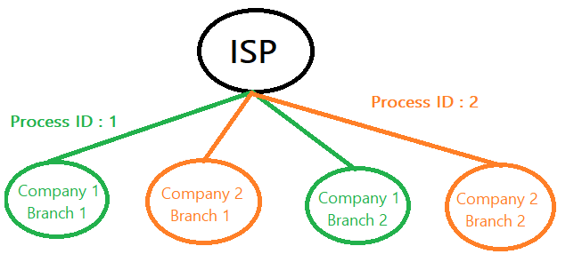
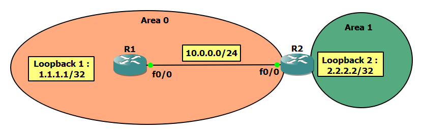
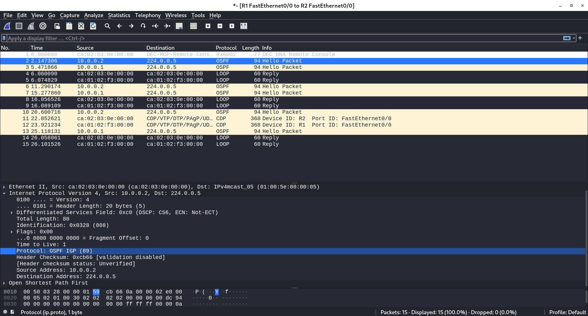

# OSPF Process ID

- The OSPF process ID is **locally significant** on the router. The process ID does not have to match between 2 neighbors for a neigborship to establish.

- You can run multiple OSPF processes on the **same physical router**, one serving one set of interfaces and one serving a different set of interfaces and the process ID would be how the router distinguishes between the processes. They will operate entirely independently of each other (unless you choose to redistribute routes between them), and will hold completely separate link-state databases. 

> Note that running multiple OSPF processes on the same router is not normally recommended as OSPF can be quite heavy on the router resources.


- Example:



You separate the routing table of process 1 from routing table of process 2. The 2 routing tables can't see each other.


----------------------------------------------------------------------------------------------------

# Wildcard masks

- Wildcard masks are used to specify a range of network addresses. They are commonly used with routing protocols (like OSPF) and access lists.

- Just like a subnet mask, a wildcard mask is **32 bits** long. It acts as an **inverted subnet masks**.

- The rule for a wildcard mask is:
  - `0` means that the equivalent bit **must match**
  - `1` means that the equivalent bit does not matter   

- They are used in several places, for example:

   - To indicate the size of a network or subnet for some routing protocols, such as OSPF. 
   - To indicate what IP addresses should be permitted or denied in access control lists (ACLs).

- **Example**: 

   - `10.0.0.0/24` →  wildcard mask = `0.0.0.255`  → So, in this case, wildcard mask will match all addresses that begin with` 10.0.0.X`.
 
- **More Examples:**

|Slash|Netmask        |Wildcard mask|
|-----|---------------|-------------|
| /32 |255.255.255.255|  0.0.0.0    |
| /31 |255.255.255.254|  0.0.0.1    |
| /30 |255.255.255.252|  0.0.0.3    |
| /29 |255.255.255.248|  0.0.0.7    |

> Tip : You can use this formula : Wildcard = 255.255.255.255 - Subnet Mask

- **Notes :**
   - A Wildcard mask of all zeros (`0.0.0.0`) means that the entire IP address have to match in order for a statement to execute. For example, if we want to match only the IP address of 192.168.0.1, the command used would be `192.168.0.1 0.0.0.0`. 

   - A wildcard mask of all ones (`255.255.255.255`) means that no bits have to match. This basically means that all addresses will be matched.

   - The network command `network 0.0.0.0 255.255.255.255 area 0` dictates that you do not care (`255.255.255.255`) what the IP address is, but if an IP address is enabled on any interface, place it in area 0

-----------------------------------------------------

# Broadcast Network (Lab 1)



## Main Configurations

### R1

```
Router>en
Router#config t
Router(config)#line console 0
Router(config-line)#logging syn
Router(config-line)#hostname R1

R1(config)#int f0/0
R1(config-if)#ip address 10.0.0.1 255.255.255.0
R1(config-if)#no shut

R1(config-if)#int loop 1
R1(config-if)#ip address 1.1.1.1  255.255.255.255
```

### R2

```
Router>en
Router#config t
Router(config)#line console 0
Router(config-line)#hostname R2

R2(config)#int f0/0
R2(config-if)#ip address 10.0.0.2 255.255.255.0
R2(config-if)#no sh


R2(config-if)#int loop 2
R2(config-if)#ip address 2.2.2.2 255.255.255.255
```

##  OSPF Configurations

- To get into the OSPF configuration : `R(config)#router ospf [Process ID]`  

- To enable OSPF on a Network (Advertise the networks that fall within this range in OSPF) : `R(config-router)#network [IP Address] [Wildcard] area [Number]`

### R1

```
R1(config)#router ospf 1
R1(config-router)#network 10.0.0.1 0.0.0.0 area 0
R1(config-router)#
```

### R2

```
R2(config)#router ospf 2
R2(config-router)#network 10.0.0.2 0.0.0.0 area 0
R2(config-router)#
```

### Notes 

- R1 and R2 will form a neighbor relationship even though the process ID is not the same. The process ID is a locally significant number.

- R1’s RID is `1.1.1.1`, the highest loopback address even though it is not involved in the OSPF process. And the same for R2’s RID.


### R1
```
R1#show ip ospf neighbor

Neighbor ID     Pri   State           Dead Time   Address         Interface
2.2.2.2           1   FULL/BDR        00:00:38    10.0.0.2        FastEthernet0/0
```

**From this output:**

- The neighbor state is 'Full' in R1 with respect to R2 which has a Neighbor ID of `2.2.2.2`. 

- R2 is a BDR in this broadcast network as R1 OSPF process started first. 

- The default for the interface OSPF priority is 1 in broadcast network.

- **Dead interval:** this defines how long we should wait for hello packets before we declare the neighbor dead.
The hello and dead interval values can be different depending on the OSPF network type. On Ethernet interfaces you will see a 10 second hello interval and a 40 second dead interval by default. **It indicates that you're losing connection if the dead interval is less than 30 seconds.**


### R2

```
R2#show ip ospf neighbor

Neighbor ID     Pri   State           Dead Time   Address         Interface
1.1.1.1           1   FULL/DR         00:00:39    10.0.0.1        FastEthernet0/0
```


### show ip route

### R1

```
R1#show ip route
..
..

      1.0.0.0/32 is subnetted, 1 subnets
C        1.1.1.1 is directly connected, Loopback1
      10.0.0.0/8 is variably subnetted, 2 subnets, 2 masks
C        10.0.0.0/24 is directly connected, FastEthernet0/0
L        10.0.0.1/32 is directly connected, FastEthernet0/0
```


### R2
```
R2#show ip route
..
..

      2.0.0.0/32 is subnetted, 1 subnets
C        2.2.2.2 is directly connected, Loopback2
      10.0.0.0/8 is variably subnetted, 2 subnets, 2 masks
C        10.0.0.0/24 is directly connected, FastEthernet0/0
L        10.0.0.2/32 is directly connected, FastEthernet0/0

```

### Add the other networks

### R1

```
R1(config)#router ospf 1
R1(config-router)#network 1.1.1.1 0.0.0.0 area 0
```

### R2
```
R2(config)#router ospf 2
R2(config-router)#network 2.2.2.2 0.0.0.0 area 1
```

### R1

```
R1#show ip route ospf
..
..
      2.0.0.0/32 is subnetted, 1 subnets
O IA     2.2.2.2 [110/2] via 10.0.0.2, 00:04:32, FastEthernet0/0

```

### R2
```
R2#show ip route ospf
..
..

      1.0.0.0/32 is subnetted, 1 subnets
O        1.1.1.1 [110/2] via 10.0.0.1, 00:05:34, FastEthernet0/0
```

**O** indicates that the route is in the same area and **O IA** (IA : Inter-area) indicates that the route is in a different area.

### R1#show ip ospf int f0/0

Displays information about specific OSPF-enabled interfaces.

```
R1#show ip ospf int f0/0
FastEthernet0/0 is up, line protocol is up
  Internet Address 10.0.0.1/24, Area 0, Attached via Network Statement
  Process ID 1, Router ID 1.1.1.1, Network Type BROADCAST, Cost: 1
  Topology-MTID    Cost    Disabled    Shutdown      Topology Name
        0           1         no          no            Base
  Transmit Delay is 1 sec, State DR, Priority 1
  Designated Router (ID) 1.1.1.1, Interface address 10.0.0.1
  Backup Designated router (ID) 2.2.2.2, Interface address 10.0.0.2
  Timer intervals configured, Hello 10, Dead 40, Wait 40, Retransmit 5
    oob-resync timeout 40
    Hello due in 00:00:08
  Supports Link-local Signaling (LLS)
  Cisco NSF helper support enabled
  IETF NSF helper support enabled
  Index 1/1, flood queue length 0
  Next 0x0(0)/0x0(0)
  Last flood scan length is 0, maximum is 1
  Last flood scan time is 0 msec, maximum is 0 msec
  Neighbor Count is 1, Adjacent neighbor count is 1
    Adjacent with neighbor 2.2.2.2  (Backup Designated Router)
  Suppress hello for 0 neighbor(s)

```
---------------------------------------------------------------------------------------------------

# Let's mess with the network:

## 1. Change the subnet mask 

```
R1(config)#int f0/0
R1(config-if)#ip add 10.0.0.1 255.255.255.252
*May  1 22:12:52.691: %OSPF-5-ADJCHG: Process 1, Nbr 2.2.2.2 on FastEthernet0/0 from FULL to DOWN, Neighbor Down: Interface down or detached --> From full to down
```

### Troubleshoot The Problem

`R# debug ip ospf hello` : this command displays hello packets being sent and received on your router. It also displays more information than the `R#debug ip ospf packet`

```
R1#debug ip ospf hello
OSPF hello debugging is on
*May  1 22:16:04.475: OSPF-1 HELLO Fa0/0: Rcv hello from 2.2.2.2 area 0 10.0.0.2
*May  1 22:16:04.479: OSPF-1 HELLO Fa0/0: Mismatched hello parameters from 10.0.0.2  ---> note this point (Mismatched hello parameters)
*May  1 22:16:04.479: OSPF-1 HELLO Fa0/0: Dead R 40 C 40, Hello R 10 C 10 Mask R 255.255.255.0 C 255.255.255.252   ---> note this point
R1#u all
All possible debugging has been turned off
```

→ The subnet masks for the routers on the same network do not match, so we can now fix everything.

### Fix

```
R1(config)#int f0/0
R1(config-if)#ip add 10.0.0.1 255.255.255.0
*May  1 22:21:48.167: %OSPF-5-ADJCHG: Process 1, Nbr 2.2.2.2 on FastEthernet0/0 from LOADING to FULL, Loading Done
```

> Now R2 is a DR

## 2. Change the hello interval

```
R1(config)#int f0/0
R1(config-if)#ip ospf hello-interval 5

R1(config-if)#do show ip ospf neighbor

Neighbor ID     Pri   State           Dead Time   Address         Interface
2.2.2.2           1   FULL/DR         00:00:21    10.0.0.2        FastEthernet0/0

R1(config-if)#do show ip ospf neighbor

Neighbor ID     Pri   State           Dead Time   Address         Interface
2.2.2.2           1   FULL/DR         00:00:03    10.0.0.2        FastEthernet0/0


R1(config-if)#
*May  1 22:29:14.303: %OSPF-5-ADJCHG: Process 1, Nbr 2.2.2.2 on FastEthernet0/0 from FULL to DOWN, Neighbor Down: Dead timer expired
R1(config-if)#

```

### Troubleshoot The Problem

```
R1#debug ip ospf hello
OSPF hello debugging is on

*May  1 22:30:31.363: OSPF-1 HELLO Fa0/0: Send hello to 224.0.0.5 area 0 from 10.0.0.1
*May  1 22:30:34.379: OSPF-1 HELLO Fa0/0: Rcv hello from 2.2.2.2 area 0 10.0.0.2
*May  1 22:30:34.383: OSPF-1 HELLO Fa0/0: Mismatched hello parameters from 10.0.0.2  ---> note this point (Mismatched hello parameters)
*May  1 22:30:34.383: OSPF-1 HELLO Fa0/0: Dead R 40 C 20, Hello R 10 C 5 Mask R 255.255.255.0 C 255.255.255.0  ---> note this point
R1#u all
All possible debugging has been turned off
```

> The R stands for what we received and the C stands for what we have configured.


→ The local hello interval = 5 and dead interval = 20 while the received hello interval = 10 and dead interval = 40.

### Fix

```
R1(config)#int f0/0
R1(config-if)#ip ospf hello-interval 10  or R1(config-if)#no ip ospf hello-interval
*May  1 22:33:58.691: %OSPF-5-ADJCHG: Process 1, Nbr 2.2.2.2 on FastEthernet0/0 from LOADING to FULL, Loading Done
```

------------------------------------------------------------------------

# OSPF Fast Hello Packets

- This OSPF feature allows sending hello packets at intervals of less than one second.

- OSPF Fast Hello is typically used in LAN segments to achieve fast convergence. Please note that sending a lot of hello packets means more processing power. This may lead to high CPU usage.

- The dead interval is set to minimal (1 second), and the hello-multiplier value is set to the number of hello packets that you want to send during that 1-second period.

```
R(config-if)#no ip ospf dead-interval minimal hello-multiplier 3
```

The previous commands mean that the router will send 3 hello packets each second and the dead interval will be set to 1 second. 

**Again, this is not recommended to configure as it will cause a load on the router’s CPU.**

------------------------------------------------------------------------

# The DR and BDR Configurations

## 1. We will configure R1 to be the DR by increasing its priority

### R1

```
R1(config)#int f0/0
R1(config-if)#ip ospf priority 5

R1(config-if)#do show ip ospf neighbor

Neighbor ID     Pri   State           Dead Time   Address         Interface
2.2.2.2           1   FULL/DR         00:00:37    10.0.0.2        FastEthernet0/0

R1(config-if)#do clear ip ospf process
Reset ALL OSPF processes? [no]: yes
R1(config-if)#
*May  3 00:04:44.335: %OSPF-5-ADJCHG: Process 1, Nbr 2.2.2.2 on FastEthernet0/0 from FULL to DOWN, Neighbor Down: Interface down or detached
*May  3 00:04:44.543: %OSPF-5-ADJCHG: Process 1, Nbr 2.2.2.2 on FastEthernet0/0 from LOADING to FULL, Loading Done

R1(config-if)#do show ip ospf neighbor

Neighbor ID     Pri   State           Dead Time   Address         Interface
2.2.2.2           1   FULL/DR         00:00:39    10.0.0.2        FastEthernet0/0
```

You have to clear ospf process on R2 also :

### R2

```
R2#clear ip ospf process
Reset ALL OSPF processes? [no]: yes

*May  3 00:05:04.235: %OSPF-5-ADJCHG: Process 2, Nbr 1.1.1.1 on FastEthernet0/0 from FULL to DOWN, Neighbor Down: Interface down or detached
*May  3 00:05:04.435: %OSPF-5-ADJCHG: Process 2, Nbr 1.1.1.1 on FastEthernet0/0 from LOADING to FULL, Loading Done
```

**Now R1 will be the DR**

### R1

```
R1(config-if)#
*May  3 00:05:04.211: %OSPF-5-ADJCHG: Process 1, Nbr 2.2.2.2 on FastEthernet0/0 from LOADING to FULL, Loading Done
R1(config-if)#do show ip ospf neighbor

Neighbor ID     Pri   State           Dead Time   Address         Interface
2.2.2.2           1   FULL/BDR        00:00:39    10.0.0.2        FastEthernet0/0
```


## 2. We will configure R2 to be DR by shutting the interface

### R1

```
R1(config-if)#no ip ospf priority
R1(config-if)#shutdown

*May  3 00:09:31.159: %OSPF-5-ADJCHG: Process 1, Nbr 2.2.2.2 on FastEthernet0/0 from FULL to DOWN, Neighbor Down: Interface down or detached
*May  3 00:09:33.135: %LINK-5-CHANGED: Interface FastEthernet0/0, changed state to administratively down
*May  3 00:09:34.135: %LINEPROTO-5-UPDOWN: Line protocol on Interface FastEthernet0/0, changed state to down

R1(config-if)#no shut
*May  3 00:09:42.511: %LINK-3-UPDOWN: Interface FastEthernet0/0, changed state to up
*May  3 00:09:43.511: %LINEPROTO-5-UPDOWN: Line protocol on Interface FastEthernet0/0, changed state to up
*May  3 00:09:48.659: %OSPF-5-ADJCHG: Process 1, Nbr 2.2.2.2 on FastEthernet0/0 from LOADING to FULL, Loading Done
R1(config-if)#do show ip ospf neighbor

Neighbor ID     Pri   State           Dead Time   Address         Interface
2.2.2.2           1   FULL/DR         00:00:37    10.0.0.2        FastEthernet0/0
R1(config-if)#
```


## 3. We will configure R1 to be DR by setting the priority value of R2 (DR) to 0

### R2

```
R2(config-if)# ip ospf priority 0
R2(config-if)#do show ip ospf neighbor

Neighbor ID     Pri   State           Dead Time   Address         Interface
1.1.1.1           1   FULL/DR         00:00:38    10.0.0.1        FastEthernet0/0
R2(config-if)#
```
--------------------------------------------------------------------------

# OSPF Authentication Types 

```
R(config-if)#ip ospf authentication ?
  message-digest  Use message-digest authentication
  null            Use no authentication
  <cr>
```
> cr → clear text

|Type               |Description|
|-------------------|-----------|
|Null (Type 0)      |This is the default method and means that **no authentication is used** for OSPF.|
|Clear Text (Type 1)|Authentication with unencrypted text                                             |
|MD5 (Type 2)       |It is calculated using the MD5 algorithm.                                        |

> OSPF v3 supports SHA authentication which is much stronger, besides it encrypts the payload and the key.

- OSPF authentication mode can be configured globally for all interfaces under the OSPF process, but the **authentication key** still need to be configured under the interface.

```
R1(config)#router ospf 1
R1(config-router)#area 0 authentication ?
message-digest Use message-digest authentication 
<cr>
```

> The authentication mode which is configured per interface override the authentication mode which is configured globally. 


## Clear Text Authentication

To configure clear text authentication, the following steps are required:

- 1. configure the OSPF password on the interface by using : `R(config-if)#ip ospf authentication-key [PASSWORD]`
- 2. configure the interface to use OSPF clear-text authentication by using : `R(config-if)#ip ospf authentication` 

### Configure OSPF Clear Text Authentication

```
R1(config-if)#ip ospf authentication
R1(config-if)#ip ospf authentication-key ?
  <0-7>  Encryption type (0 for not yet encrypted, 7 for proprietary)
  LINE   The OSPF password (key) (maximum 8 characters)

R1(config-if)#ip ospf authentication-key 123456789
% OSPF: Warning: The password/key will be truncated to 8 characters


R1(config-if)#
*May  3 00:34:59.855: %OSPF-5-ADJCHG: Process 1, Nbr 2.2.2.2 on FastEthernet0/0 from FULL to DOWN, Neighbor Down: Dead timer expired


R1(config-if)#do show run int f0/0
Building configuration...

Current configuration : 118 bytes
!
interface FastEthernet0/0
 ip address 10.0.0.1 255.255.255.0
  ip ospf authentication
 ip ospf authentication-key 12345678
 duplex half
end
```

> Note that the password is 12345678 not 123456789

### Troubleshoot The Problem

`R#debug ip ospf adj` : Displays information about OSPF adjacencies and authentication, including DR and BDR elections, sent and received hello packets, neighbor state transitions, and database description information. Refers to a specific adjacency event.

```
R1#debug ip ospf adj
OSPF adjacency debugging is on
*May  3 00:37:37.291: OSPF-1 ADJ   Fa0/0: Rcv pkt from 10.0.0.2 : Mismatched Authentication type. Input packet specified type 0, we use type 1
R1#u all
All possible debugging has been turned off
R1#
```

### Fix

```
R1(config-if)#no ip ospf authentication
R1(config-if)#no ip ospf authentication-key 12345678
```

## MD5 Authentication

Two commands are also used:

- 1. First you need to configure the MD5 value on an interface by using the `R(config-if)# ip ospf message-digest-key 1 md5 [VALUE]` 
- 2. Next, you need to configure the interface to use MD5 authentication by using the `R(config-if)#ip ospf authentication message-digest`

-------------------------------------

# OSPF in Wireshark

OSPF uses its own protocol(89) like EIGRP(88) and doesn’t use a transport protocol like TCP or UDP. If you would look at the IP packet in Wireshark you can see that OSPF has protocol ID 89 for all its packets.



