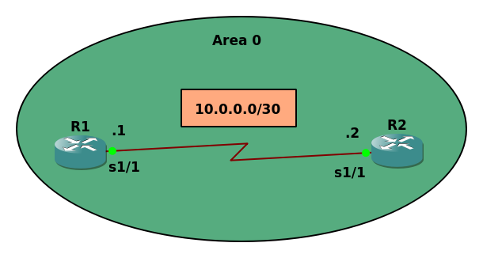
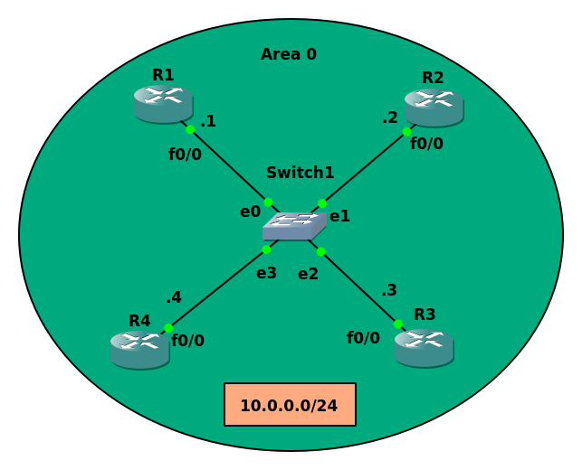

# Point-to-Point Network (Lab 2)



### R1
```
Router>en
Router#config t
Router(config)#line console 0
Router(config-line)#no logging syn
Router(config-line)#hostname R1

R1(config)#int s1/1
R1(config-if)#ip address 10.0.0.1 255.255.255.252
R1(config-if)#no shut

R1(config-if)#router ospf 1
R1(config-router)#network 10.0.0.1 0.0.0.0 area 0
```

### R2
```
Router#config t
Router(config)#line console 0
Router(config-line)#logging syn
Router(config-line)#hostname R2

R2(config)#int s1/1
R2(config-if)#ip address 10.0.0.2 255.255.255.252
R2(config-if)#no shut


R2(config-if)#router ospf 1         
R2(config-router)#network 10.0.0.2 0.0.0.0 area 0
```

### show ip ospf neighbor

```
R2(config-router)#do show ip ospf neighbor

Neighbor ID     Pri   State           Dead Time   Address         Interface
10.0.0.1          0   FULL/  -        00:00:35    10.0.0.1        Serial1/1
R2(config-router)#

```

As you can see there's no DR or BDR

```
R1#show ip ospf int s1/1

Serial1/1 is up, line protocol is up
  Internet Address 10.0.0.1/30, Area 0, Attached via Network Statement
  Process ID 1, Router ID 10.0.0.1, Network Type POINT_TO_POINT, Cost: 64   
  Topology-MTID    Cost    Disabled    Shutdown      Topology Name
        0           64        no          no            Base
  Transmit Delay is 1 sec, State POINT_TO_POINT
  Timer intervals configured, Hello 10, Dead 40, Wait 40, Retransmit 5
    oob-resync timeout 40
    Hello due in 00:00:04
  Supports Link-local Signaling (LLS)
  Cisco NSF helper support enabled
  IETF NSF helper support enabled
  Index 1/1, flood queue length 0
  Next 0x0(0)/0x0(0)
  Last flood scan length is 1, maximum is 1
  Last flood scan time is 0 msec, maximum is 0 msec
  Neighbor Count is 1, Adjacent neighbor count is 1
    Adjacent with neighbor 10.0.0.2
  Suppress hello for 0 neighbor(s)
R1#

```

→ Notice that there is no mention for the election of the DR or the BDR.

----------------------------------------------------------------------

# Lab 3



### R1
```
Router>en
Router#config t
Router(config)#line console 0
Router(config-line)#logging syn
Router(config-line)#hostname R1

R1(config)#int f0/0
R1(config-if)#ip address 10.0.0.1 255.255.255.0
R1(config-if)#no shut

R1(config-if)#router ospf 1
R1(config-router)#network 10.0.0.1 0.0.0.0 area 0
```

### R2
```
Router>en
Router#config t
Router(config)#line console 0
Router(config-line)#logging syn
Router(config-line)#hostname R2

R2(config)#int f0/0
R2(config-if)#ip address 10.0.0.2 255.255.255.0
R2(config-if)#no shut

R2(config-if)#router ospf 1
R2(config-router)#network 10.0.0.2 0.0.0.0 area 0
```

### R3
```
Router>en
Router#config t
Router(config)#line console 0
Router(config-line)#logging syn
Router(config-line)#hostname R3

R3(config)#int f0/0
R3(config-if)#ip address 10.0.0.3 255.255.255.0
R3(config-if)#no shut

R3(config-if)#router ospf 1
R3(config-router)#network 10.0.0.3 0.0.0.0 area 0
```


### R4
```
Router>en
Router#config t
Router(config)#line console 0
Router(config-line)#logging syn
Router(config-line)#hostname R4

R4(config)#int f0/0
R4(config-if)#ip address 10.0.0.4 255.255.255.0
R4(config-if)#no shut

R4(config-if)#router ospf 1
R4(config-router)#network 10.0.0.4 0.0.0.0 area 0
```

### show ip ospf neighbor

### R1
```
R1#show ip ospf neighbor

Neighbor ID     Pri   State           Dead Time   Address         Interface
10.0.0.2          1   FULL/BDR        00:00:31    10.0.0.2        FastEthernet0/0
10.0.0.3          1   FULL/DROTHER    00:00:31    10.0.0.3        FastEthernet0/0
10.0.0.4          1   FULL/DROTHER    00:00:37    10.0.0.4        FastEthernet0/0
```

### R2
```
R2#show ip ospf neighbor

Neighbor ID     Pri   State           Dead Time   Address         Interface
10.0.0.1          1   FULL/DR         00:00:35    10.0.0.1        FastEthernet0/0
10.0.0.3          1   FULL/DROTHER    00:00:30    10.0.0.3        FastEthernet0/0
10.0.0.4          1   FULL/DROTHER    00:00:38    10.0.0.4        FastEthernet0/0
```

### R3
```
R3#show ip ospf neighbor

Neighbor ID     Pri   State           Dead Time   Address         Interface
10.0.0.1          1   FULL/DR         00:00:34    10.0.0.1        FastEthernet0/0
10.0.0.2          1   FULL/BDR        00:00:39    10.0.0.2        FastEthernet0/0
10.0.0.4          1   2WAY/DROTHER    00:00:35    10.0.0.4        FastEthernet0/0
```

### R4
```

R4#show ip ospf neighbor

Neighbor ID     Pri   State           Dead Time   Address         Interface
10.0.0.1          1   FULL/DR         00:00:31    10.0.0.1        FastEthernet0/0
10.0.0.2          1   FULL/BDR        00:00:35    10.0.0.2        FastEthernet0/0
10.0.0.3          1   2WAY/DROTHER    00:00:35    10.0.0.3        FastEthernet0/0
```

> The neighbor relationship between the DRother routers will stay still at the 2WAY state as they don’t exchange the LSA between each other’s directly 

-------------------------------------------------------------