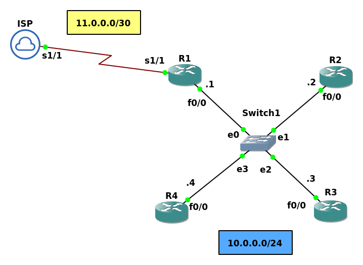

# Lab 4

Consider a scenario where you are working in a company and want to connect its network to internet. You will go to every router and put the default gateway which is exhausted job, or you can choose the router witch is connected to ISP and run the `default-information originate always` command which will advertise a default route throughout the OSPF domain. 

|Command                                                |Description|
|-------------------------------------------------------|-----------|
|`R(config-router)#default-information originate`       |Advertise the default route to 0.0.0.0/0 only if a default route already exist in the routing table.|
|`R(config-router)#default-information originate always`|Always advertise the default route to 0.0.0.0/0.|


## Topology



**Using the previous lab :**

### ISP
```
Router>en
Router#config t
Router(config)#line console 0
Router(config-line)#no logging syn
Router(config-line)#hostname ISP

ISP(config)#int s1/1
ISP(config-if)#ip add 11.0.0.2 255.255.255.252
ISP(config-if)#no sh
```

### R1
```
R1>en
R1#config t
R1(config)#int s1/1
R1(config-if)#ip address 11.0.0.1 255.255.255.252
R1(config-if)#no shut


R1(config-if)#exit
R1(config)#ip route 0.0.0.0 0.0.0.0 s1/1
R1(config)#router ospf 1
R1(config-router)#default-information originate
R1(config-router)#end

R1#show ip route
..
..

Gateway of last resort is 0.0.0.0 to network 0.0.0.0

S*    0.0.0.0/0 is directly connected, Serial1/1
      10.0.0.0/8 is variably subnetted, 2 subnets, 2 masks
C        10.0.0.0/24 is directly connected, FastEthernet0/0
L        10.0.0.1/32 is directly connected, FastEthernet0/0
      11.0.0.0/8 is variably subnetted, 2 subnets, 2 masks
C        11.0.0.0/30 is directly connected, Serial1/1
L        11.0.0.1/32 is directly connected, Serial1/1
```

> Remember that the 'S' signifies that the route source is a static route, whereas the asterisk (*) identifies this route as a possible candidate to be the default route.

### R2
```
R2#show ip route ospf
Codes: L - local, C - connected, S - static, R - RIP, M - mobile, B - BGP
       D - EIGRP, EX - EIGRP external, O - OSPF, IA - OSPF inter area
       N1 - OSPF NSSA external type 1, N2 - OSPF NSSA external type 2
       E1 - OSPF external type 1, E2 - OSPF external type 2
       i - IS-IS, su - IS-IS summary, L1 - IS-IS level-1, L2 - IS-IS level-2
       ia - IS-IS inter area, * - candidate default, U - per-user static route
       o - ODR, P - periodic downloaded static route, H - NHRP, l - LISP
       a - application route
       + - replicated route, % - next hop override

Gateway of last resort is 10.0.0.1 to network 0.0.0.0

O*E2  0.0.0.0/0 [110/1] via 10.0.0.1, 00:00:44, FastEthernet0/0
```

> E route is an external route (redistributed from another routing protocol, static route or connected route).


### R3
```
R3#show ip route ospf
..
..

Gateway of last resort is 10.0.0.1 to network 0.0.0.0

O*E2  0.0.0.0/0 [110/1] via 10.0.0.1, 00:01:14, FastEthernet0/0
```

### R4
```
R4#show ip route ospf
..
..

Gateway of last resort is 10.0.0.1 to network 0.0.0.0

O*E2  0.0.0.0/0 [110/1] via 10.0.0.1, 00:01:18, FastEthernet0/0
```

If we remove the default static route, R2, R3 and R4 will miss the default route. 


### R1
```
R1(config)#no ip route 0.0.0.0 0.0.0.0 s1/1
```

### R2
```
R2#show ip route
..
..

Gateway of last resort is not set

      10.0.0.0/8 is variably subnetted, 2 subnets, 2 masks
C        10.0.0.0/24 is directly connected, FastEthernet0/0
L        10.0.0.2/32 is directly connected, FastEthernet0/0
```

so it's better to use `default-information originate always`

### R1
```
R1(config-router)#default-information originate always
```

### R2
```
R2#show ip route
..
...

Gateway of last resort is 10.0.0.1 to network 0.0.0.0

O*E2  0.0.0.0/0 [110/1] via 10.0.0.1, 00:00:11, FastEthernet0/0
      10.0.0.0/8 is variably subnetted, 2 subnets, 2 masks
C        10.0.0.0/24 is directly connected, FastEthernet0/0
L        10.0.0.2/32 is directly connected, FastEthernet0/0

```
-------------------------------------------------------------