# OSPF Neighborship States

OSPF routers go through the seven states while building neighborship with other routers.

**1.** Down state

**2.** Attempt/Init state

**3.** Two ways state

**4.** Exstart state

**5.** Exchange state

**6.** Loading state

**7.** Full state


|State         |Description|
|--------------|-----------|
|Down state    |There is no active neighbor detected on the interface.|
|Attempt state |Neighbors must be manually configured. This state is used only in nonbroadcast multi-access (NBMA) networks.|
|Init state    |A hello packet has been received; this is the first state in which you would see a neighbor ID appear in the neighbor table.|
|Two ways state|The local router has received a hello packet from a neighbor that contains its own router ID, signifying 2-way communications have been established.|
|Exstart state |The two routers have agreed on the master and slave roles for transmission of database description (DBD) packets in the subsequent Exchange state.|
|Exchange state|The database description packets for the LSDB are exchanged. Packets may be flooded to other interfaces on the router.|
|Loading state |After DBD exchange, the two routers send LSUs and LSRs to exchange information about missing routes, using request and retransmission lists.|
|Full state    |Once databases have been fully synchronized between the two routers and they are capable of running the SPF algorithm, the adjacency is completed and transitions to the “Full” state.|


-------------------------------------------------------------------------------------

# 1. Down State

**In this stage :**

- Both routers have no information about each other (no active neighbor detected). R1 does not know which protocol is running on R2. Vice versa R2 have no clue about R1.

- OSPF learns about the **local interfaces** which are configured to run the OSPF instance.

- Routers prepares themselves for neighborship process. In this state routers choose RID (Router ID). RID plays a big role in OSPF process.

- **In down state router do following:**

   - Choose RID and initialize the OSPF process
   - Run OSPF instance on local interfaces which are configured through the `network` command such as `R(config-router)#network 10.0.0.0 0.0.255.255 area 0`.
   - Collect necessary information for **Hello packet** such **RID** and **configuration values** which are required to build the neighborship.

### Hello Packet

Hello message includes these informations :

- Router ID (RID)
- Area ID
- Network ID and subnet mask
- Hello interval
- Dead interval
- Router Priority
- Authentication password
- DR/BDR IP

   
## RID

- RID is a unique identifier of Router in OSPF network. **It must be unique within the autonomous system.** Routers identify each other through the RID in AS.

- RID is **32 bit** long. IP address is also 32 bit in length. We can use IP address as a RID. This gives us more flexibility over RID. For example we can use a simple and sequential IP scheme such as `1.1.1.1` for R1, `1.1.1.2` for R2, `1.1.1.3` for R3 and so on. You can also make RID = `0.0.1.1`

**How do routers choose RID?**

An OSPF router looks in three places for RID:-

- **1. Manual configuration :**
  - If we have assigned RID manually, OSPF will not look in next two options. Suppose we did not assign it through the command. In this situation OSPF will look in next option to find the RID.

- **2. Loopback interface IP configuration :**
  -  If loopback interface is not configured, OSPF will look in next and last possible place to choose the RID.

- **3. Active interfaces IP configuration**

### 1. Manual configuration

- Because RID plays a significant role in network, OSPF allows us to configure it manually. 

- We can assign RID from OSPF sub command mode :

   ```
   Router(config)#router ospf 1
   Router(config-router)#router-id [RID]
   ```

### 2. Loopback interface IP configuration

- If loopback interface is configured, OSPF will choose its IP address as RID. If multiple loopback interfaces are configured, **highest IP address will be chosen** from all loopback interfaces configuration.

### 3. Active interface IP configuration

- OSPF will choose the **highest IP address** from all operational IP interfaces. We should not let the OSPF to use this option. This option does not provide a fix RID which is very necessary for network stability.

- This option has several reasons which may force OSPF to recalculate the RID such as Interface which IP address is chosen may go down or for troubleshooting we may enable / disable the interfaces.

## Key points

- OSPF will follow the sequence (Manual configuration → Loopback interface → Active interface) of options while selecting RID.

- OSPF will choose IP address only from operational IP interface. Operational means interface should be listed as line is up and line protocol is up in the output of `show ip interface brief` command.

- When multiple IP addresses are available, OSPF will always pick highest IP address for RID.

- For network stability we should always set RID from either `router-id` command or by using loopback interfaces.

- By default Router chooses OSPF RID when it initialized. Once RID is selected it will use that RID until next reboot.

- OSPF will not consider any change in RID which we make after initialization. We have two options to implement new RID. Either reboots the router or clear the OPSF process with `clear ip ospf process` command.

- If OSPF fails to select the RID, it will halt the OSPF process. We cannot use OSPF process without RID.

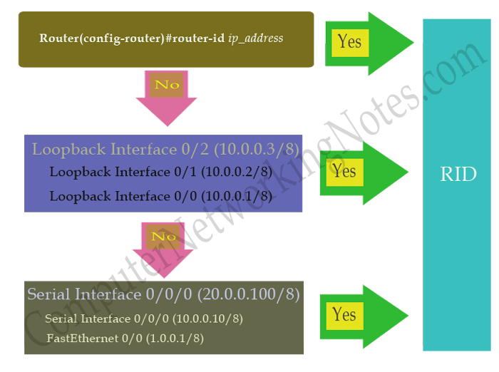


--------------------------------------------------------------------------------------

# 2. Attempt/Init State

- Neighborship building process starts from this state. R1 **multicasts** first hello packet, so other routers in network can learn about the existence of R1 as an OSPF router.


### In Init state routers do following :

- R1 will generate a hello packet with RID and essential configuration values and send it out from all active interfaces.
- The hello packets are sent to the multicast address `224.0.0.5`.
- R2 will receive this packet.
- R2 will read RID from packet and look in neighbor table for existing entry.
- If match found, R2 would skip neighborship building process and reset the dead interval timer for that entry.
- If OSPF does not find a match in neighbor table, it will consider R1 (sender router) as a possible OSPF neighbor and start neighborship building process.
- R2 will match its essential configuration values with values listed in packet.
- If all necessary configuration values match, R2 will add R1 in its neighbor table.
- At this moment R1 has no idea about R2. R1 will learn about R2 when it will respond.


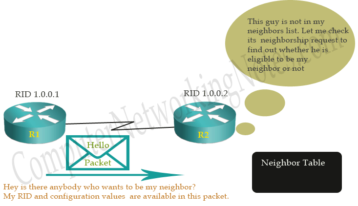


### Attempt State

- In **Non-broadcast multi-access environment** such as **Frame Relay** and **X.25**, OSPF uses Attempt state instead of Init state. OSPF uses this state only **if neighbors are statically configured with `neighbor` command**. In this situation, it does not have to discover them dynamically. As it already knows the neighbors, it will use **unicast** instead of multicast in this state.

- Once neighborship is built, OSPF uses hello packets as keep alive. If a router does not receive a hello packet from any particular neighbor in dead interval, it will change its state to down from full. After changing the state it will make an effort to contact the neighbor by sending Hello packets. This effort is made in Attempt state.

**Basically Both Init and Attempt states describe similar situation where one router has sent a hello packet and waiting for response.**

-----------------------------------------------------------------------------------------

# 3. Two Ways State

- If essential configuration values match, R2 will add R1 in neighbor table and reply with its hello packet. As R2 knows the exact address of R1, it will use **unicast for reply**. 

- Beside RID and configuration values, this packet **also contains** the **R2’s neighbor table data**. As we know R2 has already added R1 in its neighbor table. So when R1 will see R2’s neighbor table data, R1 would also see its name in this data. This will assure R1 that R2 has accepted its neighborship request.

**At this point:**

- R2 has checked all essential configuration values listed in hello packet which it received from R1.
- R2 is ready to build neighborship with these parameters.
- R2 has added R1 in its neighbor table.
- To continue the neighborship process, R2 has replied with its hello packet and it's neighbor table data.
- R1 has received a reply from neighbor, with its own RID listed in R2’s neighbor table.

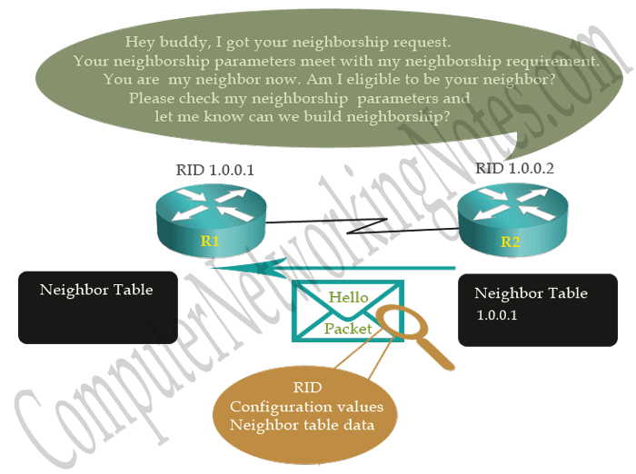

Now it is R1’s turn to take action on R2’s reply. This reply would be based on hello packet which it received from R2. As we know that this hello packet contains one additional field; Neighbor table data field which indicates that this is not a regular neighbor discovery hello packet. This packet is a reply of its own request.

**R1 will take following actions:**

- It will read RID from hello packet and look in its neighbor table for existing entry.
- If a match for RID found in neighbor table, it would reset the dead interval timer for that entry.
- If a match is not found in neighbor table, it would read the essential configuration values from packet.
- It will match configuration values with its own values. If values match, it will add R2’s RID in neighbor table.
- If packet contains neighbor table data with its own RID, it will consider that as request to enter in two way state.
- R1 will reply with a hello packet which contains its neighbor table data.
- This packet is a confirmation of two ways state.

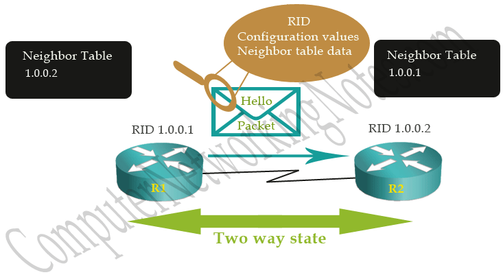

Fine, our routers are neighbor now. They are ready to exchange the routing information.

Before we understand how routers will exchange routing information, we need to understand the types of network. OSPF uses different types of exchange process for different types of network.

----------------------------------------------------------------------

# Types of Networks

## Point to point Network (Serial Connection or Leased Line Connection)

It connects a single pair of routers. In this type of network:-

- No DR and BDR are required.
- All routers form full adjacencies with each other.
- All routers are considered as AllSPFRouters (ALL Routers running OSPF).
- Hello packets are sent using a multicast address **224.0.0.5**
- Hello interval = 10 sec
- Dead interval = (4 * hello interval) sec

## Broadcast Networks

Broadcast networks are capable in connecting more than two devices. In this type of network:-

- DR and BDR are required.
- All routers form full adjacencies only with DR and BDR.
- Routers use a multicast address **224.0.0.6** to update the **DR**.
- DR uses a multicast address **224.0.0.5** to update the all **routers**.
- Hello interval = 10 sec
- Dead interval = (4 * hello interval) sec

> It's not bus topology, there is a switch.

## NBMA Netowrks (Non-broadcast Multi-access Networks)

NBMAs are also capable in connecting more than two devices. But they do not have broadcast capability, dynamic network discovery will not be possible. In this type of network:-

- DR and BDR are required.
- OSPF neighbors must have to define statically.
- All OSFP packets are **unicast**.
- Hello interval = 30 sec
- Dead interval = (4 * hello interval) sec

## Point to Multipoint

Point to multipoint is a special implementation of NBMA network where networks are configured as a collection of point to point links. In this type of network:-

- No DR and BRD are selected in this type of network.
- Network must be configured statically.
- OSPF packets are multicast.

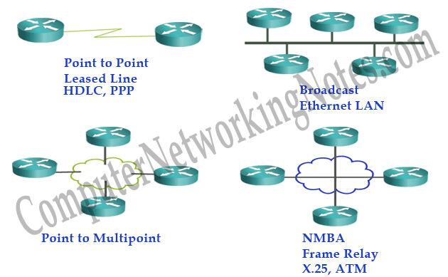

### We can divide these networks in two types;

- Networks which need DR and BDR such as broadcast and NBMA
- Networks which do not need DR and BDR such as point to point and point to multipoint

So what does DR and BDR actually do? Why do we need them in our network?

--------------------------------------------------------------------------

# DR and BDR

- OSPF uses a DR **(Designated Router)** and BDR **(Backup Designated Router)** on each **multi-access network**. A multi-access network is a segment where we have more than two routers. OSPF figures this out by looking at the interface type. For example, an Ethernet interface is considered a multi-access network, and a serial interface is considered a point-to-point interface.

- OSPF routers in a network which need DR and BDR do not share routing information directly with all each other’s. To minimize the routing information exchange, they select one router as designated router (DR) and one other router as backup designated router (BDR). Remaining routers are known as **DROTHERs**.

- **All DROTHERs share routing information with DR**. **DR will share this information back to all DROTHERs**. BDR is a backup router. **In case DR is down**, BDR will immediately take place the DR and would elect new BDR for itself.

- Main reason behind this mechanism is that routers have a central point for routing information exchange. Thu, they need not update each other’s. A DROTHER only need to update the central point (DR) and other DROTHERs will receive this update from DR.

- Practically this will cut the numbers of routing information exchange from **O(n*n)** to **O(n)** where n is the number of routers in a multi-access segment.

- For example following figure illustrates a simple OSPF network. In this network R4 is selected as DR and R5 is selected as BDR. DROTHERs (R1, R2 and R3) will share routing information with R4 (DR) and R5 (BDR), but they will not share routing information with each other. Later DR will share this information back to all DROTHERs.


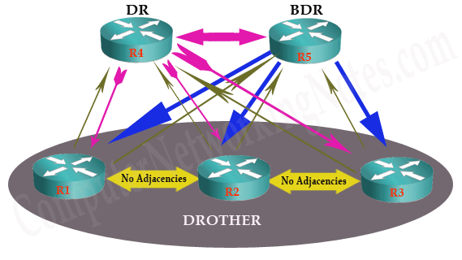


# DR and BDR Election Process


- **Condition 1:- Use the first router that comes up within 40 seconds:**

  - It waits for 40 seconds in broadcast network (default dead interval is 40 in broadcast) and then elects itself as DR
  
  - The DR and BDR election process takes place as soon as the first router with an OSPF-enabled interface is active on the multiaccess network. This can happen when the routers are powered on, or when the OSPF network command for that interface is configured. The election process only takes a few seconds. If all the routers on the multiaccess network have not finished booting, it is possible that a router with a lower router ID becomes the DR. 

- **Condition 2:- Use the highest priority value (0:255)**

  - This condition says “Arrange all routes in high to low order and pick the highest for DR and second highest for BDR”.  OSPF router with the highest priority becomes DR. Router with second highest priority becomes BDR. If there is a **tie**, router with the **highest RID** will be chosen.

  - **Priority value** is **8 bit** in length. **Default priority value is 1**. We can set any value from range 0 to 255. We can change it from Interface Sub-configuration mode with `ip ospf priority` command.


- **Condition 3:- If there is a tie use the highest RID**


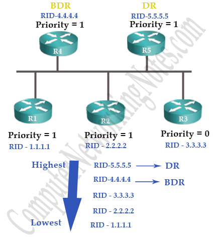


**Notes**

- **OSPF DR and BDR elections are not preemptive**. If a new router with a higher priority or higher router ID is added to the network after the DR and BDR election, the newly added router does not take over the DR or the BDR role. This is because those roles have already been assigned. The addition of a new router does not initiate a new election process.


### How to force a router to become DR?

- **1.** We can force any router to become DR (Highest) or BDR (Second highest) by changing its priority value. 

- **2.** Then do one of the following:

  - **1.** Reload the DR and BDR routers
  
  - **2.** Sutdown the interfcae of DR router:
    - when you turn on the interface of the old DR router it will come back with its rule (DR) so it Will fight for power with the  new DR router, so the highest priority router will be the DR.
  
  - **3.** Use the command `clear ip ospf process`
  
  - **4.** Set the priority value of DR BDR to 0. **If we set priority value to 0, it will never become DR or BDR.** (It will give up the power immediately)

-----------------------------------------------------------------------------------------

# Adjacency


As we know that there are two types of network:

- **Networks which need DR and BDR :** DROTHERs will exchange routing information with DR and BDR.

- **Networks which do not need DR and BDR :** All routers will exchange routing information with each other’s.

  > Note Serial interfaces have default priorities set to 0; therefore, they do not elect DR and BDRs.

- **Adjacency** is a relationship formed between neighboring routers for the purpose of exchanging routing information. Not every pair of neighboring routers becomes adjacent.

- Routers which will exchange routing information are known as **adjacent**. Relationship between two adjacent is known as **adjacency**. This terminology is associated with interfaces. A router which has two interfaces can be adjacent in one interface and DROTHER in other interface.

- For example following figure illustrates an OSPF running NBMA network. In this network;

     - R3 will build adjacency with R1, so in this relationship they will be considered as Adjacent.

     - R3 will not build adjacency with R4, so in this relationship they will be considered only DROTHER.

 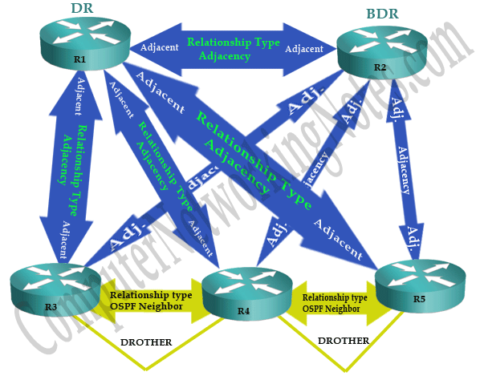


- In a network which doesn’t require DR and BDR, all routers will be considered as Adjacent and relationship between them will be considered as Adjacency.

**Only adjacent routers will enter next states to build the adjacency.**

-----------------------------------------------------------------------------

# 4. Exstart State

Routers who decided to build adjacency will form a **master/slave relationship**. In each adjacency router who has **higher RID** will become **master** and the other will become slave.

Do not mix Master/Slave relationship with DR/ BDR/ DROTHER relationship. Both terms look similar but have different meaning. DR/ BDR/ DROTHER relationship is built in a segment and have a wider meaning while Master/Slave relationship is built between two interfaces which need to exchange routing information. Master / Slave relationship has limited purpose. **It is used to decide the Router who will start exchange process. Always Master starts exchange process.**

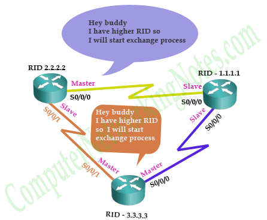

Once routers settle down on Master/Slave, they will establish the **initial sequence numbers** which will be used in routing information exchange process. Sequence numbers ensure that routers get most accurate information.

----------------------------------------------------------------------------

# Relative Terms

Let’s understand few relative terms:

- **LSA (Link State Advertisement)**
   LSA is a data packet which contains link-state and routing information. Each LSA contains routing information about a particular link. OSPF uses it share and learn network information.

- **LSDB (Link State Database)**
  Every OSPF router maintains a LSDB. LSDB is collection of all LSAs received by a router. Every LSA has a sequence number. OSPF stores LSA in LSDB with this sequence number.

- **DBDs (Database Description) or DDPs**
  Database description packets (also referred as **DDPs**) contain the list of LSA. This list includes **link state type**, **cost of link**, **ID of advertising router** and **sequence number of link**. **It is only a list of all LSAs** from its respective database. **It does not include full LSAs.**

----------------------------------------------------------------------------

# 5. Exchange State

In exchange state, Master and slave decide how much information needs to be exchange. An OSFP router is smart enough to filter the updates before receiving it. It will ask only for the updates which it does not have. In this state, routers will filter the updates which need to be exchanged.

In this state, routers exchanges **DBDs**. Through DBDs routers can learn which LSAs they already have. For example in following network R2 has A1, A2 and B2 LSAs in its DBD. So it will send a list of these LSAs to R1. R1 will send an acknowledgment of receiving the list with **LSACK signal**. Same as R2, R1 will send its DBDs to R2 and R2 would acknowledge that with its **LSACK single**.

### LSR (Link State Request)

Upon receiving DBDs, routers will compare it with their own DBS. Thus, they will learn what they need to order. For example R2 received a check list (DBDs) of A1 and B1. When it will compare this list with its own DBD, it will learn that it already has A1. So it does not need to order this LSA again. But it does not have B1, so it needs to order for this LSA. After a complete comparison, both routers will prepare a list of LSAs which they do not have in their own LADB. This list is known as LSR (Link State Request).


**What others have (DBDs) – What I have (my DBD) = What I need to order (LSR)**


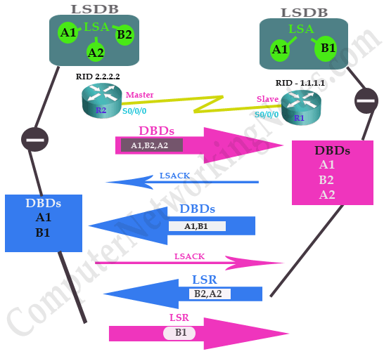

At the end of this state both routers have a list of LSAs which need to be exchanged.

-----------------------------------------------------------------------------------------------

# 6. Loading State

In this state **actual routing information is exchanged**. Routers exchange LSAs from LSR list.

Routers will use **LSU (Link state update)** to exchange the LSAs. It contain one or more LSAs inside it.

Routers also maintain a **retransmission list** to make sure that every sent LSA is acknowledged.

For example following figure illustrates loading state of above example. R2 sent a LSU which contain two LSAs but it received acknowledgement of only one, so it had to resend lost LSA again.

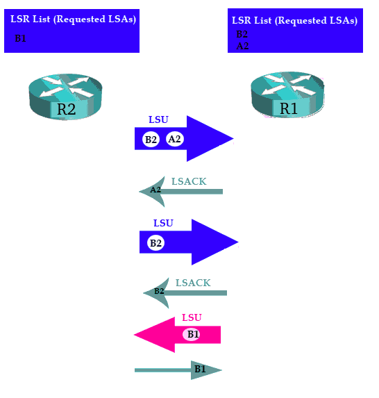

This exchange process will continue till router has any unsent LSA in LSR list.

-----------------------------------------------------------------------------------------------

# 7. Full State

Full state indicates that both routers has been exchanged all LSAs from LSR list. Now they have identical LSDB.

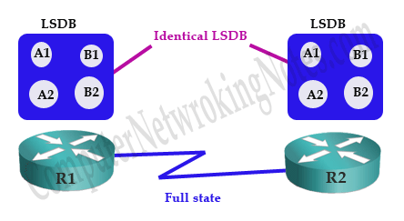

Adjacent routers remain in this state for life time. This state also referred as adjacency. If any change occurs in network, routers will go through this process again.

---------------------------------------------------------------------------------------

# Maintaining Adjacency

- Routers will send hello messages in hello interval.
- If a router does not receive hello message from neighbor in dead interval, it will declare that neighbor as dead.
- Once a neighbor is dead, router will flood **this change** immediately to other connected neighbors (Not all routing table as the RIP did).
- Beside this if router detect any change in network or receive any update, it will flood that change.
- A LSA has a default lifetime of **30 minutes**. Any unchanged LSAs must be reflooded in every 30 minutes.

----------------------------------------------------------------------------------------------

