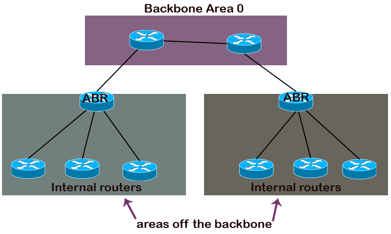
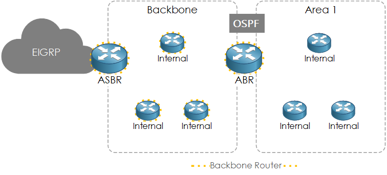
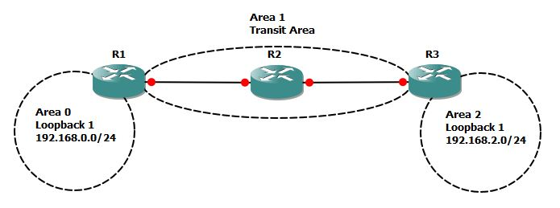
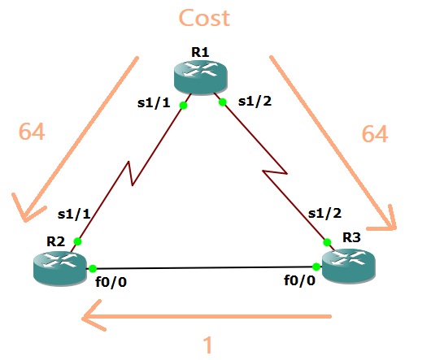
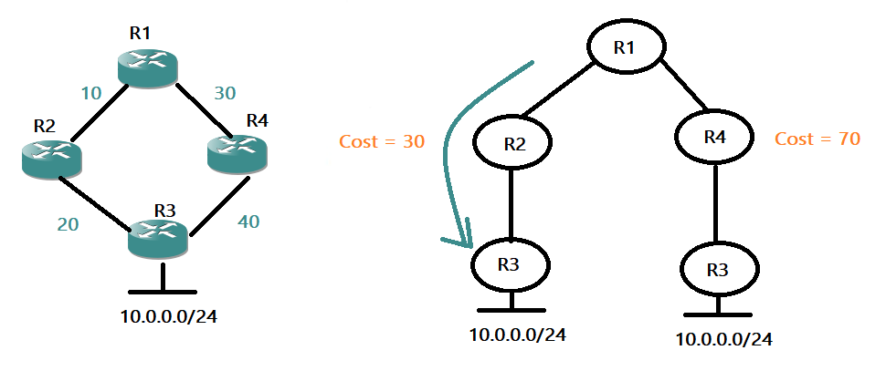
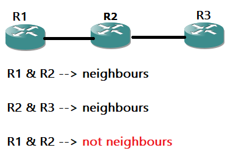
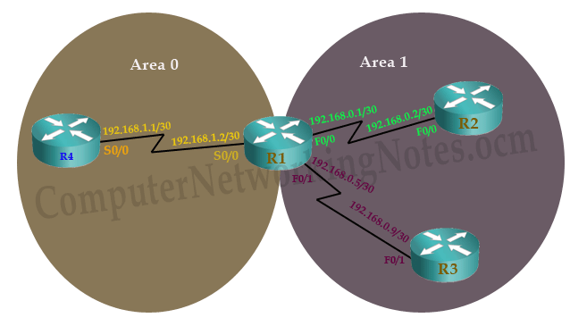

# Distance Vector vs Link State Protocols

**Distance vector protocols** send their entire routing table to directly connected neighbors.

**Link state protocols** send information about directly connected links to all the routers in the network.

# Link

A link is a router's interface connected to an IP subnet. When we add an interface to the OSPF process, OSPF considers the interface as a link.

# State

Since a link is an interface, it has two states: up and down. The **up state** shows the link (interface) is operational and OSPF can reach the IP subnet connected to the link. The **down state** shows the link is not operational and OSPF cannot reach the IP subnet connected to the link.

# Link State Protocol

OSPF is a link-state protocol. Link state protocols use the **Shortest Path First (SPF) algorithm** to calculate the best path to a destination. To run this algorithm, link-state protocols learn the complete topology of the network. In a big size network, this feature creates scalability problems. To solve this problem, OSPF uses two concepts: **autonomous systems** and **areas**.

# Hierarchical Design and Areas

Within the AS, OSPF uses areas and hierarchical design. OSPF implements a two-layer hierarchy: **backbone area (Area 0)** and **areas off the backbone**. OSPF uses the **backbone area** to distribute all routing information between the **non-backbone areas**.

An area is a group of contiguous networks. Each area uses a **unique area ID**. All routers in the same area use the same area ID. The following image shows how OSPF uses areas for hierarchical routing.

 

### Some Terms

|Term                                       |Description|
|-------------------------------------------|--------------------------------------------------------------------------------|
|**Area**         	                        |A set of contiguous routers that share the same routing information.            |
|**Backbone area**	                        |A special area to which all other areas must connect.                           |
|**Backbone routers**                       |Routers in the backbone area or router has at least one interface in **Area 0** |
|**Internal routers**	                      |Routers in areas off the backbone                                               |
|**ABR (Area border router)**               |A router that connects the area to the backbone area                            |
|**ASBR (Autonomous System Border Router)** |Connects to an area and also to an external AS.                                 |
|**Intra-area route**                       |A route within the same area                                                    |
|**Interarea route**	                      |A route between the areas                                                       |

### Transit Area

All areas in an OSPF autonomous system must be physically connected to the backbone area (Area 0). In some cases, where this is not possible, you can use a virtual link to connect to the backbone through a non-backbone area. The area through which you configure the virtual link (bridge), known as a **transit area**.

----------------------------------------------------------------------------------------------------

# OSPF Metric Cost

- Logically a packet will face more overhead in crossing a **56 Kbps** serial link than crossing a **100 Mbps** Ethernet link. Respectively it will take less time in crossing a higher bandwidth link than a lower bandwidth link. OSPF uses this logic to calculate the cost. 

- Cost is the inverse proportional of bandwidth. Higher bandwidth has a lower cost. Lower bandwidth has a higher cost.

- OSPF uses **"Cost"** as the value of metric.

- The cost for OSPF is automatically derived from the **interface bandwidth**. **A higher bandwidth interface will be automatically preferred.**

- **Cost = reference bandwidth / interface bandwidth** (The default reference bandwidth is **100 Mbps** (108bps.)

   |Interface Type   | Bandwidth (Mbps)|Bandwidth (bps)         |Cost                                             |
   |-----------------|-----------------|------------------------|-------------------------------------------------|
   |Loopback         |        -        | -                      | 1                                               |
   |Serial           |       1.544     |1.544 * 10 6 |108 / (1.544 * 10 6) ≈  64 |
   |Ethernet         |       10        |10 * 10 6    |108 / (10 * 10 6) = 10     |
   |Fast Ethernet    |       100       |100 * 10 6   |108 / (100 * 10 6) = 1     |
   |Gigabit Ethernet |       1000      |1000 * 10 6  |108 / (1000 * 10 6) ≈  1   |

- Cost formula doesn’t differentiate between interfaces with bandwidth faster than 100 Mbps.  The result of this is that OSPF routers in the network cannot make an accurate path calculation when comparing fast Ethernet interface versus a gigabit Ethernet interface as both interfaces has a cost of 1.

- By default, OSPF assigns a default **cost metric of 1 to any link faster than 100 Mbps.**

- In order to resolve this, the reference bandwidth value can be modified to allow higher bandwidth interface to have more granular cost value.

   |Interface Type   |Cost                                          |
   |-----------------|----------------------------------------------|
   |Ethernet         |109 / (10 * 10 6) = 100 |
   |Fast Ethernet    |109 / (100 * 10 6) = 10 |
   |Gigabit Ethernet |109 / (1000 * 10 6) =  1|

- It is recommended to set **the same reference bandwidth on all routers throughout the OSPF domain**. Suppose you set the reference bandwidth differently on two routers, so that they advertise different link costs for their Ethernet interfaces. This could cause seriously strange routing patterns as OSPF will try to avoid using the higher cost links. For example, that a Fast Ethernet interface on one router is faster than a Gigabit Ethernet interface on the other route.

--------------------------------------------

# SPT (Shortest Path Tree)

- OSPF uses SPT tree to calculate the best route for routing table.

- SPT is just like a family tree where router is the root and destination networks are the leaves. SPF algorithm calculates the branch cost between leaves and root. Branch with the **lowest cost** will be used to reach at leaf. 

- SPF algorithm calculates all possible routes from source router to destination network.

- An SPT tree cannot grow beyond the area. So if a router has interfaces in multiple areas, it needs to build separate tree for each area.

- **Cumulative cost = Sum of all outgoing interfaces cost in route**

   - **Best route for routing table = Route which has the lowest cumulative cost**

- While calculating cumulative cost, OSPF consider only outgoing interfaces in path. It does not add the cost of incoming interfaces in cumulative cost.

-------------------------------------------------------

# OSPF Neighborship Requirements

- OSPF routers share routing information **only with neighbors**. OSPF uses **hello packets** to discover neighbors in segments.

- In order to become OSPF neighbor following values must be match on both routers:

   - **1.** The devices must be direct connected (Neighboring routers are the routers that have interfaces in common network).

     

   - **2.** The devices must use the same **network ID** and the **same subnet**.
     > Using the same subnet mask is not a condition to create a neighbor relationship in the **point-to-point** OSPF networks

   - **3.** The devices must be in the **same area**.

   - **4.** The devices **hello intervals** must match : Default hello interval is **10** seconds.

   - **5.** The devices **dead intervals** must match : Default dead interval is **(4 * hello interval) sec** seconds. If a router does not receive hello packet in 40 seconds from neighbor it will declare that as dead. 

   - **6.** The devices must have the **same authentication configuration**.

   - **7.** The devices must have matching **stub flags**. →(CCNP)

> Area is associated with specific interface, not with entire router. For example a router that has two interfaces; Serial interface and Fast Ethernet interface, can run Serial interface in one area and Fast Ethernet in another area. 

- Example : In this network R1 is eligible to form neighborship with R4 and R2 respectively on S0/0 and F0/0.

 
 
 **Why neighborship cannot be built between R1 and R3?**

  - Both interfaces should be in same segment.
    
    Yes both interfaces ( R1’s Fo/1 and R3’s F0/1) are connected with direct link.

  - Both interfaces should be in same area.
    
    Yes both interfaces ( R1’s Fo/1 and R3’s F0/1) are in same area.

  - Both interfaces should have same subnet mask.
    
    Yes both interfaces have same subnet mask /30.

  - Both interfaces should have same network ID.
    
    No both interfaces have different network ID. R1’s F0/1 has network ID 192.168.0.4/30 while R3’s F0/1 has network ID 192.168.0.8/30. This condition does not match. Thus, these two routers on these interfaces cannot build neighborship.

---------------------------------------------------------

