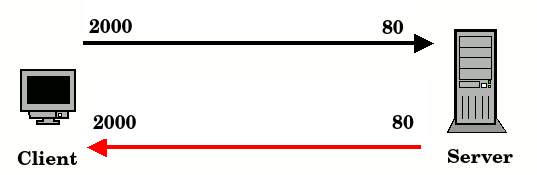

# Ports

- A port **in computer hardware** is a jack or socket that peripheral hardware plugs into.

- A port **in networking** is a virtual point where network connections start and end. Ports are **software-based** and managed by a computer's operating system. Each port is associated with a **specific process (network protocol)**. Ports allow computers to easily differentiate between different kinds of traffic: emails go to a different port than webpages, for instance, even though both reach a computer over the same physical network connection.

# Computer Network Ports

- A port number is a **16-bit** unsigned integer, thus ranging from **0** to **65,535** (2^16 - 1), although not all are in common use. 

- The port numbers are divided into three ranges : 
   - **System or well-known** ports : **0 – 1023** 
   - **User or registered** ports : **1024 – 49151** 
   - **Dynamic or private** ports : **49152 – 65535** 
   
    

   **There's no technical difference between a "well-known" port, or a "registered port", or a "dynamic" port.** Any of them can be used for a service/daemon to listen on, any of them can be port-forwarded in a NAT gateway, and any of them can be used for a client to initiate a connection from.

- The client and server don't need to use the same port. Client generally uses random port (e.g,2000) to connect to a server with a specific port (e.g, 80). The server responds back to that machine using the random port. 

    

- Ports are a **transport layer** (layer 4) concept. Only a transport protocol such as the **TCP** or **UDP** can indicate which port a packet should go to. TCP and UDP headers have a section for indicating port numbers. Network layer protocols — for instance, the Internet Protocol (IP) — are unaware of what port is in use in a given network connection. In a standard IP header, there is no place to indicate which port the data packet should go to. IP headers only indicate the destination IP address, not the port number at that IP address.

---------------------------------------------

# Common Ports 

**Some of the most commonly used ports :**

| Port Number  | Transport Protocol            | Service |
|--------------|-------------------------------|---------|
| 20,21        | TCP                           | FTP     |
| 22           | TCP                           | SSH     |
| 23           | TCP                           | Telnet  |
| 25           | TCP                           | SMTP    |
| 53           | TCP & UDP                     | DNS     |
| 80           | TCP                           | HTTP    |
| 110          | TCP                           | POP3    |
| 123          | UDP                           | NTP     |
| 179          | TCP                           | BGP     |
| 443          | Transport Layer Security(TLS) | HTTPS   |

----------------------------------------

