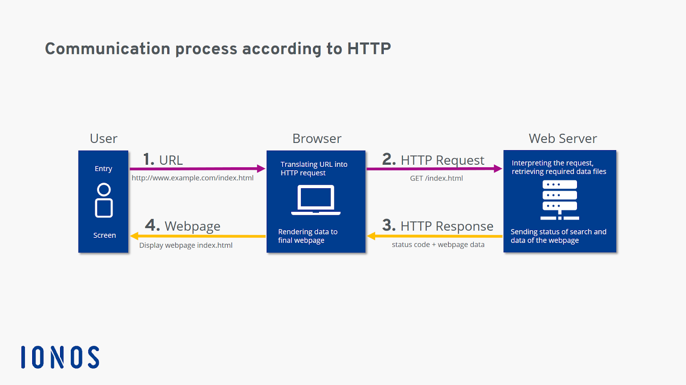
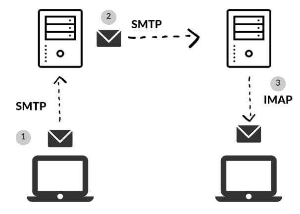

# HTTP (Hypertext Transfer Protocol)

- **HTTP** is a **client-server protocol** that fetches resources, such as HTML documents. 

- HTTP is the foundation of any data exchange on the Web. When a user enters an internet address in the browser URL bar, the browser communicates with the web server via HTTP, fetching data from different servers since data on one page could be distributed on different servers. Browsers use HTTP to request all types of media used on modern websites: text, images, videos, program code, etc.

### How HTTP works? 



### Some HTTP Methods 

- **HTTP GET:** The GET method is used to **retrieve information** from the given server using a given URI.

- **HTTP HEAD:** Same as GET, but **requests only headers fields**. No body message will return in the response. 

- **HTTP POST:** A POST request is used to **send data to the server**, for example, customer information, file upload, etc. using HTML forms.

----------------------------------------------------

# HTTPS (Hypertext Transport Protocol Secure) 

- This secure version is actually plain HTTP sent over **TLS (Transport Layer Security)**. 

- If we need to exchange sensitive information which needs to be secured and to prevent unauthorized access, we should use HTTPS instead of HTTP. **Using HTTP** makes data transfer in plaintext without encryption, so any **Man-in-the-Middle** could see the actual data sent.  

----------------------------------------------------

# SMTP (Simple Mail Transfer Protocol)

- SMTP is an email protocol that is used for **email sending only**.

----------------------------------------------------

# POP3 (Post Office Protocol)

- The number three stands for “version 3”, which is the latest version and the most widely used — hence the term “POP3.”

- POP3 **downloads** the email from a server to a **single computer**, then **deletes** the email from the server. Other devices will obviously not be able to fetch them anymore. This takes away the convenience of checking emails from multiple devices.

- Using POP3 means that your email will be accessible offline and deleted from the server but most clients offer the option to leave the messages on the server (just copied).

----------------------------------------------------

# IMAP (Internet Access Message Protocol)

- **IMAP** is an email protocol that is used for **receiving messages only**.
 
- **IMAP** stores the message on a server and **synchronizes** the message across **multiple devices**.
 


----------------------------------------------------

# Telnet

- It provides a **CLI** for communication with a remote device or server. Telnet is **not secure** enough for public use.

----------------------------------------------------

# SSH (Secure Shell or Secure Socket Shell)

- It is a cryptographic network protocol that allows two computers to communicate and share the data over an insecure network such as the internet. It is used to login to a remote server to execute commands and data transfer from one machine to another machine.

- Secure communication provides a strong password authentication and encrypted communication with a **public key** over an insecure channel. It is used to replace unprotected remote login protocols such as Telnet, rlogin, rsh, etc., and insecure file transfer protocol FTP.

----------------------------------------------------

# RDP (Remote Desktop Protocol)

- Remote desktop is used to connect and use a faraway desktop computer from a separate computer. Remote desktop users can access their desktop, open and edit files, and use applications as if they were actually **sitting at their desktop computer**. Employees often use remote desktop software to access their work computers when they are traveling or working from home.

----------------------------------------------------

# FTP (File Transfer Protocol)

- **FTP** is a communication protocol used for file transfer over **(unsecured)** TCP/IP network from the server to the client. FTP clients could be **CLI** that is installed on operating systems or **GUI** that is user friendly, e.g: FileZilla, FireFTP. 

- By default, your browser renders pages in a visual format with **hypertext transfer protocol**, but you can also use your browser to open files with FTP. **Browser-based FTP** is more common for public sites that enable anonymous access for downloading files. If the server where those files are hosted does not allow anonymous FTP connections, you must have a username and password to view the files on the server. **The URL using the FTP will start with FTP.**

- FTP supports two separate Transmission Control Protocols: 
    - **TCP Port 21** is the **FTP control port** used for establishing the connection(authenticate the use) between the 2 hosts.
    - **TCP port 20** is the **FTP data port** used for transferring data (via the Data channel).

> FTPS (File Transfer Protocol Secure) is an extension of FTP that supports Transport Layer Security (TLS) and Secure Sockets Layer (SSL).

----------------------------------------------------

# SMB & NFS

- If you want to share files over a **local network**, there are two main solutions you can choose from: NFS and SMB. 

- Both are client-server communication protocols that allow you to access files on a remote server. Both are often used in many network environments to share files to and from file servers.

### SMB (Server Message Block)

- SMB is mainly a native file sharing protocol for computers running on **Microsoft Windows**. It seamlessly integrates with Windows operating systems.

### NFS (Network File System)

- NFS was designed for **UNIX systems** and **Unix-like** operating systems (such as Linux).

> **In order to make a shared folder between Linux and MS Windows you can either install SMB on Linux or NFS on MS Windows.**

### Create a Share on Ubuntu and Access It from MS Windows

- **Step 1** : Create the shared folder on Linux: `mkdir sharedFolder`

- **Step 2** : installing Samba : `sudo apt-get install samba`

   **Note :** Samba is a suite of applications that implements the SMB protocol.
   
- **Step 3** : configure a username and password that will be used to access the share: `sudo smbpasswd -a [username]`

- **Step 4** : use your favorite editor to configure the smb.conf file. We’re using nano here: `sudo nano /etc/samba/smb.conf`

- **Step 5** : Scroll down to the end of the file and add these lines: 
   ```
   [<folder_name>] 
   path = /home/<user_name>/<folder_name> 
   available = yes 
   valid users = <user_name> 
   read only = no 
   browsable = yes 
   public = yes
   writable = yes
   ```

- **Step 6** : Save the file and close your editor.  Now, you just need to restart the SMB service for the changes to take effect : `sudo service smbd restart`

- **Step 7** : To access the Linux Share from Windows Right-click somewhere on your Desktop and select `New > Shortcut`.

- **Step 8** : Type in the network location of the shared folder, with this syntax: \\IP-ADDRESS\SHARE-NAME
             choose a name for the Shortcut, and then click Finish. 

  **Note: If you need the IP of your Linux computer, just use the `ifconfig` command at the terminal.**

  **For Fedora users :** https://docs.fedoraproject.org/en-US/quick-docs/samba/

----------------------------------------------------

# P2P(Peer To Peer) Protocol

- P2P is a file-sharing technology, allowing the users to access mainly the multimedia files like videos, music, e-books, games, etc. The individual users in this network are referred to as peers. The peers request files from other peers by establishing TCP or UDP connections. 

### How P2P works(Overview) 

- A peer-to-peer network allows computer hardware and software to communicate without the need for a server. Unlike **client-server architecture**, there is **no central server** for processing requests in a P2P architecture. The peers directly interact with one another without the requirement of a central server. 

- Now, when one peer makes a request, it is possible that multiple peers have a copy of that requested object. Now the problem is how to get the IP addresses of all those peers. This is decided by the underlying architecture supported by the P2P systems. By means of one of these methods, the client peer can get to know about all the peers which have the requested object/file and the file transfer takes place directly between these two peers. 

### Three such Architectures exist: 
 
  - **1.** Centralized Directory

  - **2.** Query Flooding

  - **3.** Exploiting Heterogeneity

### 1. Centralized Directory 
 
- It is somewhat similar to client-server architecture in the sense that it maintains a **huge central server** to provide directory service.

- All the peers inform this central server of their IP address and the files they are making available for sharing.

- The server queries the peers at regular intervals to make sure if the peers are still connected or not.

- So basically this server maintains a huge database regarding **which file is present at which IP addresses**.

#### Working 
 
- Now whenever a requesting peer comes in, it sends its query to the server.

- Since the server has all the information of its peers, so it returns the IP addresses of all the peers having the requested file to the peer.

- Now the file transfer takes place between these two peers.


The major problem with such an architecture is that there is a single point of failure. If the server crashes, the whole P2P network crashes. Also, since all the processing is to be done by a single server, so a huge amount of the database has to be maintained and regularly updated. 

**The first system which made use of this method was Napster, for the purpose of Mp3 distribution.**


### 2. Query Flooding 
 

- Unlike the centralized approach, this method makes use of **distributed systems**.

- In this, the peers are supposed to be connected to an overlay network. It means if a connection/path exists from one peer to another, it is a part of this overlay network.

- In this overlay network, peers are called nodes, and the connection between peers is called an edge between the nodes, thus resulting in a graph-like structure.

#### Working 
 
- Now when one peer requests for some file, this request is sent to all its neighboring nodes i.e. to all nodes which are connected to this node. If those nodes don’t have the required file, they pass on the query to their neighbors and so on. This is called **query flooding**.

- When the peer with the requested file is found (referred to as **query hit**), the query flooding stops, and it sends back the file name and file size to the client, thus following the reverse path.

- If there are multiple query hits, the client selects from one of these peers.


This method also has some disadvantages like, the query has to be sent to all the neighboring peers unless a match is found. This increases traffic in the network. 

**Gnutella was the first decentralized peer-to-peer network.**

### 3. Exploiting Heterogeneity 
 
- This P2P architecture makes use of both the above-discussed systems.

- It resembles a distributed system like **Gnutella** because there is no central server for query processing. But unlike **Gnutella**, it does not treat all its peers equally. The peers with **higher bandwidth** and **network connectivity** are at a **higher priority** and are called **group leaders/supernodes**. The rest of the peers are assigned to these supernodes.

- These supernodes are interconnected and the peers under these supernodes inform their respective leaders about their connectivity, IP address, and the files available for sharing.

- **KaZaA technology** is such an example that makes use of **Napster** and **Gnutella**. 

#### Working 
 
This structure can process the queries in two ways:

- The first one is that the **supernodes** could contact **other supernodes** and **merge** their databases with their own database. Thus, this supernode now has information of a large number of peers.

- Another approach is that when a query comes in, it is forwarded to the neighboring super nodes until a match is found, just like in Gnutella. Thus query flooding exists but with limited scope as each supernode has many child peers. Hence, such a system exploits the heterogeneity of the peers by designating some of them as group leaders/supernodes and others as their child peers.
 
 
 

-------------------------------------------------------------------

# NTP (Network Time Protocol) 

- NTP is a protocol that helps the computers clock times to be synchronized in a network. It belongs to and is one of the oldest parts of the **TCP/IP** suite.

- Having synchronized clocks is not only convenient but required for many distributed applications. Therefore, the firewall policy must allow the NTP service if the time comes from an external server.

----------------------------------------------------
----------------------------------------------------