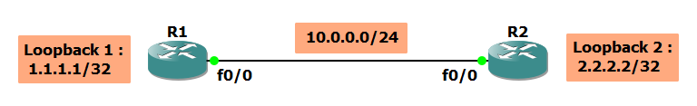
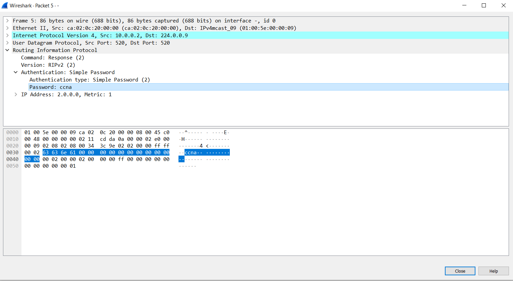
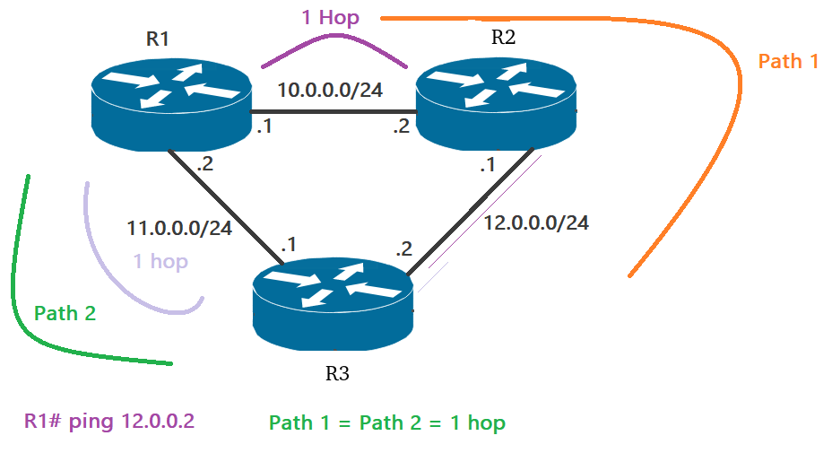
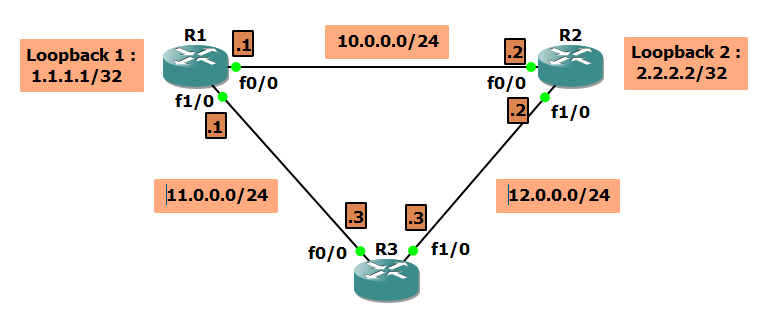

# Creating a Keychain

|Command                      |Purpose                                                     |
|-----------------------------|------------------------------------------------------------|
|`R(config)# key chain [name]`|Creates the keychain and enters keychain configuration mode |
|`R(config)#no key chain CCNA`|Removes the keychain and any keys that the keychain contains|
|`R#show key chain`           |Displays the keychain configuration                         |
|`R#show key chain CCNA`      |Displays CCNA keychain                                      |

```
R(config)# key chain CCNA
R(config-keychain-key)#?
Key-chain key configuration commands:
  accept-lifetime  Set accept lifetime of key
  default          Set a command to its defaults
  exit             Exit from key-chain key configuration mode
  key-string       Set key string
  no               Negate a command or set its defaults
  send-lifetime    Set send lifetime of key
```

### Accept lifetime

The time interval within which the device accepts the key during a key exchange with another device.

### Send lifetime

The time interval within which the device sends the key during a key exchange with another device.

**You define the send and accept lifetimes of a key using the following parameters:** `accept-lifetime [start-time] [end-time]`

  - **Start-time** : The absolute time that the lifetime begins, e.g, `00:00:00 18 Sep 2022`
  - **End-time** : The end time can be defined in one of the following ways:
     - The absolute time that the lifetime ends        
     - The number of seconds after the start time that the lifetime ends        
     - Infinite lifetime (no end-time), e.g, `accept-lifetime 00:00:00 18 Sep 2022 infinite` 
`
        
During a key send lifetime, the device sends routing update packets with the key. The device does not accept communication from other devices when the key sent is not within the accept lifetime of the key on the device.

### Default Settings for Keychain

|Parameters                 |Default                                                       |
|---------------------------|--------------------------------------------------------------|
|Keychains                  |No keychain exists by default.                                |
|Keys                       |No keys are created by default when you create a new keychain.|
|Accept lifetime            |Always valid.                                                 |
|Send lifetime              |Always valid.                                                 |
|Key-string entry encryption|Unencrypted.                                                  |

-------------------------------------------------

# RIP Authentication (Lab 2)

- **RIPv2** allows packets to be authenticated via either an insecure **plain text** password or a secure **MD5** hash based authentication.  

- For authentication to work in RIPv2, **both** the sending and receiving routers must be set to use authentication, and must be configured with the **same keys**. In RIP this is achieved by configuring a keychain in both the routers which require authentication.



Let's continue with the configurations that were made in lab 1:

### R1

```
R1(config)#key chain CCNA
R1(config-keychain)#key 1
R1(config-keychain-key)#key-string ccna

R1(config-keychain-key)#do show key chain

Key-chain CCNA:
    key 1 -- text "ccna"
        accept lifetime (always valid) - (always valid) [valid now]
        send lifetime (always valid) - (always valid) [valid now]

R1(config-keychain-key)#accept-lifetime ?
  hh:mm:ss  Time to start
  local     Specify time in local timezone

R1(config-keychain-key)#accept-lifetime 00:00:00 ?
  <1-31>  Day of the month to start
  MONTH   Month of the year to start

R1(config-keychain-key)#accept-lifetime 00:00:00 18 ?
  MONTH  Month of the year to start

R1(config-keychain-key)#accept-lifetime 00:00:00 18 Sep 2022 ?
  duration  Set key lifetime duration
  hh:mm:ss  Time to stop
  infinite  Never expires


R1(config-keychain-key)#accept-lifetime 00:00:00 18 Sep 2022 00:00:00 18 sep 2023
R1(config-keychain-key)#send-lifetime 00:00:00 18 Sep 2022 00:00:00 18 sep 2023

R1(config-keychain-key)#do show key chain

Key-chain CCNA:
    key 1 -- text "ccna"
        accept lifetime (00:00:00 UTC Sep 18 2022) - (00:00:00 UTC Sep 18 2023) [valid now]
        send lifetime (00:00:00 UTC Sep 18 2022) - (00:00:00 UTC Sep 18 2023) [valid now]
```

### Notes

> The keychain name is locally significant, meaning it doesn’t have to match on both routers. The key ID is locally significant if we use the clear text mode, but must match if we use the MD5 mode. The key string obviously must match.

> The spaces are considered as the part of the name : "CCNA" != "CCNA "

> We must synchronize the clock on both routers.

### Turn on the authentication

```
R1(config)#int f0/0
R1(config-if)#ip rip authentication key-chain CCNA
```

**Now R2 can’t see the updates from R1 as we haven’t configured the authentication on R2 yet.**

### R2

```
R2(config)#key chain CCNP
R2(config-keychain)#key 1
R2(config-keychain-key)# key-string ccna
R2(config-keychain-key)#$fetime 00:00:00 18 Sep 2022 00:00:00 18 sep 2023 --> $ : beacue the command is too long 
R2(config-keychain-key)#send-lifetime 00:00:00 18 Sep 2022 00:00:00 18 sep 2023

R2(config-keychain-key)#do show key chain

Key-chain CCNP:
    key 1 -- text "ccna"
        accept lifetime (00:00:00 UTC Sep 18 2022) - (00:00:00 UTC Sep 18 2023) [valid now]
        send lifetime (00:00:00 UTC Sep 18 2022) - (00:00:00 UTC Sep 18 2023) [valid now]
```

```
R2(config)#int f0/0
R2(config-if)#ip rip authentication key-chain CCNP
```
----------------------------------------------------

## Detecting Network with Wireshark

If we run Wireshark to capture the traffic between R1 and R2, we will see the key.



-----------------------------------------------------

## MD5 Authentication

Now we will run the more secured mode of authentication which is MD5.

### R1

```
R1(config)#int f0/0
R1(config-if)#ip rip authentication mode md5
```

Notice the following :

```
R1(config-if)#do show ip route  rip
..
..

Gateway of last resort is not set

R     2.0.0.0/8 [120/1] via 10.0.0.2, 00:01:15, FastEthernet0/0
```

As you can see the routers are losing connection because clear text authentication and MD5 authentication is not compatible with  each other.


### R2

```
R2(config)#int f0/0
R2(config-if)#ip rip authentication mode md5
```

Now the connection is back :

```
R2(config-if)#do show ip route rip
..
..

R     1.0.0.0/8 [120/1] via 10.0.0.1, 00:00:10, FastEthernet0/0

```

-------------------------------------------------------------------------------------------------
-------------------------------------------------------------------------------------------------

# RIP Equal Cost Load Balance (Lab 3)

**What if we maximize the previous lab to use three routers instead of only two routers ?**



### Topology



### R1

```
R1(config)#int f1/0
R1(config-if)#ip address 11.0.0.1 255.255.255.0
R1(config-if)#no shut

R1(config-if)#router rip
R1(config-router)#network 11.0.0.0
```

### R2

```
R2(config)#int f1/0
R2(config-if)#ip address 12.0.0.2 255.255.255.0
R2(config-if)#no shut

R2(config-if)#router rip
R2(config-router)#network 12.0.0.0
```

### R3

```
Router>en
Router#config t
Router(config)#line console 0
Router(config-line)#logging syn
Router(config-line)#hostname R3

R3(config)#int f0/0
R3(config-if)#ip address 11.0.0.3 255.255.255.0
R3(config-if)#no shut

R3(config-if)#int f1/0
R3(config-if)#ip address 12.0.0.3 255.255.255.0
R3(config-if)#no shut

R3(config-if)#router rip
R3(config-router)#version 2
R3(config-router)#no auto-summary
R3(config-router)#network 11.0.0.0
R3(config-router)#network 12.0.0.0
```

### `show ip route rip`

```
R3#show ip route rip
..
..

      1.0.0.0/32 is subnetted, 1 subnets
R        1.1.1.1 [120/1] via 11.0.0.1, 00:00:07, FastEthernet0/0
      2.0.0.0/32 is subnetted, 1 subnets
R        2.2.2.2 [120/1] via 12.0.0.2, 00:00:01, FastEthernet1/0
      10.0.0.0/24 is subnetted, 1 subnets
R        10.0.0.0 [120/1] via 12.0.0.2, 00:00:01, FastEthernet1/0    
                  [120/1] via 11.0.0.1, 00:00:07, FastEthernet0/0
```

**Notice that** R3 can see the `10.0.0.0` network using two paths, via `11.0.0.1` and via `12.0.0.2`, as there is a tie in the administrative distance which is **120**, and there is a tie also in the metric value which is **1**. This is called **Equal Cost Load Balance.**

### `traceroute`

The traceroute command is used to identify the path used by a packet to reach its target. It identifies all the routers in the path from the source host to destination host, and it can be useful when troubleshooting network problems. 

```
R3#traceroute 10.0.0.1
Type escape sequence to abort.
Tracing the route to 10.0.0.1
VRF info: (vrf in name/id, vrf out name/id)
  1 11.0.0.1 52 msec
    12.0.0.2 92 msec
    11.0.0.1 88 msec
R3#traceroute 10.0.0.1
Type escape sequence to abort.
Tracing the route to 10.0.0.1
VRF info: (vrf in name/id, vrf out name/id)
  1 12.0.0.2 68 msec
    11.0.0.1 76 msec
    12.0.0.2 80 msec
R3#
```

### Change the number of maximum path in equal cost load balance

By default, the RIP routing protocol supports **four paths** to use in equal cost load balance. But this can be changed under the RIP process.

```
R1(config)#router rip
R1(config-router)#maximum-path ?
<1-16> Number of paths
```

------------------------------------------------------------
------------------------------------------------------------