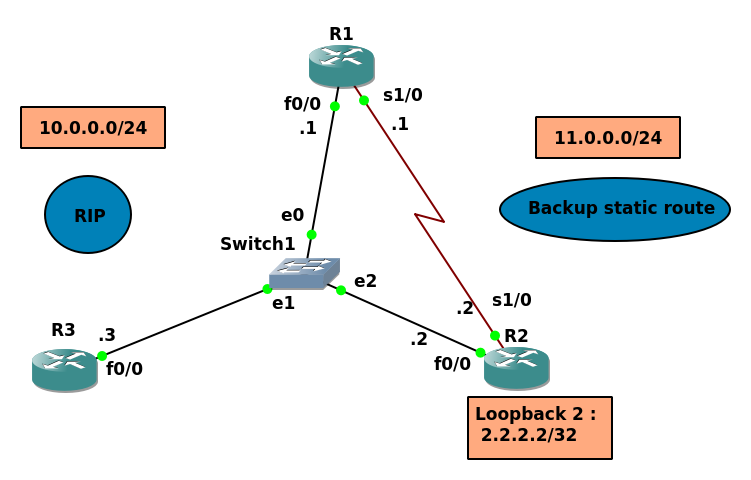

# Floating Static Route (Lab 4)

- A Floating static route is a route that has a higher administrative distance than the current route in a routing table. Think of how a router works for a second; The routes that have a lower administrative distance number will be the ones installed into the routing table whereas higher AD numbers will not.

- In this topology, we want to use network `11.0.0.0` as a backup route :



### R1

```
Router>en
Router#config t
Router(config)#line console 0
Router(config-line)#logging syn
Router(config-line)#exit
Router(config)#hostname R1

R1(config)#int f0/0
R1(config-if)#ip address 10.0.0.1 255.255.255.0
R1(config-if)#no shut

R1(config-if)#int s1/0
R1(config-if)#ip address 11.0.0.1 255.255.255.0
R1(config-if)#no shut

R1(config-if)#router rip
R1(config-router)#version 2
R1(config-router)#no auto-summary
R1(config-router)#network 10.0.0.0
```

### R2

```
Router#config t
Router(config)#line console 0
Router(config-line)#logging syn
Router(config-line)#hostname R2

R2(config)#int f0/0
R2(config-if)#ip address 10.0.0.2 255.255.255.0
R2(config-if)#no shut

R2(config-if)#int s1/0
R2(config-if)#ip address 11.0.0.2 255.255.255.0
R2(config-if)#no shut

R2(config-if)#int loop 2
R2(config-if)#ip address 2.2.2.2 255.255.255.255

R2(config-if)#router rip
R2(config-router)#network 10.0.0.0
R2(config-router)#network 2.0.0.0
R2(config-router)#version 2
R2(config-router)#no auto-summary
```

### R3
```
Router>en
Router#config t
Router(config)#line console 0
Router(config-line)#logging syn
Router(config-line)#hostname R3

R3(config)#int f0/0
R3(config-if)#ip address 10.0.0.3 255.255.255.0
R3(config-if)#no shut

R3(config-if)#router rip
R3(config-router)#version 2
R3(config-router)#no auto-summary
R3(config-router)#network 10.0.0.0
```


### `show ip route`

### R1
```
R1#show ip route
..
..
      2.0.0.0/32 is subnetted, 1 subnets
R        2.2.2.2 [120/1] via 10.0.0.2, 00:00:15, FastEthernet0/0
      10.0.0.0/8 is variably subnetted, 2 subnets, 2 masks
C        10.0.0.0/24 is directly connected, FastEthernet0/0
L        10.0.0.1/32 is directly connected, FastEthernet0/0
      11.0.0.0/8 is variably subnetted, 2 subnets, 2 masks
C        11.0.0.0/24 is directly connected, Serial1/0
L        11.0.0.1/32 is directly connected, Serial1/0
```

### R2
```
R2#show ip route
..
..

      2.0.0.0/32 is subnetted, 1 subnets
C        2.2.2.2 is directly connected, Loopback2
      10.0.0.0/8 is variably subnetted, 2 subnets, 2 masks
C        10.0.0.0/24 is directly connected, FastEthernet0/0
L        10.0.0.2/32 is directly connected, FastEthernet0/0
      11.0.0.0/8 is variably subnetted, 2 subnets, 2 masks
C        11.0.0.0/24 is directly connected, Serial1/0
L        11.0.0.2/32 is directly connected, Serial1/0

```


### R3
```
R3#show ip route
..
..

      2.0.0.0/32 is subnetted, 1 subnets
R        2.2.2.2 [120/1] via 10.0.0.2, 00:00:10, FastEthernet0/0
      10.0.0.0/8 is variably subnetted, 2 subnets, 2 masks
C        10.0.0.0/24 is directly connected, FastEthernet0/0
L        10.0.0.3/32 is directly connected, FastEthernet0/0
```

------------------------------------------------------------------------

### Backup Static Route

Now we will configure R1 to see the `2.2.2.2/32` network using static route, so we will increase the Administrative Distance value.

`R1(config)#ip route 2.2.2.2 255.255.255.255 11.0.0.2 121`

### `show ip route`

```
R1(config)#do show ip route
..
..

      2.0.0.0/32 is subnetted, 1 subnets
R        2.2.2.2 [120/1] via 10.0.0.2, 00:00:23, FastEthernet0/0
      10.0.0.0/8 is variably subnetted, 2 subnets, 2 masks
C        10.0.0.0/24 is directly connected, FastEthernet0/0
L        10.0.0.1/32 is directly connected, FastEthernet0/0
      11.0.0.0/8 is variably subnetted, 2 subnets, 2 masks
C        11.0.0.0/24 is directly connected, Serial1/0
L        11.0.0.1/32 is directly connected, Serial1/0
```

R1 sees the 2.2.2.2/32 using RIP as it has a lower Administrative Distance.


```
R1(config)#int f0/0
R1(config-if)#shutdown
```

Immediately R1 changes its path to reach the 2.2.2.2/32 network using the static route.


```
R1(config-if)#do show ip route
..
..

      2.0.0.0/32 is subnetted, 1 subnets
S        2.2.2.2 [121/0] via 11.0.0.2
      11.0.0.0/8 is variably subnetted, 2 subnets, 2 masks
C        11.0.0.0/24 is directly connected, Serial1/0
L        11.0.0.1/32 is directly connected, Serial1/0
```


When the interface f0/0 comes up again it will use it to reach the `2.2.2.2/32` network.

```
R1(config-if)#int f0/0
R1(config-if)#no shutdown
```


```
R1(config-if)#do show ip route
..
..

      2.0.0.0/32 is subnetted, 1 subnets
R        2.2.2.2 [120/1] via 10.0.0.2, 00:00:28, FastEthernet0/0
      10.0.0.0/8 is variably subnetted, 2 subnets, 2 masks
C        10.0.0.0/24 is directly connected, FastEthernet0/0
L        10.0.0.1/32 is directly connected, FastEthernet0/0
      11.0.0.0/8 is variably subnetted, 2 subnets, 2 masks
C        11.0.0.0/24 is directly connected, Serial1/0
L        11.0.0.1/32 is directly connected, Serial1/0

```

### `traceroute`

```
R1(config-if)#do traceroute 2.2.2.2
Type escape sequence to abort.
Tracing the route to 2.2.2.2
VRF info: (vrf in name/id, vrf out name/id)
  1 10.0.0.2 16 msec 8 msec 12 msec
R1(config-if)#
```

[Another Example](https://networklessons.com/cisco/ccna-routing-switching-icnd1-100-105/floating-static-route)

------------------------------------------------------
------------------------------------------------------