#  RIP (Routing Information Protocol)

- RIP is an **intra-domain** routing protocol used **within** an autonomous system.

- It is a dynamic routing protocol that uses hop count as a routing metric to find the best path between the source and the destination network.

- It is a distance-vector routing protocol that has an **AD value of 120** and works on the **Network layer** of the OSI model. 

- RIP uses the **UDP**, and is assigned the reserved port number **520**. 

- **RIP versions :** 
  - RIP Version1
  - RIP Version2
  - RIPng

-----------------------------------------

# RIP Metric Value

 - It uses hop count as the metric.
  
 - The largest number of hops allowed for RIP is 15, which limits dramatically the size of networks that RIP can support.
 
 - The hop count 0 denotes a network that is directly connected to the router. 16 hops denote a network that is unreachable, according to the RIP hop limit. 

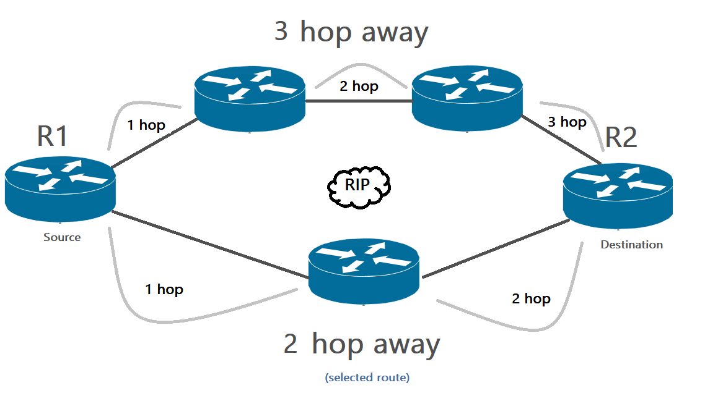

> In the example above you can see the problem of using hop counts as a routing metric. Imagine if the down path was the 56 kbps, while the other path is a high speed WAN link. R1 would still chose the down path as the best route, because RIP uses only the hop count as its metric.

**What will happen if the metric is the same? the router will use all possible paths and load balance over them.** 

## Equal cost load balancing

 - Load balancing is a concept that allows a router to take advantage of multiple best paths to a given destination.

- **RIP load balancing**
   - RIP will load balance on all paths with same metric, the default setting (depending on your Cisco IOS version) is 4. You can change this with the maximum-paths command. 
   - The minimum is 1, which disables load balancing. The maximum value will depend on your IOS version. 
   
   - When you set it to 1, RIP prefers to use the first entry that it has installed in its routing table.

---------------------------------------------------------

# How does the RIP work?

We have three routers, and we are running a distance vector routing protocol (RIP). As we start our routers they build a routing table by default but the only thing they know are their directly connected interfaces.

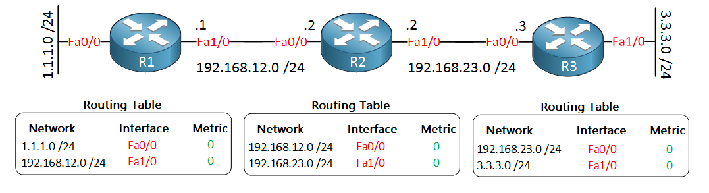

When you enable distance vector routing, what will happen is that our routers will copy their routing table to their directly connected neighbor. R1 will copy its routing table to R2. R2 will copy its routing table to R3 and the other way around.

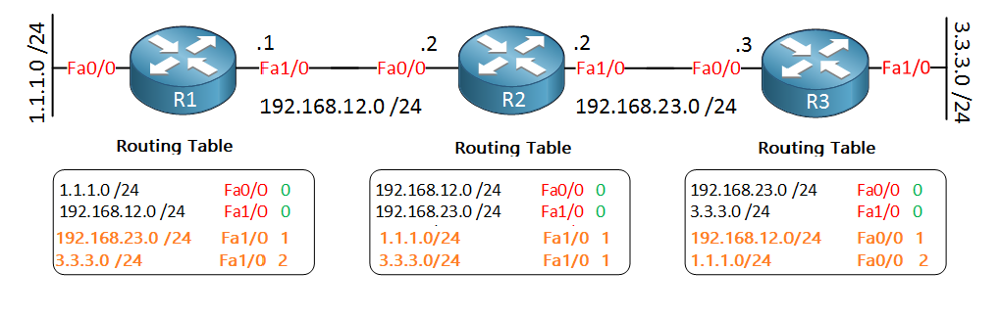

> Each router broadcasts its entire routing table to its neighbors (which a router is connected directly) every 30 seconds. 

**Snapshot to what's happening in the background:**

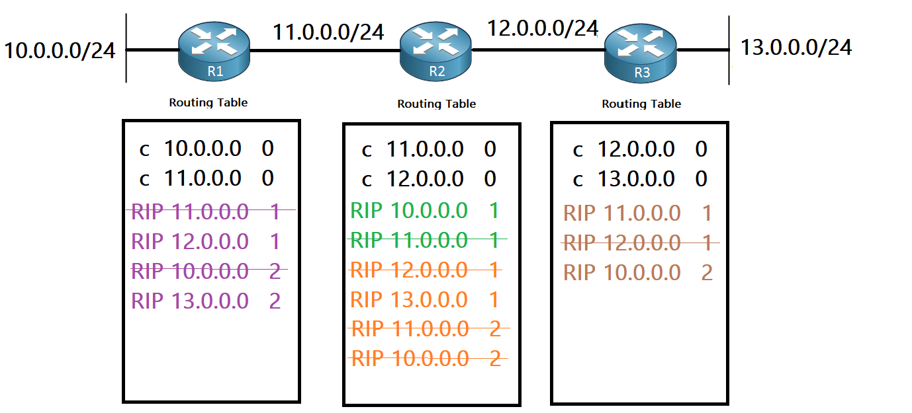

----------------------------------------------

# RIP Packets

- **By default**, a RIP packet contains **25 routes** (25 network entries).

- A router running RIP with 100 routes would send a 4 updates packets every period. Imagine if a routing table had 10000 routes. Four hundred updates would be sent every 30 seconds!

-------------------------------------------------------------------

# RIP Timers

RIP uses four different types of timers:

- **Update timer(30s):** 

   - RIP uses this timer to set the interval between two continuous routing updates. The default value of this timer is 30 seconds. After advertising a routing update, RIP waits 30 seconds before advertising the next routing update.

- **Route invalid timer(180s):** 

   - The invalid timer specifies how long a routing entry can be in the routing table without being updated. This is also called as **expiration timer**.

   - RIP learns new routes from the received routing update. After learning new routes, when RIP adds them to the routing table, it also adds an invalid timer with each route. RIP uses this timer to get rid of routes that become invalid in the future.

   - In upcoming routing updates, if RIP receives the same information on a route, it resets the invalid timer of that route in the routing table. If RIP does not receive the same information on a route in 180 seconds, it assumes that the route is no longer available. When this happens, RIP sends an update to all its neighbors to indicate that the route is invalid or unreachable. However, the route still forwards packets until the **flush interval expires.**

- **Route flush timer (240s):** 

   - The flush timer controls the time between the route is marked as **unreachable** and **removal** of entry from the routing table. By default, the value is 240 seconds. This is **60 seconds longer than Invalid timer**. So for 60 seconds the router will be advertising about this **unreachable route** to all its neighbors.
   
   -  The value of this timer must be set higher than the value of the invalid timer. This gives the RIP enough time to tell its neighbors about an invalid route before the invalid route is removed from the routing table.

- **Hold-down timer (180s):**

   - RIP uses this timer to quickly identify invalid routes. When RIP receives a routing update that contains information about an **invalid route**, the RIP **immediately** starts the hold-down timer for that route in the routing table. The default value of the hold timer is 180 seconds.

   - RIP stops and removes this timer from an invalid route only if it receives a routing update that contains a better routing metric for the invalid route. If RIP does not receive a better metric for the invalid route until the hold-down timer expires, RIP advertises the invalid route to its neighbors till the flush timer expires. The invalid route will be removed, once the **flush timer is expired**.

   - Both the root invalid-route timer and hold-down timer work similarly except how they are triggered. An **invalid-route timer** of the route is triggered when RIP **does not receive a routing update** for that route until 180 seconds. The **hold-down timer** of a route is triggered when RIP **receives a routing update** that indicates that the route has become **invalid**.

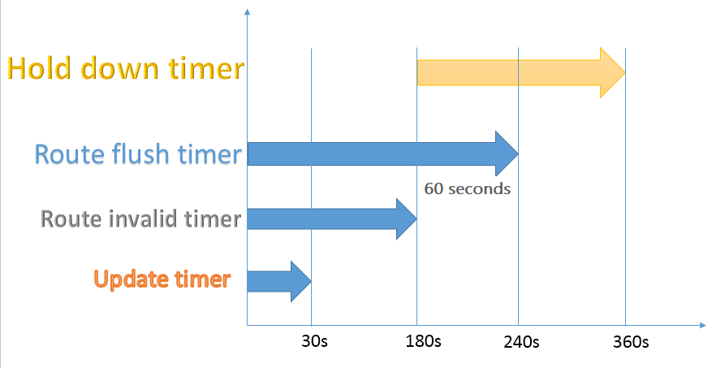

----------------------------------------------

# A Distance Vector Routing(DVR) 

- A DVR requires that a router informs its neighbors of topology changes periodically. 

- The main issue with Distance Vector Routing protocols is **Routing Loops** since **Bellman-Ford Algorithm** cannot prevent loops. 

# Count to Infinity Problem in Routing

- The Count to Infinity problem arises from the routing loop in this DVR network. Such Routing Loops usually occur when 2 routers send an update together at the same time or when an interface goes down.

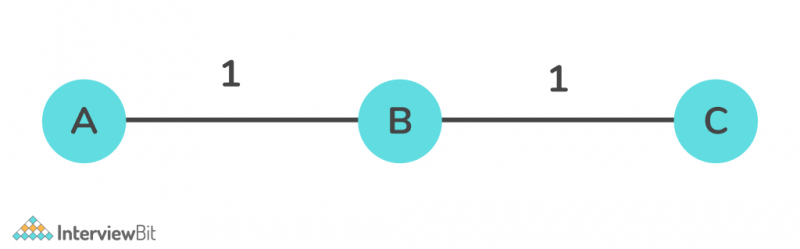

Consider the above diagram, for this setup, the Bellman-Ford algorithm will work such that for each router, they will have entries for each other. Router A will infer that it can reach B at a cost of 1 unit, and B will infer that it can reach C at a cost of 1 unit.

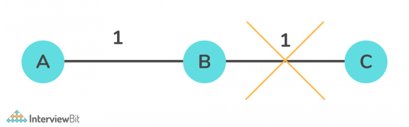

Consider the case in the above diagram, where the connection between B and C gets disconnected. In this case, B will know that it cannot get to C at a cost of 1 anymore and update its table accordingly. However, it can be possible that A sends some information to B that it is possible to reach C from A at a cost of 2. Then, since B can reach A at a cost of 1, B will erroneously update its table that it can reach C via A at a cost of 1 + 2 = 3 units. A will then receive updates from B and update its costs to 4, and so on. Thus, the process enters into a loop of bad feedback and the cost shoots towards infinity.

# Solution for the Count to Infinity Problem

## TTL (Time to Live)

For example, say Router 1 has a network route to 192.168.1.0 via Router 2. Router 2 has a route to the same network, but it is back through Router 1. Therefore, Router 1 sends packets for 192.168.1.0 to Router 2, which then sends the packets back to Router 1. This looping continues until the TTL on the packet expires.

## Route Poisoning

- Route Poisoning is a method used to prevent routers from sending packets through a route that has been become unreachable. 

- Upon failure of a route, Distance Vector Protocols spread the bad news about the route failure by poisoning the route using a special metric value called Infinity . 

**Infinity metric**
  
   -  When a route becomes unreachable, instead of removing that route from the routing table, the router changes the metric value of that route to infinite. A route with an infinite metric value is equal to a deleted route. If the metric value of a route is set to infinite, the router never uses that route for the routing.

  - The infinity metric value is routing protocol specific. Different routing protocols use different infinity metric values. 
     - **RIP** routing protocol uses the value 16 as infinity. In an RIP running network, if the value of a route is set to 16, the route will be considered as an unreachable or a down route.

- Route Poisoning is used in combination with Poison Reverse and Triggered Update. 

   - **Triggered update:** When a route fails, do not wait for the next periodic update.  Instead, send an immediate triggered update listing the poisoned route.

   - **Poison reverse:** When a route poisoning is received, return a poison reverse. (You can consider it as an acknowledgement)
      
## Split Horizon

- Split-horizon feature states that if a router receives a route from its neighboring router, it will not propagate the received route back to the neighboring router on the same interface.

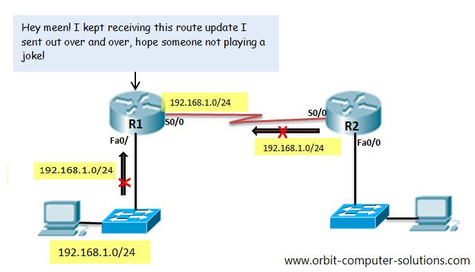

- Split horizon is enabled by default on most interfaces. 

- **Split horizon can’t prevent routing loops involving three or more routers, but it’s effective at preventing loops between two routers.**

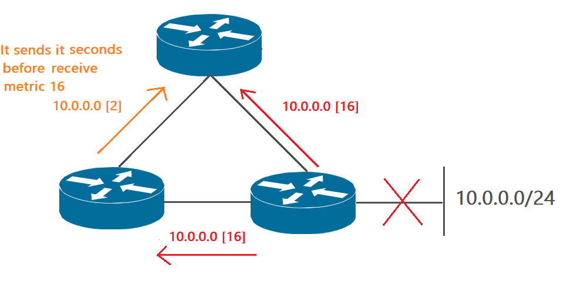

> We can use Split Horizon along with Route Poisoning, combined effectively, to achieve efficiency and reduce the rate of increase in the size of routing announcements.

## Hold-down Timer

- This feature prevents a router from learning new information about a failed route. When a router receives updated information about an unreachable route, a hold-down timer is instantly started.

- The router overlooks all routing updates for that route until the timer expires (180 seconds is the default for RIP).

- The only routing updates permitted during that period are updates sent from the router that initially advertised the route. If R1 router advertises the update, the hold-down timer is stopped and the routing information is processed.

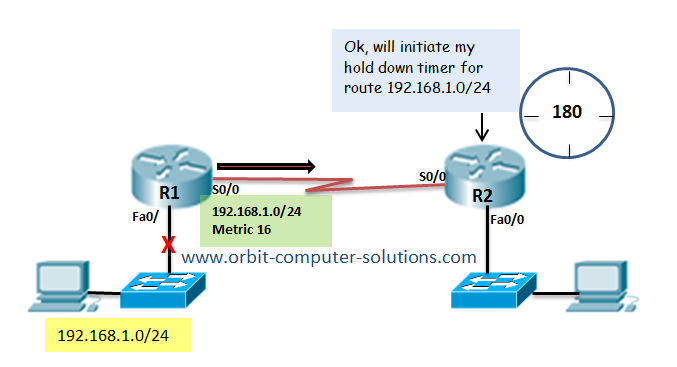

The hold-down time starts by R2 after it received a failed (unreachable) route update advertisement from R1.

During that time all updates from any other routers about that route are ignored to prevent routing loops.

If interface Fa0/1 on R1 comes back up, R1 will advertise the route once more.

The R2 process that updates even while the hold-down timer is still running, because the update is sent by the same router that originally advertised the route.

-------------------------------------------------------------------------------

## RIP Route Poisoning

RIP will advertise the failed destination out ALL of its interfaces with a metric of 16 (which is considered unreachable); this tells all of its neighbors that it no longer has a route to that specific network.

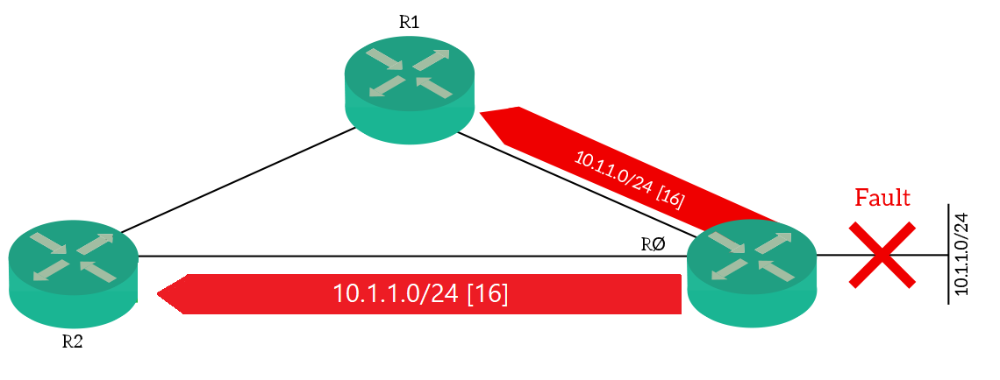

----------------------------------------------------------

# RIP Version 1

- When starting up, and every 30 seconds thereafter, a router with RIPv1 implementation **broadcasts** to 255.255.255.255 a request message through every RIPv1 enabled interface. 

- RIPv1 uses Broadcast. It means all the devices in the same network will receive RIP packet, so every PC will process this packet then drop it. 

# RIP Version 2

-  RIPv2 **multicasts** the entire routing table every 30 seconds to all adjacent routers at the address **224.0.0.9**. Multicast communication reduces the burden on the network devices that do not need to listen to RIP updates.

> 224.0.0.9 --> All RIPv2 routers 

# RIPv1 vs RIPv2

|PARAMETER                            | RIP v1 and RIP v2 similarity |
|-------------------------------------|------------------------------|
|Routing protocol                     |Distance vector               | 
|Routing algorithm                    |Bellman-Ford                  |
|Protocol                             |UDP port 520                  |
|Metric                               |Hop count                     |
|Hop count limit                      | 15                           |
|Administrative Distance              | 120                          |
|Routing Entries in RIP Update packet | 25                           |
|Paths to be load balanced            | 4 by default and 6 maximum (depending on your Cisco IOS version)           |   
|Timers                               |Update → 30    Invalid → 180    Hold down → 180    Flush → 240  |
|Manual route summarization           |Support manual route summarization.                                         |   

|PARAMETER                  |RIPv1                                  |RIPv2                                                       |
|---------------------------|---------------------------------------|------------------------------------------------------------|
|Routing                    | Classful                              | Classless                                                  |
|Routing update address     | Broadcast (255.255.255.255)           |Multicast (224.0.0.9)                                       |
|Subnet mask|Doesn't send subnet mask information with routing update| Sends subnet mask information with routing update         |
|VLSM                       |Not Supported                          | Supported                                                  |
|CIDR                       |Not Supported                          | Supported                                                  |
|Authentication             |Not Supported                          | Supported                                                  |

------------------------------------------------------------------------------------

# RIP Authentication

If you don’t use authentication, and you are running RIP someone could try to form an RIP neighbor adjacency with one of your routers and try to mess with your network… You don’t want that to happen right?

For example, an operator may assign an existing **Network IP address** to a router. When the misconfigured device is then connected to the network, it creates an **Netowrk conflict**. When this occurs, both routers end up not being able to connect to the network.

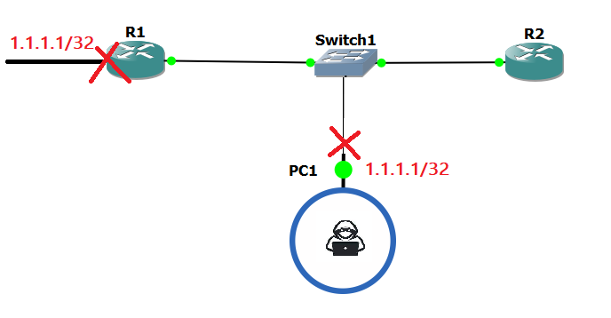

## Key Chain

- The authentication key chain functionality provides a mechanism for storing a number of different keys for authentication. The main advantage of key chain authentication is that we can change the authentication keys periodically, without causing any network interruption

- Every key has an index number and a key string value that is associated it. Key string value associated with a key can be considered as the password for that key.

- Each key has a life time mentioned to indicate when that key is valid. The life time of the keys are defined as “send-lifetime” and “accept-lifetime” values.

- **Very Important**: All the Routers running RIPv2 must have the same Date/Time settings for RIPv2 key chain authentication to work properly. It is very difficult to configure all the routers manually to have same date/time settings. This can be achieved by using time synchronization protocol Network Time Protocol (NTP).

- The Network Time Protocol (NTP) is used to synchronize the date/time settings of different routers which are running RIPv2 from a Network Time Server.

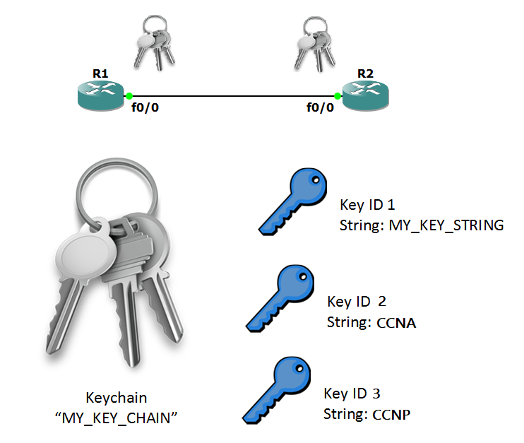

