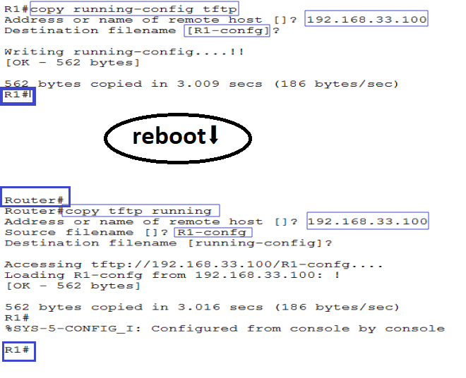
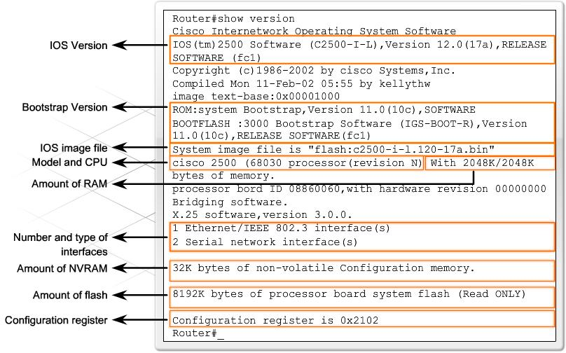

# The basic components of any Cisco router 

- The Processor (CPU)
- IOS (Internetwork Operating System)
- ROM (Read Only Memory)
- RAM (Random Access Memory)
- Flash Memory
- NVRAM (Non-volatile RAM)
- Configuration Register
- Interfaces

# CPU

CPU is hardware that carries out the instructions of the OS to perform routing and switching.

# IOS

- The IOS is the main operating system on which the router runs. The IOS is loaded upon the router's bootup. It usually is around 2 to 5MB in size, but can be a lot larger depending on the router series.

- The IOS is compressed.
 
  ```
   Self decompressing the image :
  ##################################################
  ###################################################################
  ###############################################
  [OK]
  ```

# ROM 

- The ROM is used to start and maintain the router. It contains some code, like the **Bootstrap and POST**, which helps the router do some basic tests and bootup when it's powered on or reloaded. 

- You cannot alter any of the code in this memory as it has been set from the factory and is Read Only.
 
- ROM stores the following:

    - **Bootstrap Loader :** It used to bring a router up during the initialization.
    - **Power-on self-test (POST)** : It is used to check the basic functionality of the router hardware, and it determines which interfaces are present. 
    - **The RXBoot image** : It is nothing more than a "cut-down" version of the IOS. If you had no Flash card to load the IOS from, you can configure the router to load the RXBoot image.    
   
# RAM 

- The RAM is hardware allow to the router to loads the IOS and the configuration file. 

- Cisco routers use a fast type of RAM called **synchronous dynamic random access memory (SDRAM)**.  As we know that it is a **volatile memory** and requires power to keep the data accessible. **If the router turned off, all data in RAM has lost**.

- RAM has offered the following main function:

    - Store routing table
    - Running IOS
    - Store ARP Table
    - Store running configuration file

- The amount of RAM your router requires **subject to the size of the IOS image and configuration file in the router**. The smaller routers (up to the 1600 series) are likely working with 12 to 16 MB while the bigger routers with larger IOS images would require around 32 to 64 MB of memory. Routing tables are also stored in the system's RAM so if you have large and complex routing tables, you will obviously need more RAM ! 

# Flash Memory

- It is the non-volatile memory and it is permanent storage for the **IOS** and other systems related files. It fits into a special slot normally at the back of the router and has nothing more than the IOS image. Usually, it comes in sizes of 4MB for the smaller routers and goes up from there depending on the router model.

- The IOS has copied from flash to RAM during router boot process. 

# NVRAM 

- The NVRAM is a special memory place where the router holds its **configuration**. When you configure a router and then save the configuration, it is stored in the NVRAM. 

- This memory is not big at all when compared with the system's RAM. On a Cisco 1600 series, it is only 8 KB while on bigger routers, like the 2600 series, it is 32 KB. 

- Normally, when a router starts up, after it loads the IOS image it will look into the NVRAM and load the configuration file in order to configure the router. **The NVRAM is not erased when the router is reloaded or even switched off**.


# Configuration Register

- The Configuration Register determines if the router is going to boot the IOS image from its Flash, TFTP server or just load the RXBoot image. 

- This register is a **16 Bit** register. A sample of it in Hex would be the following: `0x2102` and in binary is: `0010 0001 0000 0010`.

- It can be used to change router behavior in several ways, such as how the router boots, options while booting and the console speed.


# IOS Booting Sequence


<!-- <p align="center">
  
</p> -->


# Interfaces 
 
- These allow us to use the router ! The interfaces are the various serial ports or ethernet ports which we use to connect the router to our LAN.

- **Types of Interfaces**

   - **Console (RJ-45)**: It is for locally connecting to a device, meaning you need to be physically beside the device with a console cable from the port to your laptop.

   - **Aux port (RJ-45):** This auxiliary port is used to connect a modem to the router.

   - **Serial (RS-232):** Typically it's used for the **WAN** connection (connect routers together), e.g,**Frame Relay**.

   - **Ethernet/Fast Ethernet/Gigabit Ethernet (RJ-45):** Standard network interfaces used to connect different network segments **(LAN)**.

   - **WAN Interface Card (WIC) port:** Because a wide variety of WAN connectivity options are available, you can use this port to add different interfaces to a standard router.

   - **Hardware WAN Interface Card (HWIC) port:** With the integration of services into routers, the WIC interface became too limiting. The HWIC interface was created to support a wider variety of hardware expansion options, such as switches and service cards. This port is **backward compatible** with most older WIC hardware.


--------------------------------------------------------

# Interface Numbering

### Fixed Ports

- Older Cisco routers, such as the Cisco 2500, use a fixed port numbering scheme: 
   -  Each built-in port was hard-wired with a port number. 
   -  Numbering starts with 0, and is assigned from **right to left**.
   
 - Examples:
     -  Serial0 
     -  Serial1  
     -  Ethernet0 


### Interface Card Slot/Port Numbering `(Slot/Port)`

> **Built-in ports** and **built-in WIC slots** are given **NM slot number 0**. 

- Newer Cisco routers, such as the Cisco 2600, support **WAN Interface Cards (WIC)** and **Network Modules (NM)** with various ports. Some NM include slots for WIC. 

- In the Slot/Port numbering scheme:

  - The **Slot** numbering is assigned from **right to left and bottom to top**, starting with 0.
    
  - The **port numbers** start with 0 and are assigned from **right to left and bottom to top for each NM slot**.

- **Examples:**

     - FastEthernet3/4 (3rd NM slot/5th FastEthernet port)
     - FastEthernet0/3 (built-in/4th FastEthernet port)

     - Serial2/3 (2nd NM slot/4th serial port)
     - Serial1/5 (1st NM slot/6th serial port)
     - Serial0/2 (built-in or 1st WIC slot/3rd serial port)

### NM Slot/Interface Card Slot/Port Numbering `(Slot/Subslot/Port)`

- The newest Cisco routers, such as the Cisco 1800/2800/3800, use an enhanced slot/port numbering scheme to identify the **WIC sub-slot**.  

- In the Slot/Sub-slot/Port numbering scheme:
 
  - **Built-in WIC ports** are numbered using a **slot of 0** and a **sub-slot** that is the **WIC slot number**.
  - **WIC ports on a NM slot** are numbered using the **NM slot number** and the **WIC's sub-slot number on the NM**.
  - **Ports** (other than those of a WIC) use the **slot/port** numbering scheme.

- **Examples:**

    - FastEthernet2/1/0 (2nd NM slot/2nd WIC sub-slot/1st FastEthernet port)
    - FastEthernet0/0/0 (built-in/1st WIC sub-slot/1st FastEthernet port)
    - FastEthernet0/1/3 (built-in/2nd WIC sub-slot/4th FastEthernet port)

    - Serial4/1/1 (4th NM slot/2nd WIC sub-slot/2nd Serial port)
    - Serial0/1/0 (built-in/2nd WIC sub-slot/1st Serial port)


    - Ethernet1/0 (1st NM slot/1st Ethernet port)
    - FastEthernet0/1 (built-in/2nd FastEthernet port)


 

> Note that the image above it's just an example.


**Notes**

> NM : It's a big module that can hold a variaty of ports and also some NM modules have space and connectors for WIC cards.

> WIC/HWIC smaller cards that can be inserted in a router or in some NM card.

> \<interface-name\> **slot/port** is used whenever the interfaces are native on the network module.
> \<interface-name\> **slot/subslot/port** is used whenever the interfaces are on the WIC slot of a network module (NM).


------------------------------

# Back up and Restore Configuration Files


## Copy Command

It allows you to copy system images and configuration files. You can copy files within the router’s memory, or you can copy files to or from a TFTP server.

**Syntax:** `copy [source] [destination]`


|Sources and destinations |                     Meaning                               |
|-------------------------|-----------------------------------------------------------|
|running-config           |The currently running configuration                        |
|startup-config           |The configuration that will be loaded when the router boots|
|tftp                     | An external TFTP server                                   |
|ftp                      |An external FTP server                                     |
|flash                    |The router’s flash filesystem                              |


**Use a TFTP Server to Backup and Restore a Configuration**



--------------------------

# Show Version Command

Displays information about the router’s internal components, including the IOS version, memory, configuration register information, etc.

`Router#show version`


