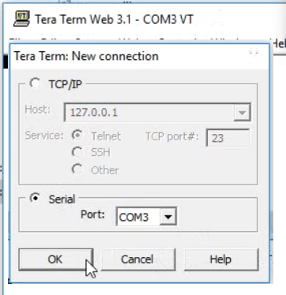
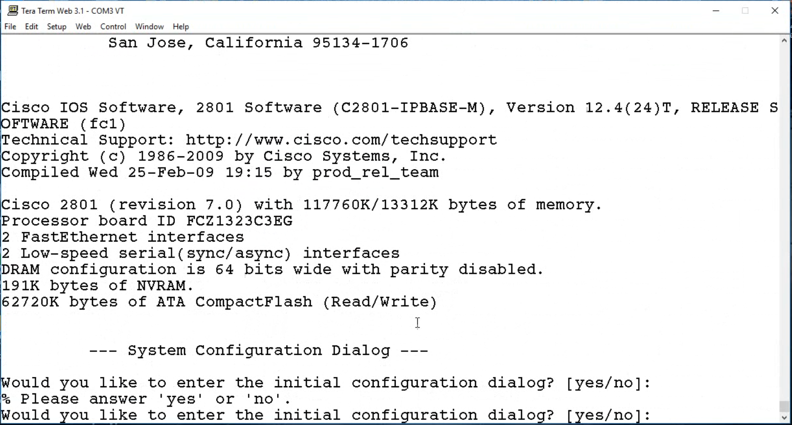
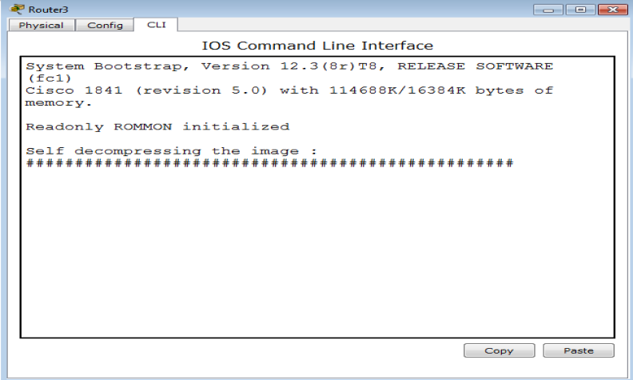
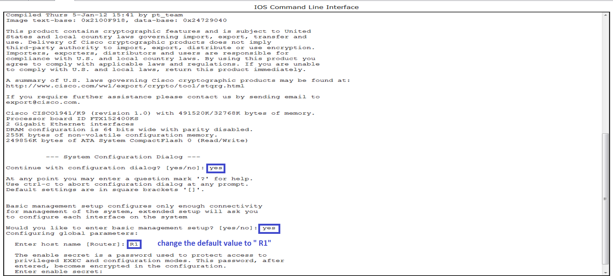
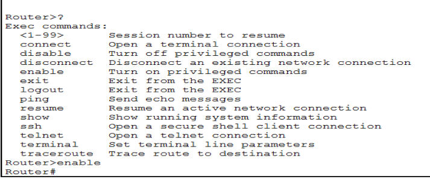
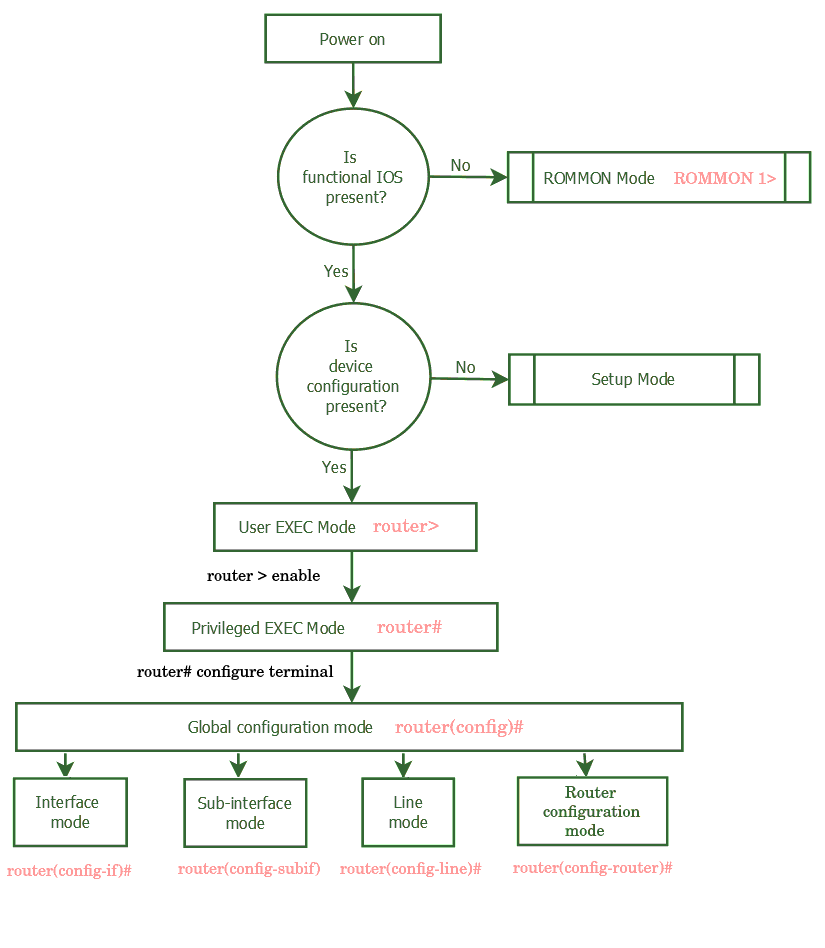
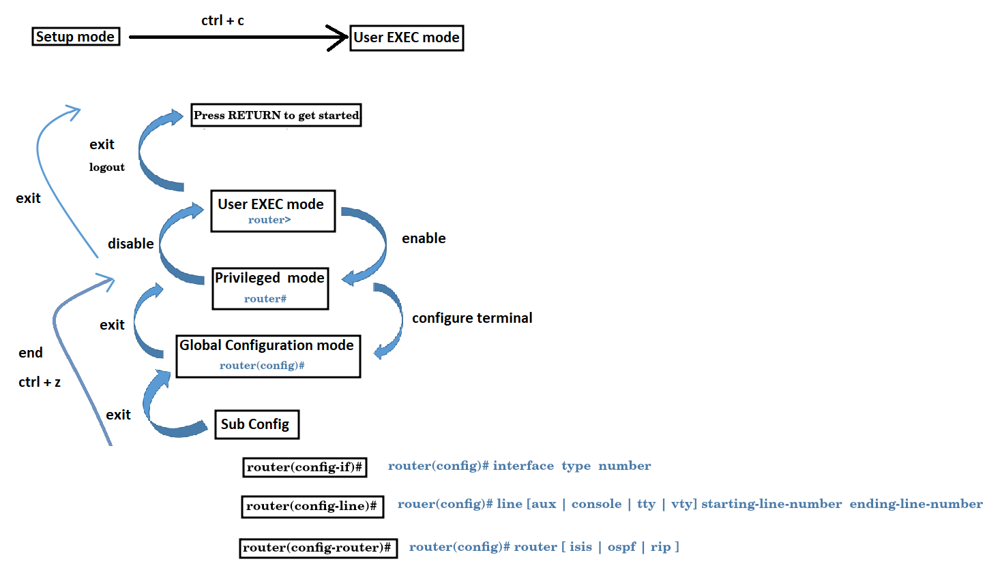

# How to Connect to Cisco Device?

- To connect to Cisco dvice, and setup initial configuration, use a **rollover cable**. 

- Connect the serial port of **console cable** to your serial port on your laptop or PC, and the other end of the cable (RJ45) connect to the console port on the Cisco device.

- For connection, use a communication utility – terminal emulation program like **HyperTerminal** if using Windows, or **Minicom** if using Linux. Also you can use programs like **Putty, Tera Term** or some other application that supports terminal emulation and local serial line connection.





> COM (communication port) is the original, yet still common, name of the serial port interface on PC-compatible computers.

----------------------------------------------------------------------

### GUI and CLI are the mainstream interface for accessing network device.

- **GUI** is short for **Graphical User Interface** – it uses graphics like windows, scrollbars, buttons, etc.

- **CLI** stands for **Command Line Interface**, which allows users to write commands in a terminal or console window to communicate with an operating system. 

---------------------------------------------------------------

# Cisco IOS Modes

- An IOS mode is also known as the **IOS access mode** or the **IOS commands mode.**

- An IOS mode is a **group of commands** that are used to configure similar features or to control a particular area of the device. 

- The CLI is an interface where a user gives the command to interact with a computer program. **Cisco uses CLI** to configure, troubleshoot and maintain the routers and switches.

- **Each mode** on Cisco Router and Switch **has specific commands** that are used in that particular mode. 

### There are five IOS modes:

<b>
	
- Setup Mode
	
- User EXEC Mode

- Privileged (Enable) Mode

- Global Configuration Mode :
	
   - Submodes :
	  
	  - Interface Mode
	 
	  - Subinterface Mode
	 
	  - Line Mode
	 
	  - Router Configuration Mode
	 
- ROM Monitor Mode
	
</b> 

-----------------------------------------------

# Setup Mode

- When we power-on the IOS operated device, the IOS looks for the device configuration. If it does not find a valid configuration, it places the user in this mode.   

- The setup mode is a **step-by-step process** which helps you configure the **initial** device configuration. 

- This mode presents a text-based wizard that asks questions about initial settings in the sequence. Based on the answers provided by the user, the IOS automatically builds the initial configuration.

- It should be noted that when you are prompted to enter a value at the console prompt, whatever is between the square brackets `[ ]` is considered to be a **default** value. In other words, if you hit enter without entering anything, the value in those brackets will be set for the specific question.

**How to deal with its prompts?**
 
  - `[yes/no] :` y  → yes
  - `[yes/no] :` n  → no
  - `[yes] :` yes   → yes
  - `[yes] :` enter → yes
  - `[yes] :` n → no

### DETAILED STEPS

- Step 1 : Power on the device.

- Step 2 : Enter yes at the prompt to enter the initial configuration dialogue.

  If the following messages appear at the end of the startup sequence, the **System Configuration Dialog** was invoked automatically:

  ```
  --- System Configuration Dialog ---
  Would you like to enter the initial configuration dialog? [yes/no]: yes

  ```
  The screen displays the following:

  ```
  --- System Configuration Dialog ---
  Continue with configuration dialog? [yes/no]: 

  ```


- Step 3 : If you are prompted to continue with the configuration dialogue, enter yes at the prompt to continue the dialog (this step might not appear).

  ```
  Continue with configuration dialog? [yes/no]: yes 
  ```





-----------------------------------------------

# User Execution Mode `router>`
  
 - This is the first mode of the IOS. If configured, the IOS prompts the user to enter the password to access this mode.
 
 - This mode has **very limited commands** that allow the user to view statistics and perform basic troubleshooting. 
 
 - This mode **does not** allow the user to change any of the settings.
 
 - This mode is the starting (or entry) point of the IOS. Other modes of the IOS can only be accessed through this mode.
 
 
 
 - `?`:	Show the available commands in this mode.
 ------------------------------------
 
# Privileged Mode `router#`

- Since the `enable` command is used to access this mode, this mode is also known as the **enable mode.**
  
 
- As the name suggests, this mode includes privileged or powerful commands. This mode is usually used for the following purposes: 
      
    - To view, save and erase **device configuration**
    - To take the **backup** of the **current device configuration**
    - To **restore** the configuration from backup
    - To **install** a new IOS image file
    - To **debug** or troubleshoot the device
    - To **restart** or reload the device

- Although this mode allows the user to manage device configuration and IOS image files, it does not allow the user to change the device configuration. **A user can change device configuration only from the configuration mode.**
  
 --------------------------------
 
# Global Configuration Mode `router(config)#`

- This mode includes the commands that are used to configure the device. 

- From this mode, a user can not only configure new settings but can also change, update or delete existing settings.

- Of all available modes, this mode has the **largest number of commands**. To organize these commands more effectively, this mode groups similar commands into sub-configuration modes.

- **Submodes** :

     - **Interface mode** (Router physical interface configuration mode) `Router(config-if)#`
      
     - **Subinterface mode** (Router sub-interface configuration mode) `Router(config-subif)#`
      
     - **Line mode** (Router line configuration mode - console, vty etc.) `Router(config-line)#`
      
     - **Router configuration mode** (Routing protocols configuration mode.) `Router(config-router)# `

---------------------------------------------

# ROMMON Mode `ROMMON 1>`

- During the boot process, the IOS image file is loaded into the RAM. If the **IOS image** file is **missing or corrupt**, the device **automatically** enters this mode. This mode allows the user to troubleshoot the IOS.

- We can even enter ROM monitor mode **manually** when we interrupt the boot process of the router.

- In this mode, the user can select a different IOS image file to boot the device or load a new IOS image file from the **TFTP server**.

- Generally, we enter this mode while the **password recovery** process or **backing up** of IOS on devices like TFTP server. It is like the **BIOS mode** of a PC. 
  
--------------------------------------------

**The following image shows how all IOS modes work together :**
   


--------------------------------

# IOS Navigation

|Modes                    |	Access Method        |	Prompt	       |Exit Method          |
|-------------------------|----------------------|-----------------|---------------------|
|User execution mode      |	login	               |`router>`	       | `exit` <br> `logout`|
|Privilege mode	          | `enable`             |`router#`        |`disable` <br> `exit`|
|Global configuration mode| `configure terminal` |`router(config)#`| `exit`              |
|ROMMON mode              |Press `ctrl+break` key while boot process <br> or use `reload` command in privilege mode then press `ctrl+break`.| `ROMMON 1>` |`reset`|




--------------------------------------------------------
--------------------------------------------------------