# Router Passwords

# Line Command

It specifies which line or group of lines you want to configure by entering the line configuration mode.

**Syntax:** `line [aux | console | tty | vty] starting-line-number ending-line-number`

- `line aux 0` : The auxiliary port is used for out-of-band configuration of your router/switch, which is typically accomplished via a **modem**. 

- `line console 0` : This is the physical console port on the switch/router in which you can configure/troubleshoot the device.

- `line tty 5 10`: It is a physically connected one, via the serial/console port.

- `line vty 0 4` : VTY is a virtually connected one, via telnet or SSH.
 
**Example:** `Router(config)#line console 0` ⇾ Select the console line

If you want to apply line commands to more than one line, you can specify the starting and ending numbers of a group of lines. 
**For example,** say you want to apply the command `exec-timeout` to TTY lines 5 through 10. Instead of typing this command five times, you can configure the entire group with one line command:

```
Router(config)#line tty 5 10
Router(config-line)#exec-timeout 30 0
```

- **By default**, an IOS device will disconnect a console or VTY user after **10 minutes** of inactivity. You can specify a different inactivity timer using the `exec-timeout MINUTES SECONDS` line mode command.

[Read More](https://www.oreilly.com/library/view/cisco-ios-in/0596008694/ch04.html)

--------------------------------------

# Configuring Passwords

We have 5 passwords :

  - **1.** Console Password
  - **2.** Enable Password
  - **3.** Secret Password
  - **4.** Aux Password
  - **5.** Telnet Password


## Console Password

It is used to set the **console port** password, if no password has been set on the router’s console, by default, the user can use the access user mode. It is crucial to set a console port password as it defends against someone from connecting, physically moving up to the router, or gaining access to user mode, and much more. As the routers have **only one** console port, the user needs to use the command `line console 0` in the global config mode.

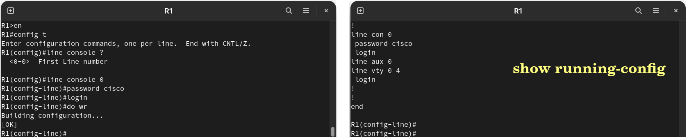

<center> 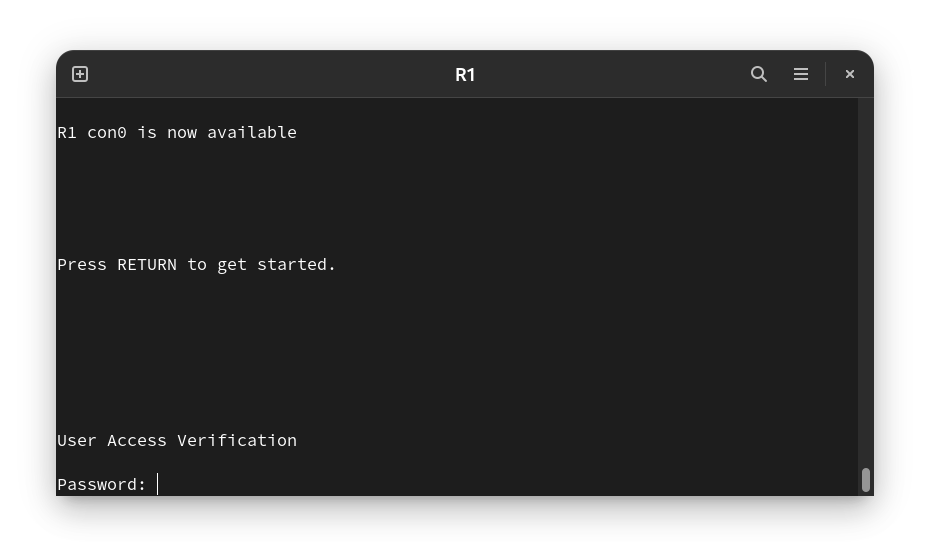 </center>

- `R1#write memory`	: Saves the running configuration as the startup configuration.
- `R1(config-line)# do wr` : Doing the do Command provides the convenience of entering EXEC-level commands without needing to exit the current configuration mode.

> Cisco IOS provides some abbreviation commands to speed user interaction, e.g.: user not need to type the entire command to have recognized by IOS, it only requires minimum amount of character that unambiguously define a commands. `R1#write memory` ⇾ `R1#wr`

## Enable Password  

Enable password is a global command that limits access to the privileged exec mode. These passwords are **not encrypted**. 

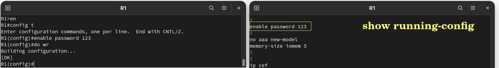

<center> 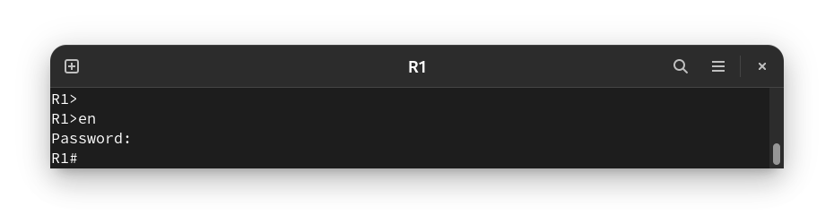 </center>


## Secret Password

- It has the same functionality as the enabled password.

- Enable password uses a **weak** encryption algorithm. To overcome this situation, we use enable secret password on the device. 

- When **both** enable password and enable secret password are configured, **enable secret** password is used to move from User EXEC mode to Privileged EXEC mode.

- Enable secret password is **encrypted** by default, but the enable password is **not** encrypted.


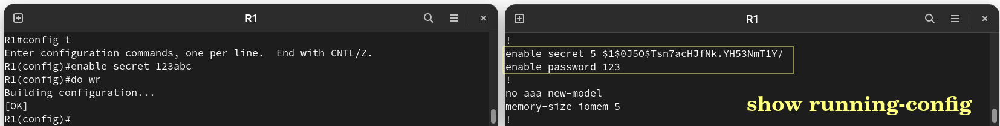

<center> 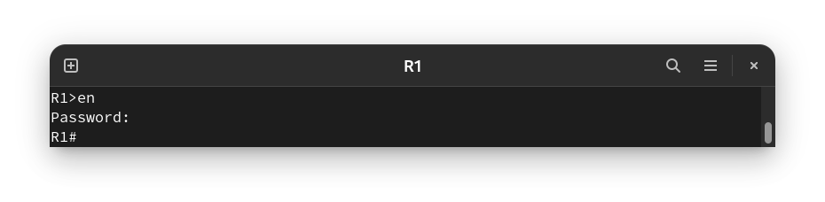 </center>

**Notes** 

- If you have both enable password and enable secret set, the enable secret will **override** the enable password, so now you will login with the enable secret password and if you try to login using the enable password, it will be refused.
  
- The purpose of enable password if we already configured enable secret is the **compatibility** for older IOS. If you copy the configuration file and the older IOS doesn't support enable secret it will use the enable password.

- Many routers will alert the users if they have made the enable secret and the enable password values the same in terms of the password. Although the message that results is **just a warning**, and administrators can indeed set both to the same thing (although this is not recommended as it will almost defeat the purpose of the enable secret command).

### `service password-encryption`

**Now to encrypt all the passwords in the configuration file, we can use `service password-encryption` command.**

**Syntax :**

`service password-encryption { sha1 | sha256 }`

`no service password-encryption { sha1 | sha256 }`

**Command Default**
The user account password is encrypted using the **MD5** encryption type.


 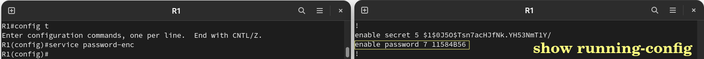

At this moment both the passwords are encrypted now.

## Aux Password

The Aux password is used for setting up a password for the auxiliary port, which is a physical access port on the router. An Auxiliary port is used for accessing a router **over a modem**.  Though, this port is not present on all the routers.  

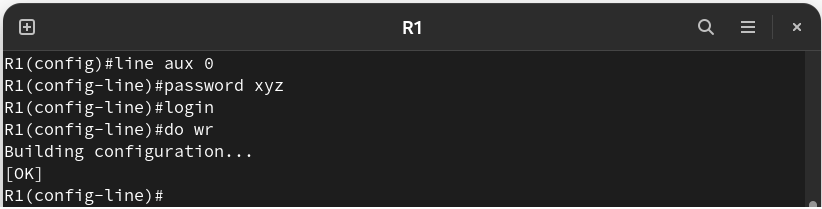

---------------------------------------
 
# Removing Passwords

You **turn off** most commands by issuing the command again with the `no` keyword in front of it.

## Console Password
 
```
R1(config)# line console 0                 → go to line console interface config mode
R1(config-line)# no login                  → force no login 
R1(config-line)# no password               → remove line console password
```
Notice that if you use `no login` command only, you won't be asked about the console password, but it will remain in the configuration file, when you use `no password` command, it will be removed.

## Enable Password

```
R1#config t 
R1(config)#no enable password
```

## Secret Password

```
R1(config)#no enable secret
```

## Aux Password

```
R1(config) # line aux 0                        → going to Auxiliary line configuration mode
R1(config-line) # no login                     → forcing no login
R1(config-line) # no password                  → disabling password for Auxiliary line
```

-----------------------------------------

# Routers Password Types

The following table shows some types of Cisco password :

|Password Type|Encryption Type|Ability to Crack|Recommendation|Command|
|-------------|---------------|----------------|--------------|-------|
|Type 0       | **Clear-Text**|Immediate       | Do not use   |`enable password cisco123` <br> `username Salma password 0 P@ssw0rd` |
|Type 4|**SHA-256** which apps like Cain can crack but will take long time |Easy| Do not use|`enable secret 4 Rv4kArhts7yA2xd8BD2YTVbts `|
|Type 5       |**MD5** which apps like Cain can crack but will take long time| Medium |Use only when Types 6, 8, and 9 are not available|`enable secret cisco123 ` <br> `enable secret 5 00271A5307542A02D22842` |
|Type 7       |**Vigenere cipher** which any website with type7 reverser can crack it in less than one second| Immediate|  Do not use|`enable password cisco123` <br> `service password-encryption`|
|Type 8       | **PBKDF2-SHA-256** |Difficult|  Recommended|` R1(config)#enable algorithm-type sha256 secret cisco `<br> `R1(config)# username demo algorithm-type sha256 secret cisco`|
|Type 9       |**Scrypt as the hashing algorithm.**|Difficult|  Not NIST approved|`R1(config)#enable algorithm-type scrypt secret cisco` <br>`R1(config)# username demo algorithm-type scrypt secret cisco`|


`enable secret 4 Rv4kArhts7yA2xd8BD2YTVbts` : notice that it is not the password string itself but the hash of the password.


**Important Note:** If you configure type 8 or type 9 passwords and then downgrade to a release that does not support type 8 and type 9 passwords, you must configure the type 5 passwords before downgrading. If not, you are locked out of the device and a password recovery is required.

----------------------------------------

# Privilege Level Security

- Cisco IOS devices use privilege levels for more granular security and Role-Based Access Control (RBAC) in addition to usernames and passwords. There are **16** privilege levels of admins access, **0-15**, With **0** being the **least privileged** and **15** being the **most privileged**.

- By default, the three privilege levels on a router are:


  **Level 0 –** Zero-level access only allows five commands : `logout`, `enable`, `disable`, `help` and `exit`.

  **Level 1 –** Includes all commands available at the User EXEC command mode (E.g, `ping` command). 

  **Level 15 –** Full Access to all commands.

    **The levels between these minimum and maximum levels are undefined until the administrator assigns commands and/or users to them. Therefore, the administrator can assign users different privilege levels in between these minimum and maximum privilege levels to separate what different users have access to.**

    [ ⇒ How to assign commands to a privilege level](https://qualysguard.qualys.com/qwebhelp/fo_portal/authentication/cisco/cisco_ios.htm)

```
Router>show privilege
Current privilege level is 1
Router>en 15
Router>show privilege
Current privilege level is 15
```

## Configuring Different Privilege Levels to Passwords

We can also configure different privilege levels to passwords. Here, we will allow the `enable secret` command to access the Privileged Exec level.

**Syntax** : `enable secret level {level} {password}` 

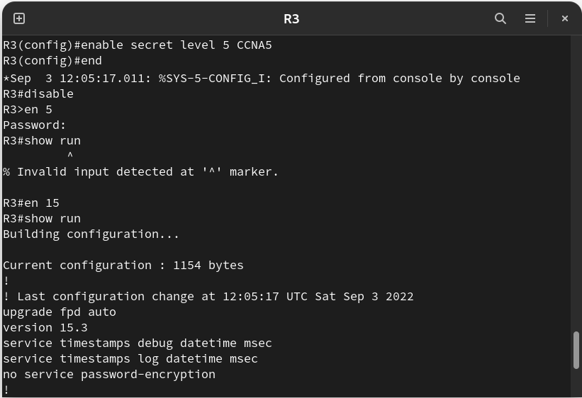


In our first attempt, notice in the example above that we do not have access to the `show running-configuration` command. That is because we are currently under privilege level 5. However, we can log in as a privilege level 15 user with the `enable {privilege level}` command, and from there, we can now access the `show running-configuration` command.

--------------------------------------

# Configuring User Accounts

The username can be only one word. Spaces and quotation marks are not allowed.

```
router(config)# username pingo password 789  → Password Type 0
router(config)# username salma secret 123    → Password Type 5
router(config)# line console 0
router(config-line)# login local
```

Salma and Pingo will have a **privilege level of 1 by default**.

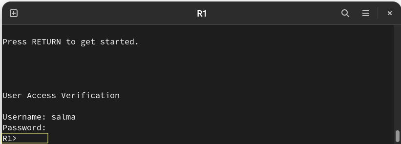

```
Router(config)#username admin1 privilege 0 secret CCNA1
Router(config)#username admin2 privilege 15 secret CCNA2
Router(config)#username admin3 privlege 15 password CCNA3
```
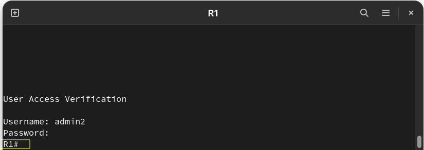


### Login vs Login local Command

We have both options for security :

- `login` : 

    - We use **only a password** for accessing a line (cons0/aux0/vty).

- `login local` : 

     - We use **both username and password** for accessing a line (cons0/aux0/vty).
     - Login local means use the local User Database to perform the authentication, its more secure than `login` command.
     - While creating the users with privileges with this command the **TACACS** or **RADIUS** protocol is used for authentication.

--------------------------------------------------------


