# Encryption 

Encryption is the process of converting human-readable data (plaintext) into unintelligible ciphertext.  This scrambling of data is the result of an algorithmic operation that uses a cryptographic key. Simply put, encryption takes your data and makes it random enough so that anybody who steals it can’t read it unless they have the key to turn it back into a legible form.

The use of encryption is necessary if we want privacy and for protecting our data. There are two main types: 
  - Symmetric encryption
  - Asymmetric encryption 

### Symmetric Encryption (only a single key)

Symmetric encryption is a type of encryption where **one key** can be used to encrypt messages to the opposite party, and also to decrypt the messages received from the other participant. This means that **anyone who holds the key can encrypt and decrypt messages** to anyone else holding the key.

This type of encryption scheme is often called **shared secret** encryption, or **secret key** encryption. There is typically only a single key that is used for all operations.

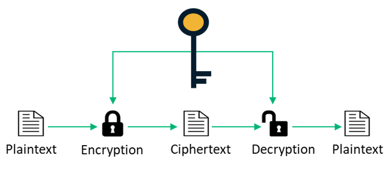

### Asymmetric Encryption (public & private key)

Asymmetric encryption also known as **public-key cryptography** or **public key encryption**.

Asymmetric encryption uses a pair of related keys — **a public and a private key**. **The public key** is what’s used to **encrypt** a plaintext message before sending it (Here, you take the file, take the public key from the other node, and you get your protected file). To decrypt and read this message, you need to hold the **private key**. The public and the private keys are mathematically related, but the private key cannot be derived from it.

The **public key** is shared openly **with everyone**, while the **private key** must remain known **only to its owner**. 

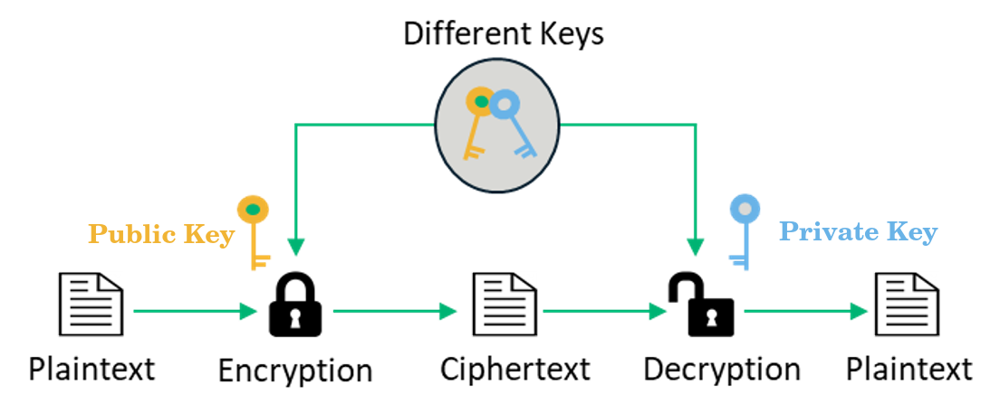

Because asymmetric encryption is a **more complicated** process than its symmetric counterpart, **the time required is greater**. However, this type of encryption offers a **higher level of security** as compared to symmetric encryption since the private key is not meant to be shared and is kept a secret. 


### Hybrid Encryption

Hybrid Encryption **combines** the efficiency of symmetric encryption with the convenience of public-key (asymmetric) encryption. 

**Asymmetric encryption** is often used to establish a secure connection between two parties, e.g. when connecting to an online web secure website. The extra overhead of the public/private key operation is only incurred at the beginning of the exchange to ensure a trusted relationship. Typically, once a secure connection is established, the two entities will then use faster **symmetrical encryption** to share multiple transactions of sensitive data. The combination of using both symmetric and asymmetric algorithms together is known as hybrid encryption.

----------------------------------------------

# SSH (Secure Shell or Secure Socket Shell)

It is a cryptographic network protocol that allows two computers to communicate and share the data over an insecure network such as the internet. It is used to login to a remote server to execute commands and data transfer from one machine to another machine.

Secure communication provides a strong password authentication and encrypted communication with a public key over an insecure channel. It is used to replace unprotected remote login protocols such as Telnet, rlogin, rsh, etc., and insecure file transfer protocol FTP.

## SSH Encryption

SSH uses both symmetric and asymmetric encryption. The **asymmetric encryption** is used only to share a secret key using which, **symmetric encryption** can be done for further communication.

## SSHv1 vs SSHv2 

SSHv2 is an entire rewrite of SSHv1. The difference between SSH1 and SSH2 is they are two entirely **different protocols**. SSH1 and SSH2 encrypt at different parts of the packets.

----------------------------------------------

# Setting up SSH

**Topology**

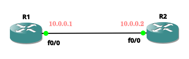

- To enable SSH, the following steps are required:

  - **1.** Assign IP address and subnet mask.
  - **2.** Configure local username and password.
  - **3.** Set up a domain name : Domain Name is needed for generating SSH keys.
    - `R1(config)#ip domain name [name]`
  - **4.** Generate RSA public and private keys : RSA is a type of asymmetric encryption.
    - `R1(config)#crypto key generate rsa`  
  - **5.** Allow SSH access.
    - `R1(config)#line vty 0 4` 
    - `R1(config-line)#login local`

### Configure Router 1

```
R1#config t
R1(config)#int f0/0 
R1(config-if)#ip add 10.0.0.1 255.255.255.252
R1(config-if)#no sh 
R1(config-if)#exit

R1(config)#username salma password abc

R1(config)#ip domain name cisco

R1(config)#crypto key generate rsa

R1(config)#line vty 0 4
R1(config-line)#login local
```

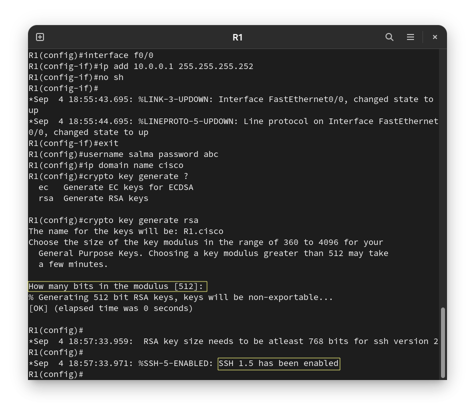

**NOTE :** You should use the more recent version of the protocol, **SSH version 2**. This is done by using at least **768** bits in the modulus.

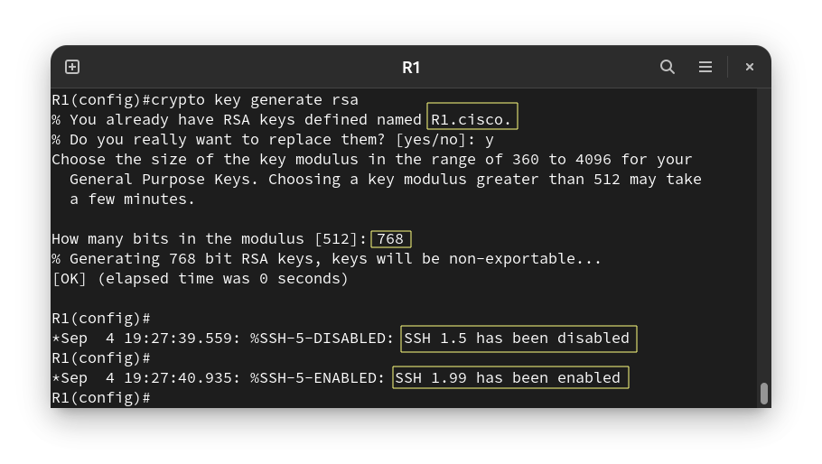

### Configure Router 2

```
R2(config)#int f0/0
R2(config-if)#ip add 10.0.0.2 255.255.255.252
R2(config-if)#no sh
```
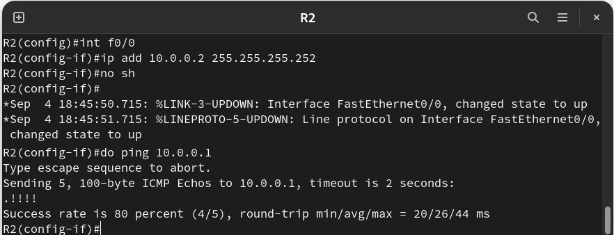

**Now you can open ssh session**

**Syntax** : `ssh -l [username] [ip]` 
- `-l` : Log in using this username.

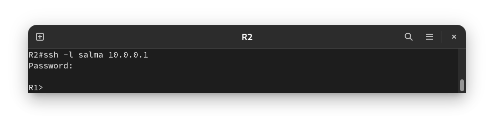

### Enable SSH Only

if you try to open a telnet session it will be open :

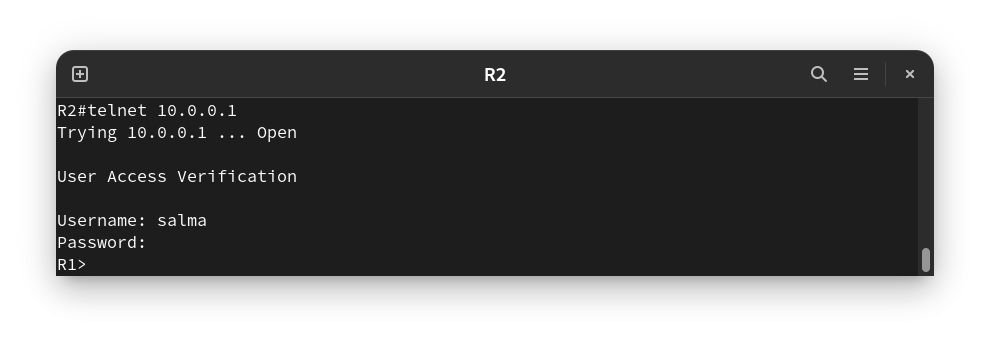

To enable only the SSH access to a device. This is done by using : `R1(config-line)#transport input ssh`

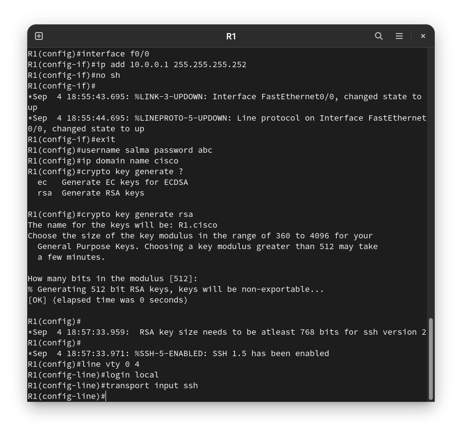

if you try to open a telnet session again it won't be open :

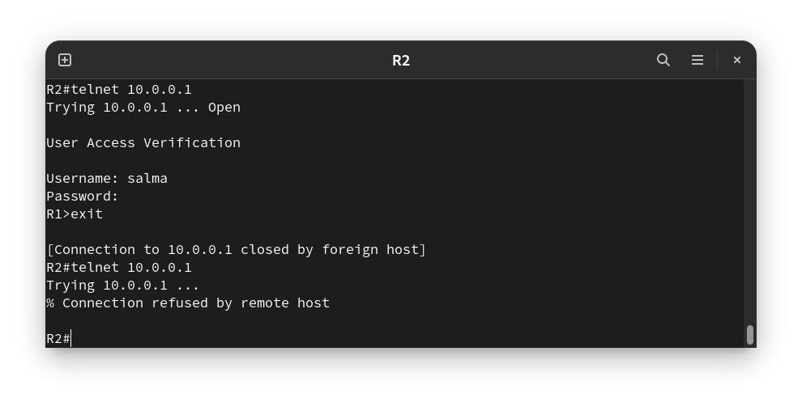

-----------------------------------

# Examining Telnet & SSH in Wireshark

## Examining a Telnet Session with Wireshark

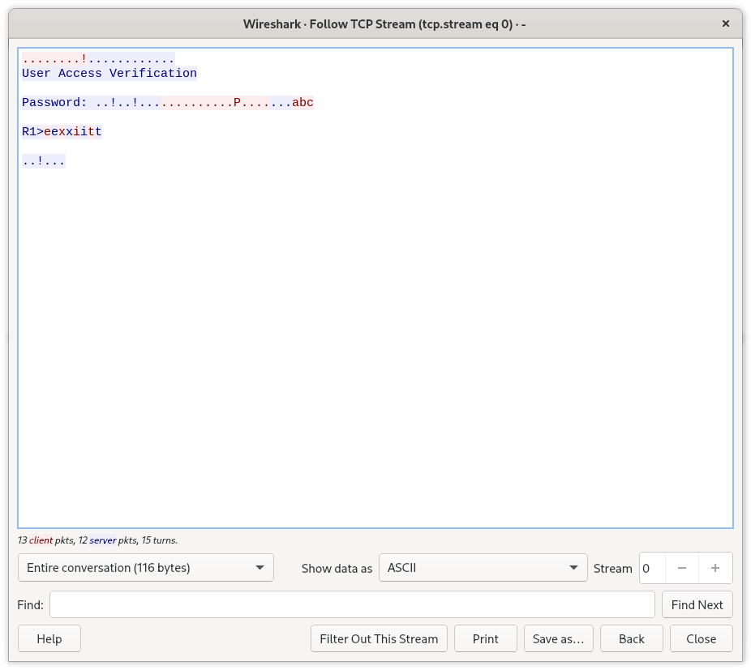

## Examining an SSH Session with Wireshark


------------------------------------------