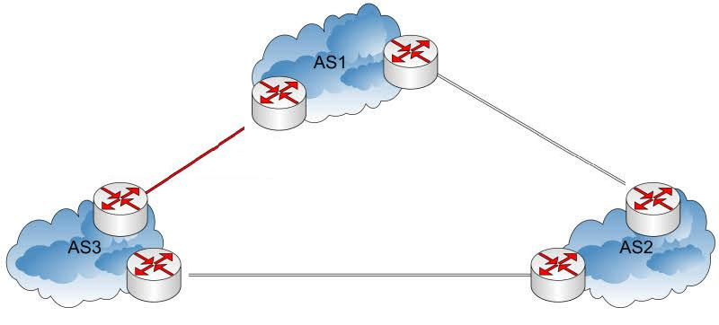
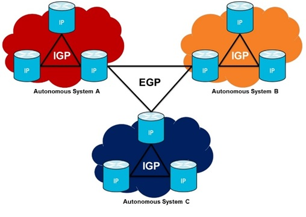
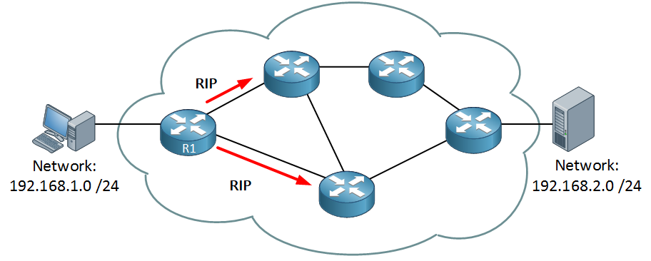

# Routed Protocol

- A Routed protocol is a protocol by which data can be routed. 

- Routed protocols are routed by Routing protocols.

- Used Between Routers to direct user traffic. It is also called **network protocols**.

- **Some examples :** 
   - IPv4
   - IPv6
   - AppleTalk (discontinued)

# Routing Protocols 

- Routing protocols are used to distribute routing information across routers on a network. When each router or Layer 3 device knowing about the networks connected to other Router, then each one can determine the best path to take to deliver your traffic.

- Used between Layer 3 devices to learn and advertise Routes and maintain Routing tables

- **Some examples :** 
   - RIP 
   - OSPF 
   - EIGRP 
   - BGP

---------------------------------------------

# Autonomous System (AS)

AS is a network or a collection of networks that are all managed and supervised by a single entity or organization.

-----------------------------------------

# Routing Protocols Categories

## Interior Gateway Protocols (IGP)

- IGP is a routing protocol that is used to exchange routing information **within** an autonomous system.

- Types of IGP :
   
   - **Distance Vector routing protocol :**

       - RIP
       - IGRP
    
  - **Advanced Distance Vector routing protocol :**
     
       - RIP Version 2 
       - EIGRP
   
   - **Link-state routing protocol :**
      
      - OSPF
      - IS-IS 
 

## Exterior Gateway Protocols (EGP) 

- EGP is a routing protocol that is used to exchange routing information **between** autonomous systems

- Types of EGP :

   - EGP
   - BGP  

-----------------------------------------------------------------------------------

# Administrative distance (AD)

Imagine we have a network that is running two routing protocols at the same time, OSPF and EIGRP. Both routing protocols are giving information to R1.

- EIGRP tells us the router should send IP packets using the path on the top.
- OSPF tells us the router should send IP packets using the path on the bottom.
What routing information are we going to use? We need to look at the **administrative distance**.

## AD

- AD is a value that routers use in order to select the best path when there are two or more different routes to the same destination from two different routing protocols.

- AD is a numeric value which can range from **0 to 255**. **A smaller AD is more trusted by a router**, therefore the **best AD** being **0** and the **worst**, **255**.

- **Keep in mind:**

   - The administrative distance is **only local** and can be different for each router.   
   - The administrative distance can be modified.

| AD   |Route Type         |
|------|-------------------|
| 0    |Connected Interface|
| 1    |Static Route       |
| 20   |EBGP Route         |
| 90   |EIGRP Route        |
| 100  |IGRP Route         |
| 110  |OSPF Route         |
| 115  |IS-IS Route        |
| 120  |RIP Route          |
| 140  |EGP                |
| 200  |IBGP Route         |
| 255  |Unknown Route      |

If a route is known both via OSPF and as a static entry, the static entry, not the entry known via OSPF, will be installed in the routing table.

---------------------------------------------------------------

# Routing Metric Value

If the router has more than one route found by two different routing protocols, for the same destination network, the router chooses Administrative Distance to choose the best one.

But in some cases, there will be two paths found by the same protocol, to the same destination network. Here the Routing Protocol will use Route Metric value to find the best path.

## Metric

- Metric is the measure used to decide which route is better. Each routing protocol uses its own metric. 

- **A common metric** can either be: **hop count**, **delay**, **bandwidth**, **current load on the path**, **cost**, **MTU**, or the combination of two or more of these standards.

### Hop count

- **Hop Count** = Number of Routers data must pass from source network to reach the destination (lower number is better).

### Delay (or Latency)

- Delay refers to the time taken to **route a packet** from source to destination; this includes the time taken by a router to process and send a datagram to the receiving interface. 

- For protocols that use delay as their metric, **the link with low latency is considered the best path**.

### Bandwidth

- Bandwidth is the number of bits that a link between two devices can send per second.

- For a protocol that uses bandwidth capacity as its metric, the protocol determines the bandwidth capacity of all possible routes to the destination subnet, and the route with a **higher bandwidth capacity is considered the best path** added to the routing table.

Router 6 will prefer to send its traffic through router 8 rather than send it through router 7 because the route through router 8 has a higher bandwidth.

### Load

- The number of packets being processed per second by the router or its CPU. 

- For protocols that use load as their metric, **the path with the least load is considered the best** and added to the routing table to transmit the datagram to the destination subnet.

### Cost

- A parameter roughly proportional to the actual cost in dollars of using each network link. 

- Some WAN links might have more latency but cost much less.

### MTU (Maximum Transmission Unit)

- The largest size of packet that the router can forward without segmenting the packet into subpackets.

- Segmentation of network traffic by routers adds additional latency to network communication.

-----------------------------------------------------------------------------------------------------------