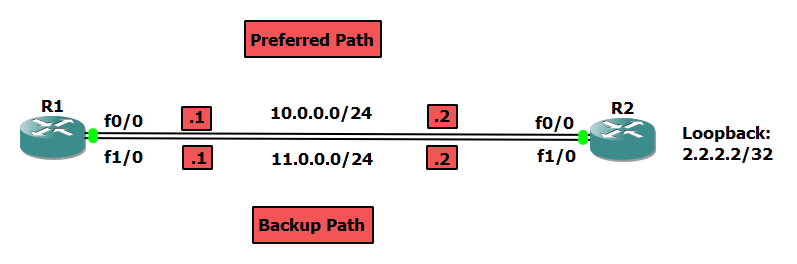

# Lab 2 (Preferred Static Route Lab)

- The routes that have a lower administrative distance number will be the ones installed into the routing table whereas higher AD numbers won't so in order to make R1 sends message throug a specific path we will make the another path has the higesth AD.

- we want to use network 11.0.0.0 as a backup route.
 



**R1**

```
Router>en
Router#config t
Router(config)#line console 0
Router(config-line)#logging syn
Router(config-line)#hostname R1

R1(config)#int f0/0
R1(config-if)#ip address 10.0.0.1 255.255.255.0
R1(config-if)#no shut

R1(config-if)#int f1/0
R1(config-if)#ip address 11.0.0.1 255.255.255.0
R1(config-if)#no shut

R1(config-if)#do show ip route
..
..

      10.0.0.0/8 is variably subnetted, 2 subnets, 2 masks
C        10.0.0.0/24 is directly connected, FastEthernet0/0
L        10.0.0.1/32 is directly connected, FastEthernet0/0
      11.0.0.0/8 is variably subnetted, 2 subnets, 2 masks
C        11.0.0.0/24 is directly connected, FastEthernet1/0
L        11.0.0.1/32 is directly connected, FastEthernet1/0

```


**R2**

```
Router>en
Router#config t
Router(config)#line console 0
Router(config-line)#logging syn
Router(config-line)#hostname R2

R2(config)#int f0/0
R2(config-if)#ip address 10.0.0.2 255.255.255.0
R2(config-if)#no shut

R2(config-if)#int f1/0
R2(config-if)#ip address 11.0.0.2 255.255.255.0
R2(config-if)#no shut

R2(config-if)#int loop 2
R2(config-if)#ip address 2.2.2.2 255.255.255.255

R2(config-if)#do show ip route
..
..
      2.0.0.0/32 is subnetted, 1 subnets
C        2.2.2.2 is directly connected, Loopback2
      10.0.0.0/8 is variably subnetted, 2 subnets, 2 masks
C        10.0.0.0/24 is directly connected, FastEthernet0/0
L        10.0.0.2/32 is directly connected, FastEthernet0/0
      11.0.0.0/8 is variably subnetted, 2 subnets, 2 masks
C        11.0.0.0/24 is directly connected, FastEthernet1/0
L        11.0.0.2/32 is directly connected, FastEthernet1/0

```


**Static Routes**


```
R1(config)#ip route 2.2.2.2 255.255.255.255 10.0.0.2
R1(config)#ip route 2.2.2.2 255.255.255.255 11.0.0.2 2

R1(config)#do show ip route
..
..

      2.0.0.0/32 is subnetted, 1 subnets
S        2.2.2.2 [1/0] via 10.0.0.2
      10.0.0.0/8 is variably subnetted, 2 subnets, 2 masks
C        10.0.0.0/24 is directly connected, FastEthernet0/0
L        10.0.0.1/32 is directly connected, FastEthernet0/0
      11.0.0.0/8 is variably subnetted, 2 subnets, 2 masks
C        11.0.0.0/24 is directly connected, FastEthernet1/0
L        11.0.0.1/32 is directly connected, FastEthernet1/0

```

If interface f0/0 has shut down it will go through the backup path ( 11.0.0.2)


```
R1(config)#int f0/0
R1(config-if)#shutdown
R1(config-if)#


R1(config-if)#do show ip route
..
..
      2.0.0.0/32 is subnetted, 1 subnets
S        2.2.2.2 [2/0] via 11.0.0.2
      11.0.0.0/8 is variably subnetted, 2 subnets, 2 masks
C        11.0.0.0/24 is directly connected, FastEthernet1/0
L        11.0.0.1/32 is directly connected, FastEthernet1/0
```

> Note that if a router sent message to another router through a specific path, it's not  must to send its reply through the same path.
