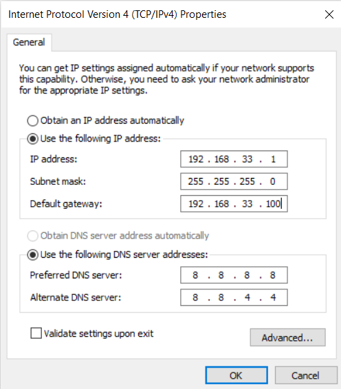
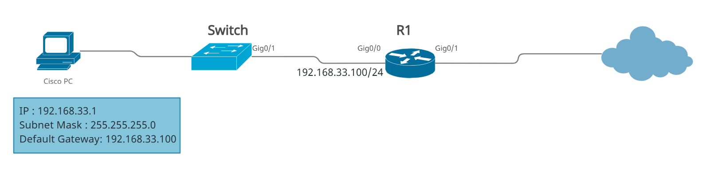
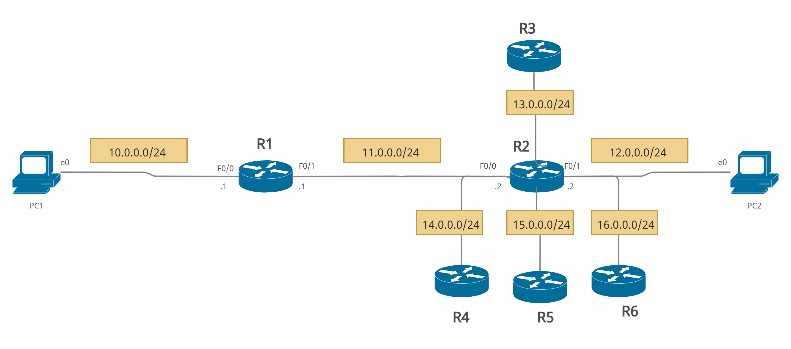

# Routers

- A Router is a networking device that forwards data packets between computer network.

- This device is usually connected to two or more different networks.
 
- When a data packet comes to a router port, the router reads address information in packet to determine out which port the packet will be sent. For example, a router provides you with the internet access by connecting your LAN with the Internet.

- When a packet arrives at a Router, it examines destination IP address of a received packet and make routing decisions accordingly. Routers use Routing Tables to determine out which interface the packet will be sent. 

# Functions of a router

- Connect different subnets.
- Path determination
- Routing decision
- Load balancing


> Note : Must every interface on a router have a different subnet connected to it because the purpose of router is to connect different subnets.


# Routing Table 

- A routing table is a table or database that stores the location of routers based on their IP addresses. 

- A routing table lists all networks for which routes are known. Each router’s routing table is unique and stored in the RAM of the device.

- This table acts as an address map to various networks, it contains information about various networks, and how to get to them.

- All IP-enabled devices, including routers and switches, use routing tables.

 
 # How are Routing Tables populated?

There are ways to maintain Routing Table:

- **Directly connected** networks are added automatically.

- **Using Static Routing** : by manually entering routes into a routing table.

- **Using Dynamic Routing** : with the help of routing protocols.

---------------------------------------------------------------

# Static Routing (non-adaptive routing)

- The administrator configures the routes into the routing table to be used by the router to send packets to a destination network.

- The route needs to be reconfigured by the administrator in the event of **any change**.

# Dynamic Routing (adaptive routing)


- Dynamic routing is a technique in which a router learns about routing information without an administrator’s help. 

- It  adds the best route to its routing table and can also determine another path if the primary route goes down.

- Paths are automatically updated. If the changes occur on the network side, there is no need to update the routing path manually; routing paths will automatically be updated. 

- Different types of dynamic routing protocol are used today:
   
    - RIP
    - OSPF
    - EIGRP


# Static Routing vs Dynamic Routing

|Basis of Comparison   | Static Routing | Dynamic Routing|
|--|--|--|
|Configuration Technique|	Routing tables are manually updated.	|Routing tables are dynamically updated.|
|Bandwidth	|It requires less bandwidth than dynamic routing.	|It requires more bandwidth than static routing.|
|Paths/Routes|	Paths are defined by administrative.	|Paths are updated according to the changes in the network.|
|Application Area|	Static Routing is implemented in a small network.	|Dynamic Routing is implemented in a large network.|
|Routing Protocols|	It does not use any protocol.|	It uses protocols like eigrp, arp, etc., to calculate the routing operation.|
|Routing Algorithms|	It does not use any complex routing algorithms.	|It uses complex routing algorithms.|
|Security|	Highly secure than dynamic routing	|Less secure than static routing.|
|Link Affect|	If any link between routers fails, it disturbs other routing paths.|	Failure of any link between routers does not affect other routing paths.|
|Network Infrastructure|	Network infrastructure is small.	|The network infrastructure is large.|
|Failure of Link|	Link failure disturbs routing is in process.	|Link failure does not disturb routing is in process.|


--------------------------------------------


# Default Gateway

- A default gateway makes it possible for devices in one network to communicate with devices in another network.

- If a computer, for example, requests a web page, the request goes through the default gateway before exiting the LAN to reach the internet.







--------------------------------------------


# Static Route Configuration

- Router 1 is directly connected to router 2. Router 2 is directly connected to the subnet 12.0.0.0/24. Since that subnet is not directly connected to Router 1, the router doesn’t know how to route packets destined for that subnet. 

- Router 2 is directly connected to router 1. Router 1 is directly connected to the subnet 10.0.0.0/24. Since that subnet is not directly connected to Router 2, the router doesn’t know how to route packets destined for that subnet.
 
**So let's configure that**


- Subnets directly connected to a router’s interface are added to the router’s routing table. 

- Interface has to have an IP address configured and both interface status codes must be in the up and up state.

- A router will be able to route all packets destined for all hosts in subnets directly connected to its active interfaces.

## Configure PCs

- **PC1**
```
PC1> ip 10.0.0.100 255.255.255.0 10.0.0.1
Checking for duplicate address...
PC1 : 10.0.0.100 255.255.255.0 gateway 10.0.0.1
PC1>
```

- **PC2**
```
PC2> ip 12.0.0.100 255.255.255.0 12.0.0.2
Checking for duplicate address...
PC1 : 12.0.0.100 255.255.255.0 gateway 12.0.0.2
PC2>
```
```
PC2> show ip

NAME        : PC2[1]
IP/MASK     : 12.0.0.100/24
GATEWAY     : 12.0.0.2
DNS         :
MAC         : 00:50:79:66:68:01
LPORT       : 10005
RHOST:PORT  : 127.0.0.1:10004
MTU:        : 1500
```

## Configure Routers


- **R1**

```
Router>en
Router#config t
Enter configuration commands, one per line.  End with CNTL/Z.
Router(config)#hostname R1
R1(config)#int f0/0
R1(config-if)#ip add 10.0.0.1 255.255.255.0
R1(config-if)#no shut
R1(config-if)#
*Mar  1 00:08:48.259: %LINK-3-UPDOWN: Interface FastEthernet0/0, changed state to up
*Mar  1 00:08:49.259: %LINEPROTO-5-UPDOWN: Line protocol on Interface FastEthernet0/0, changed state to up
R1(config-if)#int f0/1
R1(config-if)#ip add 11.0.0.1 255.255.255.0
R1(config-if)#no shut
R1(config-if)#
*Mar  1 00:09:31.063: %LINK-3-UPDOWN: Interface FastEthernet0/1, changed state to up
*Mar  1 00:09:32.075: %LINEPROTO-5-UPDOWN: Line protocol on Interface FastEthernet0/1, changed state to up
R1(config-if)#
```

- **R2**
```
Router>en
Router#config t
Enter configuration commands, one per line.  End with CNTL/Z.
Router(config)#hostname R2
R2(config)#int f0/0
R2(config-if)#ip add 11.0.0.2 255.255.255.0
R2(config-if)#no shut
R2(config-if)#
*Mar  1 00:11:59.403: %LINK-3-UPDOWN: Interface FastEthernet0/0, changed state to up
*Mar  1 00:12:00.403: %LINEPROTO-5-UPDOWN: Line protocol on Interface FastEthernet0/0, changed state to up
R2(config-if)#int f0/1
R2(config-if)#ip add 12.0.0.2 255.255.255.0
R2(config-if)#no shut
R2(config-if)#
*Mar  1 00:12:40.955: %LINK-3-UPDOWN: Interface FastEthernet0/1, changed state to up
*Mar  1 00:12:41.955: %LINEPROTO-5-UPDOWN: Line protocol on Interface FastEthernet0/1, changed state to up
R2(config-if)#
```

## Show directly connected routes


- The router has two active interfaces, Fa0/0 and Fa0/1. Each interface has been configured with an IP address and is currently in the up-up state, so the router adds these subnets to its routing table.

- The character C in the routing table indicates that a route is a directly connected route.


### `show ip route` command

- **R1**
```
R1#show ip route
Codes: C - connected, S - static, R - RIP, M - mobile, B - BGP
       D - EIGRP, EX - EIGRP external, O - OSPF, IA - OSPF inter area
       N1 - OSPF NSSA external type 1, N2 - OSPF NSSA external type 2
       E1 - OSPF external type 1, E2 - OSPF external type 2
       i - IS-IS, su - IS-IS summary, L1 - IS-IS level-1, L2 - IS-IS level-2
       ia - IS-IS inter area, * - candidate default, U - per-user static route
       o - ODR, P - periodic downloaded static route

Gateway of last resort is not set

     10.0.0.0/24 is subnetted, 1 subnets
C       10.0.0.0 is directly connected, FastEthernet0/0
     11.0.0.0/24 is subnetted, 1 subnets
C       11.0.0.0 is directly connected, FastEthernet0/1
R1#
```

- **R2**

```
R2#show ip route
Codes: C - connected, S - static, R - RIP, M - mobile, B - BGP
       D - EIGRP, EX - EIGRP external, O - OSPF, IA - OSPF inter area
       N1 - OSPF NSSA external type 1, N2 - OSPF NSSA external type 2
       E1 - OSPF external type 1, E2 - OSPF external type 2
       i - IS-IS, su - IS-IS summary, L1 - IS-IS level-1, L2 - IS-IS level-2
       ia - IS-IS inter area, * - candidate default, U - per-user static route
       o - ODR, P - periodic downloaded static route

Gateway of last resort is not set

     11.0.0.0/24 is subnetted, 1 subnets
C       11.0.0.0 is directly connected, FastEthernet0/0
     12.0.0.0/24 is subnetted, 1 subnets
C       12.0.0.0 is directly connected, FastEthernet0/1
R2#
```

> Note that the gateway of last resort is not set. 

## Configure Static routes

- By adding static routes, a router can learn a route to a remote network that is not directly connected to one of its interfaces.

- Static routes are configured manually by typing the global configuration mode command :
    - `ip route Destination_Network Subnet_Mask <Exit interface>`  
         
       or 
         
    - `ip route Destination_Network Subnet_Mask <Next_Hop_IP_Address>`

- The character S in the routing table indicates that a route is a statically configured route.


- **R1**

```
R1(config)#ip route 12.0.0.0 255.255.255.0 f0/1
R1(config)#do show ip route
Codes: C - connected, S - static, R - RIP, M - mobile, B - BGP
       D - EIGRP, EX - EIGRP external, O - OSPF, IA - OSPF inter area
       N1 - OSPF NSSA external type 1, N2 - OSPF NSSA external type 2
       E1 - OSPF external type 1, E2 - OSPF external type 2
       i - IS-IS, su - IS-IS summary, L1 - IS-IS level-1, L2 - IS-IS level-2
       ia - IS-IS inter area, * - candidate default, U - per-user static route
       o - ODR, P - periodic downloaded static route

Gateway of last resort is not set

     10.0.0.0/24 is subnetted, 1 subnets
C       10.0.0.0 is directly connected, FastEthernet0/0
     11.0.0.0/24 is subnetted, 1 subnets
C       11.0.0.0 is directly connected, FastEthernet0/1
     12.0.0.0/24 is subnetted, 1 subnets
S       12.0.0.0 is directly connected, FastEthernet0/1
R1(config)#
```


- **R2**

```
R2(config)#ip route 10.0.0.0 255.255.255.0 11.0.0.1
R2(config)#do show ip route
Codes: C - connected, S - static, R - RIP, M - mobile, B - BGP
       D - EIGRP, EX - EIGRP external, O - OSPF, IA - OSPF inter area
       N1 - OSPF NSSA external type 1, N2 - OSPF NSSA external type 2
       E1 - OSPF external type 1, E2 - OSPF external type 2
       i - IS-IS, su - IS-IS summary, L1 - IS-IS level-1, L2 - IS-IS level-2
       ia - IS-IS inter area, * - candidate default, U - per-user static route
       o - ODR, P - periodic downloaded static route

Gateway of last resort is not set

     10.0.0.0/24 is subnetted, 1 subnets
S       10.0.0.0 [1/0] via 11.0.0.1
     11.0.0.0/24 is subnetted, 1 subnets
C       11.0.0.0 is directly connected, FastEthernet0/0
     12.0.0.0/24 is subnetted, 1 subnets
C       12.0.0.0 is directly connected, FastEthernet0/1
R2(config)#
```


## Verify the connectivity

```
PC1> ping 12.0.0.100
84 bytes from 12.0.0.100 icmp_seq=1 ttl=62 time=44.575 ms
84 bytes from 12.0.0.100 icmp_seq=2 ttl=62 time=45.852 ms
84 bytes from 12.0.0.100 icmp_seq=3 ttl=62 time=47.496 ms
84 bytes from 12.0.0.100 icmp_seq=4 ttl=62 time=50.010 ms
84 bytes from 12.0.0.100 icmp_seq=5 ttl=62 time=52.202 ms
```
-------------------------------------------------

What if we expand our network?
It will be exhausting to write each path manually so we cn use **default route.**



In order to implement this lab i will use **loopback interfaces** instead of routers

# Loopback Interfaces


- Loopback interfaces don’t have any physical attributes that can fail, they never go down. Loopbacks are logical so it's impossible for them to physically be in the same subnet as other devices, so they're usually assigned /32 subnet mask as a standard to avoid wasting IP addresses.

-  Like our physical interface, we assign a special IP address which is called a loopback address or loopback IP address.

- The loopback interface can be considered stable because once you enable it, it will remain up until you issue the shutdown command under its interface configuration mode.  


## Configure Loopback Interfaces

- **R2**

```
R2(config)#int loopback ?
  <0-2147483647>  Loopback interface number
R2(config)#int loopback 13
*Mar  1 00:35:45.599: %LINEPROTO-5-UPDOWN: Line protocol on Interface Loopback13, changed state to up
R2(config-if)#ip add 13.0.0.2 255.255.255.0
R2(config-if)#int loopback 14
*Mar  1 00:33:47.655: %LINEPROTO-5-UPDOWN: Line protocol on Interface Loopback13, changed state to up
R2(config-if)#ip add 14.0.0.2 255.255.255.0
R2(config-if)#int loopback 15
*Mar  1 00:35:45.599: %LINEPROTO-5-UPDOWN: Line protocol on Interface Loopback13, changed state to up
R2(config-if)#ip add 15.0.0.2 255.255.255.0
```

- Loopback interfaces is directly connected

```
R2#show ip int b
Interface                  IP-Address      OK? Method Status                Protocol
FastEthernet0/0            11.0.0.2        YES manual up                    up
FastEthernet0/1            12.0.0.2        YES manual up                    up
Loopback13                 13.0.0.2        YES manual up                    up
Loopback14                 14.0.0.2        YES manual up                    up
Loopback15                 15.0.0.2        YES manual up                    up
```


```
R2#show ip route
Codes: C - connected, S - static, R - RIP, M - mobile, B - BGP
       D - EIGRP, EX - EIGRP external, O - OSPF, IA - OSPF inter area
       N1 - OSPF NSSA external type 1, N2 - OSPF NSSA external type 2
       E1 - OSPF external type 1, E2 - OSPF external type 2
       i - IS-IS, su - IS-IS summary, L1 - IS-IS level-1, L2 - IS-IS level-2
       ia - IS-IS inter area, * - candidate default, U - per-user static route
       o - ODR, P - periodic downloaded static route

Gateway of last resort is not set

     10.0.0.0/24 is subnetted, 1 subnets
S       10.0.0.0 [1/0] via 11.0.0.1
     11.0.0.0/24 is subnetted, 1 subnets
C       11.0.0.0 is directly connected, FastEthernet0/0
     12.0.0.0/24 is subnetted, 1 subnets
C       12.0.0.0 is directly connected, FastEthernet0/1
     13.0.0.0/24 is subnetted, 1 subnets
C       13.0.0.0 is directly connected, Loopback13
     14.0.0.0/24 is subnetted, 1 subnets
C       14.0.0.0 is directly connected, Loopback14
     15.0.0.0/24 is subnetted, 1 subnets
C       15.0.0.0 is directly connected, Loopback15
```


**Up to this point if you try to ping network 13 you will receive a reply from network 10:**

```
PC1> ping 13.0.0.100
*10.0.0.1 icmp_seq=1 ttl=255 time=15.534 ms (ICMP type:3, code:1, Destination host unreachable)
*10.0.0.1 icmp_seq=2 ttl=255 time=15.340 ms (ICMP type:3, code:1, Destination host unreachable)
*10.0.0.1 icmp_seq=3 ttl=255 time=15.232 ms (ICMP type:3, code:1, Destination host unreachable)
*10.0.0.1 icmp_seq=4 ttl=255 time=15.540 ms (ICMP type:3, code:1, Destination host unreachable)
*10.0.0.1 icmp_seq=5 ttl=255 time=15.350 ms (ICMP type:3, code:1, Destination host unreachable)
```


## Default Routes

- A default route defines where packets will be sent if no specific route for the destination network is listed in the routing table. If no default route is set, the router will discard all packets with destination addresses not found its routing table.

- **Details:**
   - If a packet is received on a routing device, the device first checks to see if the IP destination address is on one of the device’s local subnets.
   - If the destination address is not local, the device checks its routing table.
   - If the remote destination subnet is not listed in the routing table, the packet is forwarded to the next hop toward the destination using the default route. 
   - The default route generally has a next-hop address of another routing device, which performs the same process. The process repeats until a packet is delivered to the destination.

- The default route in IPv4 is designated as `0.0.0.0/0` or simply `0/0`. Similarly, in IPv6, the default route is specified as `::/0`. The subnet mask `/0` specifies all networks

- Administrators generally point the default route toward the routing device that has a connection to a network service provider. Therefore, packets with destinations outside the organization's local area network, typically destinations on the Internet or a wide area network, are forwarded to the routing device with the connection to that provider. The device to which the default route points is often called the **default gateway**.


## Configure the default route

`R1(config)#ip route 0.0.0.0 0.0.0.0 11.0.0.2`

The command above instructs R1 to match all IP address and subnet masks and send the packets to 11.0.0.2 . 

- **R1**
```
R1(config)#ip route 0.0.0.0 0.0.0.0 11.0.0.2
R1(config)#do show ip route
Codes: C - connected, S - static, R - RIP, M - mobile, B - BGP
       D - EIGRP, EX - EIGRP external, O - OSPF, IA - OSPF inter area
       N1 - OSPF NSSA external type 1, N2 - OSPF NSSA external type 2
       E1 - OSPF external type 1, E2 - OSPF external type 2
       i - IS-IS, su - IS-IS summary, L1 - IS-IS level-1, L2 - IS-IS level-2
       ia - IS-IS inter area, * - candidate default, U - per-user static route
       o - ODR, P - periodic downloaded static route

Gateway of last resort is 11.0.0.2 to network 0.0.0.0

     10.0.0.0/24 is subnetted, 1 subnets
C       10.0.0.0 is directly connected, FastEthernet0/0
     11.0.0.0/24 is subnetted, 1 subnets
C       11.0.0.0 is directly connected, FastEthernet0/1
     12.0.0.0/24 is subnetted, 1 subnets
S       12.0.0.0 is directly connected, FastEthernet0/1
S*   0.0.0.0/0 [1/0] via 11.0.0.2
```
S* in the routing table means that the static default route we’ve just configured is a candidate default route (since routers can learn about multiple default routes).

> Note that : A Gateway of Last Resort or Default gateway is a route used by the router when no other known route exists to transmit the IP packet and now it's set to 11.0.0.2 .


## Verify the connectivity


- **PC1**
```
PC1> ping 13.0.0.100
13.0.0.100 icmp_seq=1 timeout
13.0.0.100 icmp_seq=2 timeout
13.0.0.100 icmp_seq=3 timeout
13.0.0.100 icmp_seq=4 timeout
13.0.0.100 icmp_seq=5 timeout

PC1> ping 14.0.0.100
14.0.0.100 icmp_seq=1 timeout
14.0.0.100 icmp_seq=2 timeout
14.0.0.100 icmp_seq=3 timeout
14.0.0.100 icmp_seq=4 timeout
14.0.0.100 icmp_seq=5 timeout
```
--------------------------------------------------------
 
 **what if we configure the default route in R2 then ping network 16 ?**
 
 `R2(config)#ip route 0.0.0.0 0.0.0.0 f0/0`
 
 `PC1> ping 16.0.0.100`

**The traffic goes in a loop ♾ 😂**
 
 
 
 # Routing Loop

- A routing loop is an issue that occurs when the routers forward packets such that the same single packet ends up back at the same router repeatedly in the network because of the unusual behavior of the routing table when the data packets keep getting routed again and again between two or more routers.

- For example, it’s where traffic is being received from one connection or one device (a router typically or a layer 3 switch) it sees traffic coming from an interface and it sends this traffic to this host and then that host receives the traffic and it sends this traffic to the interface and it is receiving traffic from the host and it is sending it right back to host so essentially the traffic goes in a loop.

# How to avoid Routing loops?


# Maximum hop Count
Maximum hop count mechanism can be used to prevent Routing Loops. Distance Vector protocols use the TTL (Time-to-Live) value in the IP datagram header to avoid Routing Loops. When an IP datagram move from router to router, a router keeps track of the hops in the TTL field in the IP datagram header. For each hop a packet goes through, the packet’s TTL field is decremented by one. If this value reaches 0, the packet is dropped by the router that decremented the value from 1 to 0.

-----------------------------------------------------

# Exit Interface vs Next-hop

There are two methods to create static routes:

## Exit interface

- A static route that uses the exit interface causes the router to look at the routing table once. 

`R1(config)#ip route 12.0.0.0 255.255.255.0 f0/1`  --> This generates an ARP broadcast that looks for the next-hop IP address so it can overload the CPU on the router and it makes the network slower.

```
S       12.0.0.0 is directly connected, FastEthernet0/1
```

- For point-to-point links(serial ports), always use an exit interface in your static route. Else , use next-hop.


## next-hop address (RECURSIVE LOOKUPS)

- A static route that uses a next-hop address causes the router to look at the routing table twice. 

`R2(config)#ip route 10.0.0.0 255.255.255.0 11.0.0.1` --> This does not generate an ARP request. It keeps Layer 2 out of the routing process.

```
      10.0.0.0/24 is subnetted, 1 subnets
S       10.0.0.0 [1/0] via 11.0.0.1
     11.0.0.0/24 is subnetted, 1 subnets
C       11.0.0.0 is directly connected, FastEthernet0/0

```


-------------------------------------------------------
