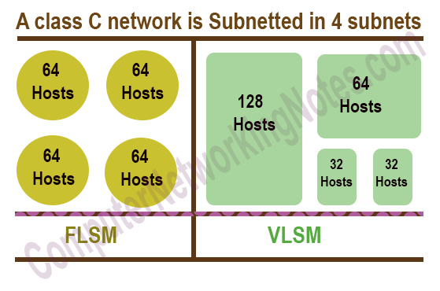

# FLSM & VLSM

- For subnetting an IP address for a network, one of two approaches can be used:

  - **1) FLSM** (Fixed Length Subnet Mask)
  - **2) VLSM** (Variable Length Subnet Mask)


- **FLSM** creates subnets of the **same size** and an **equal number of host** identifiers, while **VLSM** creates subnets with **varying sizes** with a **variable number of hosts.**

- **FLSM** is a better choice for **private IP addresses**, while **VLSM** is more suitable for **public IP addresses**.

- **FLSM** tends to use more IP addresses than are necessary, which leads to **wastage**. In **VLSM**, **wastage is minimum** because it uses a given IP address range more efficiently.




# Implementing a FLSM subnet

Let’s, consider an IP address `198.168.10.0`

Now we have to divide this IP address into **4 subnetwork parts.** After dividing we have to find out the range of IP addresses blocks.

### Step 1: Calculate the required subnet bit. In this subnetting process, we will borrow the bit from the host side.

Now here is the question arise, which bits belong to the host side and network side?

We will find it with the help of subnet masks. We are given a Class C IP address and default subnet mask for Class C is 255.255.255.0

Every octet consists of 8-bit in this case we are having 24 1’s in network bit.

As we know that every binary value having two possible values either 0 or 1. And with one binary we can make two value and with two binary values, we can make four values. And with three binary value, we can make 8 values and so on.

```
    i.e.
    
    2^1 = 2
    
    2^2 = 4
    
    2^3 = 8
    
    2^4 = 16
 ```
Here, we need to configure 4 subnets for this we need to borrow 2 bits and making the MSB of host bit of subnet mask to 1 and the value we will get,

11111111.11111111.11111111.11000000

From this we get the mask value for the subnet -->  `255.255.255.192` (The decimal equivalent of upper mask in binary)


### Step 2: We will find the range in this step.

Formula, `Range: (Maximum Subnet Mask – Updated Subnet Mask)`

Maximum Subnet Mask is always 255.255.255.255 for every case

```
    255.255.255.255
  - 255.255.255.192
  =   0.  0.  0. 63
```
Here is the range for network we have got is 0.0.0.63

### Step 3: Now we will divide the whole network with the help of the range.

- **First Network Block:**  `198.168.10.0 – 198.168.10.63`

    - For this block Network ID will be `198.168.10.0` and Broadcast address will be `198.168.10.63`

- **Second Network Block:** `198.168.10.64` – `198.168.10.127`

  - For this block Network ID will be `198.168.10.64` and Broadcast address will be `198.168.10.127`

- **Third Network Block:**  `198.168.10.128` – `198.168.10.191`

  - For this block Network ID will be `198.168.10.128` and Broadcast address will be `198.168.10.191`

- **Fourth Network Block:** `198.168.10.192` – `198.168.10.255`

  - For this block Network ID will be `198.168.10.192` and Broadcast address will be `198.168.10.255`

**Subnet masks will remain same for every network block i.e. 255.255.255.192**


## Another Example

Let’s, consider an IP address `192.168.1.0/24`

Now we have to divide this IP address into **N networks** and each network will support a maximum of 15 hosts  

### Solution

Subnet :  1111 1111 . 1111 1111 . 1111 1111 . 0000 0000
No. of host per network : 2^5 -2 = 30 (2^4 -2 = 14 --> Invaild)

So we will need 5 bits for host ID then we will borrow the MSB 3 bits for network ID (2^3 = 8 subnets)

We will get --> 1111 1111 . 1111 1111 . 1111 1111 . 1110 0000 (255.255.255.224)

Range:

```
    255.255.255.255
  - 255.255.255.224
  =   0.  0.  0. 31
```

- **First Network Block:**   `192.168.1.0 – 192.168.1.31`

- **Second Network Block:**  `192.168.1.32` – `192.168.1.63`

- **Third Network Block:**   `192.168.1.64` – `192.168.1.95`

- **Fourth Network Block:**  `192.168.1.96` – `192.168.1.127`

- **5th Network Block:**    `192.168.1.128` – `192.168.1.159`

- **6th Network Block:**    `192.168.1.160` – `192.168.1.191`

- **7th Network Block:**    `192.168.1.192` – `192.168.1.223`

- **8th Network Block:**   `192.168.1.224` – `192.168.1.255`

-------------------------------------------------------------

