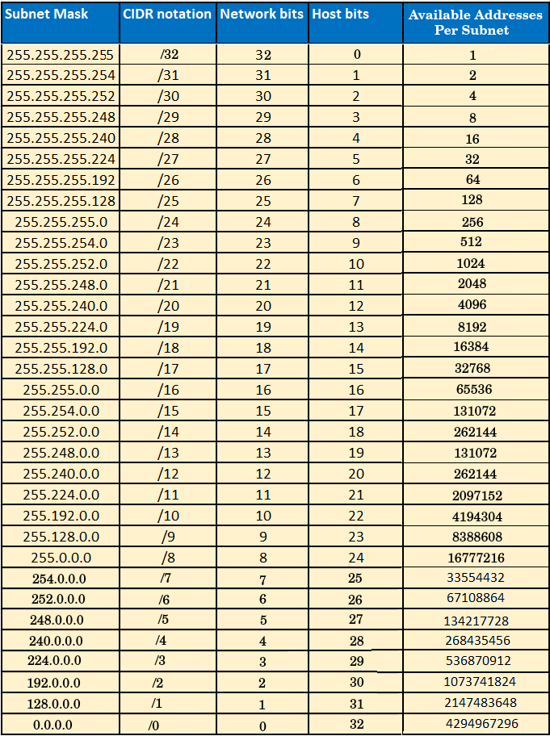
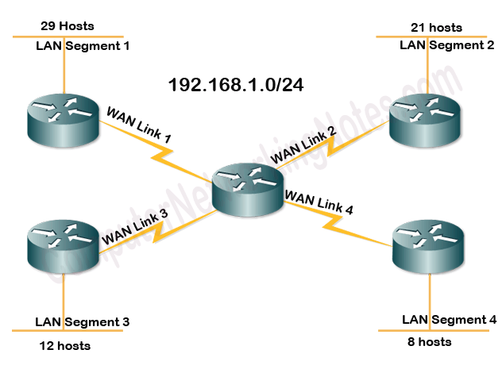
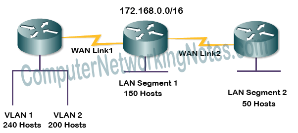
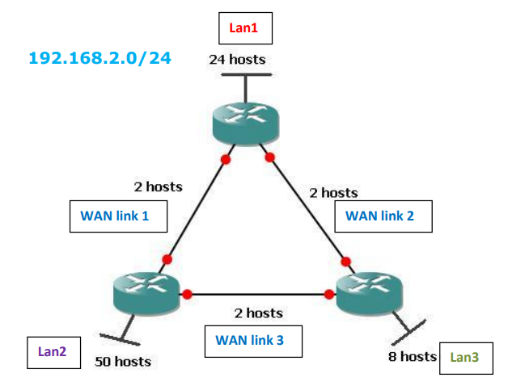
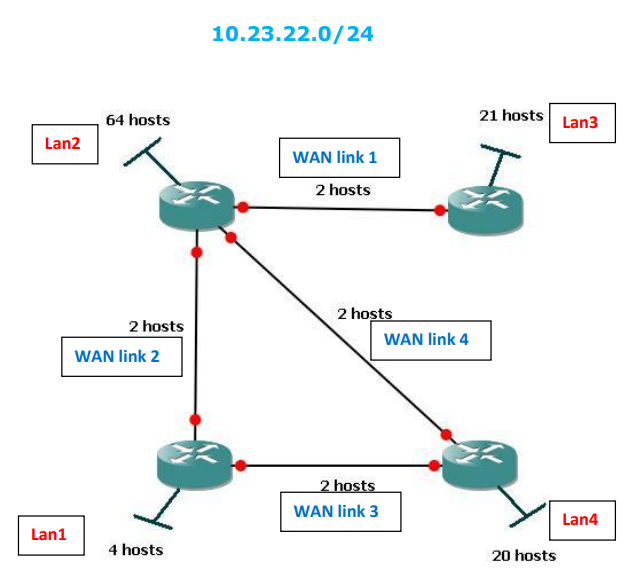

# Practice Subnetting IPv4

<table>
 <tr>
   <td>Number of networks</td>
   <td> 2 <sup>Network Bits</sup> </td>
 </tr>
  
 <tr>
   <td>Number of hosts per network</td>
   <td>2 <sup>Host Bits</sup> -2 </td>
 </tr>
 
 <tr> 
    <td> Network Address</td>
    <td>  All the bits in the host part are "0"</td>
 </tr>
  
 <tr>
    <td>Directed Broadcast Address </td>
    <td> All the bits in the host part are "1"</td>
 </tr>
  
</table>



----------------------------------------------

# General Examples

## Example 1

**Target IP address : 4.147.215.184/25**

**Solution:**

```
Subnet Mask      --> 255.255.255.128
Netowrk ID       --> N.N.N.Nxxx xxxx
Current Host ID  --> 4.147.215.184  --> 184 -->1011 1000
Netowrk ID       --> N.N.N.1xxx xxxx

So:

Network Address = 4.147.215.128    (N.N.N.1000 0000)
Broadcast Address = 4.147.215.255  (N.N.N.111 1111)
First Host = 4.147.215.129
Last Host = 4.147.215.254
Host Range = 4.147.215.129 - 4.147.215.254
Next Subnet = 4.147.216.0
```

--------------------------------------------------

## Example 2

**Target IP address : 166.4.166.221/22**

Solution:

```
Subnet Mask      --> 255.255.252.0
Netowrk ID       --> N.N.NNNN NNHH.H
Current Host ID  --> 166.4.166.221  --> 166 -->1010 0110
Netowrk ID       --> N.N.1010 01xx.x

So:

Network Address = 166.4.164.0      (N.N.1010 0100.0)
Broadcast Address = 166.4.167.255  (N.N.1010 0111.1)
First Host = 166.4.164.1
Last Host = 166.4.167.254
Host Range = 166.4.164.1 - 166.4.167.254
Next Subnet = 166.4.168.0

```
--------------------------------------------------

## Example 3

**Target IP address : 208.91.187.78/29**

**Solution:**

```
Subnet Mask      --> 255.255.255.248
Netowrk ID       --> N.N.N.NNNN NHHH
Current Host ID  --> 208.91.187.78  --> 78 --> 0100 1110
Netowrk ID       --> N.N.N.0100 1HHH

So:

Network Address =  208.91.187.72   (N.N.N.0100 1000)
Broadcast Address = 208.91.187.79  (N.N.N.0100 1111)
First Host = 208.91.187.73
Last Host =  208.91.187.78
Host Range = 208.91.187.73 - 208.91.187.78
Next Subnet =  208.91.187.80

```
--------------------------------------------------


## Example 4

**Target IP address : 130.185.251.183/26**

**Solution:**

```
Subnet Mask      --> 255.255.255.192
Netowrk ID       --> N.N.N.NNHH HHHH
Current Host ID  --> 130.185.251.183  --> 183 --> 10110111
Netowrk ID       --> N.N.N.10HH HHHH


So:

Network Address =  130.185.251.128   (N.N.N.1000 1000)
Broadcast Address = 130.185.251.191  (N.N.N.1011 1111)
First Host = 130.185.251.129
Last Host =  130.185.251.190
Host Range = 130.185.251.129 - 130.185.251.190
Next Subnet =  130.185.251.192

```
--------------------------------------------------

## Example 5

**Target IP address : 209.207.193.43/27**

**Solution:**

```
Subnet Mask      --> 255.255.255.224
Netowrk ID       --> N.N.N.NNNH HHHH
Current Host ID  --> 209.207.193.43  --> 43 --> 0010 1011
Netowrk ID       --> N.N.N.00HH HHHH


So:

Network Address =  209.207.193.32     (N.N.N.0010 0000)
Broadcast Address = 209.207.193.63  (N.N.N.0011 1111)
First Host = 209.207.193.33
Last Host =  209.207.193.62
Host Range = 209.207.193.33 - 209.207.193.62
Next Subnet =  209.207.193.64

```
--------------------------------------------------

## Example 6

**Target IP address : 94.78.148.177/17**

**Solution:**

```
Subnet Mask      --> 255.255.128.0
Netowrk ID       --> N.N.NHHH HHHH.H
Current Host ID  --> 94.78.148.177  --> 148 --> 1001 0100
Netowrk ID       --> N.N.1HHH HHHH.H


So:

Network Address =   94.78.128.0     (N.N.1000 0000.0)
Broadcast Address = 94.78.255.255  (N.N.1111 1111.1)
First Host = 94.78.128.1
Last Host =  94.78.255.254
Host Range = 94.78.128.1 - 94.78.255.254
Next Subnet =  94.79.0.0
```
------------------------------

## Example 7

**Target IP address : 1.178.42.87/8**

**Solution:**

```
Subnet Mask      --> 255.0.0.0
Netowrk ID       --> N.H.H.H

So:

Network Address =   1.0.0.0     (N.0.0.0)
Broadcast Address = 1.255.255.255  (N.1.1.1)
First Host = 1.0.0.1
Last Host =  1.255.255.254
Host Range = 1.0.0.1 - 1.255.255.254
Next Subnet =  2.0.0.0
```
--------------------------------------

[↗  More Problems](https://subnetipv4.com/)

--------------------------------------------------
--------------------------------------------------


# FLSM Examples

## Example 1 

**Requirement :** Divide this IP address ``192.168.1.0/24`` into 4 networks.

**Solution:** 
```
- The number of required network are “4“ (2^2) :

- Network bits = 2 (we have to borrow 2 bits from the host portion to network portion)

- New subnet mask = 255.255.255.192 (255.255.255.NNHH HHHH --> 255.255.255.1100 0000)

- Range = 255.255.255.255 - 255.255.255.192 = 0.0.0.63  

| New Network |  Netowrk ID  | Broadcast Address |  Subnet Mask  |
|-------------|--------------|-------------------|---------------|
|  Subnet 0   |192.168.1.0   |  192.168.1.63     |255.255.255.192|
|  Subnet 1   |192.168.1.64  |  192.168.1.127    |255.255.255.192|
|  Subnet 2   |192.168.1.128 |  192.168.1.191    |255.255.255.192|
|  Subnet 3   |192.168.1.192 |  192.168.1.255    |255.255.255.192|

```

## Example 2

**Requirement :** Divide this IP address ``121.37.10.64 /26`` into 4 networks.

**Solution:** 
```
- The number of required network are “4“ (2^2) :

- Network bits = 2 (we have to borrow 2 bits from the host portion to network portion)

- New subnet mask = 255.255.255.240 (255.255.255.NNNN HHHH --> 255.255.255.1111 0000)

- Range = 255.255.255.255 - 255.255.255.240 = 0.0.0.15  

| New Network |  Netowrk ID  | Broadcast Address |  Subnet Mask  |
|-------------|--------------|-------------------|---------------|
|  Subnet 0   |121.37.10.64  |  121.37.10.79     |255.255.255.240|
|  Subnet 1   |121.37.10.80  |  192.168.1.95     |255.255.255.240|
|  Subnet 2   |121.37.10.96  |  1121.37.10.111   |255.255.255.240|
|  Subnet 3   |121.37.10.112 |  192.168.1.127    |255.255.255.240|

```

## Example 3

**Requirement :** Divide a Class A network ``50.0.0.0`` into two equal networks.

**Solution:** 
```
- The number of required network are “2“ (2^1) :

- Network bits = 1 (we have to borrow 1 bit from the host portion to network portion)

- New subnet mask = 255.128.0.0 (255.NHHH HHHH.H.H --> 255.1000 0000.0.0)

- Range = 255.255.255.255 - 255.128.0.0 = 0.127.255.255  

| New Network |  Netowrk ID  | Broadcast Address |  Subnet Mask  |
|-------------|--------------|-------------------|---------------|
|  Subnet 0   |   50.0.0.0   |  50.127.255.255   |  255.128.0.0  |
|  Subnet 1   |   50.128.0.0 |  50.255.255.255   |  255.128.0.0  |

```
--------------------------------------------------
--------------------------------------------------


# VLSM Examples

## VLSM Example 1 (Class C Network)



**Solution**:

- Sort the requirements of IPs in **descending order** :
    - LAN 1 - 29 Hosts
    - LAN 2 - 21 Hosts
    - LAN 3 - 12 Hosts
    - LAN 4 - 8 Hosts
    - WAN 1 - 2 Hosts
    - WAN 2 - 2 Hosts
    - WAN 3 - 2 Hosts
    - WAN 4 - 2 Hosts

**1)**

- LAN 1 - 29 Hosts
- LAN 2 - 21 Hosts

```
- Host bits =  5 (2^5 = 32 ⇾ 30 usable host addresses)

- Network bits = 27

- New subnet mask = 255.255.255.224

- Range = 255.255.255.255 - 255.255.255.224 = 0.0.0.31  

| New Network |  Netowrk ID  | Broadcast Address |    Subnet Mask     |  Assign to  |
|-------------|--------------|-------------------|--------------------|-------------|
|  Subnet 0   |192.168.1.0   |  192.168.1.31     |255.255.255.224(/27)|    LAN 1    |
|  Subnet 1   |192.168.1.32  |  192.168.1.63     |255.255.255.224(/27)|    LAN 2    |
|  Subnet 2   |192.168.1.64  |  192.168.1.95     |255.255.255.224(/27)|     ➖      |
|  Subnet 3   |192.168.1.96  |  192.168.1.127    |255.255.255.224(/27)|     ➖      |
|  Subnet 4   |192.168.1.128 |  192.168.1.159    |255.255.255.224(/27)|     ➖      |
|  Subnet 5   |192.168.1.160 |  192.168.1.191    |255.255.255.224(/27)|     ➖      |
|  Subnet 6   |192.168.1.192 |  192.168.1.223    |255.255.255.224(/27)|     ➖      |
|  Subnet 7   |192.168.1.224 |  192.168.1.255    |255.255.255.224(/27)|     ➖      |
```

**2)**

- LAN 3 - 12 Hosts
- LAN 4 - 8 Hosts

```
- Host bits =  4 (2^4 = 16 ⇾ 14 usable host addresses)

- Network bits = 28

- New subnet mask = 255.255.255.240

- Range = 255.255.255.255 - 255.255.255.240 = 0.0.0.15  

| New Network |  Netowrk ID  | Broadcast Address |    Subnet Mask     |  Assign to  |
|-------------|--------------|-------------------|--------------------|-------------|
|  Subnet 0   |192.168.1.64  |  192.168.1.79     |255.255.255.240(/28)|   LAN 3     |
|  Subnet 1   |192.168.1.80  |  192.168.1.95     |255.255.255.240(/28)|   LAN 4     |
|  Subnet 2   |192.168.1.96  |  192.168.1.111    |255.255.255.240(/28)|    ➖       |
|  Subnet 3   |192.168.1.112 |  192.168.1.127    |255.255.255.240(/28)|    ➖       |
   ...            ...               ...                  ...              ...
   ...            ...               ...                  ...              ... 
   ...            ...               ...                  ...              ...
```

**3)**

 - WAN 1 - 2 Hosts
 - WAN 2 - 2 Hosts
 - WAN 3 - 2 Hosts
 - WAN 4 - 2 Hosts

```
- Host bits =  2 (2^2 = 4 ⇾ 2 usable host addresses)

- Network bits = 30

- New subnet mask = 255.255.255.252

- Range = 255.255.255.255 - 255.255.255.252 = 0.0.0.3  

| New Network |  Netowrk ID  | Broadcast Address |    Subnet Mask     |  Assign to  |
|-------------|--------------|-------------------|--------------------|-------------|
|  Subnet 0   |192.168.1.96  |  192.168.1.99     |255.255.255.252(/30)|    WAN 1    |
|  Subnet 1   |192.168.1.100 |  192.168.1.103    |255.255.255.252(/30)|    WAN 2    |
|  Subnet 2   |192.168.1.104 |  192.168.1.107    |255.255.255.252(/30)|    WAN 3    |
|  Subnet 3   |192.168.1.108 |  192.168.1.111    |255.255.255.252(/30)|    WAN 4    |
|  Subnet 4   |192.168.1.112 |  192.168.1.115    |255.255.255.252(/30)|     ➖      |
|  Subnet 5   |192.168.1.116 |  192.168.1.119    |255.255.255.252(/30)|     ➖      |
|  Subnet 6   |192.168.1.120 |  192.168.1.123    |255.255.255.252(/30)|     ➖      |
   ...            ...               ...                  ...              ...
   ...            ...               ...                  ...              ... 
   ...            ...               ...                  ...              ...
```
----------------------------------------------------------

## VLSM Example 2 (Class B Network)



**Solution**:

- Sort the requirements of IPs in **descending order** :
    - VLAN 1 - 240 Hosts
    - VLAN 2 - 200 Hosts
    - LAN 1 - 150 Hosts
    - LAN 2 - 50 Hosts
    - WAN 1 - 2 Hosts
    - WAN 2 - 2 Hosts


  
**1)**

- VLAN 1 - 240 Hosts
- VLAN 2 - 200 Hosts
- LAN 1 - 150 Hosts

```
- Host bits =  8 (2^8 = 256 ⇾ 254 usable host addresses)

- Network bits = 24

- New subnet mask = 255.255.255.0

- Range = 255.255.255.255 - 255.255.255.0 = 0.0.0.255  

| New Network |  Netowrk ID  | Broadcast Address |    Subnet Mask     |  Assign to  |
|-------------|--------------|-------------------|--------------------|-------------|
|  Subnet 0   |172.168.0.0   |  172.168.0.255    | 255.255.255.0(/24) |   VLAN 1    |
|  Subnet 1   |172.168.1.0   |  172.168.1.255    | 255.255.255.0(/24) |   VLAN 2    |
|  Subnet 2   |172.168.2.0   |  172.168.2.255    | 255.255.255.0(/24) |    LAN1     |
|  Subnet 2   |172.168.3.0   |  172.168.3.255    | 255.255.255.0(/24) |     ➖      |
```

**2)**

- LAN 2 - 50 Hosts

```
- Host bits =  6 (2^6 = 64 ⇾ 62 usable host addresses)

- Network bits = 26

- New subnet mask = 255.255.255.192

- Range = 255.255.255.255 - 255.255.255.192 = 0.0.0.63  

| New Network |  Netowrk ID  | Broadcast Address |    Subnet Mask     | Assign to |
|-------------|--------------|-------------------|--------------------|-----------|
|  Subnet 0   |172.168.3.0   |  172.168.3.63     |255.255.255.192(/26)|   LAN 2   |
|  Subnet 1   |172.168.3.64  |  172.168.3.127    |255.255.255.192(/26)|    ➖     |
|  Subnet 2   |172.168.3.128 |  172.168.3.191    |255.255.255.192(/26)|    ➖     |
     ...            ...               ...                  ...              ...
     ...            ...               ...                  ...              ... 
     ...            ...               ...                  ...              ...
```

**3)**

- WAN 1 - 2 Hosts
- WAN 2 - 2 Hosts

```
- Host bits =  2 (2^2 = 4  ⇾ 2 usable host addresses)

- Network bits = 30

- New subnet mask = 255.255.255.252

- Range = 255.255.255.255 - 255.255.255.252 = 0.0.0.3  

| New Network |  Netowrk ID  | Broadcast Address |    Subnet Mask     | Assign to |
|-------------|--------------|-------------------|--------------------|-----------|
|  Subnet 0   |172.168.3.64  |  172.168.3.67     |255.255.255.252(/30)|   WAN 1   |
|  Subnet 1   |172.168.3.68  |  172.168.3.71     |255.255.255.252(/30)|   WAN 1   |
|  Subnet 2   |172.168.3.72  |  172.168.3.75     |255.255.255.252(/30)|    ➖     |
     ...            ...               ...                  ...              ...
     ...            ...               ...                  ...              ... 
     ...            ...               ...                  ...              ...
```

-----------------------------------------------

## VLSM Example 3 (Class A Network)


**Solution**:

- Sort the requirements of IPs in **descending order** :

    - LAN 3 - 350 Hosts
    - LAN 4 - 250 Hosts
    - LAN 1 - 80 Hosts
    - LAN 5 - 50 Hosts
    - LAN 2 - 20 Hosts
    - WAN 1 - 2 Hosts
    - WAN 2 - 2 Hosts
    - WAN 3 - 2 Hosts
    - WAN 4 - 2 Hosts
    - WAN 5 - 2 Hosts
    - WAN 6 - 2 Hosts


**1)**

- LAN 3 - 350 Hosts

```
- Host bits =  9 (2^9 = 512 ⇾ 510 usable host addresses)

- Network bits = 23

- New subnet mask = 255.255.254.0

- Range = 255.255.255.255 - 255.255.254.0 = 0.0.1.255 

| New Network |  Netowrk ID  | Broadcast Address |    Subnet Mask     |  Assign to  |
|-------------|--------------|-------------------|--------------------|-------------|
|  Subnet 0   |   10.0.0.0   |    10.0.1.255     | 255.255.254.0(/23) |    LAN 3    |
|  Subnet 1   |   10.0.2.0   |    10.0.3.255     | 255.255.254.0(/23) |     ➖      |
```

**2)**

- LAN 4 - 250 Hosts

```
- Host bits =  8 (2^8 = 256 ⇾ 254 usable host addresses)

- Network bits = 24

- New subnet mask = 255.255.255.0

- Range = 255.255.255.255 - 255.255.255.0 = 0.0.0.255 

| New Network |  Netowrk ID  | Broadcast Address |    Subnet Mask     |  Assign to  |
|-------------|--------------|-------------------|--------------------|-------------|
|  Subnet 0   |   10.0.2.0   |    10.0.2.255     | 255.255.255.0(/24) |    LAN 4    |
|  Subnet 1   |   10.0.3.0   |    10.0.3.255     | 255.255.255.0(/24) |     ➖      |
```

**3)**

- LAN 1 - 80 Hosts

```
- Host bits =  7 (2^7 = 128 ⇾ 126 usable host addresses)

- Network bits = 25

- New subnet mask = 255.255.255.128

- Range = 255.255.255.255 - 255.255.255.128 = 0.0.0.127 

| New Network |  Netowrk ID  | Broadcast Address |    Subnet Mask     |  Assign to  |
|-------------|--------------|-------------------|--------------------|-------------|
|  Subnet 0   |   10.0.3.0   |    10.0.3.127     |255.255.255.128(/25)|     LAN1    |
|  Subnet 1   |   10.0.3.128 |    10.0.3.255     |255.255.255.128(/25)|     ➖      |
```

**4)**

- LAN 5 - 50 Hosts

```
- Host bits =  6 (2^6 = 64 ⇾ 62 usable host addresses)

- Network bits = 26

- New subnet mask = 255.255.255.192

- Range = 255.255.255.255 - 255.255.255.192 = 0.0.0.63

| New Network |  Netowrk ID  | Broadcast Address |    Subnet Mask     |  Assign to  |
|-------------|--------------|-------------------|--------------------|-------------|
|  Subnet 0   |  10.0.3.128  |    10.0.3.191     |255.255.255.192(/26)|    LAN5     |
|  Subnet 1   |  10.0.3.192  |    10.0.3.255     |255.255.255.192(/26)|     ➖      |
```

**5)**

- LAN 2 - 20 Hosts

```
- Host bits =  5 (2^5 = 32 ⇾ 30 usable host addresses)

- Network bits = 27

- New subnet mask = 255.255.255.224

- Range = 255.255.255.255 - 255.255.255.224 = 0.0.0.31

| New Network |  Netowrk ID  | Broadcast Address |    Subnet Mask     |  Assign to  |
|-------------|--------------|-------------------|--------------------|-------------|
|  Subnet 0   |  10.0.3.192  |    10.0.3.223     |255.255.255.224(/27)|    LAN2     |
|  Subnet 1   |  10.0.3.224  |    10.0.3.255     |255.255.255.224(/27)|     ➖      |
```

**6)**

- WAN 1 - 2 Hosts
- WAN 2 - 2 Hosts
- WAN 3 - 2 Hosts
- WAN 4 - 2 Hosts
- WAN 5 - 2 Hosts
- WAN 6 - 2 Hosts

```
- Host bits =  2  (2^2 = 4 ⇾ 2 usable host addresses)

- Network bits = 30

- New subnet mask = 255.255.255.252

- Range = 255.255.255.255 - 255.255.255.252 = 0.0.0.3

| New Network |  Netowrk ID  | Broadcast Address |    Subnet Mask     |  Assign to  |
|-------------|--------------|-------------------|--------------------|-------------|
|  Subnet 0   |  10.0.3.224  |    10.0.3.227     |255.255.255.252(/30)|    WAN 1    |
|  Subnet 1   |  10.0.3.228  |    10.0.3.231     |255.255.255.252(/30)|    WAN 2    |
|  Subnet 2   |  10.0.3.232  |    10.0.3.235     |255.255.255.252(/30)|    WAN 3    |
|  Subnet 3   |  10.0.3.236  |    10.0.3.239     |255.255.255.252(/30)|    WAN 4    |
|  Subnet 4   |  10.0.3.240  |    10.0.3.243     |255.255.255.252(/30)|    WAN 5    |
|  Subnet 5   |  10.0.3.244  |    10.0.3.247     |255.255.255.252(/30)|    WAN 6    |
|  Subnet 6   |  10.0.3.248  |    10.0.3.251     |255.255.255.252(/30)|     ➖      |
|  Subnet 7   |  10.0.3.252  |    10.0.3.255     |255.255.255.252(/30)|     ➖      |
```

-------------------------------------------------------------

## VLSM Example 4 (Class C Network)



**Solution**:

- Sort the requirements of IPs in **descending order** :

    - LAN 2 - 50 Hosts
    - LAN 1 - 24 Hosts
    - LAN 3 - 8 Hosts
    - WAN 1 - 2 Hosts
    - WAN 2 - 2 Hosts
    - WAN 3 - 2 Hosts
  


**1)**

- LAN 2 - 50 Hosts

```
- Host bits =  6 (2^6 = 64 ⇾ 62 usable host addresses)

- Network bits = 26

- New subnet mask = 255.255.255.192

- Range = 255.255.255.255 - 255.255.255.192 = 0.0.0.63 

| New Network |  Netowrk ID  | Broadcast Address |    Subnet Mask     |  Assign to  |
|-------------|--------------|-------------------|--------------------|-------------|
|  Subnet 0   |  192.168.2.0 |    192.168.2.63   |255.255.255.192(/26)|    LAN 2    |
|  Subnet 1   |  192.168.2.64|    192.168.2.127  |255.255.255.192(/26)|     ➖      |
    ...            ...               ...                  ...              ...
    ...            ...               ...                  ...              ... 
    ...            ...               ...                  ...              ...
```


**2)**

- LAN 1 - 24 Hosts

```
- Host bits =  5 (2^5 = 32 ⇾ 30 usable host addresses)

- Network bits = 27

- New subnet mask = 255.255.255.224

- Range = 255.255.255.255 - 255.255.255.224 = 0.0.0.31 

| New Network |  Netowrk ID  | Broadcast Address |    Subnet Mask     |  Assign to  |
|-------------|--------------|-------------------|--------------------|-------------|
|  Subnet 0   |  192.168.2.64|    192.168.2.95   |255.255.255.224(/27)|    LAN1     |
|  Subnet 1   |  192.168.2.96|    192.168.2.127  |255.255.255.224(/27)|     ➖      |
    ...            ...               ...                  ...              ...
    ...            ...               ...                  ...              ... 
    ...            ...               ...                  ...              ...
```

**3)**

- LAN 3 - 8 Hosts

```
- Host bits =  4 (2^4 = 16 ⇾ 14 usable host addresses)

- Network bits = 28

- New subnet mask = 255.255.255.240

- Range = 255.255.255.255 - 255.255.255.240 = 0.0.0.15 

| New Network |  Netowrk ID  | Broadcast Address |    Subnet Mask     |  Assign to  |
|-------------|--------------|-------------------|--------------------|-------------|
|  Subnet 0   | 192.168.2.96 |   192.168.2.111   |255.255.255.240(/28)|     LAN3    |
|  Subnet 1   |192.168.2.112 |   192.168.2.127   |255.255.255.240(/28)|      ➖     |
    ...            ...               ...                  ...              ...
    ...            ...               ...                  ...              ... 
    ...            ...               ...                  ...              ...
```

**4)**

- WAN 1 - 2 Hosts
- WAN 2 - 2 Hosts
- WAN 3 - 2 Hosts

```
- Host bits =  2  (2^2 = 4 ⇾ 2 usable host addresses)

- Network bits = 30

- New subnet mask = 255.255.255.252

- Range = 255.255.255.255 - 255.255.255.252 = 0.0.0.3

| New Network |  Netowrk ID  | Broadcast Address |    Subnet Mask     |  Assign to  |
|-------------|--------------|-------------------|--------------------|-------------|
|  Subnet 0   |192.168.2.112 |   192.168.2.115   |255.255.255.252(/30)|    WAN 1    |
|  Subnet 1   |192.168.2.116 |   192.168.2.119   |255.255.255.252(/30)|    WAN 2    |
|  Subnet 2   |192.168.2.120 |   192.168.2.123   |255.255.255.252(/30)|    WAN 3    |
|  Subnet 3   |192.168.2.124 |   192.168.2.127   |255.255.255.252(/30)|     ➖      |
    ...            ...               ...                  ...              ...
    ...            ...               ...                  ...              ... 
    ...            ...               ...                  ...              ...
```

-----------------------------------------------------------

## VLSM Example 5 (Class A Network)



**Solution**:

- Sort the requirements of IPs in **descending order** :

    - LAN 2 - 64 Hosts
    - LAN 3 - 21 Hosts
    - LAN 4 - 20 Hosts
    - LAN 1 - 4 Hosts
    - WAN 1 - 2 Hosts
    - WAN 2 - 2 Hosts
    - WAN 3 - 2 Hosts
    - WAN 4 - 2 Hosts


**1)**

- LAN 2 - 64 Hosts

```
- Host bits =  7 (2^7 = 128 ⇾ 126 usable host addresses)

- Network bits = 25

- New subnet mask = 255.255.255.128

- Range = 255.255.255.255 - 255.255.255.128 = 0.0.0.127 

| New Network |  Netowrk ID  | Broadcast Address |    Subnet Mask     |  Assign to  |
|-------------|--------------|-------------------|--------------------|-------------|
|  Subnet 0   |  10.23.22.0  |   10.23.22.127    |255.255.255.128(/25)|    LAN 2    |
|  Subnet 1   | 10.23.22.128 |   10.23.22.255    |255.255.255.128(/25)|     ➖      |
```

**2)**

- LAN 3 - 21 Hosts
- LAN 4 - 20 Hosts

```
- Host bits =  5 (2^5 = 32 ⇾ 30 usable host addresses)

- Network bits = 27

- New subnet mask = 255.255.255.224

- Range = 255.255.255.255 - 255.255.255.224 = 0.0.0.31

| New Network |  Netowrk ID  | Broadcast Address |    Subnet Mask     |  Assign to  |
|-------------|--------------|-------------------|--------------------|-------------|
|  Subnet 0   | 10.23.22.128 |    10.23.22.159   |255.255.255.224(/27)|     LAN3    |
|  Subnet 1   | 10.23.22.160 |    10.23.22.191   |255.255.255.224(/27)|     LAN4    |
|  Subnet 2   | 10.23.22.192 |    10.23.22.223   |255.255.255.224(/27)|      ➖     |
     ...            ...               ...                  ...              ...
     ...            ...               ...                  ...              ... 
```

**3)**

- LAN 1 - 4 Hosts

```
- Host bits =  3 (2^3 = 8 ⇾ 6 usable host addresses)

- Network bits = 29

- New subnet mask = 255.255.255.248

- Range = 255.255.255.255 - 255.255.255.248 = 0.0.0.7

| New Network |  Netowrk ID  | Broadcast Address |    Subnet Mask     |  Assign to  |
|-------------|--------------|-------------------|--------------------|-------------|
|  Subnet 0   | 10.23.22.192 |    10.23.22.199   |255.255.255.248(/29)|    LAN1     |
|  Subnet 1   | 10.23.22.200 |    10.23.22.207   |255.255.255.248(/29)|      ➖     |
     ...            ...               ...                  ...              ...
     ...            ...               ...                  ...              ... 
```


**4)**

- WAN 1 - 2 Hosts
- WAN 2 - 2 Hosts
- WAN 3 - 2 Hosts
- WAN 4 - 2 Hosts

```
- Host bits =  2  (2^2 = 4 ⇾ 2 usable host addresses)

- Network bits = 30

- New subnet mask = 255.255.255.252

- Range = 255.255.255.255 - 255.255.255.252 = 0.0.0.3

| New Network |  Netowrk ID  | Broadcast Address |    Subnet Mask     |  Assign to  |
|-------------|--------------|-------------------|--------------------|-------------|
|  Subnet 0   | 10.23.22.200 |    10.23.22.203   |255.255.255.252(/30)|    WAN 1    |
|  Subnet 1   | 10.23.22.204 |    10.23.22.207   |255.255.255.252(/30)|    WAN 2    |
|  Subnet 2   | 10.23.22.208 |    10.23.22.211   |255.255.255.252(/30)|    WAN 3    |
|  Subnet 3   | 10.23.22.212 |    10.23.22.215   |255.255.255.252(/30)|    WAN 4    |
|  Subnet 4   | 10.23.22.216 |    10.23.22.219   |255.255.255.252(/30)|     ➖      |
     ...            ...               ...                  ...              ...
     ...            ...               ...                  ...              ... 
```

-------------------------------------------------------------
-----------------------------------------------------------