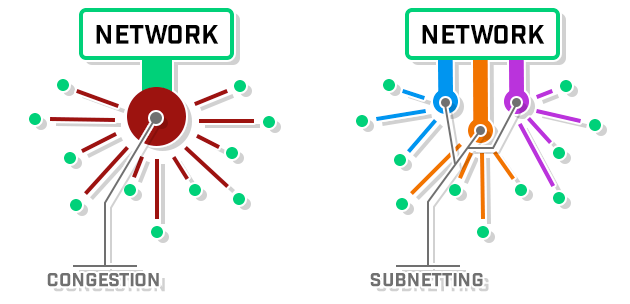

# Subnetting

- It is the technique for logically partitioning a single physical network into multiple smaller subnetworks or subnets.

- Subnetting enables an organization to conceal network complexity and reduce network traffic by adding subnets without a new network number. When a single network number must be used across many segments of a local area network (LAN), subnetting is essential.


#  Subnetting Benefits 

### Efficiency for Management

- Efficient routing consists of **reducing network congestion** as well as **improving the speed and performance** of the overall network. When a network is subnetted, different devices communicate with different networks rather than having all devices on one network trying to communicate at the same time. Think of it like an office: if several people are crowded together in a room to discuss different topics, it can be extremely difficult to effectively communicate. Therefore, subnetting is like creating separate conference rooms to discuss each individual topic. With fewer devices on the network, communication becomes vastly more efficient and effective (reducing broadcast volume).



- Even for experienced network administrators, managing a network is a stressful task. However, an administrator’s job is simplified by using subnets. Subnets allow administrators to isolate certain devices into logical groups. Therefore, when there is a problem with a device on a subnetted network, it’s much easier to locate the issue because the devices are grouped together. This allows the network administrator to determine which group of devices need attention right away. 

### Isolating Security Threats

- The improvement that subnetting provides to a network’s security is an extremely large and underrated benefit. By breaking it up into multiple networks, an administrator has the ability to isolate the compromised network(s). With the ability to isolate the compromised network, the network administrator can prevent further damage to the network and work on addressing the problem at hand.

- As well as being able to contain and target threats, subnetting can prevent users from hopping around and landing in areas of the network they don’t belong in. Rather than having all resources on one network, it is safer for an administrator and upper management to have a network with the resources that only they have access to. Information is valuable, so all the important information should be separated from possible perpetrators.

----------------------------------------------------------


# Subnet Mask

- A subnet mask is a **32 bits** address used to **distinguish** between a **network address** and a **host address** in IP address.
 
- A subnet mask created by setting **network bits to all 1s** and setting **host bits to all 0s.** In this way, the subnet mask separates the IP address into the network and host addresses.

- When organizations need additional **subnetworking**, subnetting divides the host element of the IP address further into a subnet. The goal of subnet masks are simply to enable the subnetting process. The phrase “mask” is applied because the subnet mask essentially uses its own 32-bit number to mask the IP address.

  

- **A valid subnetmask, when written in binary, has to consist of only consecutive 1's and then 0's, but no intermittent mixing.**


## Examples

```

1) 255.255.255.128   --> 1111 1111 . 1111 1111 . 1111 1111 . 1000 0000 is valid
2) 255.255.255.0     --> 1111 1111 . 1111 1111 . 1111 1111 . 0000 0000 is valid
3) 255.255.255.144   --> 1111 1111 . 1111 1111 . 1111 1111 . 1001 0000 is not valid
4) 255.255.255.224   --> 1111 1111 . 1111 1111 . 1111 1111 . 1110 0000 is valid
5) 255.255.0.255     --> 1111 1111 . 1111 1111 . 0000 0000 . 1111 1111 is not valid
6) 255.255.192.0     --> 1111 1111 . 1111 1111 . 1100 0000 . 0000 0000 is valid

```


<table>
 <tr>
   <td>Class</td>
   <td>Default subnet mask </td>
   <td>Leading bits</td>
   <td>NET ID bits </td>
   <td> HOST ID bits</td>
   <td>No. of networks</td>
   <td>No. of host per network </td>
 </tr>
  
  <tr>
   <td>A</td>
   <td>255.0.0.0 </td>
   <td>0 (0NNNNNNN.H.H.H)</td>
   <td> 8</td>
   <td>24 </td>
   <td>2 <sup>7</sup> - 2 = 126</td>
   <td> 2 <sup>24</sup> -2 = 16,777,214</td>
 </tr>
  
   <tr>
   <td>B</td>
   <td> 255.255.0.0</td>
   <td>10 (10NNNNNN.N.H.H)</td>
   <td>16 </td>
   <td>16 </td>
   <td>2 <sup>14</sup> = 16,384</td>
   <td>2 <sup>16</sup> -2 = 65,534 </td>
 </tr>
  
   <tr>
   <td>C</td>
   <td>255.255.255.0 </td>
   <td>110 (110NNNNN.N.N.H)</td>
   <td> 24</td>
   <td> 8</td>
   <td>2 <sup>21</sup> = 2,097,152</td>
   <td>2 <sup>8</sup> -2 = 254</td>
 </tr>
</table>

### Notes 

- In class A, 2 address is subtracted because 0.0.0.0 and 127.x.x.x are special address.
- When calculating hosts' IP addresses, 2 IP addresses are decreased because they cannot be assigned to hosts, i.e. the first IP of a network is network number and the last IP is reserved for Broadcast IP.

## Types of Subnet Mask

- **The default Subnet Mask** is the number of bits which is reserved by the address class. Using this default mask will accommodate a single network subnet in the relative class.

- **A Custom Subnet Mask** can be defined by an administrator to accommodate many networks

----------------------------------------------------------

# CIDR (Slash Notation)

- CIDR stands for **Classless Inter-Domain Routing**.

- The `<IP address>/<number>` is how a computer can quickly calculate what is part of its network and what is not.

- The number after the slash represents the number of consecutive 1's in the **subnet mask**. 

- For example, `192.168.10.0/24` is equal to the network `192.168.10.0` with a `255.255.255.0` subnet mask. If you convert `255.255.255.0` to binary, you end up with 24 consecutive 1's

#### A computer performs binary math of ANDing the IP address and the network mask.

➡ IP Address 10.10.15.10/16

#### Steps
- Step 1) Translate the IP address 4 octets into binary: 0000 1010 . 0000 1010 . 0000 1111 . 0000 1010

- Step 2) Translate the Subnet mask 4 octets into binary, which is easy using CIDR: 1111 1111 . 1111 1111 . 0000 0000 . 0000 0000

- Step 3) Perform the ANDing operation on the two addresses. This will give you the Network Address for the subnet.

**ANDing rules are as follows:**
  
|1 AND 1 = 1| 0 AND 1 = 0| 0 AND 0 = 0 |1 AND 0 = 0|
|--|--|--|--|

```
         00001010.00001010.00001111.00001010
   AND    
         11111111.11111111.00000000.00000000
         ———————————————————————————————————
         00001010.00001010.00000000.00000000
```
Step 4) Convert it back to decimal: 10.10.0.0

So now a computer knows that any address from 10.10.0.0 to 10.10.255.255 is part of its network and any other address is not.


**This table shows common network masks and their equivalents in slash notation.**

|Network Mask	|Slash Equivalent|
|--|--|
|255.0.0.0|/8|
|255.255.0.0	|/16|
|255.255.255.0	|/24|
|255.255.255.128|	/25|
|255.255.255.192	|/26|
|255.255.255.224	|/27|
|255.255.255.240	|/28|
|255.255.255.248	|/29|
|255.255.255.252	|/30|
|255.255.255.254	|/31|
|255.255.255.255|	/32|

# What Does IP Mask Mean?

Typically, although the phrase “subnet mask” is preferred, you might use “IP/Mask” as a shorthand to define both the **IP address** and **subnet mask** at once. In this situation, the IP address is followed by the number of bits in the mask. For example:

**1)** 10.0.1.1/24

**2)** 216.202.192.66/22

These are equivalent to

```
1 --> IP address: 10.0.1.1 with subnet mask of 255.255.255.0

2 --> IP address: 216.202.196.66 with a subnet mask example of 255.255.252.0
```
However, you do not mask the IP address, you mask the subnet.

------------------------------------------------------------------------------------

# IP Addressing Rules (IPv4)

## Assigning Network ID Rules

If the hosts are located within the same local network, then they are assigned with the same network ID. The following are the rules for assigning Network ID:

  - The network ID **cannot start** with 127 because 127 belongs to class A address and is reserved for internal loopback functions.

  - All bits of network ID set to 1 are reserved for use as an IP broadcast address and cannot be used.

  - All bits of network ID are set to 0. They are used to denote a particular host on the local network and should not be routed.

## Assigning Host ID Rules

The Host ID is used to determine the host within any network. The Host ID is assigned based on the following rules:

  - The Host ID must be **unique** within any network.
  - The Host ID in which all the bits are set to 0 **cannot** be assigned as it is used to represent the **network ID** of the IP address.
  - The Host ID in which all the bits are set to 1 **cannot** be assigned as it is reserved for the directed **broadcast address**.

## Examples


| Example           | Rule                             | Purpose |
|-------------------|----------------------------------|---------|
|131.107.255.255/16 |Host ID cannot be all binary 1s   |This address represents a network broadcast|
|131.107.0.0/16     |Host ID cannot be all binary 0s   |This address identifies a network|
|0.0.145.23/8       |Network ID cannot be all binary 0s|This address represents “on this network”|
|255.255.1.142      |Network ID cannot be all binary 1s|The address represents“ on all networks”|
|127.0.0.1          |Network ID cannot be decimal 127  |This address range is reserved for the loopback address|
|0.0.0.0            |IP address cannot be all binary 0s|This address is used to represent the default route|
|255.255.255.255    |IP address cannot be all binary 1s|This address is used to represent a broadcast|
|224.0.0.1          |Network IDs of 224 and above in the first octet cannot be assigned to host|Class D addresses are reserved for multicasting, while Class E addresses represent an experimental range|

---------------------------------------------------------


