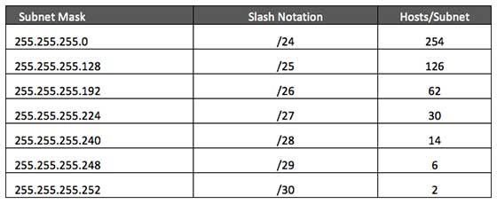

# VLSM

- ISP may face a situation where they need to allocate IP subnets of different sizes as per the requirement of customer. One customer may ask Class C subnet of 3 IP addresses and another may ask for 10 IPs. For an ISP, it is not feasible to divide the IP addresses into fixed size subnets, rather he may want **to subnet the subnets** in such a way which results in minimum wastage of IP addresses.

- For example, an administrator have 192.168.1.0/24 network. The suffix /24 tells the number of bits used for network address. In this example, the administrator has three different departments with different number of hosts. Sales department has 100 computers, Purchase department has 50 computers, Accounts has 25 computers and Management has 5 computers. 

- The following table shows how VLSM can be used in order to allocate department-wise IP addresses as mentioned in the example.

    

----------------------------------------------------

# Implementing a VLSM subnet

- `192.168.1.0/24`

### Step - 1

- Sort the requirements of IPs in **descending order** (Highest to Lowest).
    - Sales 100
    - Purchase 50
    - Accounts 25
    - Management 5


### Step - 2

- Allocate the highest range of IPs to the highest requirement, so let's assign `192.168.1.0 /25 (255.255.255.128)` to the Sales department. This IP subnet with Network number 192.168.1.0 has **126 valid Host IP addresses** which satisfy the requirement of the Sales department. 

```
- Host bits =  7 (2^7 = 128)

- Network bits = 25

- New subnet mask = 255.255.255.128 

- Range = 255.255.255.255 - 255.255.255.128 = 0.0.0.127  

| New Network |  Netowrk ID  | Broadcast Address |    Subnet Mask     |   Assign to    |
|-------------|--------------|-------------------|--------------------|----------------|
|  Subnet 0   |192.168.1.0   |  192.168.1.127    |255.255.255.128(/25)|Sales department|
|  Subnet 1   |192.168.1.128 |  192.168.1.255    |255.255.255.128(/25)|      ➖        |
```

### Step - 3

- Allocate the next highest range, so let's assign 192.168.1.128 /26 (255.255.255.192) to the Purchase department. This IP subnet with Network number 192.168.1.128 has **62 valid Host IP Addresses** which can be easily assigned to all the PCs of the Purchase department.

```
- Host bits =  6 (2^6 = 64)

- Network bits = 26

- New subnet mask = 255.255.255.192 

- Range = 255.255.255.255 - 255.255.255.192 = 0.0.0.63  

| New Network |  Netowrk ID  | Broadcast Address |    Subnet Mask     |     Assign to     |
|-------------|--------------|-------------------|--------------------|-------------------|
|  Subnet 0   |192.168.1.128 |  192.168.1.191    |255.255.255.192(/26)|Purchase department|
|  Subnet 1   |192.168.1.192 |  192.168.1.255    |255.255.255.192(/26)|         ➖        |
```


### Step - 4

- Allocate the next highest range, i.e. Accounts. The requirement of 25 IPs can be fulfilled with 192.168.1.192 /27 (255.255.255.224) IP subnet, which contains **30 valid host IPs**. The network number of Accounts department will be 192.168.1.192. 

```
- Host bits =  5 (2^5 = 32)

- Network bits = 27

- New subnet mask = 255.255.255.224

- Range = 255.255.255.255 - 255.255.255.224 = 0.0.0.31  

| New Network |  Netowrk ID  | Broadcast Address |    Subnet Mask     |     Assign to     |
|-------------|--------------|-------------------|--------------------|-------------------|
|  Subnet 0   |192.168.1.192 |  192.168.1.223    |255.255.255.224(/27)|Accounts department|
|  Subnet 1   |192.168.1.224 |  192.168.1.255    |255.255.255.224(/27)|         ➖        |
```

### Step - 5

- Allocate the next highest range to Management. The Management department contains only 5 computers. The subnet 192.168.1.224 /29 with the Mask 255.255.255.248 has exactly **6 valid host IP addresses**. So this can be assigned to Management. 

```
- Host bits =  3 (2^3 = 8)

- Network bits = 29

- New subnet mask = 255.255.255.248

- Range = 255.255.255.255 - 255.255.255.248 = 0.0.0.7  

| New Network |  Netowrk ID  | Broadcast Address |    Subnet Mask     |      Assign to      |
|-------------|--------------|-------------------|--------------------|---------------------|
|  Subnet 0   |192.168.1.224 |  192.168.1.231    |255.255.255.248(/29)|Management department|
|  Subnet 1   |192.168.1.232 |  192.168.1.239    |255.255.255.248(/29)|          ➖         |
|  Subnet 2   |192.168.1.240 |  192.168.1.247    |255.255.255.248(/29)|          ➖         |
|  Subnet 3   |192.168.1.248 |  192.168.1.255    |255.255.255.248(/29)|          ➖         |
```

 **By using VLSM**, the administrator can subnet the IP subnet in such a way that **least number of IP addresses are wasted**. Even after assigning IPs to every department, the administrator, in this example, is still left with plenty of IP addresses which was not possible if he has used CIDR.


--------------------------------

## Another Example

The administrator has 6 different networks with different number of hosts in his network topology example:

    - BRANCH 1 – 30 hosts
    - BRANCH 2 – 20 hosts
    - LAN – 50 hosts
    - WAN 1 – 2 hosts
    - WAN 2 – 2 hosts
    - WAN 3 – 2 hosts


### Step - 1

- Sort the requirements of IPs in **descending order** (Highest to Lowest).
    - LAN – 50 hosts
    - BRANCH 1 – 30 hosts
    - BRANCH 2 – 20 hosts
    - WAN 1 – 2 hosts
    - WAN 2 – 2 hosts
    - WAN 3 – 2 hosts

### Step - 2

- **Determine the class of IP subnet.** We need to determine the class of IP subnet that we will use **based on** the **required number of hosts**.

- Class **A** has **16,777,216**, Class **B** has **65,536**, and Class **C** has **256** IP addresses. As per our network requirement, **we need only 106 hosts**, therefore we will use a Class C IP address space. In our example, **we will use 192.168.10.0.** 

 
### Step - 3

- LAN – 50 hosts

```
- Host bits =  6 (2^6 = 64 ⇾ 62 usable host addresses)

- Network bits = 26

- New subnet mask = 255.255.255.192 

- Range = 255.255.255.255 - 255.255.255.192 = 0.0.0.63  

| New Network |  Netowrk ID  | Broadcast Address |    Subnet Mask     | Assign to |
|-------------|--------------|-------------------|--------------------|-----------|
|  Subnet 0   |192.168.10.0  |  192.168.10.63    |255.255.255.192(/26)|    LAN    |
|  Subnet 1   |192.168.10.64 |  192.168.10.127   |255.255.255.192(/26)|    ➖     |
|  Subnet 2   |192.168.10.128|  192.168.10.191   |255.255.255.192(/26)|    ➖     |
|  Subnet 3   |192.168.10.192|  192.168.10.255   |255.255.255.192(/26)|    ➖     |
```

### Step - 4

- BRANCH 1 – 30 hosts
- BRANCH 2 – 20 hosts

```
- Host bits =  5 (2^5 = 32 ⇾ 30 usable host addresses)

- Network bits = 27

- New subnet mask = 255.255.255.224

- Range = 255.255.255.255 - 255.255.255.224 = 0.0.0.31  

| New Network |  Netowrk ID  | Broadcast Address |    Subnet Mask     |     Assign to     |
|-------------|--------------|-------------------|--------------------|-------------------|
|  Subnet 0   |192.168.10.64 |  192.168.10.95    |255.255.255.224(/27)|      BRANCH 1     |
|  Subnet 1   |192.168.10.96 |  192.168.10.127   |255.255.255.224(/27)|      BRANCH 2     |
|  Subnet 2   |192.168.10.128|  192.168.10.159   |255.255.255.224(/27)|         ➖        |
|  Subnet 3   |192.168.10.160|  192.168.10.191   |255.255.255.224(/27)|         ➖        |
|  Subnet 4   |192.168.10.192|  192.168.10.223   |255.255.255.224(/27)|         ➖        |
|  Subnet 5   |192.168.10.224|  192.168.10.255   |255.255.255.224(/27)|         ➖        |
```


### Step - 5

- WAN 1 – 2 hosts
- WAN 2 – 2 hosts
- WAN 3 – 2 hosts

```
- Host bits =  2 (2^2 = 4 ⇾ 2 usable host addresses)

- Network bits = 30

- New subnet mask = 255.255.255.252

- Range = 255.255.255.255 - 255.255.255.252 = 0.0.0.3  

| New Network |  Netowrk ID  | Broadcast Address |    Subnet Mask     | Assign to |
|-------------|--------------|-------------------|--------------------|-----------|
|  Subnet 0   |192.168.10.128|  192.168.10.131   |255.255.255.252(/30)|   WAN 1   |
|  Subnet 1   |192.168.10.132|  192.168.10.135   |255.255.255.252(/30)|   WAN 2   |
|  Subnet 2   |192.168.10.136|  192.168.10.139   |255.255.255.252(/30)|   WAN 3   |
|  Subnet 3   |192.168.10.140|  192.168.10.143   |255.255.255.252(/30)|    ➖     |
|  Subnet 4   |192.168.10.144|  192.168.10.147   |255.255.255.252(/30)|    ➖     |
    ...            ...               ...                  ...              ...
    ...            ...               ...                  ...              ... 
    ...            ...               ...                  ...              ...
```