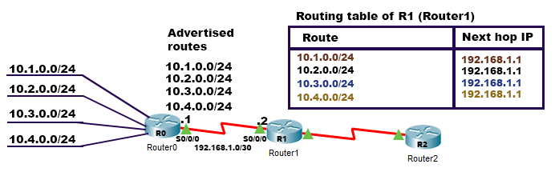
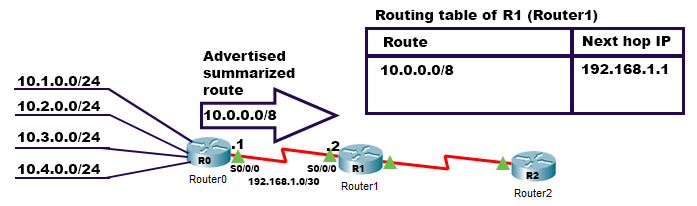

# Summarization (Supernetting)

- Supernetting, or summarization, is a process that reduces the number of routes that a router advertises to its neighbor. 

- Technically, route summarization is a feature that takes a bunch of contiguous routes from the routing table and advertises them as a single summarized or aggregated route. This feature works only if two or more routes are contiguous. If routes are not contiguous, this feature will not work.

- A network is considered contiguous when all of its hosts can access other hosts of the same network without going outside of the network. To access any other host of the network, if a host has to go outside the network then the network is considered as a discontiguous network.

# Route Summarization Steps

- **Step 1**

   Convert the addresses to binary format.

- **Step 2**

   Locate the bit where the common pattern of digits ends. (It might be helpful to draw a vertical line marking the last matching bit in the common pattern.)

- **Step 3**

  Convert the different part to zeros and this will be the network ID.
  Subnet mask will be equal the number of common bits. 
  
  
# Example 1
  
Let’s say we want to create the most optimal summary for the following 4 networks:

- `192.168.0.0/24` subnet mask `255.255.255.0`
- `192.168.1.0/24` subnet mask `255.255.255.0`
- `192.168.2.0/24` subnet mask `255.255.255.0`
- `192.168.3.0/24` subnet mask `255.255.255.0`

### Solution :

|              |      192   |     168    |            |        |
|--------------|------------|------------|------------|--------|
|192.168.0.0	|**11000000**|**10101000**|**000000**00|00000000|
|192.168.1.0	|**11000000**|**10101000**|**000000**01|00000000|
|192.168.2.0	|**11000000**|**10101000**|**000000**10|00000000|
|192.168.3.0	|**11000000**|**10101000**|**000000**11|00000000|

Our summary address will be `192.168.0.0 /22` (subnet mask `255.255.252.0`).

# Example 2

Summarize the following networks:

- `172.16.0.0/16`        subnet mask `255.255.0.0`
- `172.17.0.0/16`        subnet mask `255.255.0.0`
- `172.18.0.0/16`        subnet mask `255.255.0.0`
- `172.19.0.0/16`        subnet mask `255.255.0.0`
- `172.20.0.0/16`        subnet mask `255.255.0.0`
- `172.21.0.0/16`        subnet mask `255.255.0.0`
- `172.22.0.0/16`        subnet mask `255.255.0.0`
- `172.23.0.0/16`        subnet mask `255.255.0.0`

|              |      172   |         |
|--------------|------------|---------|
| 172.16.0.0	|**10101100**|**00010**000|
| 172.17.0.0	|**10101100**|**00010**001|
| 172.18.0.0	|**10101100**|**00010**010|
| 172.19.0.0	|**10101100**|**00010**011|
| 172.20.0.0   |**10101100**|**00010**100|
| 172.21.0.0   |**10101100**|**00010**101|
| 172.22.0.0   |**10101100**|**00010**110|
| 172.23.0.0   |**10101100**|**00010**111|

Our summary address will be `172.16.0.0 /13` (subnet mask `255.248.0.0`).

-----------------------------------------------------------
