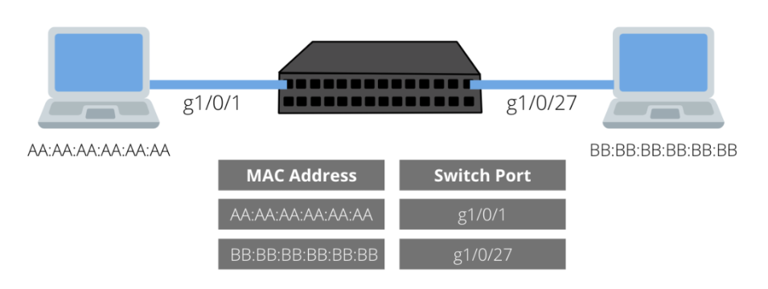

# MAC Address Table

As we explained before, each host connecting to a switch port will have its MAC address entered into the switch’s MAC address table. 

The MAC address table is a way to map each port to a MAC address. This makes it efficient to forward traffic directly to a host. Without the MAC address table, traffic would be forwarded out each port, like a hub.



**What happens if the host is no longer connected?** The host’s MAC address remains in the table until it ages out. There is a default **aging timer**. 

**What happens if the host changes to a different port?** The MAC address table is updated accordingly. 

---------------------------------------

# MAC Table Aging

All Catalyst switch models use a **Content Addressable Memory (CAM) table** for Layer 2 switching. As frames arrive on switch ports, the source MAC addresses are learned and recorded in the CAM table. The port of arrival recorded in the table, along with a **timestamp (Aging Time)**. If a MAC address learned on one switch port has moved to a different port, the MAC address and timestamp are recorded for **the most recent arrival port**. Then, the previous entry is deleted. If a MAC address is found already present in the table for the correct arrival port, only its **timestamp is updated**.

Switches generally have large CAM tables so that many addresses can be looked up for frame forwarding. However, there is not enough table space to hold every possible address on large networks. To manage the CAM table space, stale entries (addresses that have not been heard from for a period of time) are aged out. 

**By default,** idle CAM table entries are kept for **300 seconds** before they are deleted. 

You can show the default setting using the following command: `Switch(config)#show mac address-table aging-time`

You can change the default setting using the following configuration command: `Switch(config)# mac address-table aging-time [seconds]`

---------------------------------------

# Mac Address Table Entries

The MAC address table can contain two types of entries:

### Static

- Static entries are manually added to the table by a switch administrator.
- Static entries have higher priority than dynamic entries.
- Static entries remain active until they are removed by the switch administrator.

### Dynamic

- Dynamic entries are automatically added to the table through a process called MAC learning, in which the switch retrieves the source MAC address (and VLAN ID, if present) of each Ethernet frame received on a port. If the retrieved address does not exist in the table, it is added.

- Dynamic entries remain in the table for a predetermined amount of time after which they are automatically deleted.

---------------------------------------

# View the MAC Address Table

To view the MAC address table of all learned addresses: `switch#show mac address-table`

```
switch#show mac address-table 
          Mac Address Table
-------------------------------------------

Vlan    Mac Address       Type        Ports
----    – ------- –       – ------    – ---
 129    0017.88a9.b5dc    DYNAMIC     Gi1/0/1
 129    7483.c279.3a4c    DYNAMIC     Gi1/0/14
 129    c869.cd81.2307    DYNAMIC     Gi1/0/14
 103    000c.2979.60af    DYNAMIC     Gi1/0/14
 103    38f9.d329.a785    DYNAMIC     Gi1/0/14
Total Mac Addresses for this criterion: 5
```

To display the number of MAC addresses : `switch#show mac address-table count`

To display the number of dynamically learned MAC addresses: `switch#show mac address-table count dynamic`

-----------------------------------------------

# Viewing the MAC address seen on a specific interface

What if we want to verify what MAC address is seen off an individual port. This is useful for troubleshooting and verifying where a host might be located. The command syntax is: `show mac address-table <interface-name>`

```
sw1#show mac address-table interface g1/0/9
           Mac Address Table
 Vlan    Mac Address       Type        Ports
 –  –    – ------- –       – ---- –    – ---
  103    701f.53b7.da81    DYNAMIC     Gi1/0/9
```

-------------------------------------------

# Clear Mac Address Table

To remove a specified address, use : `switch# clear mac address-table [mac-addr] [interface type number]`

> If this command is used without options, all the MAC addresses are removed. 

> If you specify an address but do not specify an interface, the address is deleted from all the interfaces.

> If you specify an interface but do not specify an address, all the addresses on the specified interface are removed.

----------------------------------------------

# Assign a Static MAC Address to a Specific Port

`switch(config)# mac address-table static [mac_address] vlan [vlan-id] interface [type slot/port]` 

-------------------------------------------------------------------