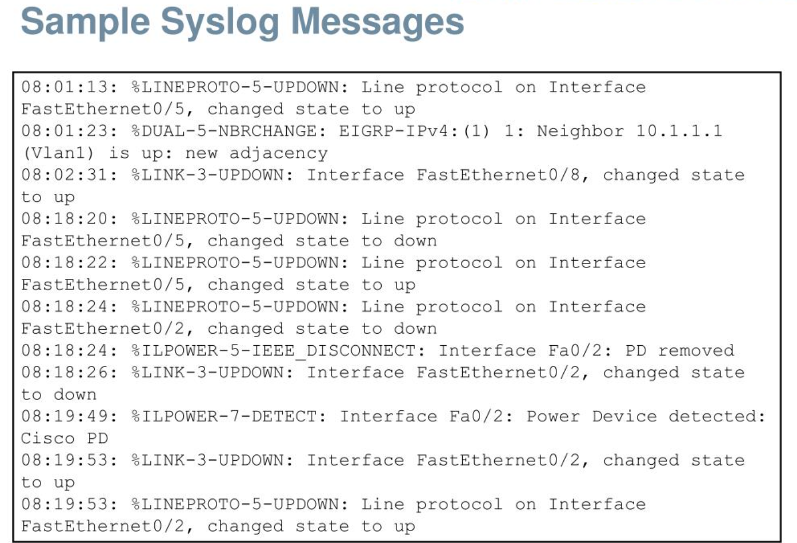
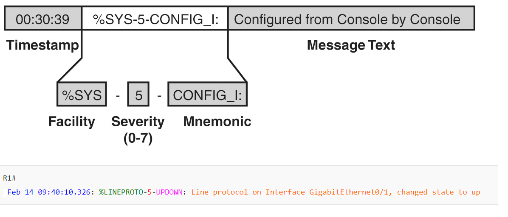
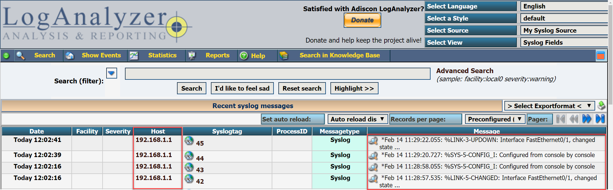

# Cisco IOS Syslog Messages

Even if you have never heard of syslog before, you probably have seen it when you worked on a router or switch. Take a look at the following lines:

```
R1#
Feb 14 09:38:48.132: %SYS-5-CONFIG_I: Configured from console by console
```
```
R1#
Feb 14 09:40:09.325: %LINK-3-UPDOWN: Interface GigabitEthernet0/1, changed state to up
Feb 14 09:40:10.326: %LINEPROTO-5-UPDOWN: Line protocol on Interface GigabitEthernet0/1, changed state to up
```
Whenever anything interesting is happening on the router or switch, Cisco IOS informs us in real-time. This is done by syslog.

**By default, these syslog messages are only outputted to the console. This is because the logging console command is enabled by default. If you log in through telnet or SSH, you won’t see any syslog messages. You can enable this with the terminal monitor command.**

**Sample Syslog Messages**



## Syslog Message Format



- The syslog is basically the process that generated the syslog message. If you look at some of the syslog messages, you can see :

   - `%LINEPROTO` which keeps track of line protocols

   -  `%SYS` for general system messages 

   -  `%LINK` for interfaces that went up or down.


- The mnemonic is a short code for the message. For example, “UPDOWN” for interfaces that go up or down. “CHANGED” for when the interface status changes and so on.

#### Syslog Severity Levels

The severity level is an important one, it tells us how important the message is. 

| Severity Level| Syslog Severity|
|--|--|
|0| Emergency|
|1| Alert|
|2| Critical|
|3| Error|
|4| Warning|
|5| Notice|
|6| Informational|
|7| Debugging|

- The lower the number, the more important the syslog message is. 

- **Alert and emergency** are used when something bad is going on, like when your router runs out of memory and a process crashes. 

- **The critical, error and warning messages** are used for important events like interfaces that go down. Here’s an example:

     ```
     R1#
     Feb 14 12:02:38: %LINK-5-CHANGED: Interface FastEthernet0/1, changed state to administratively down
     ```

     ```
     R1#
     Feb 14 12:03:36: %LINK-3-UPDOWN: Interface FastEthernet0/1, changed state to up
     ```

## Local History

- Cisco IOS keeps a history of syslog messages. We can see these with the `show logging` command
 
- It will store up to 8192 bytes of syslog messages in its RAM. It is possible to increase the size of the logging buffer

- When you reboot your router or switch, the history will be gone.

## Syslog Server

 - A local history is nice but it is stored in RAM. If you reboot the router or switch, it will be gone. What if the router crashed and you want to see if it logged anything before it went down? If you have dozens of routers and switches, logging into each device one-by-one to look for syslog messages is also not the best way to spend your time.

- In production networks, we use a central server called a syslog server. **Syslog is a protocol**, a standard and you can configure your routers and switches to forward syslog messages to the syslog server like this:




## The logging synchronous command

It will tell the router that if any informational items get displayed on the screen, your prompt and command line should be moved to a new line, so as not to confuse you.

```
Router(config)#line console 0

Router(config-line)#logging synchronous    ----> to enable it

Router(config-line)# no logging synchronous   ---> to diable it
````
