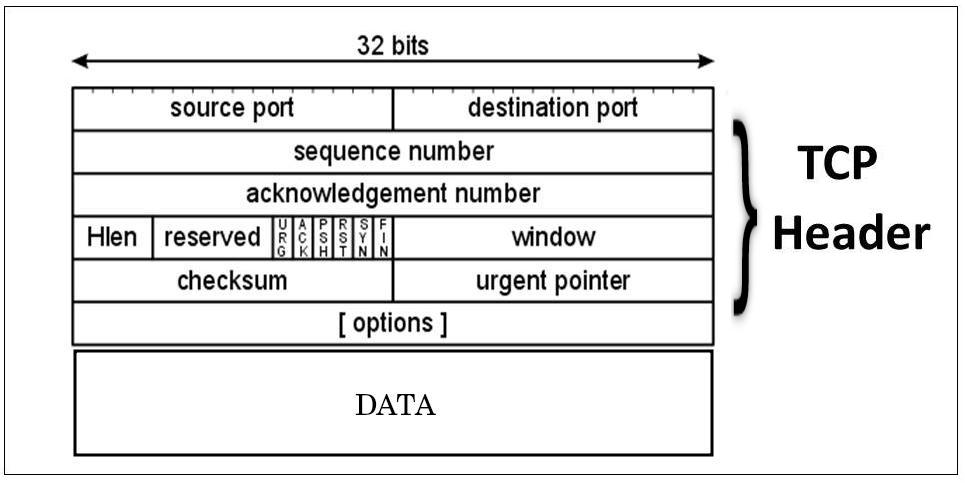

# TCP

- TCP is a connection-oriented protocol, which means that it first establishes the connection between the sender and receiver in the form of a handshake. 

- After both the connections are verified, it begins transmitting packets. It makes the transmission process error-free and ensures the delivery of data.

- TCP is one of the most common protocols that ensure **end-to-end delivery.** It guarantees the security and integrity of the data being transmitted. It always establishes a secure connection between the sender and receiver. 

- TCP is used in most of the high-level protocols, such as FTP, HTTP, and SMTP.

- TCP connection and termination are full-duplex, which means that the data can travel in both the directions simultaneously.

# TCP Message Types

|Message	|Description|
|--|--|
|Syn|	Used to initiate and establish a connection. It also helps you to synchronize sequence numbers between devices.|
|ACK|	Helps to confirm to the other side that it has received the SYN.|
|SYN-ACK	|SYN message from local device and ACK of the earlier packet.|
|FIN	|Used to terminate a connection.

# TCP Connection (3-Way Handshake)

Handshake refers to the process to establish connection between the client and server. To transmit a packet, TCP needs a three way handshake before it starts sending data. The reliable communication in TCP is termed as **PAR (Positive Acknowledgement Re-transmission)**. When a sender sends the data to the receiver, it requires a positive acknowledgement from the receiver confirming the arrival of data. If the acknowledgement has not reached the sender, it needs to resend that data. The positive acknowledgement from the receiver establishes a successful connection.

## TCP Three-Way Handshake Process  (SYN, SYN-ACK,ACK)

- **Step 1:** In the first step, the client establishes a connection with a server. It sends a segment with SYN and informs the server about the client should start communication, and with what should be its sequence number.

- **Step 2:** In this step server responds to the client request with SYN-ACK signal set. ACK helps you to signify the response of segment that is received and SYN signifies what sequence number it should able to start with the segments.

- **Step 3:** In this final step, the client acknowledges the response of the Server, and they both create a stable connection will begin the actual data transfer process.

## In deatil:

- **The client sends the SYN to the server:** 

   When the client wants to connect to the server. It sets the **'SYN' flag as 1** and sends the message to the server.
   
    The message has also some additional information like the sequence number **(any random 32 bits number), the ACK is set here to 0, the window size, and the maximum segment size.** 
    
    For Example, if the window size is 2000 bits, and the maximum segment size is 200 bits then a maximum of 10 data segments (2000/200 = 10) can be transmitted in the connection.

- **The server replies with the SYN and the ACK to the client:** 

   After receiving the client's synchronization request, the server sends an acknowledge to the client by setting the **ACK flag to '1'**. The acknowledgement number of the **ACK** is **one more** than the received sequence number.
   
   For Example, if the client has sent the SYN with sequence number = 1000, then the server will send the ACK with acknowledgement number = 10001.
   
   Also, the server sets the **SYN** flag to **'1'** and sends it to the client, if the server also wants to establish the connection. The sequence number used here for the SYN will be different from the client's SYN. 
   
   The server also advertises its window size and maximum segment size to the client. After completion of this step, the connection is established from the client to the server-side.

- **The client sends the ACK to the server:** 

   After receiving the SYN from the server, the client sets the **ACK** flag to **'1'** and sends it with an acknowledgement number 1 greater than the server's SYN sequence number to the client. 
   
   Here, the **SYN** flag is kept **'0'**. After completion of this step, the connection is now established from the server to the client-side also. After the connection is being established, the minimum of the sender's and receiver's maximum segment size is taken under consideration for data transmission.

----------------------------------------------------------

# TCP Termination (4-way handshake) 

- To terminate the data transmission, it requires a 4-way handshake. The segments required for TCP termination are similar to the segments to build a TCP connection (ACK and SYN) except the FIN segment. The FIN segment specifies a termination request sent by one device to the other.

## TCP Four-Way Handshake Process  (FIN, ACK, FIN,ACK)

- **Step 1:** When a TCP client/server close the connection first (active close), then TCP sends a FIN segment.
- **Step 2:** On the other hand who receives the FIN performs the passive close and acknowledged by TCP.
- **Step 3:** Later of time the application that received the end-of-file will close its socket and thus TCP to send a FIN.
- **Step 4:** Finally, TCP which receives this final FIN (the end which initiated the active close) acknowledges the FIN.

-------------------------------------------------------------

# TCP Header

- The size of the TCP header in **32-bit words**. 

- The minimum size header is 5 words and the maximum is 15 words thus giving the minimum size of 20 bytes and maximum of 60 bytes, allowing for up to 40 bytes of options in the header.

- **Source port:** 
   
   - This is a 16 bit field that specifies the port number of the sender.

- **Destination port:** 
   
   - This is a 16 bit field that specifies the port number of the receiver.

- **Sequence Number:** 

   - Sequence number is a random **32 bits** (in the range of 0 to (2^32 -1)) number which is assigned to the first bit of the data.
   
   - Generally, a sequence number is used only once in one connection. For other data transmission in the same connection, some other random sequence number can be used.

- **Acknowledgement Number:** 

   - It is the next sequence number that the acknowledgement sending device expects from the sender.
   
   - This value will be the sequence number **incremented by 1**.

- **Window** 
   
   - The 16 bit window field specifies how many bytes the receiver is willing to receive **(Window / buffer size)**. 

   - It is used so the receiver can tell the sender that it would like to receive more data than what it is currently receiving. It does so by specifying the number of bytes beyond the sequence number in the acknowledgment field.

- **Reserved:**
   
   - These are **6 bits** for the reserved field. They are unused and are always set to 0.

- **Hlen** 

   - This is the **4 bit**, known as the header length.
   
   - It indicates the length of the TCP header so that we know where the actual data begins.

<!-- - **Maximum Segment Size:** 
   
   - It is the maximum acceptable size of each data segment by the connected device.
   
   - Above this size, the device will not be able to receive the data segments. -->

- **Flags:**

    - There are **9 bits** for flags, we also call them control bits. We use them to establish connections, send data and terminate connections:

      - **SYN:**
         
         - SYN stands for **synchronization**. It can be described as a request for establishing a connection. 
    
         - If SYN is 1, it means that the device wants to establish a secure connection, else not.

      - **ACK:** 
         
          - ACK stands for **acknowledgement**. It can be described as the response of SYN.
   
         - If ACK is 1, the device has received the SYN message and acknowledges it, else not.

      - **FIN:**
         
         - FIN stands for **Finished**. After the data transmission has been completed, devices have to terminate the connection using the FIN flag. 

         - If FIN is 1, the device wants to terminate the connection, else not.

         - This is the normal method how we end an connection.

      - **URG:** 
      
         - Stands for **Urgent Pointer**.
         
         - When this bit is set, the data should be treated as priority over other data.

   

      - **PSH:** 
      
         - This is **Push function**. 
         
         - This tells an application that the data should be transmitted immediately and that we **don’t** want to **wait** to **fill** the **entire TCP segment**.

      - **RST:** 

         - This resets the connection.
         
         - When you receive this you have to terminate the connection right away. This is only used when there are unrecoverable errors and it’s not a normal way to finish the TCP connection.

     
- **Checksum:** 
   
   - **16 bits** are used for a checksum to check if the TCP header is OK or not.

- **Urgent pointer:** 
   
   - These **16 bits** are used when the **URG** bit has been set, the urgent pointer is used to indicate where the urgent data ends.

- **Options:** 
   
   - This field is optional and can be anywhere between **0** and **320 bits (40 bytes).**

  

-------------------------------------------------------------

# UDP

- It is an unreliable and connectionless protocol.

- Since UDP avoids the overhead associated with connections, error checks and the retransmission of missing data, it’s suitable for real-time or high performance applications that don’t require data verification or correction. If verification is needed, it can be performed at the application layer.

  

# UDP Header

- UDP header is an 8-bytes fixed and simple header.

- **Source Port:**

    - This is a 16 bit field, used to identify the port number of the source.

- **Destination Port:** 

   - This is a 16 bit field, used to identify the port of the destined packet.

- **Length:** 

   - The length of UDP including the header and the data. It is a 16-bits field.

- **Checksum:**

   - This is a 16 bit field.
   
   - It is an optional field, which means that it depends upon the application, whether it wants to write the checksum or not. If it does not want to write the checksum, then all the 16 bits are zero; otherwise, it writes the checksum. 

   - There is no sequence ordering and retransmission mechanism in UDP. If the checksum does not match packet is simply discarded.

-------------------------------------------------------------

# TCP vs UDP

