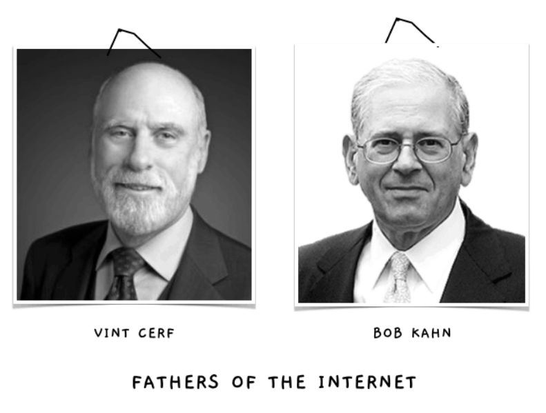
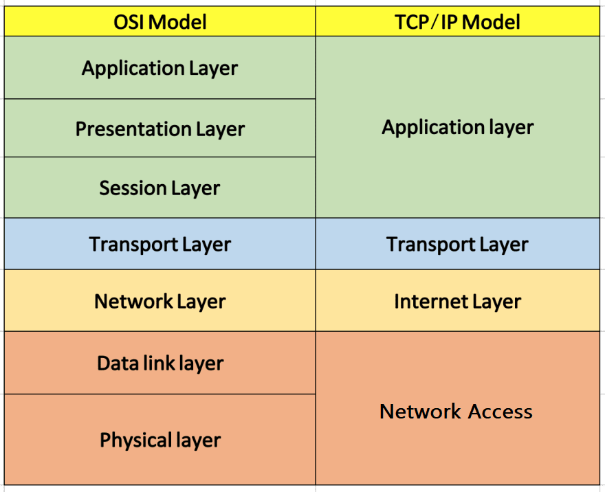
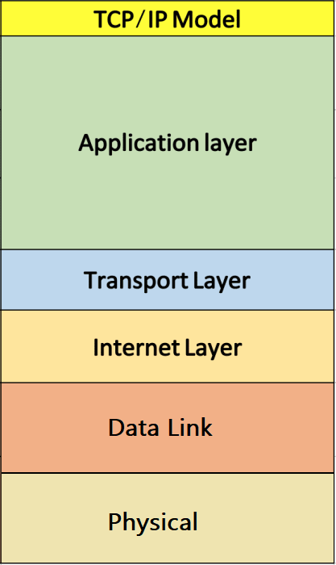
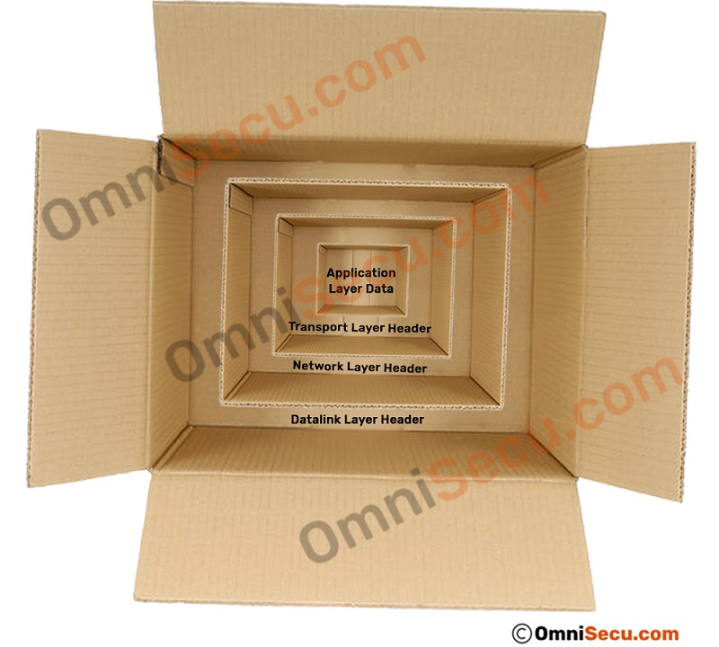
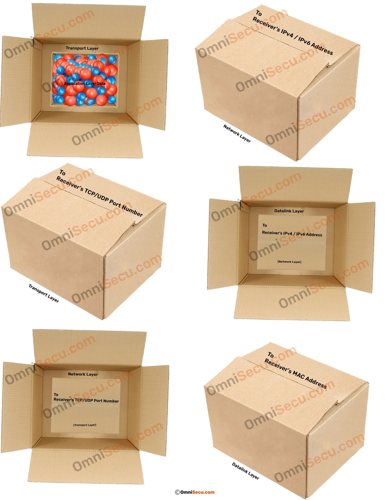

# TCP/IP Model

- TCP/IP protocol suite was created in the 1970s by two **DARPA** (US Defense Advanced Research Projects Agency) scientists, Vint Cerf and Bob Kahn. In computer history, they are known as the **“Fathers of the Internet.”**

- **ARPANet** was an early packet switching network and the first network to implement the TCP/IP. 

- TCP/IP is named after two important protocols within it, the Transmission Control Protocol and the Internet Protocol.

- Like OSI reference model, TCP/IP protocol suite also has a model. The TCP/IP model is not same as OSI model. OSI is a seven-layered model, but the original TCP/IP is a four layered model.

- The OSI reference model has been very influential in the growth and development of TCP/IP standard, and that is why much OSI terminology is applied to TCP/IP. The TCP/IP model which we use today is slightly different from the original TCP/IP model. The original TCP/IP model had only four layers, but the updated TCP/IP model has five layers.

- The four layers of original TCP/IP model are Application Layer, Transport Layer, Internet Layer and Network Access Layer.

    

## Updated TCP/IP model

--------------------------------------------------------------------------------------------------------------

# TCP/IP Protocols

|          Layer              | Some Protocols|
|-----------------------------|---------------|
|Layer 4. Application Layer   | DNS    HTTP    Telnet   SSH   FTP    TFTP    SNMP    SMTP    DHCP    RDP |
|Layer 3. Transport Layer     | TCP   UDP|
|Layer 2. Internet Layer      |  IP   ICMP   ARP    RARP |
|Layer 1. Network Access Layer| Token Ring   FDDI   X.25   Frame Relay|

------------------------------------------------------------------------------------------------

# TCP/IP Model Vs OSI Model

- In OSI, the model was developed first and then the protocols in each layer were developed. In the TCP/IP suite, the protocols were developed first and then the model was developed.

|BASIS FOR COMPARISON|	TCP/IP MODEL|	OSI MODEL|
|--------------------|--------------|----------|
|Expands To          | Transmission Control Protocol/ Internet Protocol |	Open system Interconnection|
|Meaning	           | It is a client server model used for transmission of data over the internet.	| It is a **theoretical** model which is used for computing system.|
|Number Of Layers    | 4 Layers |	7 Layers|
|Developed by        |	Department of Defense (DoD)	| ISO (International Standard Organization)|
|Usage	             | Mostly used	|Never used|

--------------------------------------------------------------------------------------------
# TCP/IP Encapsulation and Decapsulation

To visualize TCP/IP encapsulation process, refer below images.

- The data generated at the Application layer (Layer 5) is then passed down to Transport layer. 

- Transport layer adds many information with original data. If the protocol used at the Transport Layer is TCP, the data packet is known as "TCP Segment". If the protocol used at the Transport layer is UDP, the data packet is known as "UDP Datagram".

- The most important values at Transport layer header (Layer 4 header) are TCP/UDP source and destination port numbers. 

- It is then passed down to Network layer (Layer 3) for further processing.

- The data packet created at the Network layer by Internet Protocol (IPv4 or IPv6), which encapsulates its upper layer Transport layer segment/datagram, is known as "IP Datagram". It adds source and destination IPv4/IPv6 addresses. The data packet generated at Network layer is then passed down to Datalink Layer (Layer 2). 

- Datalink Layer header adds source and destination MAC addresses.  Datalink layer trailer contains a checksum value (FCS) for error detection.

- The Frame is then transferred to Physical Layer (Layer 1), and is converted into stream of bits at the Physical layer (Layer 1). The stream of bits is then placed on network medium for transmission to the destination computer.

# FCS

- A frame check sequence (FCS) is an error-detecting code added to a frame in a communication protocol. 

- The FCS field contains a number that is calculated by the source node based on the data in the frame. This number is added to the end of a frame that is sent. When the destination node receives the frame the FCS number is recalculated and compared with the FCS number included in the frame. If the two numbers are different, an error is assumed and the frame is discarded.

- The FCS provides error detection only. Error recovery must be performed through separate means. Ethernet, for example, specifies that a damaged frame should be discarded and does not specify any action to cause the frame to be retransmitted. Other protocols, notably the Transmission Control Protocol (TCP), can notice the data loss and initiate retransmission and error recovery.

--------------------------------------------------------------------------------------

