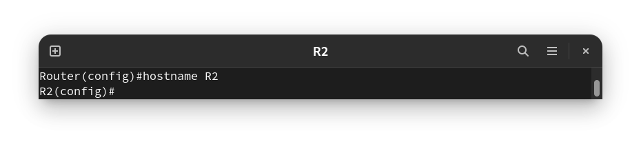
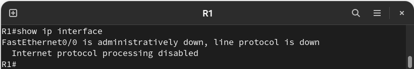
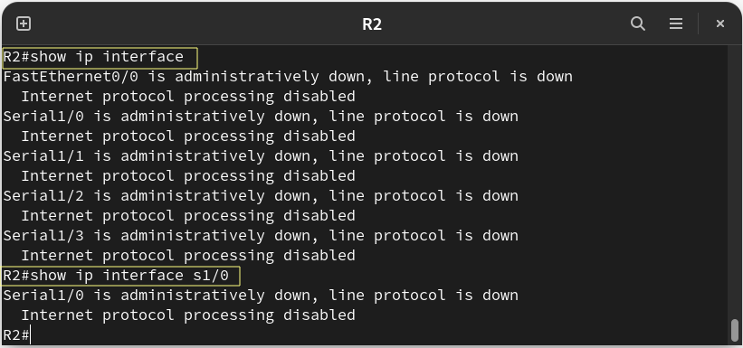
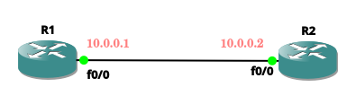
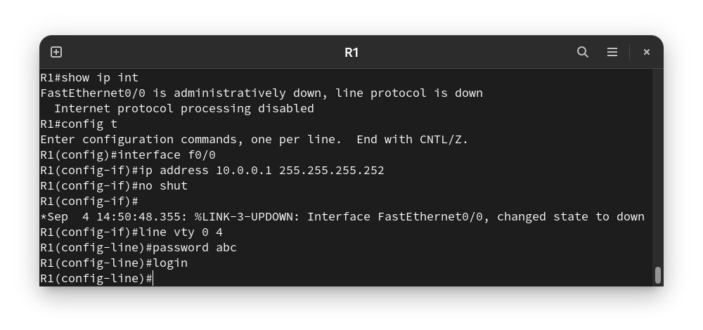
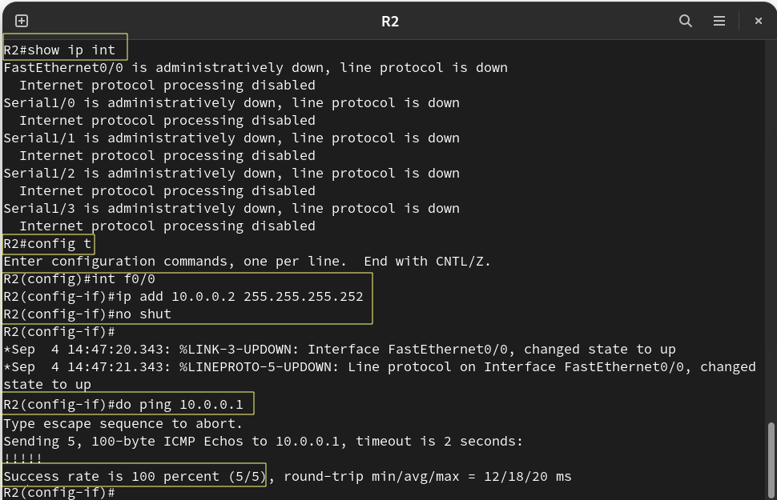
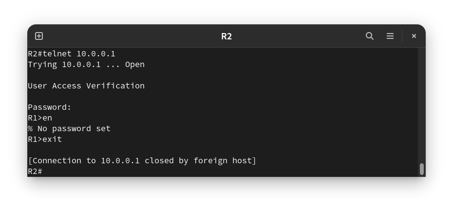
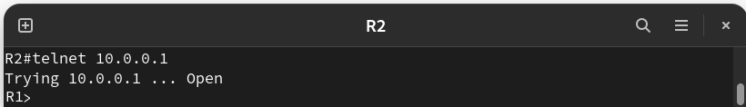

# Congiuration Commands

## `hostname` Command

Changes the host name.

**Syntax** : `R(config)#hostname [new_name]`



## `show ip interface` Command

Displays useful information about the configuration and status of the IP protocol and its services, on all interfaces. You can also use it also to know which interfaces are present on this router.

**Syntax** : `R#show ip interface [type] [number]`





## `interface` Command

Opens interface configuration mode.

**Syntax** : `R(config)# interface [interface_name]`

## `ip address` Command

Assigns an IP address and a subnet mask to a router interface.

**Syntax** : `R(config-if)# ip address [ip-address] [mask]`

## `shutdown` Command

| Command                 |	Description              |
|-------------------------|--------------------------|
|R(config-if)# shutdown   | Shuts down the interface.|
|R(config-if)# no shutdown| Brings up the interface. |

## `ping` Command

It’s a handy tool that you can use to test whether your computer can reach another device.

**Syntax:** `R# ping [IP]`


-----------------------------------------------

# VTY

- **VTY** stands for Virtual Teletype. It is a kind of virtual interface that is used to get **CLI** access of a Cisco Router or Switch over **Telnet/SSH.** 

- All the connections are **remotely** over the network, so there is no hardware associated with it.

## Line VTY Command 

**Example:** `R1(config)# line vty 0 4`

It will open 5 virtual interfaces, i.e. (0,1,2,3,4) for remote access. That means, 5 different administrators/connections can access the Cisco Router/Switch at the same time using **Telnet** or **SSH**.

# Telnet

- Telnet operates using **TCP** **Port 23**,and it was designed specifically for **LANs**.

- Telnet is **not a secure** communication protocol because it does not use any security mechanism and transfers the data over network/internet in a **plain-text** form including the passwords and so anyone can sniff the packets to get that important information.

# Telnet Password

**Topology**



You have to configure the interface f0/0 on router1 and router2 by giving it **IP** and change its state to **up**, so you can open a telnet session.


### Configure Router 1

```
R1#show ip interface
R1#configure terminal 
R1(config)#interface fastEthernet 0/0
R1(config-if)#ip address 10.0.0.1 255.255.255.252 → Assign an IP address to the interface
R1(config-if)#no shutdown

R1(config)#line vty 0 4
R1(config-line)#password abc
R1(config-line)#login
```




### Configure Router 2
 
```
R2#show ip interface
R2#configure terminal 
R2(config)#interface fastEthernet 0/0
R2(config-if)#ip address 10.0.0.2 255.255.255.252  --> Assign an IP address to the interface
R2(config-if)#no shutdown 

R2(config-if)#do ping 10.0.0.1    ---> In order to verify the connectivity
```



**Now you can telnet to your local interface to initiate a telnet session as shown below :**




**Note that** if you didn't configure **enable password** and try to gain **privileged level** access. You’ll immediately notice that you’ll be prompted for an “enable” password in which case none is set, therefore you cannot gain privileged level access, so configure an enable password and secret for the Cisco router to gain privileged level access to the device via telnet.

---------------------------------------------

# Removing Telnet Password

```
R1(config-line)#line vty 0 4
R1(config-line)#no password
R1(config-line)#no login
```

**If you remove the password and try to login again :**



---------------------------------------------