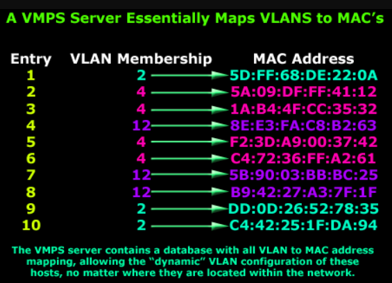

# Collision Domain 

A Collision Domain is a scenario in which when a device sends out a message to the network, all other devices which are included in its collision domain have to pay attention to it, no matter if it was destined for them or not. This causes a problem because, in a situation where **two devices send out their messages simultaneously**, a collision will occur leading them to wait and re-transmit their respective messages, one at a time. 

**Remember, it happens only in the case of a half-duplex mode.**

The following example illustrates collision domains :


> Each port on a hub is in the same collision domain. Each port on a bridge, a switch or router is in a seperate collision domain.

# Broadcast Domain 

A Broadcast Domain is a scenario in which when a device sends out a broadcast message, all the devices present in its broadcast domain have to pay attention to it. This creates a lot of congestion in the network, commonly called **LAN congestion**, which affects the bandwidth of the users present in that network. 

From this, we can realize that the more the number of collision domains and the more the number of broadcast domains, the more efficient is the network providing better bandwidth to all its users.

The following example clarifies the concept:


> All ports on a hub or a switch are by default in the same broadcast domain. All ports on a router are in the different broadcast domains and routers don’t forward broadcasts from one broadcast domain to another.


----------------------------------

# VLANs (Virtual Local Area Network)

VLANs are logical grouping of devices in the same broadcast domain. VLANs are usually configured on switches by placing some interfaces into one broadcast domain and some interfaces into another. Each VLAN acts as a subgroup of the switch ports in an Ethernet LAN.

**VLANs can spread across multiple switches,** with each VLAN being treated as its own subnet or broadcast domain. This means that frames broadcasted onto the network will be switched only between the ports within the same VLAN.

A VLAN acts like a physical LAN, but it allows hosts to be grouped together in the same broadcast domain even if they are not connected to the same switch. 

The following topology shows a network with all hosts inside the same VLAN:


Without VLANs, a broadcast sent from host A would reach all devices on the network. Each device will receive and process broadcast frames, increasing the CPU overhead on each device and reducing the overall security of the network.

By placing interfaces on both switches into a separate VLAN, a broadcast from host A would reach only devices inside the same VLAN, since each VLAN is a separate broadcast domain. Hosts in other VLANs will not even be aware that the communication took place. This is shown in the picture below:


As shown in the figure below, different VLANs can be used for different groups of users, departments, functions, etc., without needing to be in the same geographical area :


> To reach hosts in a different VLAN, a router is needed.


-----------------------------------------------


# Advantages of VLAN

### Segmentation

A VLAN is helpful for organizational use mainly because it can be used to segment a larger network into smaller segments which reduce the size of broadcast domains.

### Simple IT Management

VLANs allow for easier and simplified IT management of the network system. If VLANs are segmented based on users with similar network requirements and/or functions, this allows IT to manage each VLAN and groups of devices in a simpler fashion. For example, management can establish specific security controls based off of the users in each VLAN, and if there is an issue with one VLAN, troubleshooting problems can be solved much faster due to different users operating on different VLANs. Each VLAN can also easily be named to fit the characteristics of the VLAN (examples include: “guest,” “staff,” “finance,” etc.).

### Security

A major positive aspect of using a VLAN are the security benefits it provides. The separation of traffic on a network prevents unwanted and unauthorized users and devices from traveling on a specific network, reducing threats and risks and protecting sensitive data. Different security software and firewalls can be installed for each VLAN in a network, which helps prevent compromisation of the entire system if one VLAN faces a breach. 

--------------------------------------------------

# Takeaways

- VLANs reduce the size of broadcast domains.

- VLANs provide increased performance.

- A VLAN allows different computers and devices to be connected virtually to each other as if they were in a LAN sharing a single broadcast domain.

- VLANs can be used for different groups of users, departments, functions, etc., without needing to be in the same geographical area.

- VLAN reduces the number of devices for particular network topology. You do not require additional hardware and cabling, which helps you to saves costs.

- VLANs can limit user access to a certain VLAN, which then allows only authorized users to have access to networks with highly sensitive information.

- VLANs can help reduce IT cost, improve network security and performance, provide easier management, as well as ensuring network flexibility.

---------------------------------------------------------------

# How VLAN works

VLANs are identified by a VLAN ID which is **12-bit** (a number between 0 – 4095), with the default VLAN on any network being VLAN 1. A Valid range is `1-4094`. 

On a VLAN switch, you assign ports with the proper VLAN number. The switch then allows data which needs to be sent between various ports having the same VLAN. Since almost all networks are larger than a single switch, there should be a way to send traffic between two switches. One simple and easy way to do this is to assign a port on each network switch with a VLAN and run a cable between them.

Each VLAN has a name. The VLAN name must not exceed `56`characters in length. 

The name of VLAN1 is `default`. All other VLANs `VLAN vlan-id`

### Examples

- VLAN 3 → VLAN0003
- VLAN 20 → VLAN0020

------------------------------------------

# VLAN Ranges

|Range         |Description|
|--------------|-----------|
|VLAN 0-4095   | Reserved VLAN, which cannot be seen or used.|
|VLAN 1        | This is a default VLAN of switches. You cannot delete or edit this VLAN, but it can be used.|
|VLAN 2-1001   | It is a **normal** VLAN range. You can create, edit, and delete it.|
|VLAN 1002-1005| These ranges are CISCO defaults for token rings and FDDI. You cannot delete this VLAN.|
|VLAN 1006-4094| It is an extended range of VLANs. Extended VLANs must be configured on Switches that are in VTP Transparent mode only.|

------------------------------------------

# VLAN Membership Types

### Static VLANs

In a static VLAN, the network administrator creates a VLAN and then assigns switch ports to the VLAN. Static VLANs are also called port-based VLANs. The association with the VLAN does not change until the administrator changes the port assignment. End-user devices become the members of VLAN based on the physical switch port to which they are connected.

The ports on a single switch can be assigned multiple VLANs. Even though two devices are connected to different ports on a same switch, traffic will not pass between them if the connected ports are on different VLANs. We need a layer 3 device (typically a Router) to enable communication between two VLANs.

### Dynamic VLANs

In a dynamic VLAN, the switch automatically assigns the port to a VLAN using information from the user device like MAC address, IP address etc. When a device is connected to a switch port the switch queries a database to establish VLAN membership. A network administrator must configure VLAN database of a **VLAN Membership Policy Server (VMPS)**.

Dynamic VLANs support instant movability of end devices. When we move a device from a port on one switch to a port on another switch, the dynamic VLANs will automatically configure the membership of the VLAN.




------------------------------------------

# VLAN Configuration Commands

### Adding a VLAN Directly and Entering into VLAN Configuration Mode

- Enter global configuration mode :` switch#configure terminal`
- Enter VLAN configuration mode and/or create a VLAN : `switch(config)#vlan [vlan-id]`
- Configure a name for the VLAN : `switch(config-vlan)#name [name]`

**NOTE :** The VLAN isn't added until you leave VLAN configuration mode.

### Create multiple VLANs using one command

- `switch(config)#vlan 3,8,22` : It will create 3 vlans (3,8 & 22)
- `switch(config)#vlan 50-60` : It will create vlans 50 through 60.
- `switch(config)#vlan 2-5,7,10,15-19`

> In order to rename them you have to enter the VLAN itself

### Another method of creating a VLAN
### Assigning the VLAN to a Switchport (and Possibly Creating a New VLAN)

Enter global configuration mode : `switch#configure terminal`

Enter interface configuration mode : `switch(config)#interface [interface]`

Configure the interface into a specific VLAN (If the VLAN doesn't exist, it will be created.) : `switch(config-if)#switchport access vlan [vlan-id]`

### Deleting a VLAN

Enter global configuration mode: `switch#configure terminal`

Delete a configured VLAN : `switch(config)#no vlan vlan-id`

If an interface is configured into the VLAN being deleted, it will become inactive (homeless) and will not be displayed in the output of the `show vlan` command.


### Verifying Existing VLANs

Display the current VLANs and their assignments : `switch#show vlan [brief]`

# Scenario

Suppose you work for a school at a university, and the school is in the process of moving to a different building. In the new building, administrative operations and academic labs will be located on the same floor. In the interest of saving money and time, it has been decided that all of the school's devices will be connected via a single network switch. Since security of the administrative devices is important, the administrative network must be physically or virtually separated from the academic network.

The administrative network devices will be assigned into `VLAN 100`, and all academic network devices will be assigned into `VLAN 200`. On the switch, all administrative devices will be connected to switchports `Fast Ethernet 0/1–0/12`, and all academic devices will be connected to switchports Fast Ethernet `0/13–0/24`.

To set up this design, each interface must be configured into its respective VLAN. For purposes of this scenario, we will use the `interface range` command to assign switchports :


- Enter global configuration mode : `switch#configure terminal`
- Create VLAN 100 : `switch(config)#vlan 100`
- Create VLAN 200 : `switch(config-vlan)#vlan 200`

> Notice that the configuration mode changed to VLAN configuration mode (`config-vlan`), but this command is still configured as if the user is in global configuration mode.

- Move into interface configuration mode for switchports Fast Ethernet 0/1–0/12 : `switch(config-vlan)#interface range fastethernet0/1-12`
- Configure the switchports into VLAN 100 : `switch(config-if)#switchport access vlan 100`
- Move into interface configuration mode for the switchports Fast Ethernet 0/13–0/24 : `switch(config-if)#interface range fastethernet0/13-24`
- Configure the switchports into VLAN 200 : `switch(config-if)#switchport access vlan 200`

# VLAN Configuration Files

Configurations are stored within a VLAN database file, called `vlan.dat`. The `vlan.dat` file is located in the flash memory of the switch.

If you run `show flash` command you will see this file.


#

It is a good practice to completely erase everything on a switch (both switch configuration and switch Vlans) before using the switch in another part of your network. This is important in order to avoid any network conflicts because of any old configuration settings that are already configured on the switch.


### Deleting the switch configuration

Basically you need to delete the “startup-configuration” and then reboot the switch.

```
Switch#erase startup-config
Erasing the nvram filesystem will remove all configuration files! Continue?
[confirm]
[OK]
Erase of nvram: complete
Switch#reload
```

### Deleting the switch Vlans

The strange part is that after deleting the switch configuration you will notice that the Vlans are still there.  These vlans are stored in a file in flash memory called `vlan.dat` as we discussed above. You have to delete this file in order to completely erase all vlans on the switch.

```
Switch#delete vlan.dat
Delete filename [vlan.dat]?
Delete flash:/vlan.dat? [confirm]
```

Then you have to reload the switch : `Switch#reload`
 
-------------------------------------------------------------------------